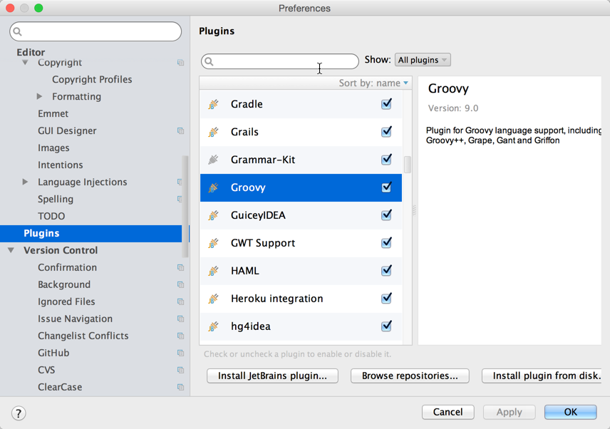

## Installing Git

The source code of IntelliJ IDEA Community Edition is stored in a Git repository. Therefore, in order to check out the sources, you need to have Git installed. We recommend using the [msys git](https://msysgit.github.io) distribution on Windows and [git-osx-installer](http://code.google.com/p/git-osx-installer/) on Mac.

## Checking Out the Code

You can check out the code either by using IntelliJ IDEA or from the command line.

**Checking out from IntelliJ IDEA:**
 
* Select **VCS \| Checkout from Version Control \| Git** from the main menu
* In the **Git Repository URL** field, enter `git://git.jetbrains.org/idea/community.git`


**Checking out from the command line:**

Please execute the following command:

```
git clone --depth 1 git://git.jetbrains.org/idea/community.git idea
```

The [master](https://github.com/JetBrains/intellij-community/tree/master) branch currently contains the code for the most recent development version of IntelliJ IDEA. Source code of older releases of IntelliJ IDEA can be found in the following branches:

| IntelliJ Product version | Branch name/number                                                |
|:-------------------------|:------------------------------------------------------------------|
| 16.0.x                   | [145](https://github.com/JetBrains/intellij-community/tree/145)   |
| 15.0.x                   | [143](https://github.com/JetBrains/intellij-community/tree/143)   |
| 14.1.x                   | [141](https://github.com/JetBrains/intellij-community/tree/141)   |
| 14.0.x                   | [139](https://github.com/JetBrains/intellij-community/tree/139)   |
| 13.1.x                   | [135](https://github.com/JetBrains/intellij-community/tree/135)   |
| 13.0.x                   | [133](https://github.com/JetBrains/intellij-community/tree/133)   |
| 12.0.x                   | [123](https://github.com/JetBrains/intellij-community/tree/123)   |
| 11.1.x                   | [117](https://github.com/JetBrains/intellij-community/tree/117)   |
| 11.0.x                   | [nika](https://github.com/JetBrains/intellij-community/tree/nika) |
| 10.5.x                   | [xena](https://github.com/JetBrains/intellij-community/tree/xena) |
| 10.0.x                   | [x0x](https://github.com/JetBrains/intellij-community/tree/x0x)   |
| 9.x                      | [maia](https://github.com/JetBrains/intellij-community/tree/maia) |


The source code of stable releases of IntelliJ IDEA Community Edition is also available as a tarball:

- [IntelliJ IDEA Community Edition 15.0.1](http://download.jetbrains.com/idea/ideaIC-15.0.1-src.tar.bz2)
- [IntelliJ IDEA Community Edition 14.1.4](http://download.jetbrains.com/idea/ideaIC-14.1.4-src.tar.bz2)
- [IntelliJ IDEA Community Edition 13.1.6](http://download.jetbrains.com/idea/ideaIC-13.1.6-src.tar.bz2)
- [IntelliJ IDEA Community Edition 13.0.4](http://download.jetbrains.com/idea/ideaIC-13.0.4-src.tar.bz2)
- [IntelliJ IDEA Community Edition 12.1.6](http://download.jetbrains.com/idea/ideaIC-12.1.6-src.tar.bz2)
- [IntelliJ IDEA Community Edition 12.0.4](http://download.jetbrains.com/idea/ideaIC-12.0.4-src.tar.bz2)
- [IntelliJ IDEA Community Edition 11.1.4](http://download.jetbrains.com/idea/ideaIC-11.1.4-src.tar.bz2)
- [IntelliJ IDEA Community Edition 11.0.2](http://download.jetbrains.com/idea/ideaIC-11.0.2-src.tar.bz2)
- [IntelliJ IDEA Community Edition 10.5.4](http://download.jetbrains.com/idea/ideaIC-10.5.4-src.tar.bz2)
- [IntelliJ IDEA Community Edition 10.0.3](http://download.jetbrains.com/idea/ideaIC-10.0.3-src.tar.bz2)
- [IntelliJ IDEA Community Edition 9.0.4](http://download.jetbrains.com/idea/ideaIC-9.0.4-src.tar.bz2)

## Forking on GitHub

As an alternative to checking out the official repository, you can fork the GitHub mirror of the IntelliJ Platform source code, make changes in your own fork, and send us a pull request.

The GitHub mirror can be found at [https://github.com/JetBrains/intellij-community](https://github.com/JetBrains/intellij-community).

## Building and Running from the IDE

To develop plugins and applications on the IntelliJ Platform, you can use either [IntelliJ IDEA Community Edition](https://www.jetbrains.com/idea/download/) or [IntelliJ IDEA Ultimate](https://www.jetbrains.com/idea/download/).

**Building and running the code**

*  Make sure you have the [Groovy plugin](https://plugins.jetbrains.com/plugin/1524) enabled by going to **Settings \| Plugins** and enabling **Groovy** plugin checkbox.

   

   Parts of IntelliJ IDEA are written in Groovy, and you will get compilation errors if you don't have the plugin enabled.

*  Make sure you have the UI Designer plugin enabled. Most of the IntelliJ IDEA platform UI is built using the UI Designer, and the version you build will not run correctly if you don't have the plugin enabled.

   

*  Open the directory with the source code as a directory-based project.
*  Configure a Java SDK named *IDEA jdk* (case sensitive), pointing to an installation of JDK 1.8

   

*  Add `lib\\tools.jar` from the JDK installation directory to the classpath of IDEA JDK

   

*  Use **Build \| Make Project** to build the code.
*  To run the code, use the *IDEA* shared run configuration provided by the project.

   

## Building and Running from the Command Line

To build the distribution archive of *IntelliJ IDEA Community Edition*, execute the [build.xml](upsource:///build.xml) Ant build script in the root directory of the source code.


The results of the build execution can be found at *out/artifacts*.
