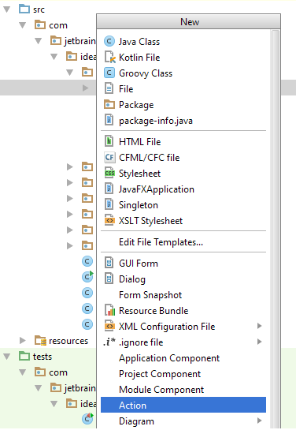
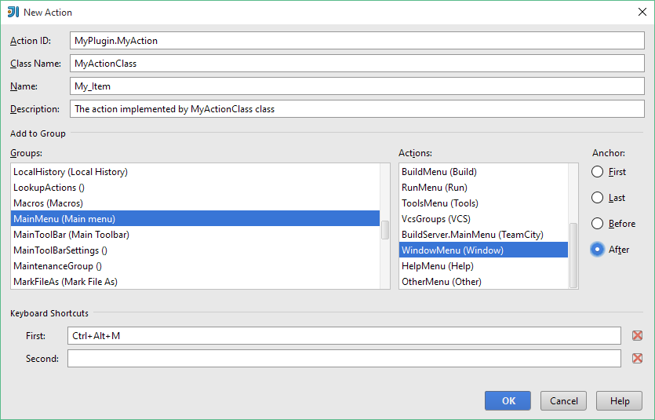

Your plugins can customize the IntelliJ Platform UI by adding new items to the menus and toolbars. The IntelliJ Platform provides the class [AnAction](upsource:///platform/editor-ui-api/src/com/intellij/openapi/actionSystem/AnAction.java), whose `actionPerformed` method is called each time you select a menu item or click a toolbar button.

To create custom actions in the *IntelliJ Platform*, you should perform two basic steps:

1. In your plugin, define an action or a system of actions that add their own items to menus and toolbars.
2. Register your actions.

This topic outlines the above steps. For detailed information and samples, refer to [IntelliJ Platform Action System](/basics/action_system.md).

### Defining actions

An action is a class derived from the `AnAction` class. To define your action, in your plugin, create a Java class derived from the `AnAction` class. In this class, override the `actionPerformed` method to be called when a menu item or a toolbar button is selected.
 
 To clarify this procedure, consider the following code snippet that defines the `TextBoxes` class derived from the `AnAction` class:
 
```java
public class TextBoxes extends AnAction {
    // If you register the action from Java code, this constructor is used to set the menu item name
    // (optionally, you can specify the menu description and an icon to display next to the menu item).
    // You can omit this constructor when registering the action in the plugin.xml file.
    public TextBoxes() {
        // Set the menu item name.
        super("Text _Boxes");
        // Set the menu item name, description and icon.
        // super("Text _Boxes","Item description",IconLoader.getIcon("/Mypackage/icon.png"));
    }
 
    public void actionPerformed(AnActionEvent event) {
        Project project = event.getData(PlatformDataKeys.PROJECT);
        String txt= Messages.showInputDialog(project, "What is your name?", "Input your name", Messages.getQuestionIcon());
        Messages.showMessageDialog(project, "Hello, " + txt + "!\n I am glad to see you.", "Information", Messages.getInformationIcon());
    }
}
```

Note that optionally, you can define a set of classes derived from the `AnAction` class. In this case, your plugin will define a system of actions.

### Registering actions

Once you have defined an action or a system of actions, you must register them to specify the menu items or toolbar buttons associated with actions. You can register actions in one of the following ways:

* Register actions in the `<actions>` section of the `plugin.xml` file.
* Register actions from Java code.

This section provides some examples that illustrate how to register actions. For more information, refer to [IntelliJ Platform Action System](/basics/action_system.md).

#### Registering actions in the plugin.xml file

To register your actions, make appropriate changes to the `<actions>` section of the plugin.xml file for your IDEA project. The following fragment of the plugin.xml file adds the Sample Menu group (item) to the main menu. Clicking this item allows you to access **Sample Menu \| Text Boxes and Sample Menu \| Show Dialog** menu commands:


```xml
<actions>
  <group id="MyPlugin.SampleMenu" text="_Sample Menu" description="Sample menu">
    <add-to-group group-id="MainMenu" anchor="last"  />
       <action id="Myplugin.Textboxes" class="Mypackage.TextBoxes" text="Text _Boxes" description="A test menu item" />
       <action id="Myplugin.Dialogs" class="Mypackage.MyShowDialog" text="Show _Dialog" description="A test menu item" />
  </group>
</actions>
```

This fragment of the plugin.xml file demonstrates only some elements you can use in the `<actions>` section to register your actions. For information about all elements designed to register your actions, refer to [IntelliJ Platform Action System](/basics/action_system.md).

#### Registering actions from Java code

Alternatively, you can register your actions from Java code. For more information and samples that illustrate how to register actions from Java code, see [IntelliJ Platform Action System](/basics/action_system.md).

### Quick creation of actions

The IntelliJ Platform provides the **New Action** wizard that suggests a simplified way of creating actions, with all the required infrastructure. The wizard helps you declare the action class and automatically makes appropriate changes to the `<actions>` section of the plugin.xml file.

Note that you can use this wizard only to add a new action to an existing action group on the main menu or toolbar. If you want to create a new action group, and then add an action to this group, follow instructions earlier in this document.

**To create and register an action with the New Action wizard**

1. In your project, on the context menu of the destination package click **New** or press **Alt + Insert**.
2. On the **New** menu, click **Action**.



3. On the **New Action** page that opens, fill in the following fields, and then click **OK**:

*  **Action ID**: Enter the unique ID of the action. Recommended format: `PluginName.ID`
*  **Class Name**: Enter the name of the action class to be created.
*  **Name**: Enter the name of the menu item or tooltip for toolbar button associated with action.
*  **Description**: Optionally, enter the action description. The IDEA status bar indicates this description when focusing the action.
*  In the **Add to Group** area, under **Groups**, **Actions** and **Anchor**, specify the action group to which to add a newly created action, and the position of the newly created action relative to other existing actions.
*  In the **Keyboard Shortcuts** area, optionally, specify the first and second keystrokes of the action.



The IntelliJ Platform generates a `.java` file with the specified class name, registers the newly created action in the plugin.xml file, adds a node to the module tree view, and opens the created action class file in the editor.
