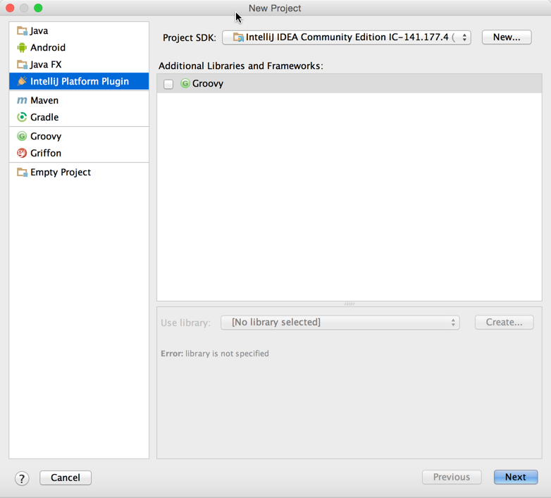
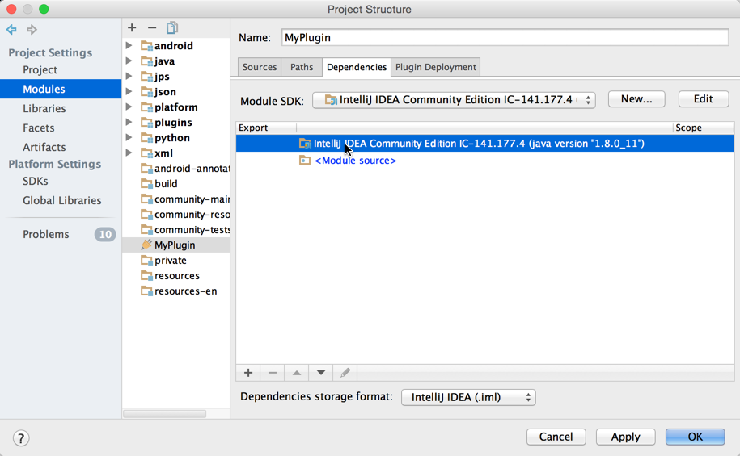

<!-- Copyright 2000-2020 JetBrains s.r.o. and other contributors. Use of this source code is governed by the Apache 2.0 license that can be found in the LICENSE file. -->

> **NOTE** For new projects, it is highly recommended to use [Gradle](/tutorials/build_system.md).

This section explains how you can create a new plugin project from scratch using the New Project wizard.  Optionally, you can import an existing project or import a project from external models. You can also add a new plugin module to an existing *IntelliJ Platform* project.
For more information, refer to the [IntelliJ IDEA Web Help](https://www.jetbrains.com/idea/help/new-project-wizard.html).

### To Create an IntelliJ Platform Plugin Project:

*  On the main menu, choose **File \| New \| Project**. The *New Project*
   wizard starts.

   

*  Set *IntelliJ Platform Plugin* project type
*  Click **Next**
*  Set desired project name
*  Click **Finish** to generate project structure files
*  Go to **File \| Project Structure** to customize project settings if required

### To Create an IntelliJ Platform Plugin Module
*  Select **File \| New \| Module** and choose the *IntelliJ Platform Plugin* module type

   
 
 
*  Enter your desired plugin name.

*  Go to **File \| Project Structure** and select the newly created *IntelliJ Platform SDK* as the default SDK for the plugin module:

   

### Adding Code to the Project
Before running the new project add some code to provide simple functionality.
See the [Creating Actions](/tutorials/action_system/working_with_custom_actions.md) tutorial for step-by-step instructions for adding a menu action. 
