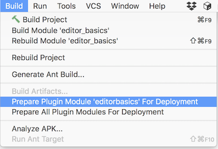
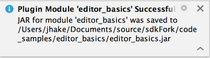
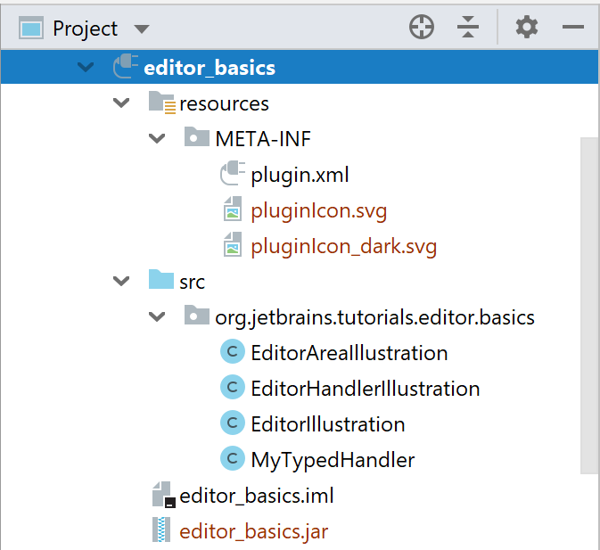

<!-- Copyright 2000-2020 JetBrains s.r.o. and other contributors. Use of this source code is governed by the Apache 2.0 license that can be found in the LICENSE file. -->

Before your custom plugin can be used, it must be deployed: built, installed, and then enabled using Plugin Manager.

To deploy a plugin:

* Make your project by invoking **Build \| Build Project** or **Build \| Build Module \<module name\>**.
* Prepare your plugin for deployment. In the main menu, select **Build \| Prepare Plugin Module \<module name\> for Deployment**.

  

* If the plugin module does not depend on any libraries, a `.jar` archive will be created. Otherwise, a `.zip` archive will be created including all the plugin libraries specified in the project settings.

  

* [Install](https://www.jetbrains.com/help/idea/managing-plugins.html#installing-plugins-from-disk)
  the newly created archive/jar file from disk. The `editor_basics` code sample builds the plugin archive/jar into the `editor_basics` project folder:

  

* Restart your IDE so the changes will take effect.

