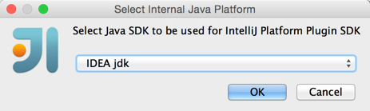

To set up your plugin development environment:

*  Check out the source code of IntelliJ IDEA Community Edition as described in
   [Check Out And Build Community Edition](/basics/checkout_and_build_community.md).

*  Create a new *IntelliJ IDEA SDK*:

   

*  Set *IDEA jdk* created in
   [Check Out And Build Community Edition](/basics/checkout_and_build_community.md)
   as the default Java SDK:

   

*  Specify your installation folder of *IntelliJ IDEA Community Edition* as the home path.

   **Note:**
   You may use IntelliJ IDEA Ultimate as an alternative, but the debugging of core code will only work with the *Community Edition*.

*  In the Sourcepath tab of the SDK settings, click the `Add` button:

   

*  Specify the directory into which you have checked out the sources of the *Community Edition*:

   

*  Select **File \| New \| Module** and choose the *IntelliJ Platform Plugin* module type

   

*  Enter your desired plugin name.

*  Go to **File \| Project Structure** and select the newly created *IntelliJ Platform SDK* as the default SDK for the plugin module:

   
