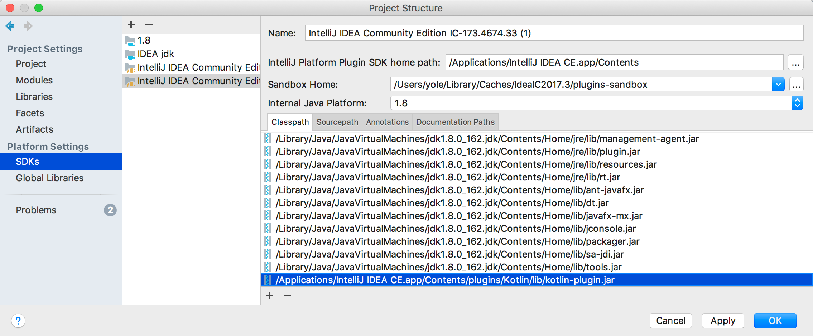

In your plugin, you may depend on classes from other plugins, either bundled, third-party or your own. In order to do so, you need to perform the following steps:

* If the plugin is not bundled, run the sandbox instance of your target IDE and install the plugin there.
* Add the jars of the plugin you're depending on to the classpath of your *IntelliJ Platform SDK*.
  In order to do that, open the Project Structure dialog, select the SDK you're using, press the + button in the Classpath tab, and
  select the plugin jar file or files.
    * For bundled plugins, the plugin jar files are located in `plugins/<pluginname>` or `plugins/<pluginname>/lib` under the main installation directory.
      If you're not sure which jar to add, you can add all of them.
    * For non-bundled plugins, the plugin jar files are located in `config/plugins/<pluginname>` or `config/plugins/<pluginname>/lib` under the directory specified as "Sandbox Home" in the IntelliJ Platform Plugin SDK settings.




> **warning** Do not add the plugin jars as a library: this will fail at runtime because IntelliJ Platform will load two separate copies of the dependency plugin classes.

* If you're using Gradle to build your plugin, instead of doing the above add it to the `plugins` parameter of the `intellij` block in your build.gradle, for example:

```groovy
intellij {
    plugins 'org.jetbrains.kotlin@1.2.30'
}
```

* Add a `<depends>` tag to your plugin.xml, adding the ID of the plugin you're depending on as the contents of the tag.
For example:

```xml
<depends>org.jetbrains.kotlin</depends>
```

To find out the ID of the plugin you're depending on, locate the `META-INF/plugin.xml` file inside its jar and check the contents of the `<id>` tag.

## Optional Plugin Dependencies

You can also specify an optional plugin dependency. In this case, your plugin will load even if the plugin you depend on
is not installed or enabled, but part of the functionality of your plugin will not be available. In order to do that,
add `optional="true" config-file="otherconfig.xml"` to the `<depends>` tag.

For example,
if you're working on a plugin that adds additional highlighting for Java and Kotlin files, you can use the following
setup. Your main plugin.xml will define an annotator for Java and specify an optional dependency on the Kotlin plugin:

```xml
<idea-plugin>
   ...
   <depends optional="true" config-file="withKotlin.xml">org.jetbrains.kotlin</depends>

   <extensions defaultExtensionNs="com.intellij">
      <annotator language="JAVA" implementationClass="com.example.MyJavaAnnotator"/>
   </extensions>
</idea-plugin>
```

Then, you create a file called withKotlin.xml, in the same directory as your main plugin.xml file. In that file, you
define an annotator for Kotlin:

```xml
<idea-plugin>
   <extensions defaultExtensionNs="com.intellij">
      <annotator language="kotlin" implementationClass="com.example.MyKotlinAnnotator"/>
   </extensions>
</idea-plugin>
```

