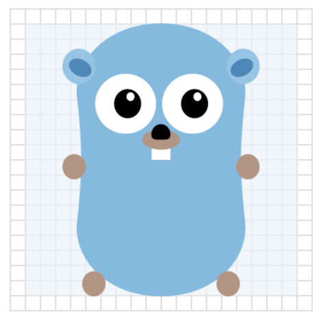

Beginning in version 2019.1, the IntelliJ Platform supports representing a plugin with a logo.
A _Plugin Logo_ is an icon, intended to be a unique representation of a plugin's functionality, technology, or company. 

**Note:** icons and images used within a plugin have different requirements. 
See [Working with Icons and Images](/reference_guide/work_with_icons_and_images.md) for more information.

* bullet list
{:toc}

## Introduction
Plugin Logos are shown in the [Plugins Repository](https://plugins.jetbrains.com/), and in [MarketPlace](https://plugins.jetbrains.com/marketplace).
They also appear in the Settings/Preferences [Plugin Manager](https://www.jetbrains.com/help/idea/managing-plugins.html) UI in JetBrains' IntelliJ Platform-based IDEs. 
Whether online or in the product UI, a Plugin Logo helps users to identify a plugin more quickly in a list, as shown below:

{:width="800px"}

## Plugin Logo Icon Requirements
Plugin Logos are represented as icons, and to be displayed correctly within an IntelliJ Platform-based IDE the icon must:
* Be the correct file format,
* Follow the best practices design guidelines
* Conform to file name conventions.  

### Plugin Logo Icon File Format
All Plugin Logo images must be SVG format. 
This vector image format is required because the Plugin Logo is displayed in more than one size.

### Plugin Logo Size
The Plugin Logo icon should be provided in one size: 40px x 40px. 
However, the icons display in two sizes, and scale automatically in each context:
* 40px by 40px in the plugins _list_ in the Plugin Manager UI.
* 80px by 80px in the plugin _details screen_ in the Plugin Manager UI, on the plugin's page in the Plugins Repository, and on MarketPlace.

Verify that Plugin Logo icon designs are effective in both sizes and all display contexts.

### Plugin Logo Shape and Visual Weight
The nominal Plugin Logo size is shown below. 
At least 2px transparent padding should remain around the perimeter. 
This leaves a nominal 36px x 36px area where the visible part of the Plugin Logo icon should fit, as shown below:

{:width="225px"}

Make sure Plugin Logos have the same visual weight as the logos in the examples below. 
The more visual weight in Plugin Logo design, the less actual space it needs. 
See more examples of [visual weight compensation](https://jetbrains.github.io/ui/principles/icons/#08) in the IntelliJ Platform UI Guidelines for Icons. 

For basic shapes use the following sizes. 
Note the different areas of transparent padding used for each shape: 

| {:width="225px"} | {:width="225px"} |
|:---:|:---:|
| _Square icon 32 x 32px_ | _Circular icon 34px in Diameter_ |
| {:width="225px"} | {:width="225px"} |
| _Horizontal rectangular icon 36px x 26px_ | _Vertical rectangular icon 26px x 36px_ |

 

### Plugin Logo Colors
If the plugin’s technology already has a logo, use its colors. 
Check the license terms before using the logo. 
If there is no existing logo, or its use is prohibited, create a custom logo based on the [Action Colors Palette](https://jetbrains.github.io/ui/principles/icons/#action-icons) in the IntelliJ Platform UI Guidelines for Icons.

| {:width="225px"} | {:width="225px"} |
|:---:|:---:|
| _The YouTrack Plugin Logo Uses the YouTrack Product Logo_ | _The Keymap Plugin Logo Uses a Color From the Action Colors Palette_ |

Ensure a Plugin Logo is visible and provides a good user experience on both light and dark backgrounds. 
If one Plugin Logo design does not work on both light and dark backgrounds, then create separate light and dark versions of the Plugin Logo. 
The examples below illustrate how a good Plugin Logo design for a light background may work well (left) for a light background but not so well (middle) for a dark background. 
Consequently, a separate Plugin Logo (right) for dark backgrounds is needed. 

| {:width="225px"} | {:width="225px"} | {:width="225px"} |
|:---:|:---:|:---:|
| _The light Plugin Logo design works well on light UI Theme_ | _The light Plugin Logo design does not work well on a dark UI Theme_ | _A separate, dark Plugin Logo design works well on dark UI Theme_ |

### Plugin Logo Icon File Naming Convention
To be used by the IntelliJ Platform, Plugin Logo icon files must be named according to the following conventions:
* `pluginIcon.svg` as the default Plugin Logo, and specifically for use with light IDE UI Themes,
* `pluginIcon_dark.svg` an optional, alternative Plugin Logo icon for use with dark IDE UI Themes.
  This alternate Plugin Logo icon can be provided when using the default icon is unsatisfactory for use with light IDE UI Themes.
    

## Adding Plugin Logo Icon Files to a Plugin Project
The Plugin Logo icon files must be in the `META-INF` folder of the plugin distribution file, i.e. the `*.jar` or `*.zip` file you upload to the plugin repository and install into a JetBrains IDE.

To include Plugin Logo icons in your distribution file, place the Plugin Logo icon files into a plugin project's `resources/META-INF` folder. Note that this requirement
is the same regardless of using DevKit or Gradle for developing a plugin. For example:
 

