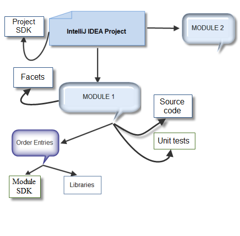

<!--TODO split into parts accordingly to the table of contents-->

This topic considers the concept of projects based on *IntelliJ Platform* and related subjects, such as _modules_, _facets_, _libraries_, _SDK_. The project structure and Java classes you can use to manage projects and modules have been considered.

## Project and its components

This section briefly discusses the IDEA project structure, project components and related terms.  For more information about projects and their components, refer to [Project](http://www.jetbrains.com/idea/help/project.html), [Module](http://www.jetbrains.com/idea/help/module.html), [Library](http://www.jetbrains.com/idea/help/library.html), [Facet](http://www.jetbrains.com/idea/help/facet.html) in the *IntelliJ IDEA* Web Help.

### Project

In the *IntelliJ Platform*, a _project_ encapsulates all your source code, libraries, and build instructions into a single organizational unit.  Everything you do using the *IntelliJ Platform SDK* is done within the context of a project. A project defines collections referred to as _modules_ and _libraries_.  Depending on the logical and functional requirements to the project, you can create a _single-module_ or a _multi-module_ project.

### Module

A _module_ is a discrete unit of functionality that can be run, tested, and debugged independently. Modules includes such things as source code, build scripts, unit tests, deployment descriptors, etc. In the project, each module can use a specific SDK or inherit SDK defined on the project level (see the [SDK](/reference_guide/project_model/sdk.md) section later in this document). A module can depend on other modules of the project.

### Library

A _library_ is an archive of compiled code (such as JAR files) that your modules depend on. The *IntelliJ Platform* supports three types of libraries:

* **Module Library**: the library classes are visible only in this module and the library information is recorded in the module `.iml` file.
* **Project Library**: the library classes are visible within the project and the library information is recorded in the project `.ipr` file or in `.idea/libraries`.
* **Global Library**: the library information is recorded in the `applicationLibraries.xml` file into the `~/.IntelliJIdea/config/options` directory. Global libraries are similar to project libraries, but are visible for the different projects.

For more information about libraries, refer to [Library](http://www.jetbrains.com/idea/help/library.html).

### SDK

Every project uses a Software Development Kit (_SDK_). For Java projects, SDK is referred to as JDK (Java Development Kit).

The SDK determines which API library is used to build the project. If your project is multi-module, the project SDK by default is common for all modules within the project. 

Optionally, you can configure individual SDK for each module.

For more information about SDKs, see [Configuring Global, Project and Module SDKs](https://www.jetbrains.com/idea/help/configuring-global-project-and-module-sdks.html) in the *IntelliJ IDEA* Web Help.

### Facet

A _facet_ represents certain configuration, specific for a particular framework/technology, associated with a module. A module can have multiple facets. E.g. Spring specific configuration is stored in a Spring facet.

For more information about facets see [Facet](http://www.jetbrains.com/idea/help/facet.html) and [Facet Dependencies](http://www.jetbrains.com/idea/help/available-facets-and-their-dependencies.html) in the *IntelliJ IDEA* Web Help.

## Project Structure

From the plugin developer's point of view, a project can be thought of as follows:



A **project** consists of one or several **modules**. Each **module** includes the plugin source code and so called **order entries** that refer to **SDK** and **libraries** the module uses. By default, all modules uses the project SDK. In addition, a **module** can optionally have a set of **facets**.

This document explains how you can explore and change the structure of projects using API.

## Working with Projects

This section explains how to complete some common tasks related to management of projects. 
The Java classes and interfaces that you can use to explore and change the project contents are discussed.

### How to Work with Project Files?

The *IntelliJ Platform* stores the project configuration data in XML files. The list of those files depends on the plugin [project format](http://www.jetbrains.com/idea/help/project.html).

For _file-based_ format projects, the information core to the project itself (e.g. location of the component modules, compiler settings, etc.) is stored in the `%project_name%.ipr` file.

The information about modules the project includes is stored in `%module_name%.iml` files. Module files are created for each module.

For _directory-based_ format projects, the project and workspace settings are stored in a number of XML files under the `%project_home_directory%/.idea` directory. Each XML file is responsible for its own set of settings and can be recognized by its name: `projectCodeStyle.xml`, `encodings.xml`, `vcs.xml` etc.

As for the file-based format projects, `.iml` files describe modules.

To work with projects and project files, you can use the following classes and interfaces:

* [`Project`](upsource:///platform/core-api/src/com/intellij/openapi/project/Project.java) interface.
* [`ProjectRootManager`](upsource:///platform/projectModel-api/src/com/intellij/openapi/roots/ProjectRootManager.java) abstract class.
* [`ProjectManager`](upsource:///platform/projectModel-api/src/com/intellij/openapi/project/ProjectManager.java) abstract class.
* [`ProjectFileIndex`](upsource:///platform/projectModel-api/src/com/intellij/openapi/roots/ProjectFileIndex.java) interface.

Note that you don't need to access project files directly to load or save settings. See [Persisting State of Components](persisting_state_of_components.md) for more information.

Note that hereafter, the `project` variable is of the `Project` type. For example, for the opened project, you can get it from an action: `Project project = e.getProject();`

### How do I get a list of source roots for all modules in my project?

Use the `ProjectRootManager.getContentSourceRoots()` method. To clarify this, consider the following code snippet:

```java
String projectName = project.getName();
StringBuilder sourceRootsList = new StringBuilder();
VirtualFile[] vFiles = ProjectRootManager.getInstance(project).getContentSourceRoots();
for (VirtualFile file : vFiles) {
  sourceRootsList.append(file.getUrl()).append("\n");
}

Messages.showInfoMessage("Source roots for the " + projectName + " plugin:\n" + sourceRootsList, "Project Properties");
```

### How do I check whether a file is related to a project?

The *IntelliJ Platform* provides the `ProjectFileIndex` interface you can use to verify whether a file or directory is related to the specified IDEA project.  This section explains how you can use this interface.

#### How do I get an instance of the ProjectFileIndex interface?

Use the `ProjectRootManager.getFileIndex()` method. For example:
`ProjectFileIndex projectFileIndex = ProjectRootManager.getInstance(project).getFileIndex();`

#### How do I get a module to which a file belongs?

To determine a module in the project in question to which the specified [virtual file](architectural_overview/virtual_file.md) belongs, use the `ProjectFileIndex.getModuleForFile(virtualFile)` method:

```java
Module module = ProjectRootManager.getInstance(project).getFileIndex().getModuleForFile(virtualFile);
```

Note that this method returns `null` if the file does not belong to any module.

You can also use the `ProjectFileIndex.getContentRootForFile` method to get the module content root to which the specified file or directory belongs:

```java
VirtualFile moduleContentRoot = ProjectRootManager.getInstance(project).getFileIndex().getContentRootForFile(virtualFileorDirectory);
```

#### How do I get the module source root or library source root to which the specified file or directory belongs?

Use the `ProjectFileIndex.getSourceRootForFile` method. For example:

```java
VirtualFile moduleSourceRoot = ProjectRootManager.getInstance(project).getFileIndex().getSourceRootForFile(virtualFileorDirectory);
```

Note that this method returns `null` if the file or directory does not belong to any source root of modules in the project.

#### How do I check whether a file or directory is related to the project libraries?

The `ProjectFileIndex` interface implements a number of methods you can use to check whether the specified file belongs to the project library classes or library sources.

You can use the following methods:

* `ProjectFileIndex.isLibraryClassFile(virtualFile)`: Returns `true` if the specified `virtualFile` is a compiled class file.
* `ProjectFileIndex.isInLibraryClasses(virtualFileorDirectory)`: Returns `true` if the specified `virtualFileorDirectory` belongs to library classes.
* `ProjectFileIndex.isInLibrarySource(virtualFileorDirectory)`: Returns `true` if the specified `virtualFileorDirectory` belongs to library sources.

#### How do I get the project SDK?

* To get the project-level SDK: `Sdk projectSDK = ProjectRootManager.getInstance(project).getProjectSdk();` 
* To get the project-level SDK name: `String projectSDKName = ProjectRootManager.getInstance(project).getProjectSdkName();`

#### How do I set the project SDK?

* To set the project-level SDK: `ProjectRootManager.getInstance(project).setProjectSdk(Sdk jdk);`
* To set the project-level SDK name: `ProjectRootManager.getInstance(project).setProjectSdkName(String name);`

Note that by default, the project modules use the project SDK. Optionally, you can configure individual SDK for each module.

## Working with Modules

The *IntelliJ Platform* provides a number of Java classes and interfaces you can use to work with modules:

* [`ModuleManager`](upsource:///platform/projectModel-api/src/com/intellij/openapi/module/ModuleManager.java) abstract class.
* [`Module`](upsource:///platform/core-api/src/com/intellij/openapi/module/Module.java) interface.
* [`ModuleRootManager`](upsource:///platform/projectModel-api/src/com/intellij/openapi/roots/ModuleRootManager.java) abstract class.
* [`ModuleRootModel`](upsource:///platform/projectModel-api/src/com/intellij/openapi/roots/ModuleRootModel.java) interface.
* [`ModuleUtil`](upsource:///platform/lang-api/src/com/intellij/openapi/module/ModuleUtil.java) class.
* [`ModifiableModuleModel`](upsource:///platform/projectModel-api/src/com/intellij/openapi/module/ModifiableModuleModel.java) interface.
* [`ModifiableRootModel`](upsource:///platform/projectModel-api/src/com/intellij/openapi/roots/ModifiableRootModel.java) interface.

This section discusses how to complete some common tasks related to management of modules.

### How do I get a list of modules the project includes?

Use the `ModuleManager.getModules()` method.

### How do I get dependencies and classpath of a module?

_Order entries_ include SDK, libraries and other modules the module uses. With the *IntelliJ IDEA* UI, you can view order entries for a module on the [Dependencies](http://www.jetbrains.com/idea/help/dependencies-tab.html) tab of the *Project Structure* dialog box.

To explore the [module dependencies](http://www.jetbrains.com/idea/help/dependencies-tab.html), use the [OrderEnumerator](upsource:///platform/projectModel-api/src/com/intellij/openapi/roots/OrderEnumerator.java) class.

The following code snippet illustrates how you can get classpath (classes root of all dependencies) for a module:

```java
VirtualFile[] roots = ModuleRootManager.getInstance(module).orderEntries().classes().getRoots();
```

### How do I get the SDK the module uses?

Use the `ModuleRootManager.getSdk()` method. This method returns a value of the [Sdk](upsource:///platform/projectModel-api/src/com/intellij/openapi/projectRoots/Sdk.java) type.

The following code snippet illustrates how you can get detailed information on SDK the specified module uses:

```java
ModuleRootManager moduleRootManager = ModuleRootManager.getInstance(module);
Sdk SDK = moduleRootManager.getSdk();
String jdkInfo = "Module: " + module.getName() + " SDK: " + SDK.getName() + " SDK version: "
                 + SDK.getVersionString() + " SDK home directory: " + SDK.getHomePath();
```

### How do I get a list of modules on which this module directly depends?

Use the `ModuleRootManager.getDependencies()` method to get an array of the `Module` type values or the `ModuleRootManager.getDependencyModuleNames()` to get an array of module names. To clarify, consider the following code snippet:

```java
ModuleRootManager moduleRootManager = ModuleRootManager.getInstance(module);
Module[] dependentModules = moduleRootManager.getDependencies();
String[] dependentModulesNames = moduleRootManager.getDependencyModuleNames();
```

### How do I get a list of modules that depend on this module?

Use the `ModuleManager.getModuleDependentModules(module)` method.

Note that you can also check whether a module (*module1*) depends on another specified module (*module2*) using the `ModuleManager.isModuleDependent` method in the following way:

```java
boolean isDependent = ModuleManager.getInstance(project).isModuleDependent(module1,module2);
```

### How do I get a module to which the specified file or PSI element belongs?

* To get the project module to which the specified file belongs, use the `ModuleUtil.findModuleForFile()` static method. 

    To clarify, consider the following code snippet:

    ```java
    String pathToFile = "C:\\users\\firstName.LastName\\plugins\\myPlugin\src\MyAction.java";
    VirtualFile virtualFile = LocalFileSystem.getInstance().findFileByPath(pathToFile);
    Module module = ModuleUtil.findModuleForFile(virtualFile,myProject);
    String moduleName = module == null ? "Module not found" : module.getName();
    ```

* To get the project module to which the specified [PSI element](architectural_overview/psi_elements.md) belongs, use the `ModuleUtil.findModuleForPsiElement(psiElement)` method.

### How do I work with libraries available within a module?

#### How do I get a list of libraries available within a module?

To get the list of libraries, use `OrderEnumerator.forEachLibrary` method. 
To clarify this, consider the following code snippet that illustrates how to output the list of libraries for the specified module:

```java
final List<String> libraryNames = new ArrayList<String>();
ModuleRootManager.getInstance(module).orderEntries().forEachLibrary(new Processor<Library>() {
  @Override
  public boolean process(Library library) {
    libraryNames.add(library.getName());
    return true;
  }
});
Messages.showInfoMessage(StringUtil.join(libraryNames, "\n"), "Libraries in Module");
```

This sample code outputs a list of libraries for the `module` module.

#### How do I get the library content?

The `Library` class provides the `getUrls` method you can use to get a list of source roots and classes the library includes. To clarify, consider the following code snippet:

```java
StringBuilder roots = new StringBuilder("The " + lib.getName() + " library includes:\n");
roots.append("Sources:\n");
for (String each : lib.getUrls(OrderRootType.SOURCES)) {
  roots.append(each).append("\n");
}
roots.append"Classes:\n");
for (String each : lib.getUrls(OrderRootType.CLASSES)) {
  strRoots.append(each).append("\n");
}
Messages.showInfoMessage(roots.toString(), "Library Info");
```

In this sample code, `lib` is of the [Library](upsource:///platform/projectModel-api/src/com/intellij/openapi/roots/libraries/Library.java) type.

### How do I get a set of facets the module includes?

Use the [FacetManager](upsource:///platform/lang-api/src/com/intellij/facet/FacetManager.java) and [Facet](upsource:///platform/lang-api/src/com/intellij/facet/Facet.java) classes.
