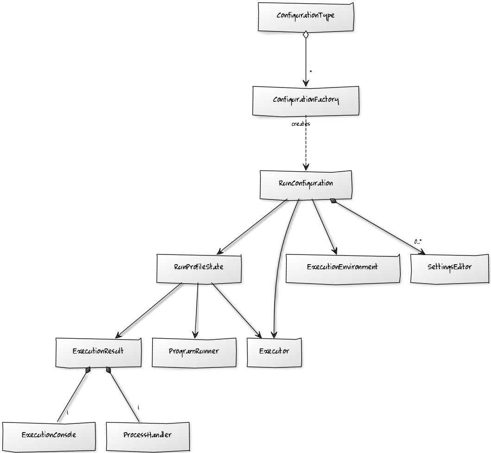

*Run Configurations* allow users to run a certain type of external processes from within the IDE, e.g. a script, an application, a server, etc. You can provide UI for the user to specify execution options, as well as an option to create a run configuration based on a specific location in the source code.

# Architectural overview

Classes used to manipulate run configurations can be split into the following groups:

* [Run configuration management](/basics/run_configurations/run_configuration_management.md). This includes creation, persistence, and modification.
* [Execution](/basics/run_configurations/run_configuration_execution.md).

This diagram shows the main classes:

