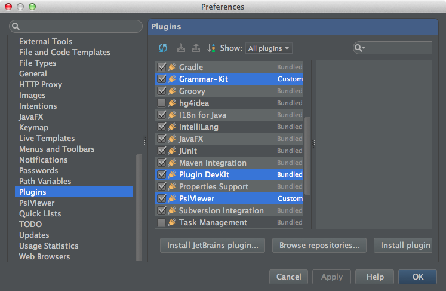

<!--
INITIAL_SOURCE https://confluence.jetbrains.com/display/IntelliJIDEA/Prerequisites
-->


### 1. Download and install IntelliJ IDEA

Download and install either IntelliJ IDEA Ultimate or IntelliJ IDEA Community Edition.

### 2. Check out Community Edition source files

```
git clone git://git.jetbrains.org/idea/community.git idea
```

### 3. Install required plugins

Make sure that the bundled Plugin DevKit plugin is enabled.
Install and enable
[Grammar-Kit](http://plugins.intellij.net/plugin?pluginId=6606)
and
[PsiViewer](http://plugins.intellij.net/plugin/?null&pluginId=227)
plugins.

### 4. Configure SDK and source files

Configure a common JDK and an IntelliJ IDEA Plugin SDK.
For IntelliJ IDEA Plugin SDK you should specify the directory with installed IntelliJ IDEA.
By default it offers the directory of the currently running IntelliJ IDEA.

To attach the Community Edition source files to the SDK, open the Sourcepath tab in the SDK configuration dialog, press the Add button and select the directory with the Community Edition source checkout.
IntelliJ IDEA will scan the directory for roots and offer the list of roots to add, with everything checked by default.
Accept the list of roots by pressing OK.




### 5. Create a project

Create an IntelliJ IDEA Plugin project and specify IntelliJ IDEA Plugin SDK.


[Top](cls_tutorial.html)
[Next](language_and_filetype.md)

