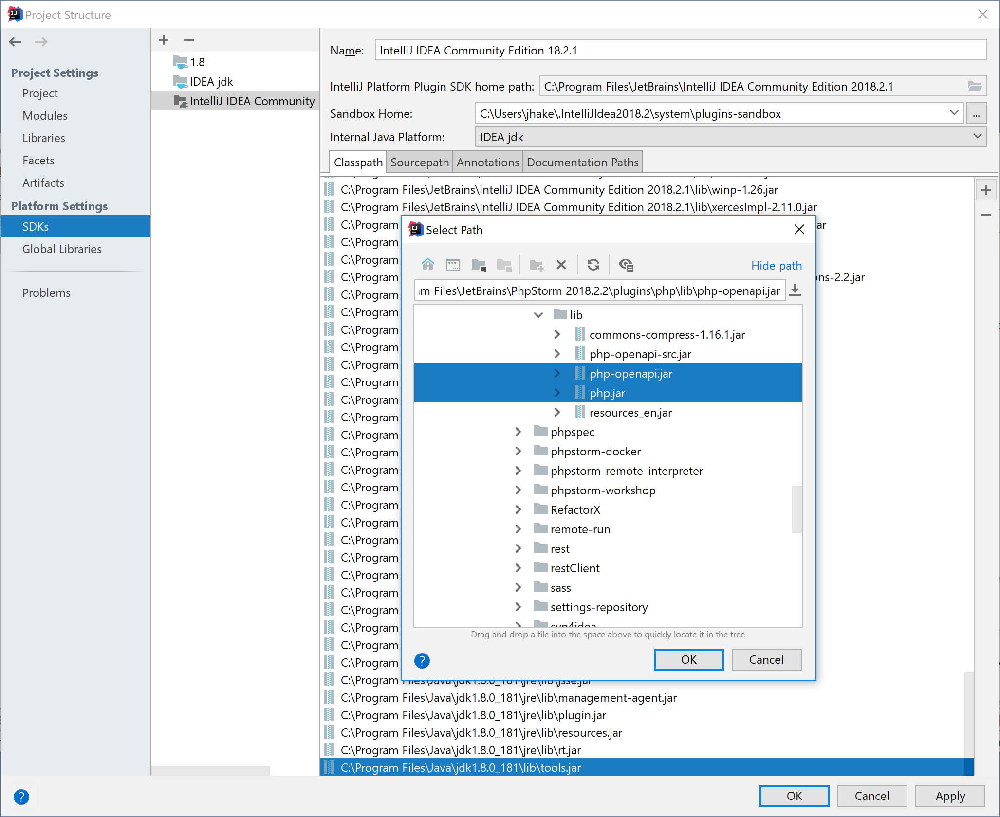

## General information
Please review the information in the [Getting Started with Plugin Development](/basics/getting_started.md)
section of this guide.

There are two ways to develop plugins for PhpStorm:
1. Use IntelliJ IDEA Ultimate as the IDE with the PHP plugin installed.
2. Use PhpStorm as the IDE.

The choice affects how you will configure an SDK for developing a plugin. Using IntelliJ IDEA Ultimate as the IDE requires basing the
SDK for your project on your installed version of IntelliJ IDEA. Using PhpStorm as the IDE requires basing the SDK for
your project on your installed version of PhpStorm. Choosing an installed IDE as the basis for a project is described on the [Setting Up a Development Environment](/basics/getting_started/setting_up_environment.md)
page.

@anet - is IDEA Ultimate required, or could a developer use IntelliJ CE?

## How to use the PhpStorm OpenAPI Library in IntelliJ

This section explains how to configure the IntelliJ Platform for using the PhpStorm OpenAPI.

> Note: the OpenAPI library is available for PhpStorm 6 and above.

### 1. Adding the Php Library
First the Php library must be added to your plugin's project settings.

#### 1.1 Add Php Libraries to a Module
This step adds the Php Libraries to the IntelliJ development environment:  
1. Open Project Structure **File \| Project Structure** 
2. Select **Libraries**  
3. Press **Add** button  
4. Find and select the `php-openapi.jar` and `php.jar` files. They are located in `<your_installation_of_PhpStorm>/plugins/php/lib`.  
5. Agree to add the libraries to your Module  
     
    
#### 1.2 Add Php Library to the SDK Classpath
This step is makes the Php Library classes available in the IntelliJ development environment:
1. Select **SDKs**
2. Select the **IntelliJ Plugin** SDK. (In the image below it is labeled _IntelliJ IDEA Community_)
3. Select the **Classpath** tab.
4. Press **Add** button  
5. Find and select the `php-openapi.jar` and `php.jar` files. They are located in `<your_installation_of_PhpStorm>/plugins/php/lib`. 
6. Agree to add the libraries to the classpath  
     
     
#### 1.3 Set the Php Library Scope    
This step is necessary because otherwise `ClassCastException` will be thrown because two instances of the library will be loaded via different class loaders
1. Open **Modules \| Dependencies**
2. Change **Scope** to **Provided**.
    


### 2. Adding dependencies to `plugin.xml`
Declare your plugin project's dependency on the Php OpenAPI:
1. Open `plugin.xml` in the directory `META-INF`
2. Add two `<depends>` items to `plugin.xml`:

```xml
<depends>com.jetbrains.php</depends>
<depends>com.intellij.modules.platform</depends>
```
