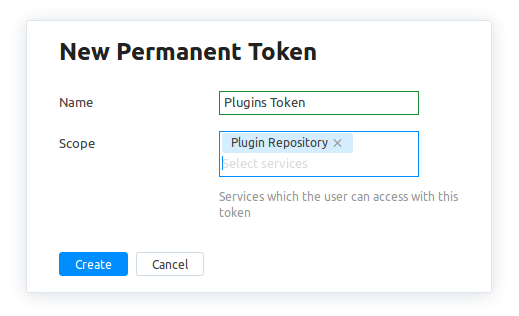

 
Please note that maximum allowed plugin size is *200 MB*.

You should create a [**hubPermanentToken**](https://www.jetbrains.com/help/hub/Manage-Permanent-Tokens.html) at [JetBrains Hub](https://hub.jetbrains.com/users/me?tab=authentification) and specify Plugin Repository in Scope.

   

Other parameters:

* **pluginId** is a numeric ID of the plugin, can be retrieved from the plugin repository URL. e.g. [Scala](https://plugins.jetbrains.com/plugin/1347-scala) plugin ID is *1347*. (*pluginXmlId* can be used instead)
* **pluginXmlId** is an unique identifier of the plugin specified as <id> in plugin.xml. Can be found as a *Plugin XML ID* parameter on the right of the plugin's individual update page and in the plugin.xml. (*pluginId* can be used instead)
* **channel** is a release channel the update is published to (empty channel means default *Stable* channel) (optional)

## POST

**Using pluginId**

Provide file as file contents. Curl command template:

```
curl -i --header "Authorization: Bearer <hubPermanentToken>" -F pluginId=<pluginId> -F file=@<path to plugin .jar/.zip file> -F channel=<channel> https://plugins.jetbrains.com/plugin/uploadPlugin
```

Curl command example:

```
curl -i --header "Authorization: Bearer perm:qwertyasdfghzxcvb" -F pluginId=5047 -F file=@Go-0.11.1197.zip -F channel=nightly https://plugins.jetbrains.com/plugin/uploadPlugin
```

**Using pluginXmlId**

Provide file as file contents. Curl command template:

```
curl -i --header "Authorization: Bearer <hubPermanentToken>" -F xmlId=<pluginXmlId> -F file=@<path to plugin .jar/.zip file> -F channel=<channel> https://plugins.jetbrains.com/plugin/uploadPlugin
```

Curl command example:

```
curl -i --header "Authorization: Bearer perm:qwertyasdfghzxcvb" -F xmlId=ro.redeul.google.go -F file=@Go-0.11.1197.zip -F channel=nightly https://plugins.jetbrains.com/plugin/uploadPlugin
```
## .NET

You can upload the plugins for .NET using *push* command of the *NuGet CLI*. 
You should use [hubPermanentToken](https://www.jetbrains.com/help/hub/Manage-Permanent-Tokens.html) for it 
with Plugin Repository in Scope as shown above. 

Push command template:

```
nuget push <path to plugin .nupkg file> <hubPermanentToken> -Source https://plugins.jetbrains.com/
```

Push command example:

```
nuget push angularjs.1.9.0.nupkg perm:qwertyasdfghzxcvb -Source https://plugins.jetbrains.com/
```

**Configuration**

Configuration for NuGet is located in `%AppData%\NuGet\NuGet.Config` (Windows), 
`~/.config/NuGet/NuGet.Config` or `~/.nuget/NuGet/NuGet.Config` (Mac/Linux).
You can modify this file using [the NuGet CLI commands](https://docs.microsoft.com/en-us/nuget/reference/nuget-config-file). 

For example, you can set a key for a source and add *plugins site* to the default push source:

```
# Set hub token for plugins site
nuget setApiKey perm:qwertyasdfghzxcvb -Source https://plugins.jetbrains.com/

# Set plugins site as default for push
nuget config -set defaultPushSource=https://plugins.jetbrains.com/

# Push if the key and the default source are set
nuget push angularjs.1.9.0.nupkg
```
In addition to the fact that you can change NuGet's default configuration, 
you can apply your own configuration file using `ConfigFile` option in *push* command. 
For example:

```
nuget push angularjs.1.9.0.nupkg -ConfigFile ~/my.Config
```

To obtain more information about the NuGet configuration see [this page](https://docs.microsoft.com/en-us/nuget/consume-packages/configuring-nuget-behavior).


