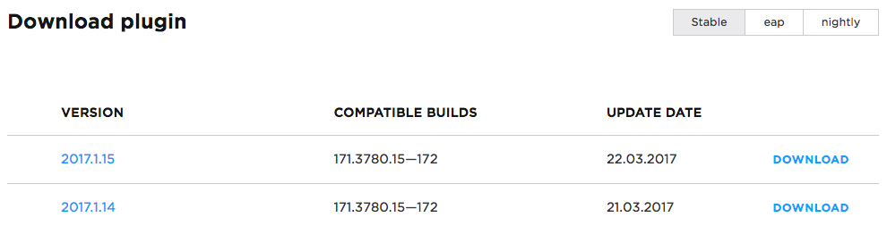
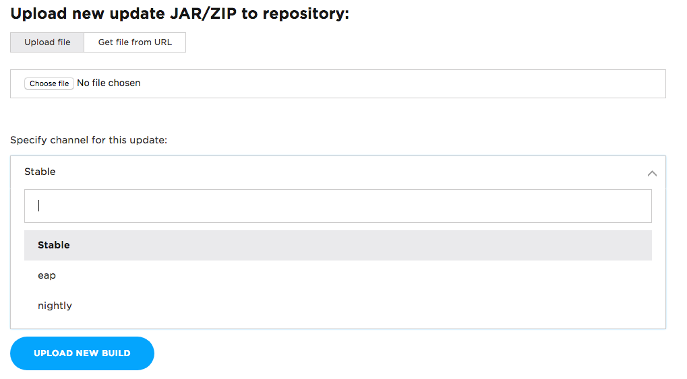
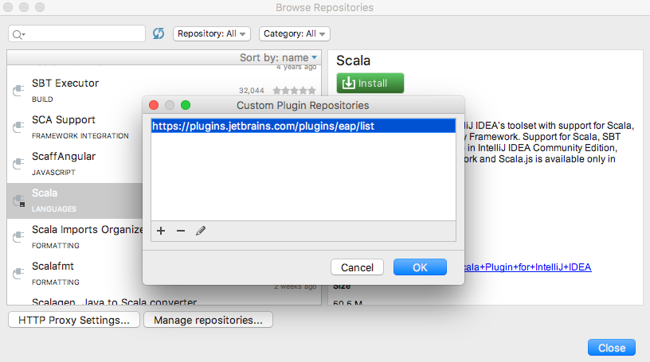

## Uploading a Plugin Update to the Custom Release Channel

You may deploy plugins to a specific channel of your choosing via the plugin repository web interface, [Gradle plugin](http://www.jetbrains.org/intellij/sdk/docs/tutorials/build_system/deployment.html) or the [API](api/plugin_upload.md).

When empty, this will use the default plugin repository channel (*Stable*), available to all JetBrains plugin repository users, however, you can publish to an arbitrarily-named channel.

When using a non-default release channel, users will need to add a new custom plugin repository to install your plugin.

In the plugin repository, all channels will be displayed on the plugin page:



You can add custom channels and upload an update to the channel on the plugin *Edit* page (as well as via Gradle plugin and the API):



## Configuring a Custom Channel in IntelliJ Platform Based IDEs

When using a non-default release channel, IntelliJ Platform Based IDEs users will need to add a new [custom plugin repository](https://www.jetbrains.com/idea/help/managing-enterprise-plugin-repositories.html) to install your plugin from the specified channel.

For example, if you specify `'eap'` as a release channel, then users will need to add the `https://plugins.jetbrains.com/plugins/eap/list` repository to install the plugin and receive updates. These channels are treated as separate repositories for all intents and purposes.

Popular channel names include:

* `eap`: https://plugins.jetbrains.com/plugins/eap/list
* `alpha`: https://plugins.jetbrains.com/plugins/alpha/list
* `beta`: https://plugins.jetbrains.com/plugins/beta/list

It is also possible to host an [Enterprise Plugin Repository](https://www.jetbrains.com/idea/help/adding-plugins-to-enterprise-repositories.html), in which case the URL structure will depend on your hosting address. For more information, please refer to the [IntelliJ IDEA documentation](https://www.jetbrains.com/idea/help/managing-plugins.html).

As an option, you might add a custom repository specifying the Plugin ID (Plugin ID is a numeric ID of the plugin, can be retrieved from the plugin repository URL. e.g. [Scala](https://plugins.jetbrains.com/plugin/1347-scala) plugin ID is *1347*):

```
https://plugins.jetbrains.com/plugins/<channel>/<pluginId>
```
(e.g. `https://plugins.jetbrains.com/plugins/eap/1347`)

Please refer to the [Managing Enterprise Plugin Repositories](https://www.jetbrains.com/help/idea/managing-enterprise-plugin-repositories.html) help article for more information on how to specify a custom plugin repository in the IntelliJ Platform Based IDEs to receive plugins and updates from the custom release channel:



## Channel Priority Notice

Please note that custom repositories take precedence over the default channel. The update is uploaded to the default channel when the custom channel name is not provided, default channel is also known as a stable or release channel. That means that plugins/updates from custom channels (e.g. EAP channel) "overwrite" plugins/updates from the main repository (default channel).

If a user is subscribed to the EAP custom channel, they won't be able to see plugin updates without the channel (so they won't be able to see new updates in the default channel).

Therefore, it is recommended to add updates to the custom channel when you add them to the default (stable) channel if you want a user to get this update.

This behavior is temporary and going to be significantly reworked in the future.
