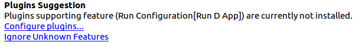
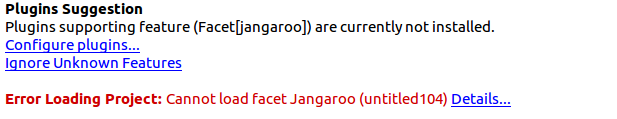

The IntelliJ Platform IDEs will advertise a plugin for installation if the plugin provides additional features from this list:
* Configuration Type
* Facet Type
* File Extensions Type
* Module Type
* Artifact Type

IntelliJ Platform IDEs only show plugin advertisements in the appropriate context so they are meaningful to the user. 

The [`feature extractor`](https://github.com/JetBrains/intellij-plugin-verifier/tree/master/intellij-feature-extractor/) tool 
catalogs these types of features for a plugin. It works by statically analyzing the bytecode of a plugin to extract values
passed to the IntelliJ Platform APIs that support extending features in the above list. 
However, if values are dynamically evaluated in a plugin, the `feature extractor` may return incomplete results. 
If you cannot find your plugin in [the list of features](https://plugins.jetbrains.com/feature/), you can either make your code 
easier for the analysis, or ask JetBrains to manually add any missed feature types.

## Configuration Type

When you want IDEs to show that your plugin supports Run Configuration Type, you need to implement 
[ConfigurationType](https://github.com/JetBrains/intellij-community/blob/master/platform/lang-api/src/com/intellij/execution/configurations/ConfigurationType.java) 
and implement the `getId()` method. The `feature extractor` analyzes the value of `getId()`.

An advertisement for a plugin that supports the *Run D App* Configuration Type:

Refer to [Run Configurations](/basics/run_configurations.md) to get more information about how to declare this feature in your plugin.

## Facet Type

To support a Facet Type feature you should extend [FacetType](https://github.com/JetBrains/intellij-community/blob/master/platform/lang-api/src/com/intellij/facet/FacetType.java),
and pass `stringId` to its constructor. The value of the `stringId` parameter will be analyzed by the `feature extractor`.

An advertisement for a plugin that supports the *jangaroo* Facet Type:

Refer to [Facet](/reference_guide/project_model/facet.md) for additional information.

## File Extensions Type

A plugin can support specific types of file extensions. When there is a file with a specific extension open in an IDE, a hint will be shown to users prompting them to install your plugin.
You should extend [FileTypeFactory](https://github.com/JetBrains/intellij-community/blob/master/platform/platform-api/src/com/intellij/openapi/fileTypes/FileTypeFactory.java) 
and feed supported file extensions in `createFileTypes(FileTypeConsumer)`. Values of `FileTypeConsumer` are analyzed by the `feature extractor`.

An advertisement for plugins which support the _\*.d_ Extension Type:

Refer to [Registering a File Type](/reference_guide/custom_language_support/registering_file_type.md) to provide this feature in a plugin.

## Module Type

If you want IDEs to advertise that your plugin can support creating specific Module Types, you should extend 
[ModuleType](https://github.com/JetBrains/intellij-community/blob/master/platform/lang-api/src/com/intellij/openapi/module/ModuleType.java) 
and pass the `id` parameter for your Module Type to its constructor. The `feature extractor` will evaluate the values of `id`.

See [Module](/reference_guide/project_model/module.md) and [Supporting Module Types](/tutorials/project_wizard/module_types.md) 
for more information about supporting Module Types.

## Artifact Type

To support specific Artifact Types, extend [ArtifactType](https://github.com/JetBrains/intellij-community/blob/master/java/compiler/openapi/src/com/intellij/packaging/artifacts/ArtifactType.java), 
and pass an `id` parameter to its constructor. The value of the `id` parameter is analyzed by the `feature extractor`.

An example suggestion to enable a plugin which supports a *dm.bundle* Artifact Type:

