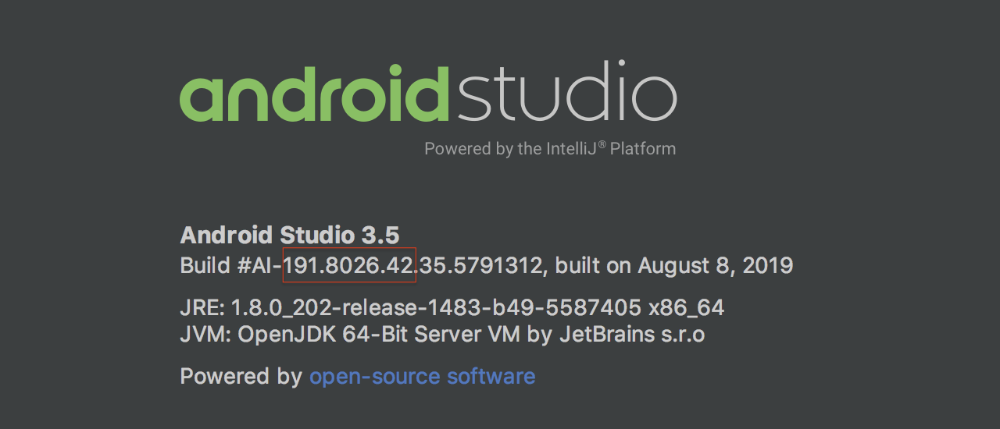

<!-- Copyright 2000-2020 JetBrains s.r.o. and other contributors. Use of this source code is governed by the Apache 2.0 license that can be found in the LICENSE file. -->

## Introduction 
Android Studio plugins extend or add functionality to the [Android Studio IDE](https://developer.android.com/studio).
Plugins can be written in Kotlin or Java, or a mix of both, and are created using IntelliJ IDEA and the [IntelliJ Platform](/intro/intellij_platform.md).
It's also helpful to be familiar with [Java Swing](https://docs.oracle.com/javase/8/javase-clienttechnologies.htm).
Once completed, plugins can be packaged and distributed at [JetBrains Plugin Repository](https://plugins.jetbrains.com).

Android Studio plugins are not Android modules or apps to run in the Android operating system, such as on a smartphone or tablet.

## Configuring IntelliJ Platform Projects for Android Studio Plugin Development
To create a new Android Studio plugin project, follow the tutorial on the [Getting Started with Gradle](/tutorials/build_system/prerequisites.md) page.
The tutorial produces a skeleton project suitable to use as a starting point for an Android Studio plugin.
On the [New Project Configuration Screen](/tutorials/build_system/prerequisites.md#new-project-configuration-screen) of the New Project Wizard tutorial, choose Gradle from the product category pane as described in the tutorial, **not** _Android_.
  
Some minor modifications to the skeleton project are needed, as discussed below.

### Matching Versions of the IntelliJ Platform with the Android Studio Version
For API compatibility, it is essential to match the version of the IntelliJ Platform APIs used for plugin development with the target version of Android Studio.
The version number of Android Studio contains the version of the underlying IntelliJ Platform APIs that were used to build it.

To find the version of the IntelliJ Platform used to build Android Studio, use the Android Studio _About_ dialog screen.
An example is shown below.
In this case, the (BRANCH.BUILD.FIX) version of the IntelliJ Platform is `191.8026.42`, which corresponds to the IntelliJ IDEA version 2019.1.4.
The [`build.gradle` configuration steps](#configuring-the-plugin-buildgradle-file) section below explains how to set the IntelliJ Platform version to match the target version of Android Studio.

{:width="600px"}

### Configuring the Plugin build.gradle File
The use-case of developing for a non-IntelliJ IDEA IDE is reviewed in the [Plugins Targeting Alternate IntelliJ Platform-Based IDEs](/tutorials/build_system/gradle_guide.md#plugins-targeting-alternate-intellij-platform-based-ides) section of the [Configuring Gradle for IntelliJ Platform Plugins](/tutorials/build_system/gradle_guide.md) page.
The particular example in that section discusses configuring a plugin project for PhpStorm, so the details for an Android Studio plugin project are reviewed here.

Here are the steps to configure the `build.gradle` file for developing a plugin to target Android Studio:
* The Gradle plugin attributes describing the configuration of the [IntelliJ Platform used to build the plugin project](/tutorials/build_system/gradle_guide.md#configuring-the-gradle-plugin-for-building-intellij-platform-plugin-projects) must be explicitly set. 
  Continuing with the example [above](#matching-versions-of-the-intellij-platform-with-the-android-studio-version), set the `intellij.version` value to `191.8026.42`.
  Alternatively, specify `intellij.localPath` to refer to a local installation of Android Studio.
* Android Studio plugin projects that use APIs from the `android` plugin must declare a dependency on that plugin.
 Declare the dependency in `build.gradle` using the Gradle plugin `intellij.plugins` attribute, which in this case lists the [directory name](https://github.com/JetBrains/gradle-intellij-plugin/blob/master/README.md#intellij-platform-properties) of the plugin.
* The best practice is to use the target version of Android Studio as the IDE Development Instance.
  Set the Development Instance to the (user-specific) absolute path to the target Android Studio application.

The snippet below is an example of configuring the Setup and Running DSLs in a `build.gradle` specific to developing a plugin targeted at Android Studio.

```groovy
  intellij {
    // Define IntelliJ Platform against which to build the plugin project.
    version '191.8026.42'  // Same IntelliJ IDEA version (2019.1.4) as target 3.5 Android Studio   
    type 'IC'              // Use IntelliJ IDEA CE because it's the basis of the IntelliJ Platform   
    // Require the Android plugin, Gradle will match the plugin version to intellij.version 
    plugins 'android'     
  }
  
  runIde {
      // Absolute path to installed target 3.5 Android Studio to use as IDE Development Instance
      // The "Contents" directory is macOS specific.
      ideDirectory '/Applications/Android Studio.app/Contents'
  }
```

### Configuring the Plugin plugin.xml File
As discussed in the [Plugin Dependencies](/basics/getting_started/plugin_compatibility.md#declaring-plugin-dependencies) section of this guide, a plugin's dependency on [Modules Specific to Functionality](/basics/getting_started/plugin_compatibility.md#modules-specific-to-functionality) must be declared in `plugin.xml`. 
When using Android Studio-specific features (APIs), a dependency on `com.intellij.modules.androidstudio` must be declared as shown in the code snippet below.
Otherwise, if only general IntelliJ Platform features (APIs) are used, then a dependency on `com.intellij.modules.platform` must be declared as discussed in [Plugin Compatibility with IntelliJ Platform Products](/basics/getting_started/plugin_compatibility.md).

```xml
  <depends>com.intellij.modules.androidstudio</depends>
```

## Additional Articles and Resources
* Discussion of extending Android Lint - [How to Register AndroidLintInspectionBase in IntelliJIdea Plugin](https://intellij-support.jetbrains.com/hc/en-us/community/posts/360005018559-How-to-register-AndroidLintInspectionBase-in-IntellijIdea-Plugin)  
* Grzegorz Matyszczak's article [How I Automated Creating Files for a New Screen with My Own Android Studio Plugin](https://proandroiddev.com/how-i-automated-creating-files-for-a-new-screen-with-my-own-android-studio-plugin-5d54b14ba6fa)
* Marcos Holgado's article series [Write an Android Studio Plugin (Part 1)](https://proandroiddev.com/write-an-android-studio-plugin-part-1-creating-a-basic-plugin-af956c4f8b50)

## Open Source Plugins for Android Studio
When learning new development configurations, it is helpful to have some representative projects for reference:  
* [ADB Idea](https://github.com/pbreault/adb-idea) plugin for Android Studio and Intellij IDEA that speeds up Android development.
* [Android postfix plugin](https://github.com/takahirom/android-postfix-plugin) for Android Studio. 
* [Flutter Plugin](https://github.com/flutter/flutter-intellij).
* Bal Sikandar's [list of Android Studio plugins](https://github.com/balsikandar/Android-Studio-Plugins).
