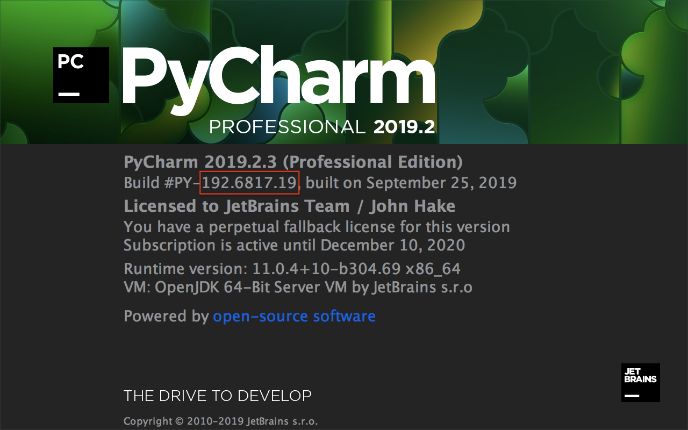
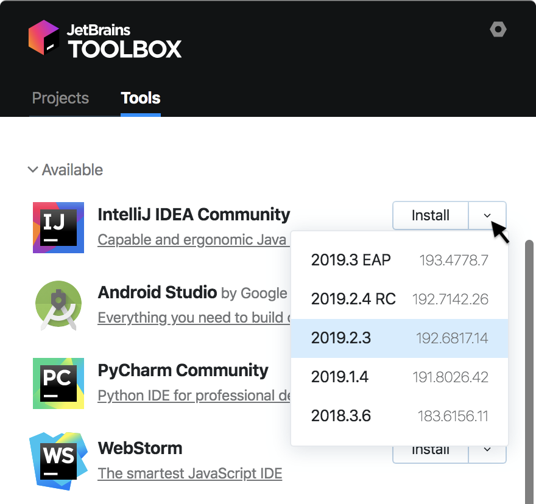

This page is an introduction to configuring Gradle plugin projects that target IDEs based on the [IntelliJ Platform](/intro/intellij_platform.md), but are not IntelliJ IDEA.
All of the Gradle configuration attributes mentioned here are discussed in-depth on the [Configuring Gradle for IntelliJ Platform Plugins](/tutorials/build_system/gradle_guide.md) page.

Information common to projects targeting products other than IntelliJ IDEA is introduced here. 
Details particular to an IntelliJ Platform-based IDE is described on the individual product pages in Part VIII.

* bullet list
{:toc}

## Introduction 
Plugins can extend or add functionality to IDEs based on the IntelliJ Platform. 
This extensibility applies to a variety of JetBrains' IDEs, such as Android Studio, WebStorm, PhpStorm, and PyCharm.
Plugins can be written in Kotlin or Java, or a mix of both, and are created using IntelliJ IDEA.
Once completed, plugins can be packaged and distributed at [plugins.jetbrains.com](https://plugins.jetbrains.com).

## Configuring Plugin Projects Targeting Alternate IntelliJ Platform-Based IDEs
To create a new Gradle plugin project, follow the tutorial on the [Getting Started with Gradle](/tutorials/build_system/prerequisites.md) page.
The tutorial produces a skeleton Gradle project suitable to use as a starting point.
Some minor modifications are needed, as described below, and on the individual product pages in Part VIII.

Understanding the relationship between build numbers is critical when developing a plugin to target an IntelliJ Platform-based IDE:
* _targetIDE_ is the (version-specific) IntelliJ Platform-based IDE in which the plugin is intended to run, such as PyCharm.
  The path in Gradle plugin attribute [`runIde.ideaDirectory`](/tutorials/build_system/gradle_guide.md#running-against-alternate-versions-and-types-of-intellij-platform-based-ides) is set to the installed location of _targetIDE_.
* _baseIntelliJPlatformVersion_ is the (version-specific) IntelliJ Platform used in the build of the _targetIDE_.
  The IntelliJ Platform is defined by a specific build of the IntelliJ IDEA Community Edition.
  The Gradle plugin attribute [`intellij.version`](/tutorials/build_system/gradle_guide.md#intellij-platform-configuration) is set to be _baseIntelliJPlatformVersion_.

For API compatibility, the IntelliJ Platform version used in the _targetIDE_ dictates the _baseIntelliJPlatformVersion_ used for developing a plugin. 

### Matching Versions of the IntelliJ Platform with the Target IDE Version
The _baseIntelliJPlatformVersion_ used in the _targetIDE_ may not be readily apparent, depending on the product.
See the individual product pages in Part VIII for exceptions.

To find the version of the IntelliJ Platform used to build the _targetIDE_, use the _About_ dialog screen for the _targetIDE_.
Next to **Build #** is the BRANCH.BUILD.FIX version of the IntelliJ Platform used to build the _targetIDE_.
In the example shown below, the (BRANCH.BUILD.FIX) version of the IntelliJ Platform is `192.6817.19`.
The product version is 2019.2.3.

{:width="600px"}

If the product version isn't clear on the _About_ screen, consult the individual product pages in Part VIII.

Using [Toolbox](https://www.jetbrains.com/toolbox-app/) is an easy way to find build numbers for recent versions.
In the example below, IntelliJ IDEA Community (which defines the IntelliJ Platform) for v2019.2.3 is build number `192.6817.14`.

{:width="400px"}

Although the FIX versions are different, this is not uncommon between products, and the builds are still compatible. 
The BRANCH and BUILD numbers match, therefor in this PyCharm example: 
* The _targetIDE_ (PyCharm) is `192.6817.19`, 
* The _baseIntelliJPlatformVersion_ (IntelliJ IDEA Community Edition) is `192.6817.14`  

### Configuring the Plugin build.gradle File
For a project developing a plugin for _targetIDE_, configure the `build.gradle` file as follows:
* The Gradle plugin attributes describing the configuration of the [IntelliJ Platform used to build the plugin project](/tutorials/build_system/gradle_guide.md#configuring-the-gradle-plugin-for-building-intellij-platform-plugin-projects) must be explicitly set. 
  The `intellij.type` is "IC" because the IntelliJ IDEA Community Edition defines the IntelliJ Platform.
  The `intellij.version` is _baseIntelliJPlatformVersion_.
* Declare the [plugin's dependency](/tutorials/build_system/gradle_guide.md#plugin-dependencies) on any _targetIDE_-specific plugins or modules.
  Use the Gradle plugin attribute `intellij.plugins` to declare a dependency.
  See the specific product pages in Part VIII for the _targetIDE_ plugin or module name.
* The best practice is to use a local installation of _targetIDE_ as the [IDE Development Instance](/basics/ide_development_instance.md).
  Set the Development Instance to the (user-specific) absolute path to the _targetIDE_ application.
  The exact path varies by the operating system; macOS is shown.

The snippet below is an example of configuring the Setup and Running DSLs in a `build.gradle` specific to developing a plugin for _targetIDE_.
```groovy
  intellij {
    // Define IntelliJ Platform against which to build the plugin project.
    // Use the IntelliJ Platform BRANCH.BUILD version ("baseIntelliJPlatformVersion") matching "targetIDE"
    // For example, '192.6817.14'
    version '<baseIntelliJPlatformVersion>'     
    type 'IC'                 
    // Require the targetIDE plugin or library 
    plugins '<targetIDE-specific modules or plugins>'  // For example, 'python' 
  }
  
  runIde {
      // Absolute path to installed target application to use as IDE Development Instance
      // For example, the path to PyCharm build 192.6817.19
      ideaDirectory '/Applications/<targetIDE>.app/Contents'
  }
```

### Configuring the Plugin plugin.xml File
As discussed on the [Plugin Dependencies](/basics/getting_started/plugin_compatibility.md#declaring-plugin-dependencies) page of this guide, a plugin's dependency on [Modules Specific to Functionality](/basics/getting_started/plugin_compatibility.md#modules-specific-to-functionality) must be declared in `plugin.xml`. 
When using _targetIDE_-specific features (APIs), a dependency on the _targetIDE_ module must be declared, as shown in the code snippet below.
Otherwise, if only general IntelliJ Platform features (APIs) are used, then a dependency on `com.intellij.modules.platform` must be declared as discussed in [Plugin Compatibility with IntelliJ Platform Products](/basics/getting_started/plugin_compatibility.md).
```xml
  <!-- For example, com.intellij.modules.python -->
  <depends>com.intellij.modules.targetIDE</depends>
```
