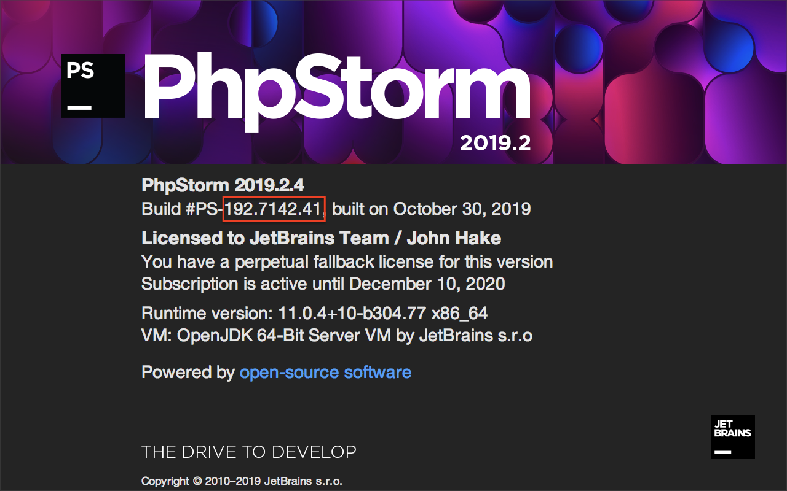

<!-- Copyright 2000-2020 JetBrains s.r.o. and other contributors. Use of this source code is governed by the Apache 2.0 license that can be found in the LICENSE file. -->

## Introduction 
Plugin projects can target IDEs other than IntelliJ IDEA, as long as the products are based on the [IntelliJ Platform](/intro/intellij_platform.md).
Such plugins are developed much like plugin projects that target IntelliJ IDEA, and can be written in Kotlin or Java, or a mix of both.
Once completed, the plugins can be packaged and distributed at [JetBrains Plugin Repository](https://plugins.jetbrains.com).

Project configuration attributes common to projects targeting products other than IntelliJ IDEA are described here. 
Details particular to an IntelliJ Platform-based product are described on the individual product pages in Part VIII.
All of the Gradle configuration attributes described here are discussed in-depth on the [Configuring Gradle for IntelliJ Platform Plugins](/tutorials/build_system/gradle_guide.md) and the `gradle-intellij-plugin` [README](https://github.com/JetBrains/gradle-intellij-plugin/blob/master/README.md) pages.

* bullet list
{:toc}

## Getting Started
To create a new Gradle plugin project, follow the tutorial on the [Getting Started with Gradle](/tutorials/build_system/prerequisites.md) page.
The tutorial produces a skeleton Gradle project suitable to use as a starting point.

Modifications are needed to the skeleton project's `build.gradle` and `plugin.xml` files, as described below, and on the individual product pages in Part VIII.
The `build.gradle` file is modified to specify the target product, which determines the APIs available during development.
The `plugin.xml` file is modified to declare the plugin's dependency on modules or libraries.

## Configuring Build.Gradle to Target Products other than IntelliJ IDEA 
The best practice is to use the `gradle-intellij-plugin` `intellij.type` [attribute](https://github.com/JetBrains/gradle-intellij-plugin/blob/master/README.md#intellij-platform-properties) to specify the target product.
For example, `PY` for PyCharm professional.
Configuration using an `intellij.type` attribute is explained in the [Product-Specific Attribute](#configuring-plugin-projects-using-a-product-specific-attribute) section below.

However, not all products have an `intellij.type` attribute defined by the `gradle-intellij-plugin`.
For example, PhpStorm.
If the target product does not have an `intellij.type` attribute defined, then the best approach is to configure the project by using the [IntelliJ IDEA Attribute](#configuring-buildgradle-using-the-intellij-idea-product-attribute). 

### Configuring Plugin Projects Using a Product-Specific Attribute
If the `gradle-intellij-plugin` supports a target product directly, there will be an `intellij.type` [attribute](https://github.com/JetBrains/gradle-intellij-plugin/blob/master/README.md#intellij-platform-properties) defined.
Specifying the target as a product-specific `intellij.type` attribute has two advantages:
* The APIs available to the plugin will be limited to only what is defined in the target product.
  (Unless additional plugin dependencies are specified.)
* The default [Development Instance](/basics/ide_development_instance.md) for running the plugin will be the target product.  

A `build.gradle` snippet setting a plugin project to target PyCharm is shown below.
The `gradle-intellij-plugin` will fetch the matching build of PyCharm Professional to define the APIs available, and use that build of PyCharm (and associated JetBrains runtime) as the Development Instance.
No additional product-specific configuration needs to be set in `build.gradle`:

```groovy
    intellij {
      version '2019.2.3'
      type 'PY'
    }
```

### Configuring Plugin Projects Using the IntelliJ IDEA Product Attribute
If the `gradle-intellij-plugin` does not directly support an IntelliJ Platform-based product, the `build.gradle` file can still be configured to target the desired product.
In this case, the `build.gradle` file is configured to use IntelliJ IDEA (Community or Ultimate Edition) as the basis for the available APIs.
This does have the drawback that APIs not specific to the target product might accidentally be included in the plugin project.
However testing the plugin project in the target product helps to find such mistakes.

Additional configuration must be done to match the version of IntelliJ IDEA to the version of the target product.
Understanding the relationship between build numbers is critical when using this approach to project configuration:
* _targetIDE_ is the (version-specific) IntelliJ Platform-based IDE in which the plugin is intended to run, such as PhpStorm.
* _baseIntelliJPlatformVersion_ is the (version-specific) IntelliJ Platform used in the build of the _targetIDE_.
  The IntelliJ Platform is defined by a specific build of the IntelliJ IDEA Community Edition.
  The Gradle plugin attribute [`intellij.version`](/tutorials/build_system/gradle_guide.md#intellij-platform-configuration) is set to be _baseIntelliJPlatformVersion_.

For API compatibility, the IntelliJ Platform version used in the _targetIDE_ dictates the _baseIntelliJPlatformVersion_ used for developing a plugin. 

#### Matching Versions of the IntelliJ Platform with the Target IDE Version
The _baseIntelliJPlatformVersion_ used in the _targetIDE_ may not be readily apparent, depending on the product.
See the individual product pages in Part VIII for exceptions.

To find the version of the IntelliJ Platform used to build the _targetIDE_, use the _About_ dialog screen for the _targetIDE_.
Next to **Build #** is the BRANCH.BUILD.FIX version of the _targetIDE_.
In the example shown below, the (BRANCH.BUILD.FIX) version is `192.7142.41`, and the product version is 2019.2.4.
The version of the IntelliJ Platform used to build this product version is BRANCH.BUILD, or `192.7142`

{:width="500px"}

If the product version isn't clear on the _About_ screen, consult the individual product pages in Part VIII.

The [Other IntelliJ IDEA Versions](https://www.jetbrains.com/idea/download/other.html) page is a way to find build numbers for every product version.
Additional ways include hovering over the version number for a product in ToolBox, or examining the _About_ screen for IntelliJ IDEA Community.
In this example, IntelliJ IDEA Community Edition (which defines the IntelliJ Platform) for 2019.2.4 is build number `192.7142.36`.
Although the FIX versions are different, this is not uncommon between products, and the builds are still compatible. 
The BRANCH and BUILD numbers match, therefore in this PhpStorm example: 
* The _targetIDE_ is PhpStorm, build `192.7142.41`, 
* The _baseIntelliJPlatformVersion_ (IntelliJ IDEA Community Edition) is build `192.7142.36`  

This information is used to configure the plugin project's `build.gradle` and `plugin.xml` files.

#### Configuring build.gradle using the IntelliJ IDEA Product Attribute
Configuring a Gradle plugin project for using _baseIntelliJPlatformVersion_ requires changing some of the default settings in the `build.gradle` file.
Changes need to be made in two tasks: `intellij {}` and `runIde {}`.

The Gradle plugin attributes describing the configuration of the [IntelliJ Platform used to build the plugin project](/tutorials/build_system/gradle_guide.md#configuring-the-gradle-plugin-for-building-intellij-platform-plugin-projects) must be explicitly set in the `intellij {}` task. 
The `intellij.type` is "IU" because although the IntelliJ IDEA Community Edition defines the IntelliJ Platform, the PHP plugin is only compatible with IntelliJ IDEA Ultimate.
The `intellij.version` is _baseIntelliJPlatformVersion_.

Any [dependencies](/tutorials/build_system/gradle_guide.md#plugin-dependencies) on _targetIDE_-specific plugins or modules must be declared in the `intellij {}` task.
Use the Gradle plugin attribute `intellij.plugins` to declare a dependency.
See the specific product pages in Part VIII for the _targetIDE_ plugin or module name.

The best practice is to modify the `runIde {}` task to use a local installation of _targetIDE_ as the [IDE Development Instance](/basics/ide_development_instance.md).
Set the `runIde.ideDirectory` attribute to the (user-specific) absolute path of the _targetIDE_ application.
The exact path format varies by operating system.

This snippet is an example for configuring the Setup and Running DSLs in a `build.gradle` specific to developing a plugin for _targetIDE_.

```groovy
  intellij {
    // Define IntelliJ Platform against which to build the plugin project.
    // Use the IntelliJ Platform BRANCH.BUILD version matching "targetIDE" (PhpStorm)
    version '192.7142.36'   // baseIntelliJPlatformVersion     
    type 'IU'                 
    // Require the targetIDE plugin or library
    // Use the stable version compatible with intellij.version and intellij.type specified above 
    plugins 'com.jetbrains.php:192.6603.42'
  }
  
  runIde {
      // Absolute path to the installed targetIDE to use as IDE Development Instance
      // Note the Contents directory must be added at the end of the path for macOS.
      ideDirectory '/Users/<user name>/Library/Application Support/JetBrains/Toolbox/apps/PhpStorm/ch-0/192.7142.41/PhpStorm.app/Contents'
  }
```

## Configuring plugin.xml
As discussed on the [Plugin Dependencies](/basics/getting_started/plugin_compatibility.md#declaring-plugin-dependencies) page of this guide, a plugin's dependency on [Modules Specific to Functionality](/basics/getting_started/plugin_compatibility.md#modules-specific-to-functionality) must be declared in `plugin.xml`. 
When using features (APIs) specific to the target product, a dependency on the target product module must be declared, as shown in the code snippet below.
Otherwise, if only general IntelliJ Platform features (APIs) are used, then a dependency on `com.intellij.modules.platform` must be declared as discussed in [Plugin Compatibility with IntelliJ Platform Products](/basics/getting_started/plugin_compatibility.md).

> **NOTE** In the special case of a plugin project declaring dependencies only on other plugins, it must also declare a dependency on `com.intellij.modules.platform`. Otherwise, the plugin project is considered to be legacy and will only load in IntelliJ IDEA. 

Continuing with the example of developing a plugin for PhpStorm:

```xml
  <!-- Targeting PhpStorm, so is dependent on the PHP plugin -->
  <depends>com.jetbrains.php</depends>
  <depends>com.intellij.modules.platform</depends>
```
