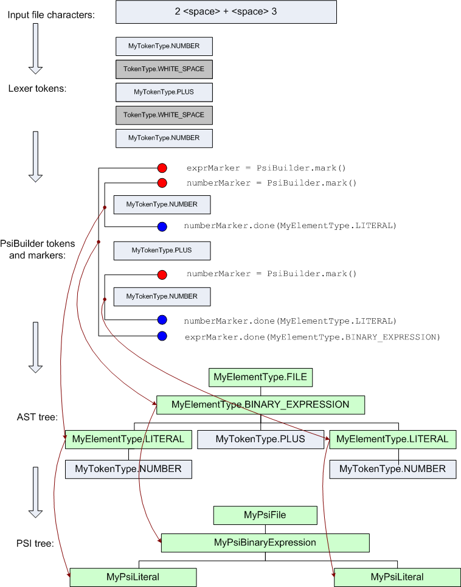

<!-- Copyright 2000-2020 JetBrains s.r.o. and other contributors. Use of this source code is governed by the Apache 2.0 license that can be found in the LICENSE file. -->

Parsing files in IntelliJ Platform is a two-step process.
First, an abstract syntax tree (AST) is built, defining the structure of the program.
AST nodes are created internally by the IDE and are represented by instances of the
[`ASTNode`](upsource:///platform/core-api/src/com/intellij/lang/ASTNode.java)
class.
Each AST node has an associated element type
[`IElementType`](upsource:///platform/core-api/src/com/intellij/psi/tree/IElementType.java)
instance, and the element types are defined by the language plugin.
The top-level node of the AST tree for a file needs to have a special element type which extends the
[`IFileElementType`](upsource:///platform/core-api/src/com/intellij/psi/tree/IFileElementType.java)
class.

The AST nodes have a direct mapping to text ranges in the underlying document.
The bottom-most nodes of the AST match individual tokens returned by the lexer, and higher level nodes match multiple-token fragments.
Operations performed on nodes of the AST tree, such as inserting, removing, reordering nodes and so on, are immediately reflected as changes to the text of the underlying document.

Second, a PSI, or Program Structure Interface, tree is built on top of the AST, adding semantics and methods for manipulating specific language constructs.
Nodes of the PSI tree are represented by classes implementing the
[`PsiElement`](upsource:///platform/core-api/src/com/intellij/psi/PsiElement.java)
interface and are created by the language plugin in the
[`ParserDefinition.createElement()`](upsource:///platform/core-api/src/com/intellij/lang/ParserDefinition.java)
method.
The top-level node of the PSI tree for a file needs to implement the
[`PsiFile`](upsource:///platform/core-api/src/com/intellij/psi/PsiFile.java)
interface, and is created in the
[`ParserDefinition.createFile()`](upsource:///platform/core-api/src/com/intellij/lang/ParserDefinition.java)
method.

**Example**:
[`ParserDefinition`](upsource:///plugins/properties/properties-psi-impl/src/com/intellij/lang/properties/parsing/PropertiesParserDefinition.java)
for
[Properties language plugin](upsource:///plugins/properties)

The lifecycle of the PSI is described in more detail in [Fundamentals](/platform/fundamentals.md).

The base classes for the PSI implementation, including
[`PsiFileBase`](upsource:///platform/core-impl/src/com/intellij/extapi/psi/PsiFileBase.java),
the base implementation of
[`PsiFile`](upsource:///platform/core-api/src/com/intellij/psi/PsiFile.java),
and
[`ASTWrapperPsiElement`](upsource:///platform/core-impl/src/com/intellij/extapi/psi/ASTWrapperPsiElement.java),
the base implementation of
[`PsiElement`](upsource:///platform/core-api/src/com/intellij/psi/PsiElement.java),
are provided by *IntelliJ Platform*.

While coding parser manually is quite possible, we highly recommend generating parser and corresponding PSI classes from grammars using
[Grammar-Kit](https://plugins.jetbrains.com/plugin/6606-grammar-kit) plugin.
Besides code generation, it provides various features for editing grammar files: syntax highlighting, quick navigation, refactorings, and more.
The Grammar-Kit plugin is built using its own engine; its source code can be found on
[GitHub](https://github.com/JetBrains/Grammar-Kit).

For re-using existing ANTLRv4 grammars, see [antlr4-intellij-adaptor](https://github.com/antlr/antlr4-intellij-adaptor) library.

The language plugin provides the parser implementation as an implementation of the
[`PsiParser`](upsource:///platform/core-api/src/com/intellij/lang/PsiParser.java)
interface, returned from
[`ParserDefinition.createParser()`](upsource:///platform/core-api/src/com/intellij/lang/ParserDefinition.java).
The parser receives an instance of the
[`PsiBuilder`](upsource:///platform/core-api/src/com/intellij/lang/PsiBuilder.java)
class, which is used to get the stream of tokens from the lexer and to hold the intermediate state of the AST being built.
The parser must process all tokens returned by the lexer up to the end of stream, in other words until
[`PsiBuilder.getTokenType()`](upsource:///platform/core-api/src/com/intellij/lang/PsiBuilder.java)
returns `null`, even if the tokens are not valid according to the language syntax.

**Example**:
[`PsiParser`](upsource:///plugins/properties/properties-psi-impl/src/com/intellij/lang/properties/parsing/PropertiesParser.java)
implementation for
[Properties language plugin](upsource:///plugins/properties/properties-psi-impl/src/com/intellij/lang/properties/).

The parser works by setting pairs of markers (
[`PsiBuilder.Marker`](upsource:///platform/core-api/src/com/intellij/lang/PsiBuilder.java)
instances) within the stream of tokens received from the lexer.
Each pair of markers defines the range of lexer tokens for a single node in the AST tree.
If a pair of markers is nested in another pair (starts after its start and ends before its end), it becomes the child node of the outer pair.

The element type for the marker pair and for the AST node created from it is specified when the end marker is set, which is done by making call to
[`PsiBuilder.Marker.done()`](upsource:///platform/core-api/src/com/intellij/lang/PsiBuilder.java).
Also, it is possible to drop a start marker before its end marker has been set.
The `drop()` method drops only a single start marker without affecting any markers added after it, and the `rollbackTo()` method drops the start marker and all markers added after it and reverts the lexer position to the start marker.
These methods can be used to implement lookahead when parsing.

The method
[`PsiBuilder.Marker.precede()`](upsource:///platform/core-api/src/com/intellij/lang/PsiBuilder.java)
is useful for right-to-left parsing when you don't know how many markers you need at a certain position until you read more input.
For example, a binary expression `a+b+c` needs to be parsed as `( (a+b) + c )`.
Thus, two start markers are needed at the position of the token 'a', but that is not known until the token 'c' is read.
When the parser reaches the '+' token following 'b', it can call `precede()` to duplicate the start marker at 'a' position, and then put its matching end marker after 'c'.

An important feature of
[`PsiBuilder`](upsource:///platform/core-api/src/com/intellij/lang/PsiBuilder.java)
is its handling of whitespace and comments.
The types of tokens which are treated as whitespace or comments are defined by the methods `getWhitespaceTokens()` and `getCommentTokens()` in the
[`ParserDefinition`](upsource:///platform/core-api/src/com/intellij/lang/ParserDefinition.java)
class.
[`PsiBuilder`](upsource:///platform/core-api/src/com/intellij/lang/PsiBuilder.java)
automatically omits whitespace and comment tokens from the stream of tokens it passes to
[`PsiParser`](upsource:///platform/core-api/src/com/intellij/lang/PsiParser.java),
and adjusts the token ranges of AST nodes so that leading and trailing whitespace tokens are not included in the node.

The token set returned from
[`ParserDefinition.getCommentTokens()`](upsource:///platform/core-api/src/com/intellij/lang/ParserDefinition.java)
is also used to search for TODO items.

In order to better understand the process of building a PSI tree for a simple expression, you can refer to the following diagram:

In general, there is no single right way to implement a PSI for a custom language, and the plugin author can choose the PSI structure and set of methods which are the most convenient for the code which uses the PSI (error analysis, refactorings and so on).
However, there is one base interface which needs to be used by a custom language PSI implementation in order to support features like rename and find usages.
Every element which can be renamed or referenced (a class definition, a method definition and so on) needs to implement the
[`PsiNamedElement`](upsource:///platform/core-api/src/com/intellij/psi/PsiNamedElement.java)
interface, with methods `getName()` and `setName()`.

A number of functions which can be used for implementing and using the PSI can be found in the `com.intellij.psi.util` package, and in particular in the
[`PsiUtilCore`](upsource:///platform/core-api/src/com/intellij/psi/util/PsiUtilCore.java)
and
[`PsiTreeUtil`](upsource:///platform/core-api/src/com/intellij/psi/util/PsiTreeUtil.java)
classes.

> **TIP** A very helpful tool for debugging the PSI implementation is the [PsiViewer plugin](https://plugins.jetbrains.com/plugin/227-psiviewer). It can show you the structure of the PSI built by your plugin, the properties of every PSI element and highlight its text range.

Please see
[Indexing and PSI Stubs](/basics/indexing_and_psi_stubs.md)
for advanced topics.
