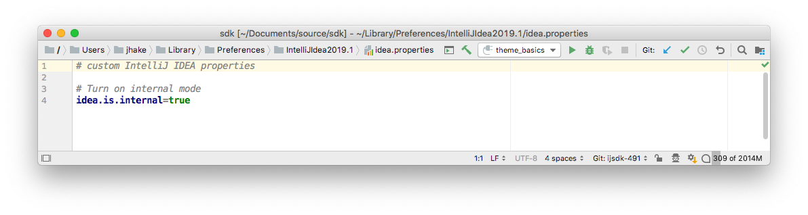
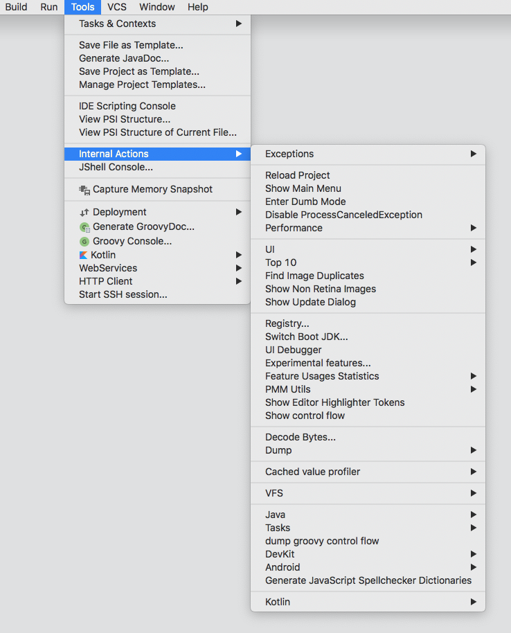

The Internal Actions menu is only visible if internal mode is enabled in IntelliJ IDEA.

## Enabling Internal Mode
There are multiple ways to enable internal mode, but the simplest is within IntelliJ IDEA:
* Start IntelliJ IDEA.
* From the main menu, select **Help | Edit Custom Properties**.
This selection opens IntelliJ IDEA's `idea.properties` file.
If a properties file does not exist, IntelliJ IDEA will prompt to create one.
* Add the line shown below to the `idea.properties` file:
 
* Save the `idea.properties` file and restart IntelliJ IDEA.

The Internal Actions menu is available in **Tools \| Internal Actions**.

