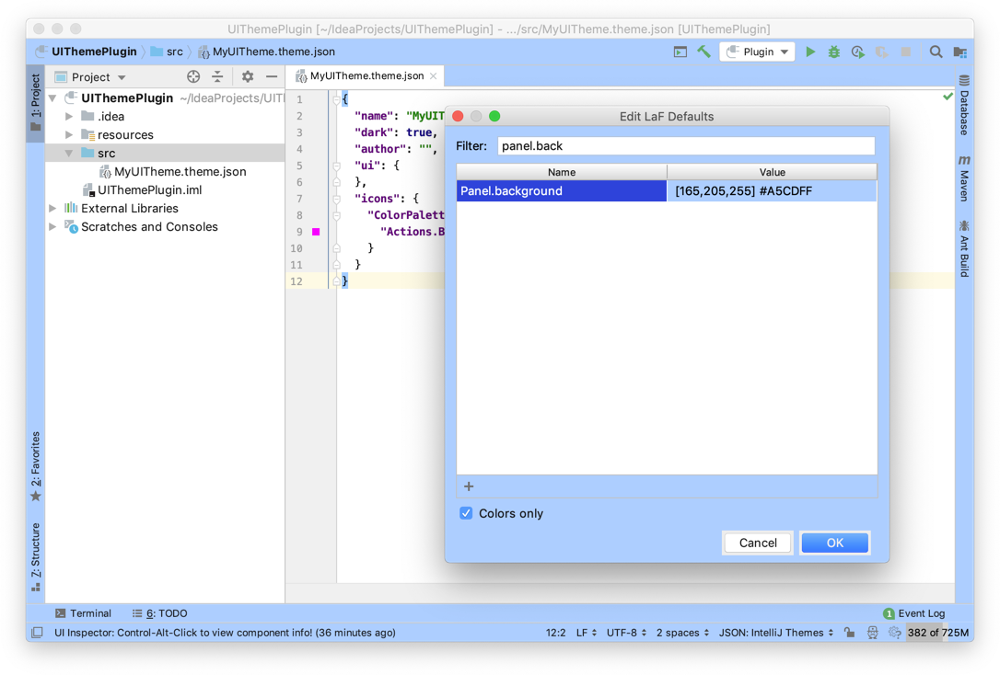

<!-- Copyright 2000-2020 JetBrains s.r.o. and other contributors. Use of this source code is governed by the Apache 2.0 license that can be found in the LICENSE file. -->

The _LaF Defaults_ window provides a key-value pair lookup for UI Controls.
It also allows interactive prototyping of UI Control color changes. 

If the menu item **Tools \| Internal Actions** is not available in IntelliJ IDEA, then the first step is to [enable internal mode](enabling_internal.md)

## Opening LaF Defaults
The _LaF Defaults_ window is opened by selecting the menu item **Tools \| Internal Actions \| UI \| LaF Defaults**.

The _LaF Defaults_ window has two columns representing key-value pairs for UI Controls: 
* The _Name_ column contains the UI Control `key` for each IntelliJ Platform UI element available at runtime.
* The _Value_ column contains the UI Control color `value` for each IntelliJ Platform UI element. 

## Using the LaF Panel

### Finding UI Controls 
The _LaF Defaults_ window is used interactively by entering a UI element type - e.g. `Panel` - in the _Filter_ text box at the top.
_LaF Defaults_ shows the list of UI Control names matching the filter.
Clicking on one of the names narrows the information to show only the key-value pair for that UI element: 

### Prototyping the Color of UI Controls
The color of UI Controls can be changed (in real time) by clicking in the _Value_ column next to a _Name_ (`key`) of interest.
The _Choose Color_ window is displayed.
Color changes can be specified as RGB, hexadecimal, or using the color picker.
Pressing the _Choose_ button changes the UI Control color immediately.

UI Control colors can be reset using the _Choose Color_ window, or by resetting the [UI Theme](https://www.jetbrains.com/help/idea/settings-appearance.html). 

 

