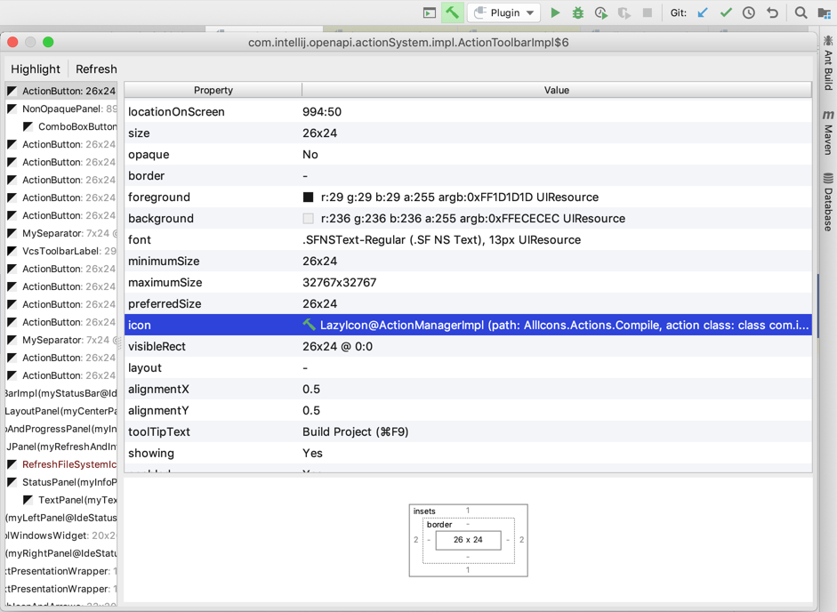

<!-- Copyright 2000-2020 JetBrains s.r.o. and other contributors. Use of this source code is governed by the Apache 2.0 license that can be found in the LICENSE file. -->

The _UI Inspector_ is a tool to interrogate elements of the IntelliJ IDEA UI to get an internal description of each element.
UI elements can be tested interactively by clicking on the element while the _UI Inspector_ is enabled.

If the menu item **Tools \| Internal Actions \| UI \| UI Inspector** is not available in IntelliJ IDEA, then the first step is to [enable internal mode](enabling_internal.md)

## Enabling the UI Inspector
Before using the _UI Inspector_, it must be enabled by selecting the menu item **Tools \| Internal Actions \| UI \| UI Inspector**.
The enabled state of the _UI Inspector_ is modal; it remains enabled until it is disabled by selecting the _UI Inspector_ menu item again. 

When enabled, the _UI Inspector_ menu entry displays a check mark.

## Using the UI Inspector
While enabled, centering the cursor on a UI element and pressing _control-alt_ when _clicking_ the mouse reveals the internal description of the UI element.

For example, to get information about the build (hammer) icon on the toolbar, put the cursor on the icon and press _control-alt_ while clicking the mouse.
The _UI Inspector_ displays that the icon has the internal path `Allcons.Actions.Compile`:

