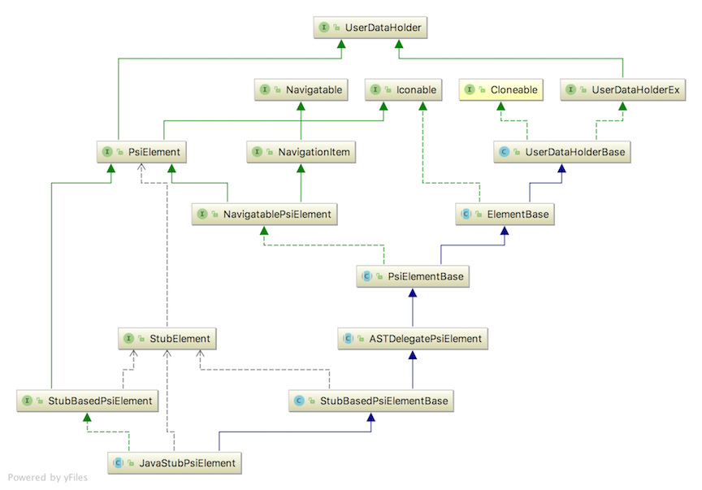

Objects that aggregate the 
[Navigatable](https://github.com/JetBrains/intellij-community/blob/master/platform/core-api/src/com/intellij/pom/Navigatable.java)
interface can be displayed in the IDE. The role of the `Navigatable` interface is to facilitate opening an object representing content
in the appropriate editing or display window. For example:
* Opening [Files, classes or symbols](https://www.jetbrains.com/help/idea/navigating-to-class-file-or-symbol-by-name.html),
  in an editor. This also applies to editing content in preference windows, such as 
  [Copyright profiles](https://www.jetbrains.com/help/idea/copyright-profiles.html).
* Going to locations within files based on [Bookmarks](https://www.jetbrains.com/help/idea/navigating-with-bookmarks.html),
  [TODOs](https://www.jetbrains.com/help/idea/using-todo.html), 
  or [Lines](https://www.jetbrains.com/help/idea/2017.3/navigating-to-line.html). 
* Representations of content, such as Psi elements, also aggregate the `Navigatable` interface. For example, the
  IntelliJ Platform SDK code sample 
  [simple_language_plugin](https://github.com/JetBrains/intellij-sdk-docs/tree/master/code_samples/simple_language_plugin) 
  defines the 
  [SimpleStructureViewElement](https://www.jetbrains.org/intellij/sdk/docs/tutorials/custom_language_support/structure_view_factory.html#define-a-structure-view-element)
  to handle navigation for the [SimpleLanguage](https://www.jetbrains.org/intellij/sdk/docs/tutorials/custom_language_support_tutorial.html) type.
* Some objects aggregate the `Navigatable` interface but do not support navigation. These are typically objects
  like as packages, which don't have a meaningful representation in an editor.   

### The Navigatable Interface 
The [Navigatable](https://github.com/JetBrains/intellij-community/blob/master/platform/core-api/src/com/intellij/pom/Navigatable.java)
interface defines the following methods:

```java
 boolean canNavigate();

 boolean canNavigateToSource();
 
 void navigate(boolean requestFocus); 
 ```
The `canNavigate()` method indicates whether this object supports navigation of any kind. The `canNavigateToSource()` method
indicates whether this object supports navigation to source within an editor. See the 
[Navigatable](https://github.com/JetBrains/intellij-community/blob/master/platform/core-api/src/com/intellij/pom/Navigatable.java)
interface comments for more information about these two methods.

The `navigate` method is called to open the (content-containing) object in an editor or display. Typically an implementation
of `Navigatable` does the heavy lifting of invoking the editor and loading the content. See below for examples.  


### Example IntelliJ Platform Implementations of Navigatable
This section describes some example implementations that can be found in the platform. This is by no means an exhaustive list, 
but is intended as a good starting point for research.

#### Example Navigatable Classes Related to Psi Elements

The [NavigatablePsiElement]() interface is the basis for many implementation classes, abstract classes, and interfaces relating to `Navigatable` 
Psi elements. The class diagram below shows `NavigatablePsiElement` inherits from three interfaces defining the underlying
functionality of a `Navigatable` Psi element.


For example, the subclass [JavaStubPsiElement]() implementation is the basis for a variety of Psi element classes that
represent Java classes, methods, and fields. See below for a `JavaStubPsiElement` class hierarchy diagram.



#### Example Navigatable Classes Related to Files

`OpenFileDescriptor` - TBD, many roads lead through this class - open actions for a file. Examples


#### Other

`Bookmark` - TBD

`TODO` - TBD

`Breakpoint` - TBD

`GroupNode` - TBD?


