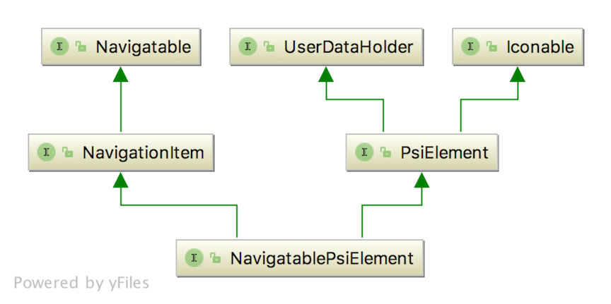
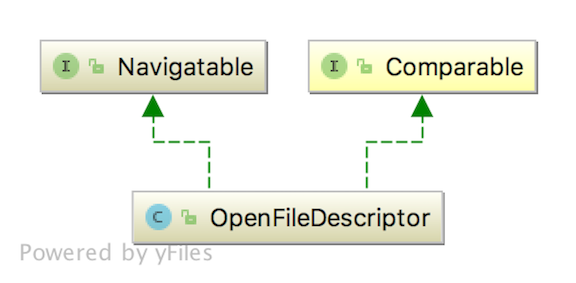
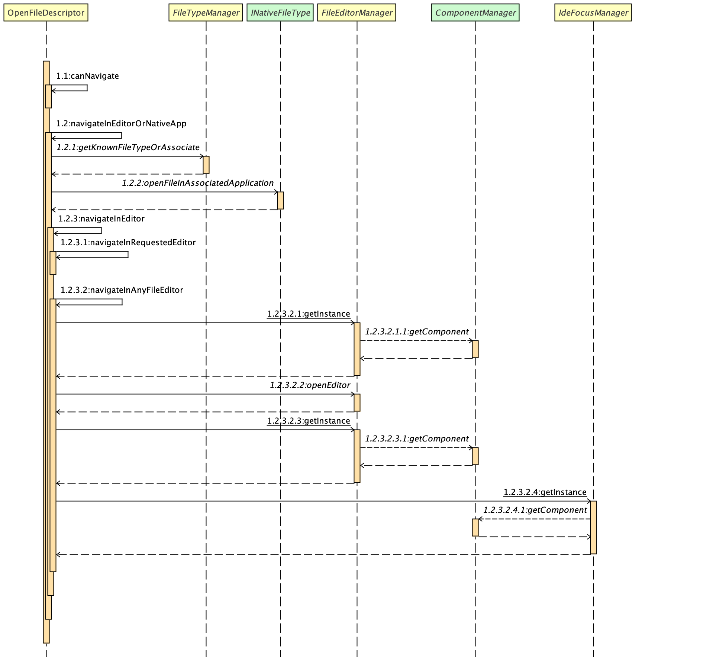

Objects that aggregate the 
[Navigatable](https://github.com/JetBrains/intellij-community/blob/master/platform/core-api/src/com/intellij/pom/Navigatable.java)
interface can be displayed in the IDE. The role of the `Navigatable` interface is to facilitate opening an object representing content
in the appropriate editing or display window, and requesting focus. For example:
* Opening [Files, classes or symbols](https://www.jetbrains.com/help/idea/navigating-to-class-file-or-symbol-by-name.html),
  in an editor. This also applies to editing content in preference windows, such as 
  [Copyright profiles](https://www.jetbrains.com/help/idea/copyright-profiles.html).
* Going to locations within files based on [Bookmarks](https://www.jetbrains.com/help/idea/navigating-with-bookmarks.html),
  [TODOs](https://www.jetbrains.com/help/idea/using-todo.html), 
  or [Lines](https://www.jetbrains.com/help/idea/2017.3/navigating-to-line.html). 

### The Navigatable Interface 
The [Navigatable](https://github.com/JetBrains/intellij-community/blob/master/platform/core-api/src/com/intellij/pom/Navigatable.java)
interface defines the following methods of particular interest:

```java

 boolean canNavigate();

 boolean canNavigateToSource();
 
 void navigate(boolean requestFocus); 
```
The `canNavigate()` method indicates whether this object supports navigation of any kind. The `canNavigateToSource()` method
indicates whether this object supports navigation to source within an editor. See the 
[Navigatable](https://github.com/JetBrains/intellij-community/blob/master/platform/core-api/src/com/intellij/pom/Navigatable.java)
interface comments for more information about these two methods.

The `navigate()` method is called to open the (content-containing) object in an editor or display, and request focus. Typically an implementation
of `Navigatable` does the heavy lifting of invoking an editor for the content and requesting focus. See below for examples.  

### Example IntelliJ Platform Implementations of Navigatable
This section describes some example implementations that can be found in the platform. This is by no means an exhaustive list, 
but is intended to illustrate how `Navigatable` works in different contexts.

#### Example Navigatable Class Related to Psi Elements

The [NavigatablePsiElement](https://github.com/JetBrains/intellij-community/blob/master/platform/core-api/src/com/intellij/psi/NavigatablePsiElement.java) 
interface is the basis for many implementation classes, abstract classes, and interfaces relating to `Navigatable` 
Psi elements. The class diagram below shows `NavigatablePsiElement` inherits from three interfaces defining the underlying
functionality of a `Navigatable` Psi element.



For example, the subclass [JavaStubPsiElement](https://github.com/JetBrains/intellij-community/blob/master/java/java-psi-impl/src/com/intellij/psi/impl/source/JavaStubPsiElement.java) 
implementation is the basis for a variety of Psi element classes that
represent Java files, classes, methods, and fields.

#### Example Navigatable Class Related to Files

The [OpenFileDescriptor](https://github.com/JetBrains/intellij-community/blob/master/platform/platform-api/src/com/intellij/openapi/fileEditor/OpenFileDescriptor.java)
class is used by content classes needing `Navigatable` functionality. 

The class diagram below shows `OpenFileDescriptor` inherits from the `Navigatable` and `Comparable` interfaces. The former defines the navigation
functionality, and the latter defines the comparison and ordering functionality.



For example, the `OpenFileDescriptor` class is used for opening a file from the 
[Project View](https://www.jetbrains.com/help/idea/project-tool-window.html)
Tool Window. Double clicking a file in Project View causes the following
sequence:

* Event listeners determine the double click event is occuring in the Project Tool panel.
* Event handlers use the event data to determine a data context that represents a file, and request processing the event.
* Utilities that use the data context to get the `Navigatable` object, in this case a file represented by an `AbstractPsiBasedNode`.
* Utilities that call the `navigate()` method on the file (`AbstractPsiBasedNode`) object.
* Navigation utilities then execute commands to open a file based on a `PsiElement`.
* The commands execute navigation utilities that call the `navigate()` method on the `PsiElement` type of object, in this case a `JavaStubPsiElement`.
* The `JavaStubPsiElement.navigate()` method uses the `PsiNavigationSupport` object to get the associated `OpenFileDescriptor` object, 
  which provides the `Navigatable` functionality.  
* The `JavaStubPsiElement.navigate()` method calls the `OpenFileDescriptor.navigate()` method.

As the sequence diagram below illustrates, `OpenFileDescriptor.navigate()` does the following:
* Calls `canNavigate()` to confirm a valid `VirtualFile` is associated with `JavaStubPsiElement`.
* Verifies the `VirtualFile` is not a directory.
* Calls `navigateInEditorOrNativeApp()`, which calls `does the following:
  * determines the `FileType` is `JavaFileType`:
  * calls `navigateInEditor()`, which calls `navigateInRequestedEditor()` to find an editor based
    on the `DataContext`, failing that it:
    * calls `navigateInAnyFileEditor`:
      * which uses `FileEditorManager` to get a list of `FileEditor` objects associated with 
      the current `Project` and `OpenFileDescriptor`.  Most `FileType` objects are associated with only one `FileEditor`.
      * `navigateInAnyFileEditor` then iterates over the `FileEditor` list (usually just one) to open the file
      represented by `JavaStubPsiElement` in the associated editor and request focus.




