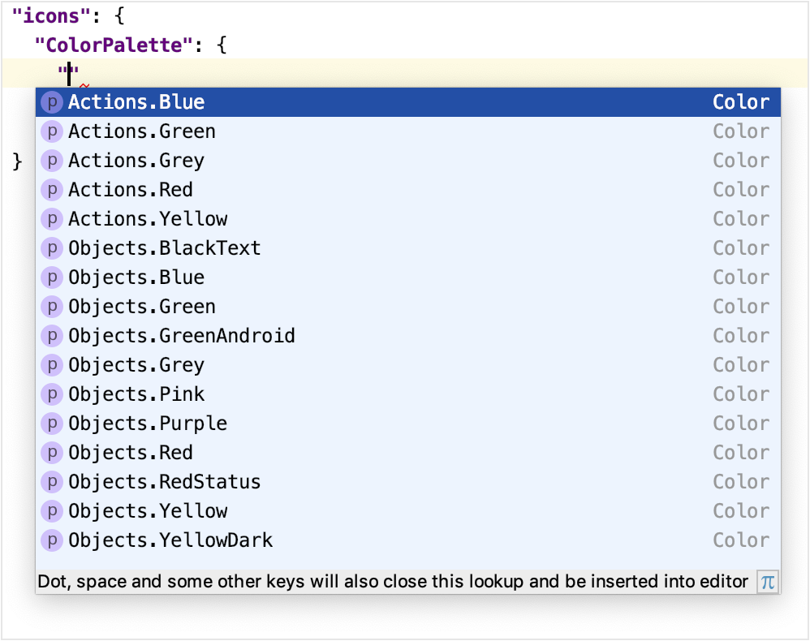
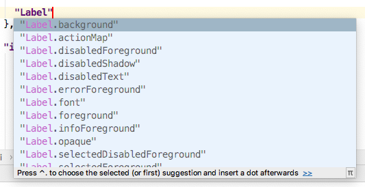

A UI Theme is customized by adding information to the UI Theme description file that overrides the base (_Light_ or _Darcula_) UI Theme. 

## Introduction to UI Theme Description File Syntax
The syntax of a Theme description file follows the JSON open-standard file format of key-value pairs. 
The minimum valid default file is the output of the [DevKit Theme Wizard](themes.md#creating-a-ui-theme-with-the-devkit-theme-wizard). 
Adding key-value pairs customizes a Theme.

UI Theme key-value pairs often use a color as the `value`.
Colors are defined by six-digit RGB or eight-digit RGBA hexadecimal notation.

### UI Theme Reference Implementations
When learning new syntax, it is often useful to have some existing implementations for reference.
For example, refer to the [Theme description file](upsource:///platform/platform-resources/src/themes/HighContrast.theme.json) for the IntelliJ IDEA _High Contrast_ Theme.

## Customizing Icons
UI themes can customize the color of default IntelliJ IDEA UI icons, or substitute custom icons for the default ones. 
Customization is done by adding an `"icons": {}` section to the Theme description file.

### Overriding the Global Color of Icons
Default global icon colors are customized by adding key-value pairs to a `"ColorPalette": {}` section. 
The `ColorPalette` must be inserted in the `icons` section.

In the following example the `key` - the default red color (#DB5860) used for `Action` icons in the _Light_ Theme - is overridden to the `value` of a different color (#D61A26):
```json
{
  "name": "Theme Basics",
  "dark": false,
  "author": "IntelliJ Platform SDK",
  "ui": {
  },
"icons": {
 "ColorPalette": {
   "#DB5860": "#D61A26"
 }
}
}
```  
This color substitution is applied throughout the IDE UI.

### Custom Icon Palette Colors
Icon Palettes are predefined UI Theme color keys, each describing a single color in an `Actions` or `Objects` context. 

#### Icon Colors in "Actions" and "Objects" Contexts
IntelliJ IDEA has default icon colors defined for `Actions` and `Objects` contexts. 
* `Actions` are Theme keys for icons that appear in the context of toolbars, and represent actions such as _Compile_, _Run_, or _Debug_. 
* `Objects` are Theme keys for icons that appear in the contexts of lists and trees, and represent entities like files, symbols, or run and debug configurations.

The [JetBrains Platform UI Guideline for Icons](https://jetbrains.github.io/ui/principles/icons/)
defines the default hexadecimal RGB values of colors for `Actions` and `Objects` keys. 
Note that this document refers to `Objects` keys as "Noun icons."

#### Customizing "Actions" and "Objects" Icon Colors
An icon Palette color is customized by adding an `Actions` or `Objects` `key` and custom color `value` to the `"ColorPalette": {}` section in a Theme description file.
The list of available icon `Actions` and `Objects` keys are provided by the completion popup in the editor:



For example, the following key-value pair changes the color for  all blue-colored icons on toolbars to the color #5BC0DE:
```json
{
  "icons": {
    "ColorPalette": {
      "Actions.Blue": "#5BC0DE"
    }
  }
}
```
This more specific change to the `Actions.Blue` color overrides the default definition. 
It will also, in the narrower context of blue `Actions` icons, supersede any global color overrides of the default blue icon color.

### Custom Icons
The default IntelliJ IDEA UI icons can be replaced by custom icons. 
The file format for icons is SVG. 
The [JetBrains Platform UI Guideline for Icons](https://jetbrains.github.io/ui/principles/icons/) has detailed specifications for icons. 

An icon replacement is described within the `icon {}` section of a Theme description file. 
Note that icon replacement key-value pairs appear outside of the `ColorPalette` section. 

For icon substitutions, the `key` is the path to the default icon image.
This path is derived from the `AllIcons.[Group].[IconName]` path in icon section reported by the [UI Inspector](/reference_guide/internal_actions/internal_uii.md).  

For example, the _Build_ (hammer) icon in the toolbar has the path `Allcons.Actions.Compile` as reported by the UI Inspector. 
Therefor the `key` for the _Build_ icon is `/actions/compile.svg`. 
The `value` is the file name of the replacement icon, located in the `resources` folder of the UI Theme plugin project:
```json
{
"icons": {
    "/actions/compile.svg": "/factory.svg"
  }
}
```
The color of a replaced icon takes precedence over any `ColorPalette` overrides.

## Customizing UI Controls
UI Themes can change the appearance of more general controls in the IntelliJ IDEA UI. 
Examples of these controls are labels, buttons, checkboxes, trees, lists, and menus.

### Custom UI Control Colors
The custom color of a UI control is specified by adding a key-value pair to the `"ui": {}` section of a Theme description file.  

A UI control `key` has the compound format `element.property`, where:
* `element` is the type (label, checkbox, etc.,) of the UI control.
* `property` is how the color is applied. Examples include `foreground`, `background`, and `errorForeground `.

Note that some UI control keys have more than two parts, for example `Popup.Advertiser.foreground` or `ScrollBar.Mac.Transparent.thumbColor`.
The full key must be used to customize that specific button control.
However, for other purposes the first section can be considered the `element`, and the last section considered the `property`.

Methods for finding UI control keys are in the [Finding Attribute Keys for UI Controls](#finding-attribute-keys-for-ui-controls) section. 

#### Customizing All UI Control Colors with the Same Property
All UI Controls that have the same `property` portion of their key can be set to the same color. 
This customization is done using the wildcard `"*": {}` section in the Theme description file. 
A key-value pair is inserted in this section, but only the `property` portion of the key is specified. 
The `value` is the custom color. 

The following example would change the default background color to #AED7E3 for all UI controls:
```json
{
  "ui": {
    "*": {
      "background": "#AED7E3"
     }
  }
}
```
Note that the wildcard `"*": {}` section must be within the `"ui": {}` section.


#### Customizing the Color of Specific UI Control Types
The color of a specific UI control types are changed by adding a key-value pair to the `"ui": {}` section of a Theme description file. 
The `key` is the full `element.property` format and the `value` is the custom color.
  
The following example sets the background color for all labels to the color #F6E9C9
```json
{
  "ui": {
    "*": {
      "background": "#AED7E3"
     },
    "Label.background": "#F6E9C9"
  }
}
```
The `Label.background` entry supersedes, in the narrower context of label backgrounds, any default color as well as any wildcard color assigned to backgrounds.

### Customizing the Borders of UI Controls
The color and geometry of borders used in UI controls can be customized by key-value pairs in a Theme description file. 
The format of keys for borders is `element.property`, where:
* `element` is the type of UI control containing a border, such as a window or a popup menu. 
* `property` is the desired border appearance, for example:
  * `border` is the border width (in pixels) specified as top, left, bottom, and right widths.
  Border color is also (optionally) specified as hexadecimal RGB, e.g. "E6E6E6" with no "#" character.
  * `borderInsets` is the inset distance (in pixels) from the edge of the `element` to the border. 
  It is specified as top, left, bottom, and right insets.  

Methods for identifying UI control keys are in the [Finding Attribute Keys for UI Controls](#finding-attribute-keys-for-ui-controls) section. 


#### Customizing the Border Appearance of Specific UI Controls
The appearance of borders for specific UI control types are customized by adding a key-value pair to the `"ui": {}` section of a Theme description file. 

The following example sets a new border width and color for all windows:
```json
{
  "ui": {
    "Window.border" : "4, 4, 4, 4, E6E6E6"
  }
}
```
In this example the customized border supersedes the default definition and 
any global color override.

## Finding Attribute Keys for UI Controls
There are hundreds of UI control `element.property` keys defined in the IntelliJ Platform UI. 
Some keys and strategies for applying them can be gleaned from the [UI Theme reference implementations](#UI-Theme-Reference-Implementations). 
For a general search, here some suggested methods for locating UI control keys.

### Finding a UI Control Key Using Code Completion in the Editor
The preferred method of finding UI control keys is to use the code completion feature in the IntelliJ IDEA editor.
New entries in the `"ui": {}` section will invoke the code completion popup, as shown below:



### Finding a UI Control Key in the Defaults File
This method is based on searching the [UiDefaultsHardcodedKeys](upsource:///plugins/devkit/devkit-core/src/completion/UiDefaultsHardcodedKeys.java) file.
Compound keys are listed in the file, and are periodically updated.

### Finding a UI Control Key using Laf Defaults UI
Using the [Laf Defaults](/reference_guide/internal_actions/internal_ui_lafd.md) inspector, enter the `element` portion of the key. 
The Laf Defaults inspector will prompt with a list of UI Control keys and their default color.
