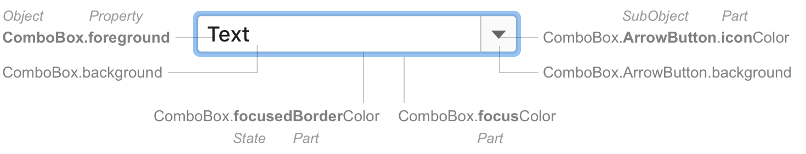

<style>
  table {
    width:100%;
  }
  th:first-child, td:first-child {
    width: 15%;
  }
  th:last-child, td:last-child {
    width: 30%;
  }
</style>


All available UI Customization Keys that can be used in [Custom Themes](themes_customize.md) must be defined in a dedicated `*.themeMetadata.json` file which is registered via `com.intellij.themeMetadataProvider` extension point. 

The following minimal sample demonstrates all details required when exposing UI customization keys of your plugin's UI.

`/resources/META-INF/plugin.xml`:

```xml
<idea-plugin> 
  [...]
  <extensions defaultExtensionNs="com.intellij">
    <themeMetadataProvider path="/META-INF/MyPlugin.themeMetadata.json"/>
  </extensions>    
  [...]
</idea-plugin>
```

`/resources/META-INF/MyPlugin.themeMetadata.json`:

```json 
{
  "name": "My Plugin",
  "fixed": false,
  "ui": [
    {
      "key": "MyComponent.border",
      "description": "The border for my component. Not used anymore.",
      "deprecated": true,
      "source": "com.myplugin.MyComponent",
    },
    {
      [more keys...]
    }
  ]
}
```     

### Attributes
- `name` - Human-readable name, e.g., plugin name
- `fixed` - `false` by default, `true` if metadata describes external elements, e.g., an UI library
- `ui` - Root element listing all customization keys:

    - `key` - Customization key name (see [Key Naming Scheme](#key-naming-scheme))
    - `description` - Description to be shown to Theme authors editing `*.theme.json` files
    - `deprecated` - `true` when key is deprecated, please provide explanation and/or replacement in `description` if available
    - `source` - FQN of the underlying UI component implementation
    - `since` - The release number (e.g. `[2019.2]`) when this UI customization key was exposed. 
                A release number prior to 2019.2 is valid.

> **NOTE** Support for the `since` attribute began with version 2019.2, so this attribute is only displayed in versions 2019.2 and later.
      
> **TIP** It is highly recommended to always provide a `description` entry, so Theme authors can understand usages.

> **TIP** Do not remove existing keys, but deprecate them instead to help Theme authors upgrade their existing themes.

Color keys can be used via `JBColor.namedColor()` providing defaults for Light and Dark theme:

```java
  private static final Color SECTION_HEADER_FOREGROUND =
    JBColor.namedColor("Plugins.SectionHeader.foreground", new JBColor(0x787878, 0x999999));
```                                                                                         

Other keys can be obtained via `javax.swing.UIManager#getXXX()` methods.

## Key Naming Scheme

All keys must follow this Naming Pattern:

**`Object[.SubObject].[state][Part]Property`**

{:width="735"}

#### Property

| Word | Use for | Example |
|------|---------|---------|
| **`foreground`**  | Text color. | `Label.foreground` |
| **`background`**  | Background color for objects with text. | `Label.background` |
| **`<part>Color`** | Objects with a single color (do not have foreground/background). Do not use the word “Color” separately, always use with the “part” word. <br/><br/>_The word “Color” shows that this is a color property. Otherwise, it can be confused with a property of another type._ | `Popup.borderColor` <br/> `Group.separatorColor` |

#### State

| Word | Use for | Example |
|------|---------|---------|
| ~~**`Active`**~~ | Enabled components, default state. Omit this word. The default state does not need explicit naming. | `Notification.background` |
| **`Inactive`**   | Enabled components that might be perceived as interactive but are actually not. Example: a tree with visible selection but not in focus. Goes after other state words. | `Tree.inactiveBackground` <br/> `ToolWindow.HeaderTab.hoverInactiveBackground` |
| **`Focused`**    | The current focused component. | `Button.focusedBorderColor` |
| **`Selected`**   | A selected tab or any other control that has equally meaningful selected and inactive states. | `ToolWindow.HeaderTab.selectedBackground` |
| **`Hover`** <br/> **`Pressed`** | An action as indicated in states. | `Link.hoverForeground` <br/> `Link.pressedForeground` |
| **`Error`** <br/> **`Warning`** <br/> **`Success`** | Validation states. [See example](https://jetbrains.design/intellij/principles/validation_errors/) in the guide article. | `ValidationTooltip.errorBackground` <br/> `ValidationTooltip.warningBorderColor` |
| **`Disabled`**   | Unavailable components. | `Label.disabledForeground` |

#### Part

A part is an internal element of a component, e.g., an arrow button in a combo box. Create a separate key for a part if its properties differ from the parent object.

If a part is common among several components, use the same name for it. Notable examples of common parts:

| Common parts| Use for | Example |
|-------------|---------|---------|
| **`Accelerator`** <br/> **`Shortcut`** | Shortcut foreground. | `Menu.acceleratorForeground` <br/> `Editor.shortcutForeground` |
| **`Border`** | A line around a component. | `NavBar.borderColor` |
| **`Caret`** | The vertical line that denotes typing place. | `TextField.caretForeground` |
| **`ModifiedItem`** | An object that has been modified but not yet saved. <br/><br/>_Example: change anything in the Settings dialog, the setting group name in the tree becomes blue._ | `Tree.modifiedItemForeground` |
| **`Focus`** | Wide focus border around a component. | `Component.focusColor` <br/><br/>_“Component” is a special key that sets common properties for several basic input components._ |
| **`Info`** | Secondary labels with additional useful information. Usually appear in gray color to the right or below a regular label. | `CompletionPopup.infoForeground` |
| **`Icon`** | An icon that is created with a source code (not an image file). | `Table.sortIconColor` |
| **`Selection`** | The focus place in a component with selectable text. Can be in a typed text or in a list or tree. <br/> Goes before other state words (for historical reasons). | `TextField.selectionForeground` <br/> `Tree.selectionInactiveBackground` |
| **`Separator`** | A horizontal or vertical line inside a component. Can be with a label. | `Menu.separatorColor` |
| **`Shadow`** | A shadow below a component. | `Button.shadowColor` |

#### SubObject
Use a subobject when creating keys for one of the following:
- An implementation variation. Usually has a similar set of UI property keys as the parent object. Examples: 
  - Default button: `Button.Default.background`
  - Tool window notification: `Notification.ToolWindow.errorBackground` 
- An internal smaller component of a complex component with its own UI and behavior. Examples:
  - Tool window tab: `ToolWindow.HeaderTab.inactiveBackground`
  - The hint text at the bottom of a popup: `Popup.Advertiser.background` 

#### Gradient Color
If a component has a gradient color, add the words “start” and “end” for the beginning and ending of a gradient. Examples:
- `Button.startBorderColor` / `Button.endBorderColor`
- `SearchMatch.startBackground` / `SearchMatch.endBackground`

#### Capitalization 
Capitalize Object and SubObject. Use lowerCamelCase for property.

#### Do Not Use

| Do not use | Use instead |
|------------|-------------|
| `Color` _as a separate word_ | `<Part>Color` |
| `Outline` | `borderColor` |
| `Text` | `Foreground` |
| `darcula` _and other look-and-feel names_ | _Omit_ | 

#### Swing Legacy

Some color keys are not named according to the rules above. Such keys are inherited from Java Swing and cannot be renamed for compatibility reasons.
Do not use naming patterns from the legacy keys.

Examples of Swing keys:
- `activeCaption`  Correct: `WindowsDialogHeader.background`
- `Button.disabledText` Correct: `Button.disabledForeground`
- `TableHeader.background` Correct: `Table.Header.background`

## IntelliJ Platform Metadata
> **NOTE** This section is relevant for IntelliJ Platform developers only.

Metadata is split up as follows:
- [`IntelliJPlatform.themeMetadata.json`](upsource:///platform/platform-resources/src/themes/metadata/IntelliJPlatform.themeMetadata.json) - all keys from IntelliJ Platform and custom UI components
- [`JDK.themeMetadata.json`](upsource:///platform/platform-resources/src/themes/metadata/JDK.themeMetadata.json) - all keys from Swing components

New keys should be added to `IntelliJPlatform.themeMetadata.json` only (or corresponding "local" `*.themeMetadata.json` file of the plugin if applicable).

Please make sure to add a `description` and use `since` and `deprecated` attributes explained in [Attributes](#attributes). Respect [Key Naming Scheme](#key-naming-scheme) and keep alphabetical ordering of keys.
