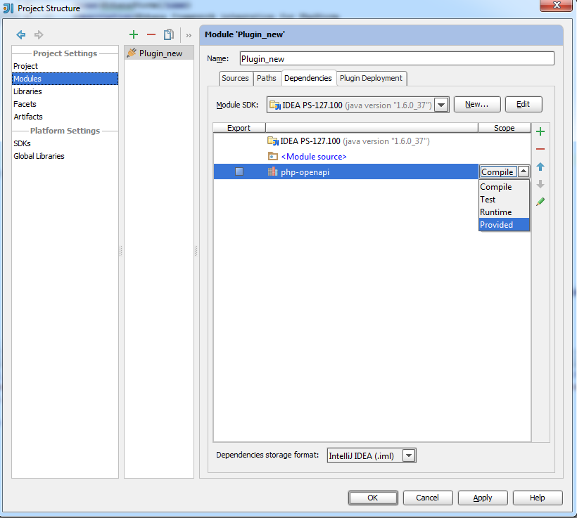

## General information
Follow steps that are described at [Getting Started with Plugin Development](http://confluence.jetbrains.com/display/IDEADEV/Getting+Started+with+Plugin+Development).
There are two ways to develop plugins for PhpStorm:
1. Use Intellij IDEA Ultimate with the PHP plugin installed
2. Use PhpStorm as a targeted IDE in a first place.
The choice affects how you will configure SDK for the plugin. In the first case you need to specify current installation of Intellij IDEA as SDK and in the second case you need to specify current installation of PhpStorm. This step is described in the Getting Started with Plugin Development

## How to use OpenAPI library

> OpenAPI is available only for PhpStorm 6 and above.

This section explains how to configure Intellij IDEA for using PhpStorm OpenAPI.

### Adding library to a module

1. Open Project Structure **File \| Project Structure**
2. Select **Libraries**
3. Press **Add** button
4. Find and select `php-openapi.jar` and `php.jar`. They are located in `<your_installation_of_PhpStorm>/plugins/php/lib`.

5. Agree to add the libraries to your Module
6. Open **Modules \| Dependencies** and change **Scope** to **Provided**. This step is necessary because otherwise `ClassCastException` will be thrown because two instances of the library will be loaded via different class loaders


### Adding dependencies to `plugin.xml`

1. Open `plugin.xml` in the directory `META-INF`
2. Add two `<depends>` items to `plugin.xml`:

```xml
<depends>com.jetbrains.php</depends>
<depends>com.intellij.modules.platform</depends>
```