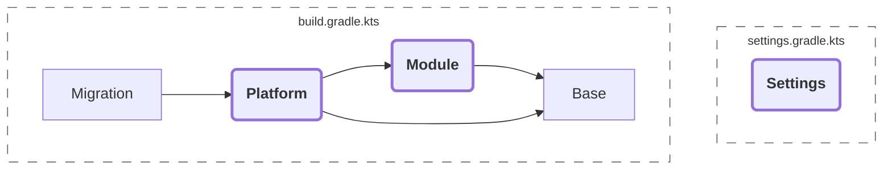

<!-- Copyright 2000-2024 JetBrains s.r.o. and contributors. Use of this source code is governed by the Apache 2.0 license. -->

# Plugins

<link-summary>IntelliJ Platform Gradle Plugin plugins.</link-summary>

<include from="tools_intellij_platform_gradle_plugin.md" element-id="faq"/>

The IntelliJ Platform Gradle Plugin consists of sub-plugins which should be applied depending on the project structure.

Subplugins architecture allows applying a subset of features, for example, to provide the IntelliJ Platform dependency to a project submodule without creating unnecessary tasks.

The following diagram describes dependencies between plugins provided with the IntelliJ Platform Gradle Plugin.





## Platform
{#platform}

<link-summary>Top-level plugin that applies all the tooling for plugin development for IntelliJ-based IDEs.</link-summary>

**Plugin ID: `org.jetbrains.intellij.platform`**

This is a top-level plugin that applies all the tooling for plugin development for IntelliJ-based IDEs.
It should be used only with the root module (for submodules, see [](#module)).

<tabs group="languages">
<tab title="Kotlin" group-key="kotlin">

<path>build.gradle.kts</path>
```kotlin
plugins {
  id("org.jetbrains.intellij.platform") version "%intellij-platform-gradle-plugin-version%"
}
```

</tab>
<tab title="Groovy" group-key="groovy">

<path>build.gradle.kts</path>
```kotlin
plugins {
  id("org.jetbrains.intellij.platform") version "%intellij-platform-gradle-plugin-version%"
}
```

</tab>
</tabs>

### Available tasks
{#platform-available-tasks}

[`buildPlugin`](tools_intellij_platform_gradle_plugin_tasks.md#buildPlugin),
[`buildSearchableOptions`](tools_intellij_platform_gradle_plugin_tasks.md#buildSearchableOptions),
[`composedJar`](tools_intellij_platform_gradle_plugin_tasks.md#composedJar),
[`generateManifest`](tools_intellij_platform_gradle_plugin_tasks.md#generateManifest),
[`initializeIntelliJPlatformPlugin`](tools_intellij_platform_gradle_plugin_tasks.md#initializeIntelliJPlatformPlugin),
[`instrumentCode`](tools_intellij_platform_gradle_plugin_tasks.md#instrumentCode),
[`instrumentedJar`](tools_intellij_platform_gradle_plugin_tasks.md#instrumentedJar),
[`jarSearchableOptions`](tools_intellij_platform_gradle_plugin_tasks.md#jarSearchableOptions),
[`patchPluginXml`](tools_intellij_platform_gradle_plugin_tasks.md#patchPluginXml),
[`prepareSandbox`](tools_intellij_platform_gradle_plugin_tasks.md#prepareSandbox),
[`prepareTest`](tools_intellij_platform_gradle_plugin_tasks.md#prepareTest),
[`printBundledPlugins`](tools_intellij_platform_gradle_plugin_tasks.md#printBundledPlugins),
[`printProductsReleases`](tools_intellij_platform_gradle_plugin_tasks.md#printProductsReleases),
[`publishPlugin`](tools_intellij_platform_gradle_plugin_tasks.md#publishPlugin),
[`runIde`](tools_intellij_platform_gradle_plugin_tasks.md#runIde),
[`setupDependencies`](tools_intellij_platform_gradle_plugin_tasks.md#setupDependencies),
[`signPlugin`](tools_intellij_platform_gradle_plugin_tasks.md#signPlugin),
[`testIdePerformance`](tools_intellij_platform_gradle_plugin_tasks.md#testIdePerformance),
[`testIde`](tools_intellij_platform_gradle_plugin_tasks.md#testIde),
[`testIdeUi`](tools_intellij_platform_gradle_plugin_tasks.md#testIdeUi),
[`verifyPluginProjectConfiguration`](tools_intellij_platform_gradle_plugin_tasks.md#verifyPluginProjectConfiguration),
[`verifyPluginSignature`](tools_intellij_platform_gradle_plugin_tasks.md#verifyPluginSignature),
[`verifyPluginStructure`](tools_intellij_platform_gradle_plugin_tasks.md#verifyPluginStructure),
[`verifyPlugin`](tools_intellij_platform_gradle_plugin_tasks.md#verifyPlugin)


## Module
{#module}

<link-summary>Applies a smaller set of functionalities for compiling and testing submodules when working in a multi-module architecture.</link-summary>

**Plugin ID: `org.jetbrains.intellij.platform.module`**

This plugin applies a smaller set of functionalities for compiling and testing submodules when working in a multi-module architecture.

Compared to the main plugin, it doesn't contain tasks related to publishing or running the IDE for testing purposes.


<tabs group="languages">
<tab title="Kotlin" group-key="kotlin">

<path>settings.gradle.kts</path>

```kotlin
rootProject.name = "..."

include(":submodule")
```

<path>submodule/build.gradle.kts</path>

```kotlin
plugins {
  id("org.jetbrains.intellij.platform.module")
}

repositories {
  mavenCentral()

  intellijPlatform {
    defaultRepositories()
  }
}

dependencies {
  intellijPlatform {
    intellijIdeaCommunity("%ijPlatform%")
  }
}
```

<path>build.gradle.kts</path>

```kotlin
plugins {
  id("org.jetbrains.intellij.platform") version "%intellij-platform-gradle-plugin-version%"
}

repositories {
  mavenCentral()

  intellijPlatform {
    defaultRepositories()
  }
}

dependencies {
  intellijPlatform {
    intellijIdeaCommunity("%ijPlatform%")
    pluginModule(implementation(project(":submodule")))
  }
}
```

</tab>
<tab title="Groovy" group-key="groovy">

<path>settings.gradle</path>

```groovy
rootProject.name = '...'

include ':submodule'
```

<path>submodule/build.gradle</path>

```groovy
plugins {
  id 'org.jetbrains.intellij.platform.module'
}

repositories {
  mavenCentral()

  intellijPlatform {
    defaultRepositories()
  }
}

dependencies {
  intellijPlatform {
    intellijIdeaCommunity '%ijPlatform%'
  }
}
```

<path>build.gradle</path>

```groovy
plugins {
  id 'org.jetbrains.intellij.platform' version '%intellij-platform-gradle-plugin-version%'
}

repositories {
  mavenCentral()

  intellijPlatform {
    defaultRepositories()
  }
}

dependencies {
  intellijPlatform {
    intellijIdeaCommunity '%ijPlatform%'
    pluginModule(implementation(project(':submodule')))
  }
}
```

</tab>
</tabs>


Note that the `:submodule` is added both to the `implementation` configuration and `intellijPlatformPluginModule` using the [](tools_intellij_platform_gradle_plugin_dependencies_extension.md#plugins) helper method.
This guarantees that the submodule content will be merged into the main plugin JAR file.

### Available tasks
{#module-available-tasks}

[`composedJar`](tools_intellij_platform_gradle_plugin_tasks.md#composedJar),
[`generateManifest`](tools_intellij_platform_gradle_plugin_tasks.md#generateManifest),
[`initializeIntelliJPlatformPlugin`](tools_intellij_platform_gradle_plugin_tasks.md#initializeIntelliJPlatformPlugin),
[`instrumentCode`](tools_intellij_platform_gradle_plugin_tasks.md#instrumentCode),
[`instrumentedJar`](tools_intellij_platform_gradle_plugin_tasks.md#instrumentedJar),
[`prepareSandbox`](tools_intellij_platform_gradle_plugin_tasks.md#prepareSandbox),
[`prepareTest`](tools_intellij_platform_gradle_plugin_tasks.md#prepareTest),
[`printBundledPlugins`](tools_intellij_platform_gradle_plugin_tasks.md#printBundledPlugins),
[`printProductsReleases`](tools_intellij_platform_gradle_plugin_tasks.md#printProductsReleases),
[`setupDependencies`](tools_intellij_platform_gradle_plugin_tasks.md#setupDependencies),
[`testIde`](tools_intellij_platform_gradle_plugin_tasks.md#testIde),
[`verifyPluginProjectConfiguration`](tools_intellij_platform_gradle_plugin_tasks.md#verifyPluginProjectConfiguration)


## Settings
{#settings}

<link-summary>Plugin available for use in Gradle settings file.</link-summary>

**Plugin ID: `org.jetbrains.intellij.platform.settings`**

If you define project repositories within the <path>settings.gradle.kts</path> using the `dependencyResolutionManagement`, make sure to include the Settings plugin in <path>settings.gradle.kts</path>.

This approach allows for omitting the `repositories {}` definition in the <path>build.gradle.kts</path> files. See [](tools_intellij_platform_gradle_plugin.md#configuration.dependencyResolutionManagement) for more details.

<tabs group="languages">
<tab title="Kotlin" group-key="kotlin">

<path>settings.gradle.kts</path>

```kotlin
import org.jetbrains.intellij.platform.gradle.extensions.intellijPlatform

plugins {
  id("org.jetbrains.intellij.platform.settings") version "%intellij-platform-gradle-plugin-version%"
}

rootProject.name = "..."

dependencyResolutionManagement {
  repositoriesMode = RepositoriesMode.FAIL_ON_PROJECT_REPOS

  repositories {
    mavenCentral()

    intellijPlatform {
      defaultRepositories()
    }
  }
}

include(":submodule")
```

<path>build.gradle.kts</path>

```kotlin
plugins {
  id("org.jetbrains.intellij.platform")
}

dependencies {
  intellijPlatform {
    intellijIdeaCommunity("%ijPlatform%")
    pluginModule(implementation(project(":submodule")))
  }
}
```

> Note that <path>build.gradle.kts</path> doesn't define the IntelliJ Platform Gradle Plugin version anymore as it was earlier declared in the <path>settings.gradle.kts</path> file.
> Specifying the version in two places may result in the following Gradle exception:
>
> `The request for this plugin could not be satisfied because the plugin is already on the classpath with an unknown version, so compatibility cannot be checked.`


<path>submodule/build.gradle.kts</path>

```kotlin
plugins {
  id("org.jetbrains.intellij.platform.module")
}

dependencies {
  intellijPlatform {
    intellijIdeaCommunity("%ijPlatform%")
  }
}
```

</tab>
<tab title="Groovy" group-key="groovy">

<path>settings.gradle</path>

```groovy
import org.jetbrains.intellij.platform.gradle.extensions.intellijPlatform

plugins {
  id 'org.jetbrains.intellij.platform.settings' version '%intellij-platform-gradle-plugin-version%'
}

rootProject.name = '...'

dependencyResolutionManagement {
  repositoriesMode = RepositoriesMode.FAIL_ON_PROJECT_REPOS

  repositories {
    mavenCentral()

    intellijPlatform {
      defaultRepositories()
    }
  }
}

include ':submodule'
```

<path>build.gradle</path>

```groovy
plugins {
  id 'org.jetbrains.intellij.platform'
}

dependencies {
  intellijPlatform {
    intellijIdeaCommunity '%ijPlatform%'
    pluginModule(implementation(project(':submodule')))
  }
}
```

> Note that <path>build.gradle</path> doesn't define the IntelliJ Platform Gradle Plugin version anymore as it was earlier declared in the <path>settings.gradle</path> file.
> Specifying the version in two places may result in the following Gradle exception:
>
> `The request for this plugin could not be satisfied because the plugin is already on the classpath with an unknown version, so compatibility cannot be checked.`


<path>submodule/build.gradle</path>

```groovy
plugins {
  id 'org.jetbrains.intellij.platform.module'
}

dependencies {
  intellijPlatform {
    intellijIdeaCommunity '%ijPlatform%'
  }
}
```

</tab>
</tabs>


## Migration
{#migration}

<link-summary>Plugin is designed to assist in upgrading projects that use Gradle IntelliJ Plugin **1.x** to the **2.x** version.</link-summary>

**Plugin ID: `org.jetbrains.intellij.platform.migration`**

The Migration plugin is designed to assist in upgrading projects that use Gradle IntelliJ Plugin **1.x** to the **2.x** version.
To prevent Gradle failing due to breaking changes, the `org.jetbrains.intellij.platform.migration` plugin was introduced to fill missing gaps and provide migration hints.

It loads the [](#platform) plugin with additional mocks and checks applied — after the successful migration, the `org.jetbrains.intellij.platform.migration` identifier shoud be replaced with `org.jetbrains.intellij.platform`.

See [](tools_intellij_platform_gradle_plugin_migration.md) for more details.


## Base
{#base}

<link-summary>Prepares all the custom configurations, transformers, and base tasks needed to manage the IntelliJ Platform dependency, JetBrains Runtime, CLI tools, and others.</link-summary>

**Plugin ID: `org.jetbrains.intellij.platform.base`**

Prepares all the custom configurations, transformers, and base tasks needed to manage the IntelliJ Platform dependency, JetBrains Runtime, CLI tools, and others.

It also introduces the [](tools_intellij_platform_gradle_plugin_extension.md) to the <path>build.gradle.kts</path> file along with [](tools_intellij_platform_gradle_plugin_dependencies_extension.md) and [](tools_intellij_platform_gradle_plugin_repositories_extension.md) to help preconfigure project dependencies:

<tabs group="languages">
<tab title="Kotlin" group-key="kotlin">

```kotlin
repositories {
  ...

  // Repositories Extension
  intellijPlatform { ... }
}

dependencies {
  ...

  // Dependencies Extension
  intellijPlatform { ... }
}

// IntelliJ Platform Extension
intellijPlatform { ... }
```

</tab>
<tab title="Groovy" group-key="groovy">

```groovy
repositories {
  ...

  // Repositories Extension
  intellijPlatform { ... }
}

dependencies {
  ...

  // Dependencies Extension
  intellijPlatform { ... }
}

// IntelliJ Platform Extension
intellijPlatform { ... }
```

</tab>
</tabs>


The plugin also introduces a task listener which allows for creating custom tasks decorated with [](tools_intellij_platform_gradle_plugin_task_awares.md).
See [](tools_intellij_platform_gradle_plugin_recipes.md) for more details.

### Available tasks
{#base-available-tasks}

[`initializeIntelliJPlatformPlugin`](tools_intellij_platform_gradle_plugin_tasks.md#initializeIntelliJPlatformPlugin),
[`printBundledPlugins`](tools_intellij_platform_gradle_plugin_tasks.md#printBundledPlugins),
[`printProductsReleases`](tools_intellij_platform_gradle_plugin_tasks.md#printProductsReleases),
[`setupDependencies`](tools_intellij_platform_gradle_plugin_tasks.md#setupDependencies),
