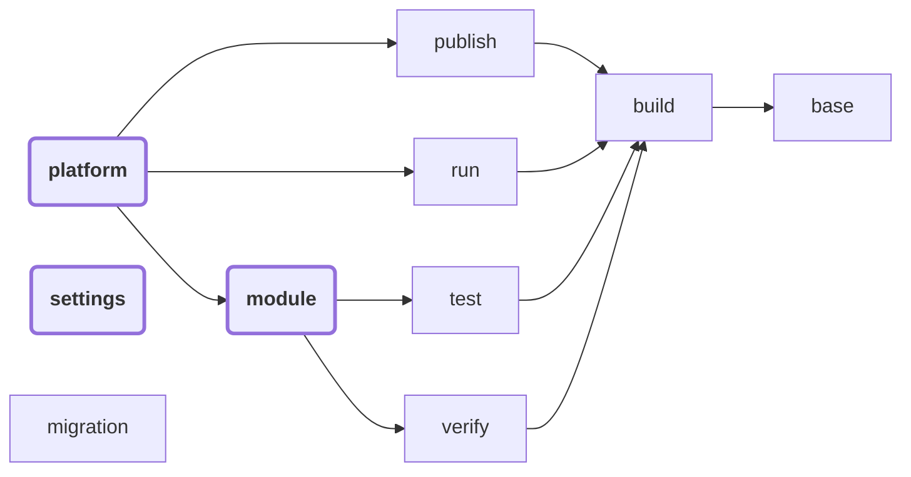

<!-- Copyright 2000-2024 JetBrains s.r.o. and contributors. Use of this source code is governed by the Apache 2.0 license. -->

# Plugins

<link-summary>IntelliJ Platform Gradle Plugin plugins.</link-summary>

<include from="tools_intellij_platform_gradle_plugin.md" element-id="EAP_Status"/>
<include from="tools_intellij_platform_gradle_plugin.md" element-id="faq"/>

The IntelliJ Platform Gradle Plugin consists of multiple subplugins which you can apply in bundles ([](#platform) or [](#module)) or separately.

Subplugins architecture allows applying a subset of features, e.g., when you want to provide the IntelliJ Platform dependency to a project submodule without creating unnecessary tasks.

> Plugins depend on each other.
>
> When applying the [](#module) plugin, there is no need for manual applying the [](#build) plugin.

The following chart describes dependencies between plugins provided with the IntelliJ Platform Gradle Plugin.

The plugins highlighted in bold are recommended for most of the cases when creating a plugin for IntelliJ-based IDEs.



## Platform

**Plugin ID: `org.jetbrains.intellij.platform`**

This is a top-level plugin that applies all project-level subplugins that bring the fully flagged tooling for plugin development for IntelliJ-based IDEs.

This plugin should be used in most cases when working with a single-module project:

<path>build.gradle.kts</path>
```kotlin
plugins {
  id("org.jetbrains.intellij.platform") version "%intellij-platform-gradle-plugin-version%"
}
```

Included plugins:
- [](#base)
- [](#build)
- [](#test)
- [](#verify)
- [](#run)
- [](#publish)


## Module

**Plugin ID: `org.jetbrains.intellij.platform.module`**

This top-level plugin applies a smaller set of subplugins required for providing required dependencies and build/test tasks for a submodule when working on a plugin for IntelliJ-based IDEs in a multi-module architecture.

Comparing to the main plugin, it doesn't contain tasks related to publishing or running the IDE for testing purposes.

<path>settings.gradle.kts</path>

```kotlin
rootProject.name = "..."

include(":submodule")
```

<path>build.gradle.kts</path>

```kotlin
plugins {
  id("org.jetbrains.intellij.platform") version "%intellij-platform-gradle-plugin-version%"
}

repositories {
  mavenCentral()

  intellijPlatform {
    defaultRepositories()
  }
}

dependencies {
  implementation(project(":submodule"))

  intellijPlatform {
    intellijIdeaCommunity("%ijPlatform%")
  }
}
```

<path>submodule/build.gradle.kts</path>

```kotlin
plugins {
  id("org.jetbrains.intellij.platform.module")
}

repositories {
  mavenCentral()

  intellijPlatform {
    defaultRepositories()
  }
}

dependencies {
  intellijPlatform {
    intellijIdeaCommunity("%ijPlatform%")
  }
}
```

Included plugins:
- [](#base)
- [](#build)
- [](#test)
- [](#verify)


## Settings

**Plugin ID: `org.jetbrains.intellij.platform.settings`**

If you define repositories within the <path>settings.gradle.kts</path> using the `dependencyResolutionManagement` Gradle, make sure to include the Settings plugin in your <path>settings.gradle.kts</path>.

See [](tools_intellij_platform_gradle_plugin.md#configuration.dependencyResolutionManagement) for more details.

<path>settings.gradle.kts</path>

```kotlin
import org.jetbrains.intellij.platform.gradle.extensions.intellijPlatform

plugins {
  id("org.jetbrains.intellij.platform.settings") version "%intellij-platform-gradle-plugin-version%"
}

rootProject.name = "..."

dependencyResolutionManagement {
  repositoriesMode = RepositoriesMode.FAIL_ON_PROJECT_REPOS

  repositories {
    mavenCentral()

    intellijPlatform {
      defaultRepositories()
    }
  }
}

include(":submodule")
```

<path>build.gradle.kts</path>

```kotlin
plugins {
  id("org.jetbrains.intellij.platform") version "%intellij-platform-gradle-plugin-version%"
}

dependencies {
  implementation(project(":submodule"))

  intellijPlatform {
    intellijIdeaCommunity("%ijPlatform%")
  }
}
```

<path>submodule/build.gradle.kts</path>

```kotlin
plugins {
  id("org.jetbrains.intellij.platform.module")
}

dependencies {
  intellijPlatform {
    intellijIdeaCommunity("%ijPlatform%")
  }
}
```

## Migration

**Plugin ID: `org.jetbrains.intellij.platform.migration`**

The Migration Plugin is designed to assist in upgrading your configuration from Gradle IntelliJ Plugin version `1.x`.
To prevent Gradle failing due to breaking changes, the `org.jetbrains.intellij.platform.migration` plugin was introduced to fill missing gaps and provide migration hints.

See [](tools_intellij_platform_gradle_plugin_migration.md) for more details.


## Base

**Plugin ID: `org.jetbrains.intellij.platform.base`**

The base plugin sets up all the custom configurations and transformers needed to manage the IntelliJ Platform dependency, JetBrains Runtime, CLI tools, and other plugins when they're added as dependencies.

It also introduces the [](tools_intellij_platform_gradle_plugin_extension.md) to the <path>build.gradle.kts</path> file along with [](tools_intellij_platform_gradle_plugin_dependencies_extension.md) and [](tools_intellij_platform_gradle_plugin_repositories_extension.md) to help preconfiguring project dependencies:

```kotlin
repositories {
  ...

  intellijPlatform {
    // Repositories Extension
  }
}

dependencies {
  ...

  intellijPlatform {
    // Dependencies Extension
  }
}

intellijPlatform {
  // IntelliJ Platform Extension
}
```

Plugin also introduces a tasks listener which allows for creating custom tasks decorated with [](tools_intellij_platform_gradle_plugin_task_awares.md).

Included tasks:
- [](tools_intellij_platform_gradle_plugin_tasks.md#initializeIntelliJPlatformPlugin)
- [](tools_intellij_platform_gradle_plugin_tasks.md#printBundledPlugins)
- [](tools_intellij_platform_gradle_plugin_tasks.md#printProductsReleases)


## Build

**Plugin ID: `org.jetbrains.intellij.platform.build`**

Tasks plugin registers and preconfigures tasks responsible for patching, instrumenting, and building the plugin.

Included tasks:
- [](tools_intellij_platform_gradle_plugin_tasks.md#buildPlugin)
- [](tools_intellij_platform_gradle_plugin_tasks.md#buildSearchableOptions)
- [](tools_intellij_platform_gradle_plugin_tasks.md#instrumentCode)
- [](tools_intellij_platform_gradle_plugin_tasks.md#jarSearchableOptions)
- [](tools_intellij_platform_gradle_plugin_tasks.md#patchPluginXml)
- [](tools_intellij_platform_gradle_plugin_tasks.md#prepareSandbox)


## Publish

**Plugin ID: `org.jetbrains.intellij.platform.publish`**

Tasks plugin adds tasks responsible for signing and publishing the final plugin archive to JetBrains Marketplace.

Included tasks:
- [](tools_intellij_platform_gradle_plugin_tasks.md#signPlugin)
- [](tools_intellij_platform_gradle_plugin_tasks.md#publishPlugin)


## Run

**Plugin ID: `org.jetbrains.intellij.platform.run`**

Registers the task used for running the local instance of the IntelliJ Platform used for development.

It is also possible to introduce custom tasks so you could run your plugin against various IDEs during the development process.

Included tasks:
- [](tools_intellij_platform_gradle_plugin_tasks.md#runIde)


## Test

**Plugin ID: `org.jetbrains.intellij.platform.test`**

Preconfigures the existing `test` task to make the plugin testing possible (unit tests, UI tests, performance tests) as well as preconfigures the customizable `TestIdeTask` class so you could register multiple `test*` task for running tests against different IDEs.

Included tasks:
- [](tools_intellij_platform_gradle_plugin_tasks.md#prepareTest)
- [](tools_intellij_platform_gradle_plugin_tasks.md#testIde)
- [](tools_intellij_platform_gradle_plugin_tasks.md#testIdePerformance)
- [](tools_intellij_platform_gradle_plugin_tasks.md#testIdeUi)


## Verify

**Plugin ID: `org.jetbrains.intellij.platform.verify`**

Introduces various verification tasks that run checks against your project configuration, <path>plugin.xml</path> file, signature check, or execute the IntelliJ Plugin Verifier tool.

Included tasks:
- [](tools_intellij_platform_gradle_plugin_tasks.md#verifyPluginProjectConfiguration)
- [](tools_intellij_platform_gradle_plugin_tasks.md#verifyPlugin)
- [](tools_intellij_platform_gradle_plugin_tasks.md#verifyPluginSignature)
- [](tools_intellij_platform_gradle_plugin_tasks.md#verifyPluginStructure)
