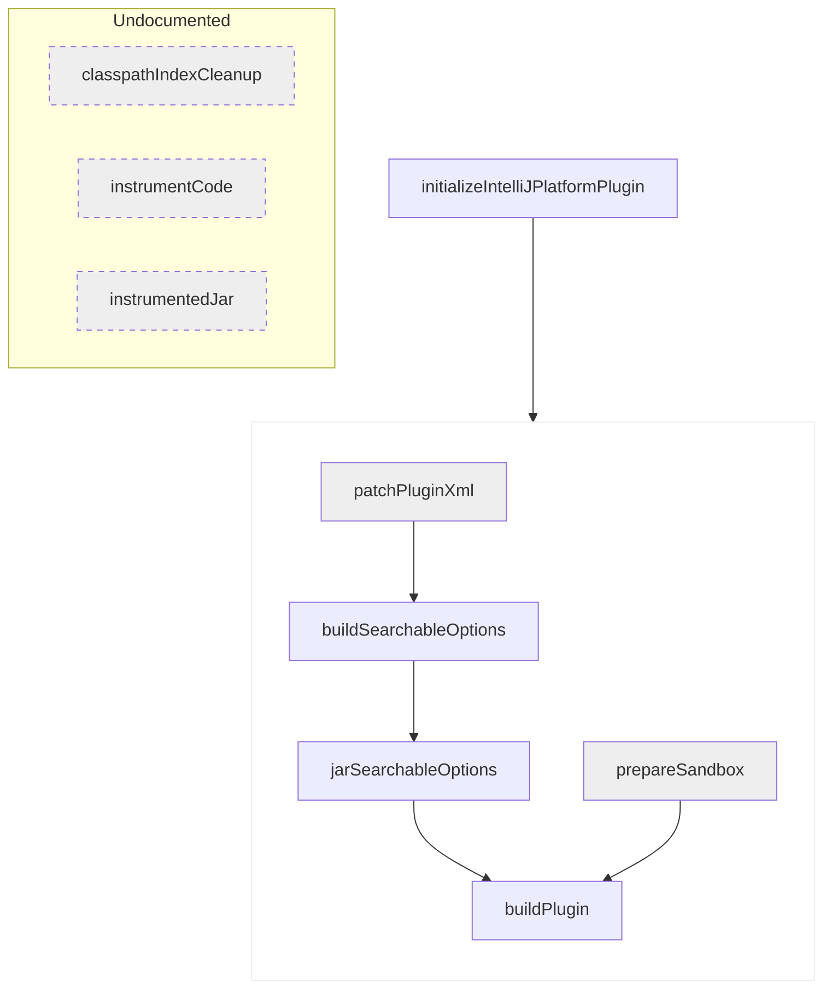

<!-- Copyright 2000-2024 JetBrains s.r.o. and contributors. Use of this source code is governed by the Apache 2.0 license. -->

# Tasks

<link-summary>IntelliJ Platform Gradle Plugin tasks.</link-summary>

<include from="tools_intellij_platform_gradle_plugin.md" element-id="EAP_Status"/>

The IntelliJ Platform Gradle Plugin introduces a set of tasks to handle activities of the plugin development for IntelliJ-based IDEs, such as building, verifying, testing, and publishing the plugin archive.

Tasks are applied to the project with the [`org.jetbrains.intellij.platform.tasks`](tools_intellij_platform_gradle_plugin.md#plugin.tasks) subplugin, which is a part of [`org.jetbrains.intellij.platform`](tools_intellij_platform_gradle_plugin.md#plugin.platform).

Each of the tasks has relations described between each other, inherit from  interfaces, respect configuration and build cache, and can be configured independently, but for the most cases, the  covers all necessary cases.

## buildPlugin
{#buildPlugin}

<tldr>

**Sources**: [`BuildPluginTask`](%gh-ijpgp%/src/main/kotlin/org/jetbrains/intellij/platform/gradle/tasks/BuildPluginTask.kt)

**Extends**: [`Zip`][gradle-zip-task]

**Depends on**: [`jarSearchableOptions`](#jarSearchableOptions), [`prepareSandbox`](#prepareSandbox)

</tldr>

Builds the plugin and prepares the ZIP archive for testing and deployment.

It takes the output of the [`prepareSandbox`](#prepareSandbox) task containing the built project with all its modules and dependencies, and the output of [`jarSearchableOptions`](#jarSearchableOptions) task.

The produced archive is stored in the <path>[buildDirectory]/distributions/[`archiveFile`](#buildPlugin-archiveFile)</path> file.
The [`archiveFile`](#buildPlugin-archiveFile) name and location can be controlled with properties provided with the [`Zip`](https://docs.gradle.org/current/dsl/org.gradle.api.tasks.bundling.Zip.html) base task.
By default, the `archiveBaseName` is set to the value of [`prepareSandbox.pluginName`](#prepareSandbox-pluginName).

### archiveFile
{#buildPlugin-archiveFile}

The archive file which represents the output file produced by the task.

{style="narrow"}
Type
: `RegularFileProperty`

Default value
: [`buildPlugin.archiveFile`](#buildPlugin-archiveFile)

## buildSearchableOptions
{#buildSearchableOptions}

<tldr>

**Sources**: [`BuildSearchableOptionsTask`](%gh-ijpgp%/src/main/kotlin/org/jetbrains/intellij/platform/gradle/tasks/BuildSearchableOptionsTask.kt)

**Extends**: [`JavaExec`][gradle-javaexec-task], [`RunnableIdeAware`](tools_intellij_platform_gradle_plugin_task_awares.md#RunnableIdeAware)

**Depends on**: [`patchPluginXml`](#patchPluginXml)

</tldr>

Builds the index of UI components (searchable options) for the plugin.
This task runs a headless IDE instance to collect all the available options provided by the plugin's .

If your plugin doesn't implement custom settings, it is recommended to disable this task via [`intellijPlatform.buildSearchableOptions`](tools_intellij_platform_gradle_plugin_extension.md#intellijPlatform-buildSearchableOptions) build feature.

In the case of running the task for the plugin using [`intellijPlatform.pluginConfiguration.productDescriptor`](tools_intellij_platform_gradle_plugin_extension.md#intellijPlatform-pluginConfiguration-productDescriptor), a warning will be logged regarding potential issues with running headless IDE for paid plugins.
It is possible to mute this warning with the [`paidPluginSearchableOptionsWarning`](tools_intellij_platform_gradle_plugin_build_features.md#paidPluginSearchableOptionsWarning) build feature.

### outputDirectory
{#buildSearchableOptions-outputDirectory}

The directory to which searchable options will be generated.

{style="narrow"}
Type
: `DirectoryProperty`

Default value
: <path>[buildDirectory]/searchableOptions</path>

### showPaidPluginWarning
{#buildSearchableOptions-showPaidPluginWarning}

Emit warning if the task is executed by a paid plugin.
Can be disabled with the [`paidPluginSearchableOptionsWarning`](tools_intellij_platform_gradle_plugin_build_features.md#paidPluginSearchableOptionsWarning) build feature.

{style="narrow"}
Type
: `Property<Boolean>`

Default value
: [`paidPluginSearchableOptionsWarning`](tools_intellij_platform_gradle_plugin_build_features.md#paidPluginSearchableOptionsWarning) && `productDescriptor` is defined

## classpathIndexCleanup
{#classpathIndexCleanup}

> Deprecated?
>
{style="warning"}

## initializeIntelliJPlatformPlugin
{#initializeIntelliJPlatformPlugin}

<tldr>

**Sources**: [`InitializeIntelliJPlatformPluginTask`](%gh-ijpgp%/src/main/kotlin/org/jetbrains/intellij/platform/gradle/tasks/InitializeIntelliJPlatformPluginTask.kt)

**Extends**: [`DefaultTask`][gradle-default-task], [`IntelliJPlatformVersionAware`](tools_intellij_platform_gradle_plugin_task_awares.md#IntelliJPlatformVersionAware)

</tldr>

This task is executed before every other task introduced by IntelliJ Platform Gradle Plugin to prepare it to run.

It is responsible for:
- checking if the project uses IntelliJ Platform Gradle Plugin in the latest available version
- preparing the KotlinX Coroutines Java Agent file to enable coroutines debugging when developing the plugin

The self-update check can be disabled via [`selfUpdateCheck`](tools_intellij_platform_gradle_plugin_build_features.md#selfUpdateCheck) build feature.

To make the Coroutines Java Agent available for the task, inherit from [`CoroutinesJavaAgentAware`](tools_intellij_platform_gradle_plugin_task_awares.md#CoroutinesJavaAgentAware).

### offline
{#initializeIntelliJPlatformPlugin-offline}

Determines if the operation is running in offline mode.

Depends on Gradle start parameters.

{style="narrow"}
Type
: `Property<Boolean>`

Default value
: `StartParameter.isOffline`

See also:
- [StartParameter](https://docs.gradle.org/current/javadoc/org/gradle/StartParameter.html)
- [Command Line Execution Options](https://docs.gradle.org/current/userguide/command_line_interface.html#sec:command_line_execution_options)

### selfUpdateCheck
{#initializeIntelliJPlatformPlugin-selfUpdateCheck}

Represents the property for checking if self-update checks are enabled.

{style="narrow"}
Type
: `Property<Boolean>`

Default value
: [`selfUpdateCheck`](tools_intellij_platform_gradle_plugin_build_features.md#selfUpdateCheck)

### selfUpdateLock
{#initializeIntelliJPlatformPlugin-selfUpdateLock}

Represents a lock file used to limit the plugin version checks in time.
If the file is absent, and other conditions are met, the version check is performed.

{style="narrow"}
Type
: `RegularFileProperty`

### coroutinesJavaAgent
{#initializeIntelliJPlatformPlugin-coroutinesJavaAgent}

Java Agent file for the Coroutines library, which is required to enable coroutines debugging.

{style="narrow"}
Type
: `Property<Boolean>`

Default value
: `[buildDirectory]/tmp/initializeIntelliJPlatformPlugin/coroutines-javaagent.jar`

### pluginVersion
{#initializeIntelliJPlatformPlugin-pluginVersion}

Represents the current version of the plugin.

{style="narrow"}
Type
: `Property<String>`

## instrumentCode
{#instrumentCode}

> Not implemented.
>
{style="warning"}

See also:
- [Extension: `intellijPlatform.instrumentCode`](tools_intellij_platform_gradle_plugin_extension.md#intellijPlatform-instrumentCode)

## instrumentedJar
{#instrumentedJar}

> Not implemented.
>
{style="warning"}

## jarSearchableOptions
{#jarSearchableOptions}

<tldr>

**Sources**: [`JarSearchableOptionsTask`](%gh-ijpgp%/src/main/kotlin/org/jetbrains/intellij/platform/gradle/tasks/JarSearchableOptionsTask.kt)

**Extends**: [`Jar`][gradle-jar-task], [`SandboxAware`](tools_intellij_platform_gradle_plugin_task_awares.md#SandboxAware)

**Depends on**: [`buildSearchableOptions`](#buildSearchableOptions)

</tldr>

Creates a JAR file with searchable options to be distributed with the plugin.

### destinationDirectory
{#jarSearchableOptions-destinationDirectory}

The directory where the JAR file will be created.

{style="narrow"}
Type
: `DirectoryProperty`

Default value
: `[buildDirectory]/libsSearchableOptions`

### inputDirectory
{#jarSearchableOptions-inputDirectory}

The directory from which

{style="narrow"}
Type
: `DirectoryProperty`

Default value
: `[buildDirectory]/tmp/initializeIntelliJPlatformPlugin/coroutines-javaagent.jar`

### noSearchableOptionsWarning
{#jarSearchableOptions-noSearchableOptionsWarning}

Emit warning if no searchable options are found.
Can be disabled with [`noSearchableOptionsWarning`](tools_intellij_platform_gradle_plugin_build_features.md#noSearchableOptionsWarning) build feature.

{style="narrow"}
Type
: `Property<Boolean>`

Default value
: [`noSearchableOptionsWarning`](tools_intellij_platform_gradle_plugin_build_features.md#noSearchableOptionsWarning)

### pluginName
{#jarSearchableOptions-pluginName}

The name of the plugin.

{style="narrow"}
Type
: `Property<String>`

Default value
: [`intellijPlatform.pluginConfiguration.name`](tools_intellij_platform_gradle_plugin_extension.md#intellijPlatform-pluginConfiguration-name)

## patchPluginXml
{#patchPluginXml}

### inputFile
{#patchPluginXml-inputFile}

Represents an input <path>plugin.xml</path> file.

By default, a <path>plugin.xml</path> file is picked from the main resource location.

{style="narrow"}
Type
: `RegularFileProperty`

Default value
: <path>src/main/<kotlin|java>/resources/META-INF/plugin.xml</path>

### outputFile
{#patchPluginXml-outputFile}

Represents the output <path>plugin.xml</path> file property for the task.

By default, the file is written to a temporary task-specific directory within the <path>build</path> directory.

{style="narrow"}
Type
: `RegularFileProperty`

Default value
: <path>[buildDirectory]/tmp/patchPluginXml/plugin.xml</path>

### pluginId
{#patchPluginXml-pluginId}

A unique identifier of the plugin.

It should be a fully qualified name similar to Java packages and must not collide with the ID of existing plugins.
The ID is a technical value used to identify the plugin in the IDE and [JetBrains Marketplace](https://plugins.jetbrains.com/).

Please use characters, numbers, and `.`/`-`/`_` symbols only and keep it reasonably short.

The provided value will be set as a value of the `<id>` element.

{style="narrow"}
Type
: `Property<String>`

Default value
: [`intellijPlatform.pluginConfiguration.id`](tools_intellij_platform_gradle_plugin_extension.md#intellijPlatform-pluginConfiguration-id)

See also:
- [Plugin Configuration File: `id`](plugin_configuration_file.md#idea-plugin__id)

### pluginName
{#patchPluginXml-pluginName}

The user-visible plugin display name (Title Case).

The provided value will be set as a value of the `<name>` element.

{style="narrow"}
Type
: `Property<String>`

Default value
: [`intellijPlatform.pluginConfiguration.name`](tools_intellij_platform_gradle_plugin_extension.md#intellijPlatform-pluginConfiguration-name)

See also:
- [Plugin Configuration File: `name`](plugin_configuration_file.md#idea-plugin__name)

### pluginVersion
{#patchPluginXml-pluginVersion}

The plugin version is displayed in the Plugins settings dialog and on the JetBrains Marketplace plugin page.

Plugins uploaded to the JetBrains Marketplace must follow semantic versioning.

The provided value will be set as a value of the `<version>` element.

{style="narrow"}
Type
: `Property<String>`

Default value
: [`intellijPlatform.pluginConfiguration.version`](tools_intellij_platform_gradle_plugin_extension.md#intellijPlatform-pluginConfiguration-version)

See also:
- [Plugin Configuration File: `version`](plugin_configuration_file.md#idea-plugin__version)

### pluginDescription
{#patchPluginXml-pluginDescription}

The plugin description is displayed on the JetBrains Marketplace plugin page and in the Plugins settings dialog.
Simple HTML elements, like text formatting, paragraphs, lists, etc., are allowed.

The description content is automatically wrapped with `<![CDATA[... ]]>`.

The provided value will be set as a value of the `<description>` element.

{style="narrow"}
Type
: `Property<String>`

Default value
: [`intellijPlatform.pluginConfiguration.description`](tools_intellij_platform_gradle_plugin_extension.md#intellijPlatform-pluginConfiguration-description)

See also:
- [Plugin Configuration File: `description`](plugin_configuration_file.md#idea-plugin__description)

### changeNotes
{#patchPluginXml-changeNotes}

A short summary of new features, bugfixes, and changes provided with the latest plugin version.
Change notes are displayed on the JetBrains Marketplace plugin page and in the Plugins settings dialog.
Simple HTML elements, like text formatting, paragraphs, lists, etc., are allowed.

The change notes content is automatically wrapped with `<![CDATA[... ]]>`.

The provided value will be set as a value of the `<change-notes>` element.

{style="narrow"}
Type
: `Property<String>`

Default value
: [`intellijPlatform.pluginConfiguration.changeNotes`](tools_intellij_platform_gradle_plugin_extension.md#intellijPlatform-pluginConfiguration-changeNotes)

See also:
- [Plugin Configuration File: `change-notes`](plugin_configuration_file.md#idea-plugin__change-notes)

### productDescriptorCode
{#patchPluginXml-productDescriptorCode}

The plugin product code used in the JetBrains Sales System.
The code must be agreed with JetBrains in advance and follow [the requirements](https://plugins.jetbrains.com/docs/marketplace/obtain-a-product-code-from-jetbrains.html).

The provided value will be set as a value of the `<product-descriptor code="">` element attribute.

{style="narrow"}
Type
: `Property<String>`

Default value
: [`intellijPlatform.pluginConfiguration.productDescriptor.code`](tools_intellij_platform_gradle_plugin_extension.md#intellijPlatform-pluginConfiguration-productDescriptor-code)

See also:
- [Plugin Configuration File: `product-descriptor`](plugin_configuration_file.md#idea-plugin__product-descriptor)

### productDescriptorReleaseDate
{#patchPluginXml-productDescriptorReleaseDate}

Date of the major version release in the `YYYYMMDD` format.

The provided value will be set as a value of the `<product-descriptor release-date="">` element attribute.

{style="narrow"}
Type
: `Property<String>`

Default value
: [`intellijPlatform.pluginConfiguration.productDescriptor.releaseDate`](tools_intellij_platform_gradle_plugin_extension.md#intellijPlatform-pluginConfiguration-productDescriptor-releaseDate)

See also:
- [Plugin Configuration File: `product-descriptor`](plugin_configuration_file.md#idea-plugin__product-descriptor)

### productDescriptorReleaseVersion
{#patchPluginXml-productDescriptorReleaseVersion}

A major version in a special number format.

The provided value will be set as a value of the `<product-descriptor release-version="">` element attribute.

{style="narrow"}
Type
: `Property<String>`

Default value
: [`intellijPlatform.pluginConfiguration.productDescriptor.releaseVersion`](tools_intellij_platform_gradle_plugin_extension.md#intellijPlatform-pluginConfiguration-productDescriptor-releaseVersion)

See also:
- [Plugin Configuration File: `product-descriptor`](plugin_configuration_file.md#idea-plugin__product-descriptor)

### productDescriptorOptional
{#patchPluginXml-productDescriptorOptional}

The boolean value determining whether the plugin is a [Freemium](https://plugins.jetbrains.com/docs/marketplace/freemium.html) plugin.

The provided value will be set as a value of the `<product-descriptor optional="">` element attribute.

{style="narrow"}
Type
: `Property<Boolean>`

Default value
: [`intellijPlatform.pluginConfiguration.productDescriptor.optional`](tools_intellij_platform_gradle_plugin_extension.md#intellijPlatform-pluginConfiguration-productDescriptor-optional)

Default value
: `false`

See also:
- [Plugin Configuration File: `product-descriptor`](plugin_configuration_file.md#idea-plugin__product-descriptor)

### sinceBuild
{#patchPluginXml-sinceBuild}

The lowest IDE version compatible with the plugin.

The provided value will be set as a value of the `<idea-version since-build="..."/>` element attribute.

{style="narrow"}
Type
: `Property<String>`

Default value
: [`intellijPlatform.pluginConfiguration.ideaVersion.sinceBuild`](tools_intellij_platform_gradle_plugin_extension.md#intellijPlatform-pluginConfiguration-ideaVersion-sinceBuild)

See also:
- [Plugin Configuration File: `idea-version`](plugin_configuration_file.md#idea-plugin__idea-version)

### untilBuild
{#patchPluginXml-untilBuild}

The highest IDE version compatible with the plugin.
Undefined value declares compatibility with all the IDEs since the version specified by the `since-build` (also with the future builds that may cause incompatibility errors).

The provided value will be set as a value of the `<idea-version until-build="..."/>` element attribute.

The `until-build` attribute can be unset by setting `provider { null }` as a value.
Note that passing only `null` will make Gradle use a default value instead.

{style="narrow"}
Type
: `Property<String>`

Default value
: [`intellijPlatform.pluginConfiguration.ideaVersion.untilBuild`](tools_intellij_platform_gradle_plugin_extension.md#intellijPlatform-pluginConfiguration-ideaVersion-untilBuild)

See also:
- [Plugin Configuration File: `idea-version`](plugin_configuration_file.md#idea-plugin__idea-version)

### vendorName
{#patchPluginXml-vendorName}

The vendor name or organization ID (if created) in the Plugins settings dialog and on the JetBrains Marketplace plugin page.

The provided value will be set as a value of the `<vendor>` element.

{style="narrow"}
Type
: `Property<String>`

Default value
: [`intellijPlatform.pluginConfiguration.vendor.name`](tools_intellij_platform_gradle_plugin_extension.md#intellijPlatform-pluginConfiguration-vendor-name)

See also:
- [Plugin Configuration File: `vendor`](plugin_configuration_file.md#idea-plugin__vendor)

### vendorEmail
{#patchPluginXml-vendorEmail}

The vendor's email address.

The provided value will be set as a value of the `<vendor email="">` element attribute.

{style="narrow"}
Type
: `Property<String>`

Default value
: [`intellijPlatform.pluginConfiguration.vendor.email`](tools_intellij_platform_gradle_plugin_extension.md#intellijPlatform-pluginConfiguration-vendor-email)

See also:
- [Plugin Configuration File: `vendor`](plugin_configuration_file.md#idea-plugin__vendor)

### vendorUrl
{#patchPluginXml-vendorUrl}

The link to the vendor's homepage.

The provided value will be set as a value of the `<vendor url="">` element attribute.

{style="narrow"}
Type
: `Property<String>`

Default value
: [`intellijPlatform.pluginConfiguration.vendor.url`](tools_intellij_platform_gradle_plugin_extension.md#intellijPlatform-pluginConfiguration-vendor-url)

See also:
- [Plugin Configuration File: `vendor`](plugin_configuration_file.md#idea-plugin__vendor)

## prepareSandbox
{#prepareSandbox}

Prepares a sandbox environment with the installed plugin and its dependencies.

The sandbox directory is required to run a guest IDE and tests in isolation from other instances, like when multiple IntelliJ Platforms are used for testing with [`runIde`](#runIde), [`testIde`](#testIde), [`testIdeUi`](#testIdeUi), or [`testIdePerformance`](#testIdePerformance) tasks.

To fully utilize the sandbox capabilities in a task, extend from [`SandboxAware`](tools_intellij_platform_gradle_plugin_task_awares.md#SandboxAware) interface.

See also:
- [Extension: `intellijPlatform.sandboxContainer`](tools_intellij_platform_gradle_plugin_extension.md#intellijPlatform-sandboxContainer)

### defaultDestinationDirectory
{#prepareSandbox-defaultDestinationDirectory}

Default sandbox destination directory to where the plugin files will be copied into.

{style="narrow"}
Type
: `DirectoryProperty`

Default value
: [`SandboxAware.sandboxPluginsDirectory`](tools_intellij_platform_gradle_plugin_task_awares.md#SandboxAware-sandboxPluginsDirectory)

### pluginName
{#prepareSandbox-pluginName}

The name of the plugin.

{style="narrow"}
Type
: `Property<String>`

Default value
: [`intellijPlatform.pluginConfiguration.name`](tools_intellij_platform_gradle_plugin_extension.md#intellijPlatform-pluginConfiguration-name)

### pluginJar
{#prepareSandbox-pluginJar}

The output of `Jar` task.
The proper `Jar.archiveFile` is picked depending on if code instrumentation is enabled.

{style="narrow"}
Type
: `RegularFileProperty`

Default value
: `Jar.archiveFile`

See also:
- [Extension: `intellijPlatform.instrumentCode`](tools_intellij_platform_gradle_plugin_extension.md#intellijPlatform-instrumentCode)

### pluginsClasspath
{#prepareSandbox-pluginsClasspath}

List of dependencies on external plugins resolved from the `intellijPlatformPluginsExtracted` configuration.

{style="narrow"}
Type
: `ConfigurableFileCollection`

See also:
- [Dependencies Extension](tools_intellij_platform_gradle_plugin_dependencies_extension.md)

### runtimeClasspath
{#prepareSandbox-runtimeClasspath}

Dependencies removed with the `runtimeClasspath` configuration.

{style="narrow"}
Type
: `ConfigurableFileCollection`

## printBundledPlugins
{#printBundledPlugins}

## printProductsReleases
{#printProductsReleases}

## publishPlugin
{#publishPlugin}

The task for publishing plugin to the remote plugins repository, such as [JetBrains Marketplace](https://plugins.jetbrains.com).

See also:
- [Uploading a Plugin to JetBrains Marketplace](publishing_plugin.md#uploading-a-plugin-to-jetbrains-marketplace)
- [Publishing Plugin With Gradle](publishing_plugin.md#publishing-plugin-with-gradle)
- [Plugin upload API](https://plugins.jetbrains.com/docs/marketplace/plugin-upload.html)

### archiveFile
{#publishPlugin-archiveFile}

ZIP archive to be published to the remote repository.

By default, it uses the output `archiveFile` of the [`signPlugin`](#signPlugin) task if plugin signing is configured, otherwise the one from [`buildPlugin`](#buildPlugin).

{style="narrow"}
Type
: `RegularFileProperty`

Default value
: [`signPlugin.archiveFile`](#signPlugin-archiveFile) or [`buildPlugin.archiveFile`](#buildPlugin-archiveFile)

See also:
- [Extension: `intellijPlatform.signing`](tools_intellij_platform_gradle_plugin_extension.md#intellijPlatform-signing)

### host
{#publishPlugin-host}

URL host of a plugin repository.

{style="narrow"}
Type
: `Property<String>`

Default value
: [`intellijPlatform.publishing.host`](tools_intellij_platform_gradle_plugin_extension.md#intellijPlatform-publishing-host)

### token
{#publishPlugin-token}

Authorization token.

{style="narrow"}
Type
: `Property<String>`

Required
: yes

Default value
: [`intellijPlatform.publishing.token`](tools_intellij_platform_gradle_plugin_extension.md#intellijPlatform-publishing-token)

### channel
{#publishPlugin-channel}

A channel name to upload plugin to.

{style="narrow"}
Type
: `Property<String>`

Default value
: [`intellijPlatform.publishing.channel`](tools_intellij_platform_gradle_plugin_extension.md#intellijPlatform-publishing-channel)

### hidden
{#publishPlugin-hidden}

Publish the plugin update and mark it as hidden to prevent public release after approval.

{style="narrow"}
Type
: `Property<String>`

Default value
: [`intellijPlatform.publishing.hidden`](tools_intellij_platform_gradle_plugin_extension.md#intellijPlatform-publishing-hidden)

See also:
- [Hidden release](https://plugins.jetbrains.com/docs/marketplace/hidden-plugin.html)

### toolboxEnterprise
{#publishPlugin-toolboxEnterprise}

Specifies if the Toolbox Enterprise plugin repository service should be used.

{style="narrow"}
Type
: `Property<String>`

Default value
: [`intellijPlatform.publishing.toolboxEnterprise`](tools_intellij_platform_gradle_plugin_extension.md#intellijPlatform-publishing-toolboxEnterprise)

> Not implemented.
>
{style="warning"}

## runIde
{#runIde}

## setupDependencies
{#setupDependencies}

> Deprecated. See [Migration FAQ](tools_intellij_platform_gradle_plugin_migration.md#setupdependencies-task).
>
{style="warning"}

## signPlugin
{#signPlugin}

Signs the ZIP archive with the provided key using the [Marketplace ZIP Signer](https://github.com/JetBrains/marketplace-zip-signer) library.

To sign the plugin before publishing to [JetBrains Marketplace](https://plugins.jetbrains.com) with the [`signPlugin`](#signPlugin) task, it is required to provide a certificate chain and a private key with its password using [`intellijPlatform.signing`](tools_intellij_platform_gradle_plugin_extension.md#intellijPlatform-signing) extension.

As soon as [`privateKey`](#signPlugin-privateKey) (or [`privateKeyFile`](#signPlugin-privateKeyFile)) and [`certificateChain`](#signPlugin-certificateChain) (or [`certificateChainFile`](#signPlugin-certificateChainFile) properties are specified, the task will be executed automatically right before the [`publishPlugin`](#publishPlugin) task.

For more details, see .

### archiveFile
{#signPlugin-archiveFile}

Input, unsigned ZIP archive file.
Refers to `in` CLI option.

By default, it uses the output archive of the [`buildPlugin`](#buildPlugin) task.

{style="narrow"}
Type
: `RegularFileProperty`

Default value
: [`buildPlugin.archiveFile`](#buildPlugin-archiveFile)

### signedArchiveFile
{#signPlugin-signedArchiveFile}

Output, signed ZIP archive file.
Refers to `out` CLI option.

Predefined with the name of the ZIP archive file with `-signed` name suffix attached.
The output file is placed next to the input [`archiveFile`](#signPlugin-archiveFile).

{style="narrow"}
Type
: `RegularFileProperty`

Default value
: [`signPlugin.archiveFile`](#signPlugin-archiveFile) with `-signed` suffix applied to the name

### keyStore
{#signPlugin-keyStore}

KeyStore file path.
Refers to `ks` CLI option.

{style="narrow"}
Type
: `Property<String>`

Default value
: [`intellijPlatform.signing.keyStore`](tools_intellij_platform_gradle_plugin_extension.md#intellijPlatform-signing-keyStore)

### keyStorePassword
{#signPlugin-keyStorePassword}

KeyStore password.
Refers to `ks-pass` CLI option.

{style="narrow"}
Type
: `Property<String>`

Default value
: [`intellijPlatform.signing.keyStorePassword`](tools_intellij_platform_gradle_plugin_extension.md#intellijPlatform-signing-keyStorePassword)

### keyStoreKeyAlias
{#signPlugin-keyStoreKeyAlias}

KeyStore key alias.
Refers to `ks-key-alias` CLI option.

{style="narrow"}
Type
: `Property<String>`

Default value
: [`intellijPlatform.signing.keyStoreKeyAlias`](tools_intellij_platform_gradle_plugin_extension.md#intellijPlatform-signing-keyStoreKeyAlias)

### keyStoreType
{#signPlugin-keyStoreType}

KeyStore type.
Refers to `ks-type` CLI option.

{style="narrow"}
Type
: `Property<String>`

Default value
: [`intellijPlatform.signing.keyStoreType`](tools_intellij_platform_gradle_plugin_extension.md#intellijPlatform-signing-keyStoreType)

### keyStoreProviderName
{#signPlugin-keyStoreProviderName}

JCA KeyStore Provider name.
Refers to `ks-provider-name` CLI option.

{style="narrow"}
Type
: `Property<String>`

Default value
: [`intellijPlatform.signing.keyStoreProviderName`](tools_intellij_platform_gradle_plugin_extension.md#intellijPlatform-signing-keyStoreProviderName)

### privateKey
{#signPlugin-privateKey}

Encoded private key in the PEM format.
Refers to `key` CLI option.

{style="narrow"}
Type
: `Property<String>`

Default value
: [`intellijPlatform.signing.privateKey`](tools_intellij_platform_gradle_plugin_extension.md#intellijPlatform-signing-privateKey)

### privateKeyFile
{#signPlugin-privateKeyFile}

A file with an encoded private key in the PEM format.
Refers to `key-file` CLI option.

{style="narrow"}
Type
: `RegularFileProperty`

Default value
: [`intellijPlatform.signing.privateKeyFile`](tools_intellij_platform_gradle_plugin_extension.md#intellijPlatform-signing-privateKeyFile)

### password
{#signPlugin-password}

Password required to decrypt the private key.
Refers to `key-pass` CLI option.

{style="narrow"}
Type
: `Property<String>`

Default value
: [`intellijPlatform.signing.password`](tools_intellij_platform_gradle_plugin_extension.md#intellijPlatform-signing-password)

### certificateChain
{#signPlugin-certificateChain}

A string containing X509 certificates.
The first certificate from the chain will be used as a certificate authority (CA).
Refers to `cert` CLI option.

{style="narrow"}
Type
: `Property<String>`

Default value
: [`intellijPlatform.signing.certificateChain`](tools_intellij_platform_gradle_plugin_extension.md#intellijPlatform-signing-certificateChain)

### certificateChainFile
{#signPlugin-certificateChainFile}

Path to the file containing X509 certificates.
The first certificate from the chain will be used as a certificate authority (CA).
Refers to `cert-file` CLI option.

{style="narrow"}
Type
: `RegularFileProperty`

Default value
: [`intellijPlatform.signing.certificateChainFile`](tools_intellij_platform_gradle_plugin_extension.md#intellijPlatform-signing-certificateChainFile)

## testIde
{#testIde}

## testIdePerformance
{#testIdePerformance}

> Not implemented.
>
{style="warning"}

## testIdeUi
{#testIdeUi}

> Not implemented.
>
{style="warning"}

## verifyPluginProjectConfiguration
{#verifyPluginProjectConfiguration}

## verifyPluginSignature
{#verifyPluginSignature}

## verifyPluginStructure
{#verifyPluginStructure}

## verifyPlugin
{#verifyPlugin}

Runs the IntelliJ Plugin Verifier CLI tool to check the binary compatibility with specified IDE builds.

See also:
- [Awares: `PluginVerifierAware`](tools_intellij_platform_gradle_plugin_task_awares.md#PluginVerifierAware)
- [Extension: `intellijPlatform.verifyPlugin`](tools_intellij_platform_gradle_plugin_extension.md#intellijPlatform-verifyPlugin)
- [Types: `FailureLevel`](tools_intellij_platform_gradle_plugin_types.md#FailureLevel)
- [Types: `Subsystems`](tools_intellij_platform_gradle_plugin_types.md#Subsystems)
- [Types: `VerificationReportsFormats`](tools_intellij_platform_gradle_plugin_types.md#VerificationReportsFormats)
- [Verifying Plugin Compatibility](verifying_plugin_compatibility.md)
- [IntelliJ Plugin Verifier](https://github.com/JetBrains/intellij-plugin-verifier)

### ides
{#verifyPlugin-ides}

Holds a reference to IntelliJ Platform IDEs which will be used by the IntelliJ Plugin Verifier CLI tool for the binary plugin verification.

The list of IDEs is controlled with the [`intellijPlatform.verifyPlugin.ides`](tools_intellij_platform_gradle_plugin_extension.md#intellijPlatform-verifyPlugin-ides) extension.

{style="narrow"}
Type
: `ConfigurableFileCollection`

### archiveFile
{#verifyPlugin-archiveFile}

Input ZIP archive file of the plugin to verify.
If empty, the task will be skipped.

{style="narrow"}
Type
: `RegularFileProperty`

Default value
: [`buildPlugin.archiveFile`](#buildPlugin-archiveFile)

### externalPrefixes
{#verifyPlugin-externalPrefixes}

The list of class prefixes from the external libraries.
The Plugin Verifier will not report `No such class` for classes of these packages.

{style="narrow"}
Type
: `ListProperty<String>`

Default value
: [`intellijPlatform.verifyPlugin.externalPrefixes`](tools_intellij_platform_gradle_plugin_extension.md#intellijPlatform-verifyPlugin-externalPrefixes)

### failureLevel
{#verifyPlugin-failureLevel}

Defines the verification level at which the task should fail if any reported issue matches.

{style="narrow"}
Type
: [`ListProperty<FailureLevel>`](tools_intellij_platform_gradle_plugin_types.md#FailureLevel)

Default value
: [`intellijPlatform.verifyPlugin.failureLevel`](tools_intellij_platform_gradle_plugin_extension.md#intellijPlatform-verifyPlugin-failureLevel)

### freeArgs
{#verifyPlugin-freeArgs}

The list of free arguments is passed directly to the IntelliJ Plugin Verifier CLI tool.

They can be used in addition to the arguments that are provided by dedicated options.

{style="narrow"}
Type
: `ListProperty<String>`

Default value
: [`intellijPlatform.verifyPlugin.freeArgs`](tools_intellij_platform_gradle_plugin_extension.md#intellijPlatform-verifyPlugin-freeArgs)

### ignoredProblemsFile
{#verifyPlugin-ignoredProblemsFile}

A file that contains a list of problems that will be ignored in a report.

{style="narrow"}
Type
: `RegularFileProperty`

Default value
: [`intellijPlatform.verifyPlugin.ignoredProblemsFile`](tools_intellij_platform_gradle_plugin_extension.md#intellijPlatform-verifyPlugin-ignoredProblemsFile)

### offline
{#verifyPlugin-offline}

Determines if the operation is running in offline mode.

Depends on Gradle start parameters

{style="narrow"}
Type
: `Property<Boolean>`

Default value
: `StartParameter.isOffline`

See also:
- [StartParameter](https://docs.gradle.org/current/javadoc/org/gradle/StartParameter.html)
- [Command Line Execution Options](https://docs.gradle.org/current/userguide/command_line_interface.html#sec:command_line_execution_options)

### subsystemsToCheck
{#verifyPlugin-subsystemsToCheck}

Specifies which subsystems of IDE should be checked.

{style="narrow"}
Type
: [`Subsystems`](tools_intellij_platform_gradle_plugin_types.md#Subsystems)

Default value
: [`intellijPlatform.verifyPlugin.subsystemsToCheck`](tools_intellij_platform_gradle_plugin_extension.md#intellijPlatform-verifyPlugin-subsystemsToCheck)

### teamCityOutputFormat
{#verifyPlugin-teamCityOutputFormat}

A flag that controls the output format.
If set to `true`, the TeamCity compatible output will be returned to stdout.

{style="narrow"}
Type
: `Property<Boolean>`

Default value
: [`intellijPlatform.verifyPlugin.teamCityOutputFormat`](tools_intellij_platform_gradle_plugin_extension.md#intellijPlatform-verifyPlugin-teamCityOutputFormat)

### verificationReportsDirectory
{#verifyPlugin-verificationReportsDirectory}

The path to the directory where verification reports will be saved.

{style="narrow"}
Type
: `DirectoryProperty`

Default value
: [`intellijPlatform.verifyPlugin.verificationReportsDirectory`](tools_intellij_platform_gradle_plugin_extension.md#intellijPlatform-verifyPlugin-verificationReportsDirectory)

### verificationReportsFormats
{#verifyPlugin-verificationReportsFormats}

The output formats of the verification reports.

{style="narrow"}
Type
: [`ListProperty<VerificationReportsFormats>`](tools_intellij_platform_gradle_plugin_types.md#VerificationReportsFormats)

Default value
: [`intellijPlatform.verifyPlugin.verificationReportsFormats`](tools_intellij_platform_gradle_plugin_extension.md#intellijPlatform-verifyPlugin-verificationReportsFormats)

<include from="snippets.md" element-id="missingContent"/>

[gradle-default-task]: https://docs.gradle.org/current/dsl/org.gradle.api.DefaultTask.html
[gradle-jar-task]: https://docs.gradle.org/current/dsl/org.gradle.jvm.tasks.Jar.html
[gradle-javaexec-task]: https://docs.gradle.org/current/dsl/org.gradle.api.tasks.JavaExec.html
[gradle-zip-task]: https://docs.gradle.org/current/dsl/org.gradle.api.tasks.bundling.Zip.html
