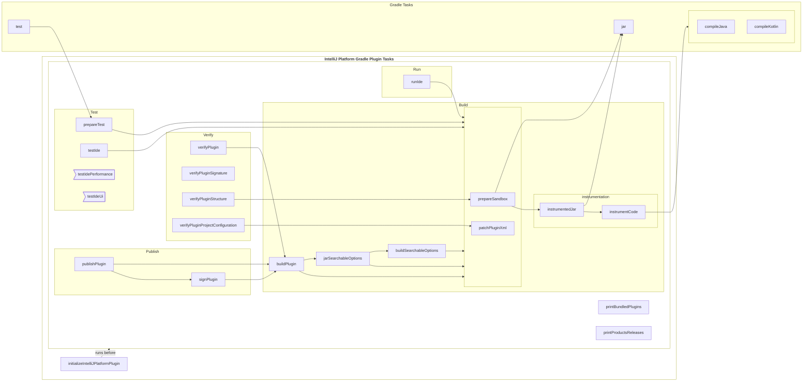

<!-- Copyright 2000-2024 JetBrains s.r.o. and contributors. Use of this source code is governed by the Apache 2.0 license. -->

# Tasks

<link-summary>IntelliJ Platform Gradle Plugin tasks.</link-summary>

<include from="tools_intellij_platform_gradle_plugin.md" element-id="EAP_Status"/>
<include from="tools_intellij_platform_gradle_plugin.md" element-id="faq"/>

The IntelliJ Platform Gradle Plugin introduces a set of tasks to handle activities of the plugin development for IntelliJ-based IDEs, such as building, verifying, testing, and publishing the plugin archive.

Tasks are applied to the project with [](tools_intellij_platform_gradle_plugin_plugins.md) depending on their contect.

Each of the tasks has relations described between each other, inherit from [](tools_intellij_platform_gradle_plugin_task_awares.md) interfaces, respect configuration and build cache, and can be configured independently, but for the most cases, the [](tools_intellij_platform_gradle_plugin_extension.md) covers all necessary cases.



## `buildPlugin`
{#buildPlugin}

<tldr>

**Depends on**: [`jarSearchableOptions`](#jarSearchableOptions), [`prepareSandbox`](#prepareSandbox)

**Extends**: [`Zip`][gradle-zip-task]

**Sources**: [`BuildPluginTask`](%gh-ijpgp%/src/main/kotlin/org/jetbrains/intellij/platform/gradle/tasks/BuildPluginTask.kt)

</tldr>

Builds the plugin and prepares the ZIP archive for testing and deployment.

It takes the output of the [`prepareSandbox`](#prepareSandbox) task containing the built project with all its modules and dependencies, and the output of [`jarSearchableOptions`](#jarSearchableOptions) task.

The produced archive is stored in the <path>[buildDirectory]/distributions/[`archiveFile`](#buildPlugin-archiveFile)</path> file.
The [`archiveFile`](#buildPlugin-archiveFile) name and location can be controlled with properties provided with the [`Zip`](https://docs.gradle.org/current/dsl/org.gradle.api.tasks.bundling.Zip.html) base task.
By default, the `archiveBaseName` is set to the plugin name specified in the <path>plugin.xml</path> file, after it gets patched with the [`patchPluginXml`](#patchPluginXml) task.


### `archiveFile`
{#buildPlugin-archiveFile}

The archive file which represents the output file produced by the task.

{style="narrow"}
Type
: `RegularFileProperty`

Default value
: [`buildPlugin.archiveFile`](#buildPlugin-archiveFile)


## `buildSearchableOptions`
{#buildSearchableOptions}

<tldr>

**Depends on**: [`patchPluginXml`](#patchPluginXml), [`prepareSandbox`](#prepareSandbox)

**Extends**: [`JavaExec`][gradle-javaexec-task], [`RunnableIdeAware`](tools_intellij_platform_gradle_plugin_task_awares.md#RunnableIdeAware)

**Sources**: [`BuildSearchableOptionsTask`](%gh-ijpgp%/src/main/kotlin/org/jetbrains/intellij/platform/gradle/tasks/BuildSearchableOptionsTask.kt)

</tldr>

Builds the index of UI components (searchable options) for the plugin.
This task runs a headless IDE instance to collect all the available options provided by the plugin's [](settings.md).

If the plugin doesn't implement custom settings, it is recommended to disable this task via [`intellijPlatform.buildSearchableOptions`](tools_intellij_platform_gradle_plugin_extension.md#intellijPlatform-buildSearchableOptions) build feature.

In the case of running the task for the plugin using [`intellijPlatform.pluginConfiguration.productDescriptor`](tools_intellij_platform_gradle_plugin_extension.md#intellijPlatform-pluginConfiguration-productDescriptor), a warning will be logged regarding potential issues with running headless IDE for paid plugins.
It is possible to mute this warning with the [`paidPluginSearchableOptionsWarning`](tools_intellij_platform_gradle_plugin_gradle_properties.md#paidPluginSearchableOptionsWarning) build feature.


### `outputDirectory`
{#buildSearchableOptions-outputDirectory}

The directory to which searchable options will be generated.

{style="narrow"}
Type
: `DirectoryProperty`

Default value
: <path>[buildDirectory]/searchableOptions</path>


### `showPaidPluginWarning`
{#buildSearchableOptions-showPaidPluginWarning}

Emit warning if the task is executed by a paid plugin.
Can be disabled with the [`paidPluginSearchableOptionsWarning`](tools_intellij_platform_gradle_plugin_gradle_properties.md#paidPluginSearchableOptionsWarning) build feature.

{style="narrow"}
Type
: `Property<Boolean>`

Default value
: [`paidPluginSearchableOptionsWarning`](tools_intellij_platform_gradle_plugin_gradle_properties.md#paidPluginSearchableOptionsWarning) && `productDescriptor` is defined


## `initializeIntelliJPlatformPlugin`
{#initializeIntelliJPlatformPlugin}

<tldr>

**Extends**: [`DefaultTask`][gradle-default-task], [`IntelliJPlatformVersionAware`](tools_intellij_platform_gradle_plugin_task_awares.md#IntelliJPlatformVersionAware)

**Sources**: [`InitializeIntelliJPlatformPluginTask`](%gh-ijpgp%/src/main/kotlin/org/jetbrains/intellij/platform/gradle/tasks/InitializeIntelliJPlatformPluginTask.kt)

</tldr>

This task is executed before every other task introduced by IntelliJ Platform Gradle Plugin to prepare it to run.

It is responsible for:
- checking if the project uses IntelliJ Platform Gradle Plugin in the latest available version
- preparing the KotlinX Coroutines Java Agent file to enable coroutines debugging when developing the plugin

The self-update check can be disabled via [`selfUpdateCheck`](tools_intellij_platform_gradle_plugin_gradle_properties.md#selfUpdateCheck) build feature.

To make the Coroutines Java Agent available for the task, inherit from [`CoroutinesJavaAgentAware`](tools_intellij_platform_gradle_plugin_task_awares.md#CoroutinesJavaAgentAware).


### `offline`
{#initializeIntelliJPlatformPlugin-offline}

Determines if the operation is running in offline mode.

Depends on Gradle start parameters.

{style="narrow"}
Type
: `Property<Boolean>`

Default value
: `StartParameter.isOffline`

See also:
- [StartParameter](https://docs.gradle.org/current/javadoc/org/gradle/StartParameter.html)
- [Command Line Execution Options](https://docs.gradle.org/current/userguide/command_line_interface.html#sec:command_line_execution_options)


### `selfUpdateCheck`
{#initializeIntelliJPlatformPlugin-selfUpdateCheck}

Represents the property for checking if self-update checks are enabled.

{style="narrow"}
Type
: `Property<Boolean>`

Default value
: [`selfUpdateCheck`](tools_intellij_platform_gradle_plugin_gradle_properties.md#selfUpdateCheck)


### `selfUpdateLock`
{#initializeIntelliJPlatformPlugin-selfUpdateLock}

Represents a lock file used to limit the plugin version checks in time.
If the file is absent, and other conditions are met, the version check is performed.

{style="narrow"}
Type
: `RegularFileProperty`


### `coroutinesJavaAgent`
{#initializeIntelliJPlatformPlugin-coroutinesJavaAgent}

Java Agent file for the Coroutines library, which is required to enable coroutines debugging.

{style="narrow"}
Type
: `Property<Boolean>`

Default value
: <path>[buildDirectory]/tmp/initializeIntelliJPlatformPlugin/coroutines-javaagent.jar</path>


### `pluginVersion`
{#initializeIntelliJPlatformPlugin-pluginVersion}

Represents the current version of the plugin.

{style="narrow"}
Type
: `Property<String>`


## `instrumentCode`
{#instrumentCode}

<tldr>

**Extends**: [`DefaultTask`][gradle-default-task], [`JavaCompilerAware`](tools_intellij_platform_gradle_plugin_task_awares.md#JavaCompilerAware)

**Sources**: [`InstrumentCodeTask`](%gh-ijpgp%/src/main/kotlin/org/jetbrains/intellij/platform/gradle/tasks/InstrumentCodeTask.kt)

</tldr>

Task dedicated to executing the code instrumentation using the Ant tasks provided with the currently used IntelliJ Platform dependency.

The code instrumentation scans the compiled Java and Kotlin classes for JetBrains Annotations usages to replace them with relevant functionalities they're responsible for.

This task is controlled with the [`intellijPlatform.instrumentCode`](tools_intellij_platform_gradle_plugin_extension.md#intellijPlatform-instrumentCode) extension property, enabled by default.
To properly run the instrumentation, it is required to add [`instrumentationTools()`](tools_intellij_platform_gradle_plugin_dependencies_extension.md#code-instrumentation) dependencies to the project.
This dependency is available via the [`intellijDependencies()`](tools_intellij_platform_gradle_plugin_repositories_extension.md#additional-repositories) repository, which can be added separately or using the [`defaultRepositories()`](tools_intellij_platform_gradle_plugin_repositories_extension.md#default-repositories) helper.

See also:
- [](tools_intellij_platform_gradle_plugin.md#code-instrumentation)


### `sourceSetCompileClasspath`
{#instrumentCode-sourceSetCompileClasspath}

Compile classpath of the project's source set.

{style="narrow"}
Type
: `ConfigurableFileCollection`


### `classesDirs`
{#instrumentCode-classesDirs}

The list of directories with compiled classes.

{style="narrow"}
Type
: `ConfigurableFileCollection`

Default value
: `classesDirs` of the project's source sets.


### `formsDirs`
{#instrumentCode-formsDirs}

The list of directories with GUI Designer form files.

{style="narrow"}
Type
: `ConfigurableFileCollection`

Default value:
: `.form` files of the project's source sets.

### `sourceDirs`
{#instrumentCode-sourceDirs}

Location of the source code.

{style="narrow"}
Type
: `ConfigurableFileCollection`


### `instrumentationLogs`
{#instrumentCode-instrumentationLogs}

Enables `INFO` logging when running Ant tasks.

{style="narrow"}
Type
: `Property<Boolean>`

Default value:
: `false`


### `outputDirectory`
{#instrumentCode-outputDirectory}

The output directory for instrumented classes.

{style="narrow"}
Type
: `DirectoryProperty`


## `instrumentedJar`
{#instrumentedJar}

<tldr>

**Depends on**: `jar`, [`instrumentCode`](#instrumentCode)

**Extends**: [`Jar`][gradle-jar-task]

</tldr>

Creates a duplicate of the current module's `jar` file with instrumented classes added.


## `jarSearchableOptions`
{#jarSearchableOptions}

<tldr>

**Depends on**: [`buildSearchableOptions`](#buildSearchableOptions), [`patchPluginXml`](#patchPluginXml), [`prepareSandbox`](#prepareSandbox)

**Extends**: [`Jar`][gradle-jar-task], [`PluginAware`](tools_intellij_platform_gradle_plugin_task_awares.md#PluginAware), [`SandboxAware`](tools_intellij_platform_gradle_plugin_task_awares.md#SandboxAware)

**Sources**: [`JarSearchableOptionsTask`](%gh-ijpgp%/src/main/kotlin/org/jetbrains/intellij/platform/gradle/tasks/JarSearchableOptionsTask.kt)

</tldr>

Creates a JAR file with searchable options to be distributed with the plugin.


### `destinationDirectory`
{#jarSearchableOptions-destinationDirectory}

The directory where the JAR file will be created.

{style="narrow"}
Type
: `DirectoryProperty`

Default value
: <path>[buildDirectory]/libs</path>


### `inputDirectory`
{#jarSearchableOptions-inputDirectory}

The directory from which the prepared searchable options are read.

{style="narrow"}
Type
: `DirectoryProperty`

Default value
: [`buildSearchableOptions.outputDirectory`](#buildSearchableOptions-outputDirectory)


### `noSearchableOptionsWarning`
{#jarSearchableOptions-noSearchableOptionsWarning}

Emit a warning if no searchable options are found.
Can be disabled with [`noSearchableOptionsWarning`](tools_intellij_platform_gradle_plugin_gradle_properties.md#noSearchableOptionsWarning) build feature.

{style="narrow"}
Type
: `Property<Boolean>`

Default value
: [`noSearchableOptionsWarning`](tools_intellij_platform_gradle_plugin_gradle_properties.md#noSearchableOptionsWarning)


## `patchPluginXml`
{#patchPluginXml}

<tldr>

**Extends**: [`DefaultTask`][gradle-default-task], [`IntelliJPlatformVersionAware`](tools_intellij_platform_gradle_plugin_task_awares.md#IntelliJPlatformVersionAware)

**Sources**: [`PatchPluginXmlTask`](%gh-ijpgp%/src/main/kotlin/org/jetbrains/intellij/platform/gradle/tasks/PatchPluginXmlTask.kt)

</tldr>


### `inputFile`
{#patchPluginXml-inputFile}

Represents an input <path>plugin.xml</path> file.

By default, a <path>plugin.xml</path> file is picked from the main resource location.

{style="narrow"}
Type
: `RegularFileProperty`

Default value
: <path>src/main/<kotlin|java>/resources/META-INF/plugin.xml</path>


### `outputFile`
{#patchPluginXml-outputFile}

Represents the output <path>plugin.xml</path> file property for the task.

By default, the file is written to a temporary task-specific directory within the <path>build</path> directory.

{style="narrow"}
Type
: `RegularFileProperty`

Default value
: <path>[buildDirectory]/tmp/patchPluginXml/plugin.xml</path>


### `pluginId`
{#patchPluginXml-pluginId}

A unique identifier of the plugin.

It should be a fully qualified name similar to Java packages and must not collide with the ID of existing plugins.
The ID is a technical value used to identify the plugin in the IDE and [JetBrains Marketplace](https://plugins.jetbrains.com/).

Please use characters, numbers, and `.`/`-`/`_` symbols only and keep it reasonably short.

The provided value will be set as a value of the `<id>` element.

{style="narrow"}
Type
: `Property<String>`

Default value
: [`intellijPlatform.pluginConfiguration.id`](tools_intellij_platform_gradle_plugin_extension.md#intellijPlatform-pluginConfiguration-id)

See also:
- [Plugin Configuration File: `id`](plugin_configuration_file.md#idea-plugin__id)


### `pluginName`
{#patchPluginXml-pluginName}

The user-visible plugin display name (Title Case).

The provided value will be set as a value of the `<name>` element.

{style="narrow"}
Type
: `Property<String>`

Default value
: [`intellijPlatform.pluginConfiguration.name`](tools_intellij_platform_gradle_plugin_extension.md#intellijPlatform-pluginConfiguration-name)

See also:
- [Plugin Configuration File: `name`](plugin_configuration_file.md#idea-plugin__name)


### `pluginVersion`
{#patchPluginXml-pluginVersion}

The plugin version is displayed in the Plugins settings dialog and on the JetBrains Marketplace plugin page.

Plugins uploaded to the JetBrains Marketplace must follow semantic versioning.

The provided value will be set as a value of the `<version>` element.

{style="narrow"}
Type
: `Property<String>`

Default value
: [`intellijPlatform.pluginConfiguration.version`](tools_intellij_platform_gradle_plugin_extension.md#intellijPlatform-pluginConfiguration-version)

See also:
- [Plugin Configuration File: `version`](plugin_configuration_file.md#idea-plugin__version)


### `pluginDescription`
{#patchPluginXml-pluginDescription}

The plugin description is displayed on the JetBrains Marketplace plugin page and in the Plugins settings dialog.
Simple HTML elements, like text formatting, paragraphs, lists, etc., are allowed.

The description content is automatically wrapped with `<![CDATA[... ]]>`.

The provided value will be set as a value of the `<description>` element.

{style="narrow"}
Type
: `Property<String>`

Default value
: [`intellijPlatform.pluginConfiguration.description`](tools_intellij_platform_gradle_plugin_extension.md#intellijPlatform-pluginConfiguration-description)

See also:
- [Plugin Configuration File: `description`](plugin_configuration_file.md#idea-plugin__description)


### `changeNotes`
{#patchPluginXml-changeNotes}

A short summary of new features, bugfixes, and changes provided with the latest plugin version.
Change notes are displayed on the JetBrains Marketplace plugin page and in the Plugins settings dialog.
Simple HTML elements, like text formatting, paragraphs, lists, etc., are allowed.

The change notes content is automatically wrapped with `<![CDATA[... ]]>`.

The provided value will be set as a value of the `<change-notes>` element.

{style="narrow"}
Type
: `Property<String>`

Default value
: [`intellijPlatform.pluginConfiguration.changeNotes`](tools_intellij_platform_gradle_plugin_extension.md#intellijPlatform-pluginConfiguration-changeNotes)

See also:
- [Plugin Configuration File: `change-notes`](plugin_configuration_file.md#idea-plugin__change-notes)


### `productDescriptorCode`
{#patchPluginXml-productDescriptorCode}

The plugin product code used in the JetBrains Sales System.
The code must be agreed with JetBrains in advance and follow [the requirements](https://plugins.jetbrains.com/docs/marketplace/obtain-a-product-code-from-jetbrains.html).

The provided value will be set as a value of the `<product-descriptor code="">` element attribute.

{style="narrow"}
Type
: `Property<String>`

Default value
: [`intellijPlatform.pluginConfiguration.productDescriptor.code`](tools_intellij_platform_gradle_plugin_extension.md#intellijPlatform-pluginConfiguration-productDescriptor-code)

See also:
- [Plugin Configuration File: `product-descriptor`](plugin_configuration_file.md#idea-plugin__product-descriptor)


### `productDescriptorReleaseDate`
{#patchPluginXml-productDescriptorReleaseDate}

Date of the major version release in the `YYYYMMDD` format.

The provided value will be set as a value of the `<product-descriptor release-date="">` element attribute.

{style="narrow"}
Type
: `Property<String>`

Default value
: [`intellijPlatform.pluginConfiguration.productDescriptor.releaseDate`](tools_intellij_platform_gradle_plugin_extension.md#intellijPlatform-pluginConfiguration-productDescriptor-releaseDate)

See also:
- [Plugin Configuration File: `product-descriptor`](plugin_configuration_file.md#idea-plugin__product-descriptor)


### `productDescriptorReleaseVersion`
{#patchPluginXml-productDescriptorReleaseVersion}

A major version in a special number format.

The provided value will be set as a value of the `<product-descriptor release-version="">` element attribute.

{style="narrow"}
Type
: `Property<String>`

Default value
: [`intellijPlatform.pluginConfiguration.productDescriptor.releaseVersion`](tools_intellij_platform_gradle_plugin_extension.md#intellijPlatform-pluginConfiguration-productDescriptor-releaseVersion)

See also:
- [Plugin Configuration File: `product-descriptor`](plugin_configuration_file.md#idea-plugin__product-descriptor)


### `productDescriptorOptional`
{#patchPluginXml-productDescriptorOptional}

The boolean value determining whether the plugin is a [Freemium](https://plugins.jetbrains.com/docs/marketplace/freemium.html) plugin.

The provided value will be set as a value of the `<product-descriptor optional="">` element attribute.

{style="narrow"}
Type
: `Property<Boolean>`

Default value
: [`intellijPlatform.pluginConfiguration.productDescriptor.optional`](tools_intellij_platform_gradle_plugin_extension.md#intellijPlatform-pluginConfiguration-productDescriptor-optional)

Default value
: `false`

See also:
- [Plugin Configuration File: `product-descriptor`](plugin_configuration_file.md#idea-plugin__product-descriptor)


### `sinceBuild`
{#patchPluginXml-sinceBuild}

The lowest IDE version compatible with the plugin.

The provided value will be set as a value of the `<idea-version since-build="..."/>` element attribute.

{style="narrow"}
Type
: `Property<String>`

Default value
: [`intellijPlatform.pluginConfiguration.ideaVersion.sinceBuild`](tools_intellij_platform_gradle_plugin_extension.md#intellijPlatform-pluginConfiguration-ideaVersion-sinceBuild)

See also:
- [Plugin Configuration File: `idea-version`](plugin_configuration_file.md#idea-plugin__idea-version)


### `untilBuild`
{#patchPluginXml-untilBuild}

The highest IDE version compatible with the plugin.
Undefined value declares compatibility with all the IDEs since the version specified by the `since-build` (also with the future builds that may cause incompatibility errors).

The provided value will be set as a value of the `<idea-version until-build="..."/>` element attribute.

The `until-build` attribute can be unset by setting `provider { null }` as a value.
Note that passing only `null` will make Gradle use a default value instead.

{style="narrow"}
Type
: `Property<String>`

Default value
: [`intellijPlatform.pluginConfiguration.ideaVersion.untilBuild`](tools_intellij_platform_gradle_plugin_extension.md#intellijPlatform-pluginConfiguration-ideaVersion-untilBuild)

See also:
- [Plugin Configuration File: `idea-version`](plugin_configuration_file.md#idea-plugin__idea-version)


### `vendorName`
{#patchPluginXml-vendorName}

The vendor name or organization ID (if created) in the Plugins settings dialog and on the JetBrains Marketplace plugin page.

The provided value will be set as a value of the `<vendor>` element.

{style="narrow"}
Type
: `Property<String>`

Default value
: [`intellijPlatform.pluginConfiguration.vendor.name`](tools_intellij_platform_gradle_plugin_extension.md#intellijPlatform-pluginConfiguration-vendor-name)

See also:
- [Plugin Configuration File: `vendor`](plugin_configuration_file.md#idea-plugin__vendor)


### `vendorEmail`
{#patchPluginXml-vendorEmail}

The vendor's email address.

The provided value will be set as a value of the `<vendor email="">` element attribute.

{style="narrow"}
Type
: `Property<String>`

Default value
: [`intellijPlatform.pluginConfiguration.vendor.email`](tools_intellij_platform_gradle_plugin_extension.md#intellijPlatform-pluginConfiguration-vendor-email)

See also:
- [Plugin Configuration File: `vendor`](plugin_configuration_file.md#idea-plugin__vendor)


### `vendorUrl`
{#patchPluginXml-vendorUrl}

The link to the vendor's homepage.

The provided value will be set as a value of the `<vendor url="">` element attribute.

{style="narrow"}
Type
: `Property<String>`

Default value
: [`intellijPlatform.pluginConfiguration.vendor.url`](tools_intellij_platform_gradle_plugin_extension.md#intellijPlatform-pluginConfiguration-vendor-url)

See also:
- [Plugin Configuration File: `vendor`](plugin_configuration_file.md#idea-plugin__vendor)


## `prepareSandbox`
{#prepareSandbox}

<tldr>

**Depends on**: `jar`, [`instrumentedJar`](#instrumentedJar)

**Extends**: [`Sync`][gradle-jar-task], [`SandboxProducerAware`](tools_intellij_platform_gradle_plugin_task_awares.md#SandboxProducerAware)

**Sources**: [`PrepareSandboxTask`](%gh-ijpgp%/src/main/kotlin/org/jetbrains/intellij/platform/gradle/tasks/PrepareSandboxTask.kt)

</tldr>

Prepares a sandbox environment with the installed plugin and its dependencies.

The sandbox directory is required by tasks that run IDE and tests in isolation from other instances, like when multiple IntelliJ Platforms are used for testing with [`runIde`](#runIde), [`testIde`](#testIde), [`testIdeUi`](#testIdeUi), or [`testIdePerformance`](#testIdePerformance) tasks.

To fully use the sandbox capabilities in a task, extend from [`SandboxAware`](tools_intellij_platform_gradle_plugin_task_awares.md#SandboxAware) interface.

See also:
- [Extension: `intellijPlatform.sandboxContainer`](tools_intellij_platform_gradle_plugin_extension.md#intellijPlatform-sandboxContainer)


### `defaultDestinationDirectory`
{#prepareSandbox-defaultDestinationDirectory}

Default sandbox destination directory to where the plugin files will be copied into.

{style="narrow"}
Type
: `DirectoryProperty`

Default value
: [`SandboxAware.sandboxPluginsDirectory`](tools_intellij_platform_gradle_plugin_task_awares.md#SandboxAware-sandboxPluginsDirectory)


### `pluginJar`
{#prepareSandbox-pluginJar}

The output of `Jar` task.
The proper `Jar.archiveFile` is picked depending on if code instrumentation is enabled.

{style="narrow"}
Type
: `RegularFileProperty`

Default value
: `Jar.archiveFile`

See also:
- [Extension: `intellijPlatform.instrumentCode`](tools_intellij_platform_gradle_plugin_extension.md#intellijPlatform-instrumentCode)


### `pluginsClasspath`
{#prepareSandbox-pluginsClasspath}

List of dependencies on external plugins resolved from the `intellijPlatformPluginsExtracted` configuration.

{style="narrow"}
Type
: `ConfigurableFileCollection`

See also:
- [Dependencies Extension](tools_intellij_platform_gradle_plugin_dependencies_extension.md)


### `runtimeClasspath`
{#prepareSandbox-runtimeClasspath}

Dependencies defined with the `runtimeClasspath` configuration.

{style="narrow"}
Type
: `ConfigurableFileCollection`


## `prepareTest`
{#prepareTest}

<tldr>

**Extends**: [`DefaultTask`][gradle-default-task], [`TestableAware`](tools_intellij_platform_gradle_plugin_task_awares.md#TestableAware)

**Sources**: [`PrepareTestTask`](%gh-ijpgp%/src/main/kotlin/org/jetbrains/intellij/platform/gradle/tasks/PrepareTestTask.kt)

</tldr>

This is a task used to prepare an immutable `test` task and provide all necessary dependencies and configuration for a proper testing configuration.


## `printBundledPlugins`
{#printBundledPlugins}

<tldr>

**Extends**: [`DefaultTask`][gradle-default-task], [`IntelliJPlatformVersionAware`](tools_intellij_platform_gradle_plugin_task_awares.md#IntelliJPlatformVersionAware)

**Sources**: [`PrintBundledPluginsTask`](%gh-ijpgp%/src/main/kotlin/org/jetbrains/intellij/platform/gradle/tasks/PrintBundledPluginsTask.kt)

</tldr>

Prints the list of bundled plugins available within the currently targeted IntelliJ Platform.


## `printProductsReleases`
{#printProductsReleases}

<tldr>

**Extends**: [`DefaultTask`][gradle-default-task], [`ProductReleasesValueSource.FilterParameters`](tools_intellij_platform_gradle_plugin_types.md#ProductReleasesValueSource-FilterParameters)

**Sources**: [`PrintProductsReleasesTask`](%gh-ijpgp%/src/main/kotlin/org/jetbrains/intellij/platform/gradle/tasks/PrintProductsReleasesTask.kt)

</tldr>

Prints the list of binary product releases that, by default, match the currently selected IntelliJ Platform along with [`intellijPlatform.pluginConfiguration.ideaVersion.sinceBuild`](tools_intellij_platform_gradle_plugin_extension.md#intellijPlatform-pluginConfiguration-ideaVersion-sinceBuild) and [`intellijPlatform.pluginConfiguration.ideaVersion.untilBuild`](tools_intellij_platform_gradle_plugin_extension.md#intellijPlatform-pluginConfiguration-ideaVersion-untilBuild) properties.

The filer used for retrieving the release list can be customized by using properties provided with [`ProductReleasesValueSource.FilterParameters`](tools_intellij_platform_gradle_plugin_types.md#ProductReleasesValueSource-FilterParameters).

### `productsReleases`
{#printProductsReleases-productsReleases}

Property holds the list of product releases to print.

Can be used to retrieve the result list.

{style="narrow"}
Type
: `ListProperty<String>`

Default value
: The output of `ProductReleasesValueSource` using default configuration

See also:
- [Types: `ProductReleasesValueSource.FilterParameters`](tools_intellij_platform_gradle_plugin_types.md#ProductReleasesValueSource-FilterParameters)


## `publishPlugin`
{#publishPlugin}

<tldr>

**Depends on**: [`buildPlugin`](#buildPlugin), [`signPlugin`](#signPlugin)

**Extends**: [`DefaultTask`][gradle-default-task]

**Sources**: [`PublishPluginTask`](%gh-ijpgp%/src/main/kotlin/org/jetbrains/intellij/platform/gradle/tasks/PublishPluginTask.kt)

</tldr>

The task for publishing plugin to the remote plugins repository, such as [JetBrains Marketplace](https://plugins.jetbrains.com).

See also:
- [Uploading a Plugin to JetBrains Marketplace](publishing_plugin.md#uploading-a-plugin-to-jetbrains-marketplace)
- [Publishing Plugin With Gradle](publishing_plugin.md#publishing-plugin-with-gradle)
- [Plugin upload API](https://plugins.jetbrains.com/docs/marketplace/plugin-upload.html)


### `archiveFile`
{#publishPlugin-archiveFile}

ZIP archive to be published to the remote repository.

By default, it uses the output `archiveFile` of the [`signPlugin`](#signPlugin) task if plugin signing is configured, otherwise the one from [`buildPlugin`](#buildPlugin).

{style="narrow"}
Type
: `RegularFileProperty`

Default value
: [`signPlugin.archiveFile`](#signPlugin-archiveFile) or [`buildPlugin.archiveFile`](#buildPlugin-archiveFile)

See also:
- [Extension: `intellijPlatform.signing`](tools_intellij_platform_gradle_plugin_extension.md#intellijPlatform-signing)


### `host`
{#publishPlugin-host}

URL host of a plugin repository.

{style="narrow"}
Type
: `Property<String>`

Default value
: [`intellijPlatform.publishing.host`](tools_intellij_platform_gradle_plugin_extension.md#intellijPlatform-publishing-host)


### `token`
{#publishPlugin-token}

Authorization token.

{style="narrow"}
Type
: `Property<String>`

Required
: yes

Default value
: [`intellijPlatform.publishing.token`](tools_intellij_platform_gradle_plugin_extension.md#intellijPlatform-publishing-token)


### `channels`
{#publishPlugin-channels}

A list of channel names to upload plugin to.

{style="narrow"}
Type
: `ListProperty<String>`

Default value
: [`intellijPlatform.publishing.channels`](tools_intellij_platform_gradle_plugin_extension.md#intellijPlatform-publishing-channels)


### `hidden`
{#publishPlugin-hidden}

Publish the plugin update and mark it as hidden to prevent public release after approval.

{style="narrow"}
Type
: `Property<String>`

Default value
: [`intellijPlatform.publishing.hidden`](tools_intellij_platform_gradle_plugin_extension.md#intellijPlatform-publishing-hidden)

See also:
- [Hidden release](https://plugins.jetbrains.com/docs/marketplace/hidden-plugin.html)


### `ideServices`
{#publishPlugin-ideServices}

Specifies if the IDE Services plugin repository service should be used.

{style="narrow"}
Type
: `Property<String>`

Default value
: [`intellijPlatform.publishing.ideServices`](tools_intellij_platform_gradle_plugin_extension.md#intellijPlatform-publishing-ideServices)


## `runIde`
{#runIde}

<tldr>

**Depends on**: [`patchPluginXml`](#patchPluginXml), [`prepareSandbox`](#prepareSandbox)

**Extends**: [`JavaExec`][gradle-javaexec-task], [`RunnableIdeAware`](tools_intellij_platform_gradle_plugin_task_awares.md#RunnableIdeAware), [`CustomIntelliJPlatformVersionAware`](tools_intellij_platform_gradle_plugin_task_awares.md#CustomIntelliJPlatformVersionAware)

**Sources**: [`RunIdeTask`](%gh-ijpgp%/src/main/kotlin/org/jetbrains/intellij/platform/gradle/tasks/RunIdeTask.kt)

</tldr>

Runs the IDE instance using the currently selected IntelliJ Platform with the built plugin loaded.
It directly extends the [`JavaExec`][gradle-javaexec-task] Gradle task, which allows for an extensive configuration (system properties, memory management, etc.).

This task class also inherits from [`CustomIntelliJPlatformVersionAware`](tools_intellij_platform_gradle_plugin_task_awares.md#CustomIntelliJPlatformVersionAware), which makes it possible to create `runIde`-like tasks using custom IntelliJ Platform versions:

```kotlin
import org.jetbrains.intellij.platform.gradle.IntelliJPlatformType
import org.jetbrains.intellij.platform.gradle.tasks.RunIdeTask

tasks {
  val runPhpStorm by registering(RunIdeTask::class) {
    type = IntelliJPlatformType.PhpStorm
    version = "2023.2.2"
  }

  val runLocalIde by registering(RunIdeTask::class) {
    localPath = file("/Users/user/Applications/Android Studio.app")
  }
}
```

## `signPlugin`
{#signPlugin}

<tldr>

**Depends on**: [`buildPlugin`](#buildPlugin)

**Extends**: [`JavaExec`][gradle-javaexec-task], [`SigningAware`](tools_intellij_platform_gradle_plugin_task_awares.md#SigningAware)

**Sources**: [`SignPluginTask`](%gh-ijpgp%/src/main/kotlin/org/jetbrains/intellij/platform/gradle/tasks/SignPluginTask.kt)

</tldr>

Signs the ZIP archive with the provided key using the [Marketplace ZIP Signer](https://github.com/JetBrains/marketplace-zip-signer) library.

To sign the plugin before publishing to [JetBrains Marketplace](https://plugins.jetbrains.com) with the [`signPlugin`](#signPlugin) task, it is required to provide a certificate chain and a private key with its password using [`intellijPlatform.signing`](tools_intellij_platform_gradle_plugin_extension.md#intellijPlatform-signing) extension.

As soon as [`privateKey`](#signPlugin-privateKey) (or [`privateKeyFile`](#signPlugin-privateKeyFile)) and [`certificateChain`](#signPlugin-certificateChain) (or [`certificateChainFile`](#signPlugin-certificateChainFile) properties are specified, the task will be executed automatically right before the [`publishPlugin`](#publishPlugin) task.

For more details, see [](plugin_signing.md).


### `archiveFile`
{#signPlugin-archiveFile}

Input, unsigned ZIP archive file.
Refers to `in` CLI option.

By default, it uses the output archive of the [`buildPlugin`](#buildPlugin) task.

{style="narrow"}
Type
: `RegularFileProperty`

Default value
: [`buildPlugin.archiveFile`](#buildPlugin-archiveFile)


### `signedArchiveFile`
{#signPlugin-signedArchiveFile}

Output, signed ZIP archive file.
Refers to `out` CLI option.

Predefined with the name of the ZIP archive file with `-signed` name suffix attached.
The output file is placed next to the input [`archiveFile`](#signPlugin-archiveFile).

{style="narrow"}
Type
: `RegularFileProperty`

Default value
: [`signPlugin.archiveFile`](#signPlugin-archiveFile) with `-signed` suffix applied to the name


### `keyStore`
{#signPlugin-keyStore}

KeyStore file path.
Refers to `ks` CLI option.

{style="narrow"}
Type
: `Property<String>`

Default value
: [`intellijPlatform.signing.keyStore`](tools_intellij_platform_gradle_plugin_extension.md#intellijPlatform-signing-keyStore)


### `keyStorePassword`
{#signPlugin-keyStorePassword}

KeyStore password.
Refers to `ks-pass` CLI option.

{style="narrow"}
Type
: `Property<String>`

Default value
: [`intellijPlatform.signing.keyStorePassword`](tools_intellij_platform_gradle_plugin_extension.md#intellijPlatform-signing-keyStorePassword)


### `keyStoreKeyAlias`
{#signPlugin-keyStoreKeyAlias}

KeyStore key alias.
Refers to `ks-key-alias` CLI option.

{style="narrow"}
Type
: `Property<String>`

Default value
: [`intellijPlatform.signing.keyStoreKeyAlias`](tools_intellij_platform_gradle_plugin_extension.md#intellijPlatform-signing-keyStoreKeyAlias)


### `keyStoreType`
{#signPlugin-keyStoreType}

KeyStore type.
Refers to `ks-type` CLI option.

{style="narrow"}
Type
: `Property<String>`

Default value
: [`intellijPlatform.signing.keyStoreType`](tools_intellij_platform_gradle_plugin_extension.md#intellijPlatform-signing-keyStoreType)


### `keyStoreProviderName`
{#signPlugin-keyStoreProviderName}

JCA KeyStore Provider name.
Refers to `ks-provider-name` CLI option.

{style="narrow"}
Type
: `Property<String>`

Default value
: [`intellijPlatform.signing.keyStoreProviderName`](tools_intellij_platform_gradle_plugin_extension.md#intellijPlatform-signing-keyStoreProviderName)


### `privateKey`
{#signPlugin-privateKey}

Encoded private key in the PEM format.
Refers to `key` CLI option.

{style="narrow"}
Type
: `Property<String>`

Default value
: [`intellijPlatform.signing.privateKey`](tools_intellij_platform_gradle_plugin_extension.md#intellijPlatform-signing-privateKey)


### `privateKeyFile`
{#signPlugin-privateKeyFile}

A file with an encoded private key in the PEM format.
Refers to `key-file` CLI option.

{style="narrow"}
Type
: `RegularFileProperty`

Default value
: [`intellijPlatform.signing.privateKeyFile`](tools_intellij_platform_gradle_plugin_extension.md#intellijPlatform-signing-privateKeyFile)


### `password`
{#signPlugin-password}

Password required to decrypt the private key.
Refers to `key-pass` CLI option.

{style="narrow"}
Type
: `Property<String>`

Default value
: [`intellijPlatform.signing.password`](tools_intellij_platform_gradle_plugin_extension.md#intellijPlatform-signing-password)


### `certificateChain`
{#signPlugin-certificateChain}

A string containing X509 certificates.
The first certificate from the chain will be used as a certificate authority (CA).
Refers to `cert` CLI option.

{style="narrow"}
Type
: `Property<String>`

Default value
: [`intellijPlatform.signing.certificateChain`](tools_intellij_platform_gradle_plugin_extension.md#intellijPlatform-signing-certificateChain)


### `certificateChainFile`
{#signPlugin-certificateChainFile}

Path to the file containing X509 certificates.
The first certificate from the chain will be used as a certificate authority (CA).
Refers to `cert-file` CLI option.

{style="narrow"}
Type
: `RegularFileProperty`

Default value
: [`intellijPlatform.signing.certificateChainFile`](tools_intellij_platform_gradle_plugin_extension.md#intellijPlatform-signing-certificateChainFile)


## `testIde`
{#testIde}

<tldr>

**Extends**: [`Test`][gradle-test-task], [`TestableAware`](tools_intellij_platform_gradle_plugin_task_awares.md#TestableAware), [`CustomIntelliJPlatformVersionAware`](tools_intellij_platform_gradle_plugin_task_awares.md#CustomIntelliJPlatformVersionAware)

**Sources**: [`TestIdeTask`](%gh-ijpgp%/src/main/kotlin/org/jetbrains/intellij/platform/gradle/tasks/TestIdeTask.kt)

</tldr>

> This task is not registered with the `testIde` name, but its configuration extends the default `test` task.

Runs plugin tests against the currently selected IntelliJ Platform with the built plugin loaded.
It directly extends the [`Test`][gradle-test-task] Gradle task, which allows for an extensive configuration (system properties, memory management, etc.).

This task class also inherits from [`CustomIntelliJPlatformVersionAware`](tools_intellij_platform_gradle_plugin_task_awares.md#CustomIntelliJPlatformVersionAware), which makes it possible to create `testIde`-like tasks using custom IntelliJ Platform versions:

```kotlin
import org.jetbrains.intellij.platform.gradle.IntelliJPlatformType
import org.jetbrains.intellij.platform.gradle.tasks.TestIdeTask

tasks {
  val testPhpStorm by registering(TestIdeTask::class) {
    type = IntelliJPlatformType.PhpStorm
    version = "2023.2.2"
  }

  val testLocalIde by registering(TestIdeTask::class) {
    localPath = file("/Users/user/Applications/Android Studio.app")
  }
}
```


## `testIdePerformance`
{#testIdePerformance}

> Not implemented.
>
{style="warning"}


## `testIdeUi`
{#testIdeUi}

> Not implemented.
>
{style="warning"}


## `verifyPluginProjectConfiguration`
{#verifyPluginProjectConfiguration}

<tldr>

**Depends on**: [`patchPluginXml`](#patchPluginXml)

**Extends**: [`DefaultTask`][gradle-default-task], [`IntelliJPlatformVersionAware`](tools_intellij_platform_gradle_plugin_task_awares.md#IntelliJPlatformVersionAware), [`PluginAware`](tools_intellij_platform_gradle_plugin_task_awares.md#PluginAware)

**Sources**: [`VerifyPluginProjectConfigurationTask`](%gh-ijpgp%/src/main/kotlin/org/jetbrains/intellij/platform/gradle/tasks/VerifyPluginProjectConfigurationTask.kt)

</tldr>

Validates the plugin project configuration:
- The [`patchPluginXml.sinceBuild`](#patchPluginXml-sinceBuild) property can't be lower than the target IntelliJ Platform major version.
- The Java/Kotlin `sourceCompatibility` and `targetCompatibility` properties should align Java versions required by [`patchPluginXml.sinceBuild`](#patchPluginXml-sinceBuild) and the currently used IntelliJ Platform.
- The Kotlin API version should align the version required by [`patchPluginXml.sinceBuild`](#patchPluginXml-sinceBuild) and the currently used IntelliJ Platform.
- The used IntelliJ Platform version should be higher than `2022.3` (`223.0`).
- The dependency on the [](using_kotlin.md#kotlin-standard-library) should be excluded.
- The Kotlin plugin in version `1.8.20` is not used with IntelliJ Platform Gradle Plugin due to the 'java.lang.OutOfMemoryError: Java heap space' exception.
- The Kotlin Coroutines library should not be added explicitly to the project as it is already provided with the IntelliJ Platform.
- The IntelliJ Platform cache directory should be excluded from the version control system. Add the `.intellijPlatform`'` entry to the <path>.gitignore</path> file.

For more details regarding the Java version used in the specific IntelliJ SDK, see [](build_number_ranges.md).

See also:
- [](build_number_ranges.md)
- [](using_kotlin.md#kotlin-standard-library)
- [](using_kotlin.md#incremental-compilation)


### `reportDirectory`
{#verifyPluginProjectConfiguration-reportDirectory}

Report directory where the verification result will be stored.

{style="narrow"}
Type
: `DirectoryProperty`

Default value
: <path>[buildDirectory]/reports/verifyPluginConfiguration</path>


### `rootProject`
{#verifyPluginProjectConfiguration-rootProject}

Root project path.

{style="narrow"}
Type
: `Property<File>`

Default value
: <path>[rootProject]</path>


### `intellijPlatformCache`
{#verifyPluginProjectConfiguration-intellijPlatformCache}

IntelliJ Platform cache directory.

{style="narrow"}
Type
: `Property<File>`

Default value
: [`intellijPlatform.cachePath`](tools_intellij_platform_gradle_plugin_extension.md#intellijPlatform-cachePath)


### `gitignoreFile`
{#verifyPluginProjectConfiguration-gitignoreFile}

The `.gitignore` file located in the <path>[rootDirectory]</path>, tracked for content change.

{style="narrow"}
Type
: `Property<File>`

Default value
: <path>[rootProject]/.gitignore</path>


### `sourceCompatibility`
{#verifyPluginProjectConfiguration-sourceCompatibility}

The `JavaCompile.sourceCompatibility` property value defined in the build script.

{style="narrow"}
Type
: `Property<String>`

Default value
: `JavaCompile.sourceCompatibility`


### `targetCompatibility`
{#verifyPluginProjectConfiguration-targetCompatibility}

The `JavaCompile.targetCompatibility` property value defined in the build script.

{style="narrow"}
Type
: `Property<String>`

Default value
: `JavaCompile.targetCompatibility`


### `kotlinPluginAvailable`
{#verifyPluginProjectConfiguration-kotlinPluginAvailable}

Indicates that the Kotlin Gradle Plugin is loaded and available.

{style="narrow"}
Type
: `Property<Boolean>`

Default value
: Kotlin Gradle Plugin presence


### `kotlinApiVersion`
{#verifyPluginProjectConfiguration-kotlinApiVersion}

The `apiVersion` property value of `compileKotlin.kotlinOptions` defined in the build script.

{style="narrow"}
Type
: `Property<String?>`

Default value
: `compileKotlin.kotlinOptions.apiVersion`


### `kotlinLanguageVersion`
{#verifyPluginProjectConfiguration-kotlinLanguageVersion}

The `languageVersion` property value of `compileKotlin.kotlinOptions` defined in the build script.

{style="narrow"}
Type
: `Property<String?>`

Default value
: `compileKotlin.kotlinOptions.languageVersion`


### `kotlinVersion`
{#verifyPluginProjectConfiguration-kotlinVersion}

The version of the Kotlin used in the project.

{style="narrow"}
Type
: `Property<String?>`

Default value
: `kotlin.coreLibrariesVersion`


### `kotlinJvmTarget`
{#verifyPluginProjectConfiguration-kotlinJvmTarget}

The `jvmTarget` property value of `compileKotlin.kotlinOptions` defined in the build script.

{style="narrow"}
Type
: `Property<String?>`

Default value
: `compileKotlin.kotlinOptions.jvmTarget`


### `kotlinStdlibDefaultDependency`
{#verifyPluginProjectConfiguration-kotlinStdlibDefaultDependency}

`kotlin.stdlib.default.dependency` property value defined in the `gradle.properties` file.

{style="narrow"}
Type
: `Property<Boolean>`

Default value
: `kotlin.stdlib.default.dependency` Gradle property


### `kotlinxCoroutinesLibraryPresent`
{#verifyPluginProjectConfiguration-kotlinxCoroutinesLibraryPresent}

This variable represents whether the Kotlin Coroutines library is added explicitly to the project dependencies.

{style="narrow"}
Type
: `Property<Boolean>`

Default value
: The `org.jetbrains.kotlinx:kotlinx-coroutines` dependency presence


## `verifyPluginSignature`
{#verifyPluginSignature}

<tldr>

**Extends**: [`JavaExec`][gradle-javaexec-task], [`SigningAware`](tools_intellij_platform_gradle_plugin_task_awares.md#SigningAware)

**Sources**: [`PrepareSandboxTask`](%gh-ijpgp%/src/main/kotlin/org/jetbrains/intellij/platform/gradle/tasks/VerifyPluginSignatureTask.kt)

</tldr>

Validates the signature of the plugin archive file using the [Marketplace ZIP Signer](https://github.com/JetBrains/marketplace-zip-signer) library.

See also:
- [](plugin_signing.md)
- [Marketplace ZIP Signer](https://github.com/JetBrains/marketplace-zip-signer)


### `inputArchiveFile`
{#verifyPluginSignature-inputArchiveFile}

Input, unsigned ZIP archive file.
Refers to `in` CLI option.

{style="narrow"}
Type
: `RegularFileProperty`

Default value
: [`signPlugin.signedArchiveFile`](#signPlugin-signedArchiveFile)


### `certificateChain`
{#verifyPluginSignature-certificateChain}

A string containing X509 certificates.
The first certificate from the chain will be used as a certificate authority (CA).
Refers to `cert` CLI option.

Takes precedence over the [`certificateChainFile`](#verifyPluginSignature-certificateChainFile) property.

{style="narrow"}
Type
: `Property<String>`


### `certificateChainFile`
{#verifyPluginSignature-certificateChainFile}

Path to the file containing X509 certificates.
The first certificate from the chain will be used as a certificate authority (CA).
Refers to `cert-file` CLI option.

{style="narrow"}
Type
: `RegularFileProperty`

Default value
: [`signPlugin.certificateChainFile`](#signPlugin-certificateChainFile) or [`signPlugin.certificateChain`](#signPlugin-certificateChain) written to a temporary file


## `verifyPluginStructure`
{#verifyPluginStructure}

<tldr>

**Depends on**: [`prepareSandbox`](#prepareSandbox)

**Extends**: [`DefaultTask`][gradle-default-task], [`SandboxAware`](tools_intellij_platform_gradle_plugin_task_awares.md#SandboxAware)

**Sources**: [`VerifyPluginStructureTask`](%gh-ijpgp%/src/main/kotlin/org/jetbrains/intellij/platform/gradle/tasks/VerifyPluginStructureTask.kt)

</tldr>

Validates completeness and contents of `plugin.xml` descriptors as well as plugin archive structure.

See also:
- [](plugin_configuration_file.md)


### `ignoreFailures`
{#verifyPluginStructure-ignoreFailures}

Specifies whether the build should fail when the verifications performed by this task fail.

{style="narrow"}
Type
: `Property<Boolean>`

Default value
: `false`


### `ignoreUnacceptableWarnings`
{#verifyPluginStructure-ignoreUnacceptableWarnings}

Specifies whether the build should fail when the verifications performed by this task emit unacceptable warnings.

{style="narrow"}
Type
: `Property<Boolean>`

Default value
: `false`


### `ignoreWarnings`
{#verifyPluginStructure-ignoreWarnings}

Specifies whether the build should fail when the verifications performed by this task emit warnings.

{style="narrow"}
Type
: `Property<Boolean>`

Default value
: `true`


### `pluginDirectory`
{#verifyPluginStructure-pluginDirectory}

The location of the built plugin file which will be used for verification.

{style="narrow"}
Type
: `DirectoryProperty`

Default value
: <path>[`prepareSandbox.defaultDestinationDirectory`](#prepareSandbox-defaultDestinationDirectory)/[`intellijPlatform.pluginConfiguration.name`](tools_intellij_platform_gradle_plugin_extension.md#intellijPlatform-pluginConfiguration-name)</path>


## `verifyPlugin`
{#verifyPlugin}

<tldr>

**Depends on**: [`buildPlugin`](#buildPlugin)

**Extends**: [`JavaExec`][gradle-javaexec-task], [`RuntimeAware`](tools_intellij_platform_gradle_plugin_task_awares.md#RuntimeAware), [`PluginVerifierAware`](tools_intellij_platform_gradle_plugin_task_awares.md#PluginVerifierAware)

**Sources**: [`VerifyPluginTask`](%gh-ijpgp%/src/main/kotlin/org/jetbrains/intellij/platform/gradle/tasks/VerifyPluginTask.kt)

</tldr>

Runs the IntelliJ Plugin Verifier CLI tool to check the binary compatibility with specified IDE builds.

See also:
- [Extension: `intellijPlatform.verifyPlugin`](tools_intellij_platform_gradle_plugin_extension.md#intellijPlatform-verifyPlugin)
- [Types: `FailureLevel`](tools_intellij_platform_gradle_plugin_types.md#FailureLevel)
- [Types: `Subsystems`](tools_intellij_platform_gradle_plugin_types.md#Subsystems)
- [Types: `VerificationReportsFormats`](tools_intellij_platform_gradle_plugin_types.md#VerificationReportsFormats)
- [Verifying Plugin Compatibility](verifying_plugin_compatibility.md)
- [IntelliJ Plugin Verifier](https://github.com/JetBrains/intellij-plugin-verifier)


### `ides`
{#verifyPlugin-ides}

Holds a reference to IntelliJ Platform IDEs which will be used by the IntelliJ Plugin Verifier CLI tool for the binary plugin verification.

The list of IDEs is controlled with the [`intellijPlatform.verifyPlugin.ides`](tools_intellij_platform_gradle_plugin_extension.md#intellijPlatform-verifyPlugin-ides) extension.

{style="narrow"}
Type
: `ConfigurableFileCollection`


### `archiveFile`
{#verifyPlugin-archiveFile}

Input ZIP archive file of the plugin to verify.
If empty, the task will be skipped.

{style="narrow"}
Type
: `RegularFileProperty`

Default value
: [`buildPlugin.archiveFile`](#buildPlugin-archiveFile)


### `externalPrefixes`
{#verifyPlugin-externalPrefixes}

The list of class prefixes from the external libraries.
The Plugin Verifier will not report `No such class` for classes of these packages.

{style="narrow"}
Type
: `ListProperty<String>`

Default value
: [`intellijPlatform.verifyPlugin.externalPrefixes`](tools_intellij_platform_gradle_plugin_extension.md#intellijPlatform-verifyPlugin-externalPrefixes)


### `failureLevel`
{#verifyPlugin-failureLevel}

Defines the verification level at which the task should fail if any reported issue matches.

{style="narrow"}
Type
: [`ListProperty<FailureLevel>`](tools_intellij_platform_gradle_plugin_types.md#FailureLevel)

Default value
: [`intellijPlatform.verifyPlugin.failureLevel`](tools_intellij_platform_gradle_plugin_extension.md#intellijPlatform-verifyPlugin-failureLevel)


### `freeArgs`
{#verifyPlugin-freeArgs}

The list of free arguments is passed directly to the IntelliJ Plugin Verifier CLI tool.

They can be used in addition to the arguments that are provided by dedicated options.

{style="narrow"}
Type
: `ListProperty<String>`

Default value
: [`intellijPlatform.verifyPlugin.freeArgs`](tools_intellij_platform_gradle_plugin_extension.md#intellijPlatform-verifyPlugin-freeArgs)


### `ignoredProblemsFile`
{#verifyPlugin-ignoredProblemsFile}

A file that contains a list of problems that will be ignored in a report.

{style="narrow"}
Type
: `RegularFileProperty`

Default value
: [`intellijPlatform.verifyPlugin.ignoredProblemsFile`](tools_intellij_platform_gradle_plugin_extension.md#intellijPlatform-verifyPlugin-ignoredProblemsFile)


### `offline`
{#verifyPlugin-offline}

Determines if the operation is running in offline mode.

Depends on Gradle start parameters

{style="narrow"}
Type
: `Property<Boolean>`

Default value
: `StartParameter.isOffline`

See also:
- [StartParameter](https://docs.gradle.org/current/javadoc/org/gradle/StartParameter.html)
- [Command Line Execution Options](https://docs.gradle.org/current/userguide/command_line_interface.html#sec:command_line_execution_options)


### `subsystemsToCheck`
{#verifyPlugin-subsystemsToCheck}

Specifies which subsystems of IDE should be checked.

{style="narrow"}
Type
: [`Subsystems`](tools_intellij_platform_gradle_plugin_types.md#Subsystems)

Default value
: [`intellijPlatform.verifyPlugin.subsystemsToCheck`](tools_intellij_platform_gradle_plugin_extension.md#intellijPlatform-verifyPlugin-subsystemsToCheck)


### `teamCityOutputFormat`
{#verifyPlugin-teamCityOutputFormat}

A flag that controls the output format.
If set to `true`, the TeamCity compatible output will be returned to stdout.

{style="narrow"}
Type
: `Property<Boolean>`

Default value
: [`intellijPlatform.verifyPlugin.teamCityOutputFormat`](tools_intellij_platform_gradle_plugin_extension.md#intellijPlatform-verifyPlugin-teamCityOutputFormat)


### `verificationReportsDirectory`
{#verifyPlugin-verificationReportsDirectory}

The path to the directory where verification reports will be saved.

{style="narrow"}
Type
: `DirectoryProperty`

Default value
: [`intellijPlatform.verifyPlugin.verificationReportsDirectory`](tools_intellij_platform_gradle_plugin_extension.md#intellijPlatform-verifyPlugin-verificationReportsDirectory)


### `verificationReportsFormats`
{#verifyPlugin-verificationReportsFormats}

The output formats of the verification reports.

{style="narrow"}
Type
: [`ListProperty<VerificationReportsFormats>`](tools_intellij_platform_gradle_plugin_types.md#VerificationReportsFormats)

Default value
: [`intellijPlatform.verifyPlugin.verificationReportsFormats`](tools_intellij_platform_gradle_plugin_extension.md#intellijPlatform-verifyPlugin-verificationReportsFormats)


<include from="snippets.md" element-id="missingContent"/>

[gradle-default-task]: https://docs.gradle.org/current/dsl/org.gradle.api.DefaultTask.html
[gradle-jar-task]: https://docs.gradle.org/current/dsl/org.gradle.jvm.tasks.Jar.html
[gradle-javaexec-task]: https://docs.gradle.org/current/dsl/org.gradle.api.tasks.JavaExec.html
[gradle-sync-task]: https://docs.gradle.org/current/dsl/org.gradle.api.tasks.Sync.html
[gradle-test-task]: https://docs.gradle.org/current/dsl/org.gradle.api.tasks.testing.Test.html
[gradle-zip-task]: https://docs.gradle.org/current/dsl/org.gradle.api.tasks.bundling.Zip.html
