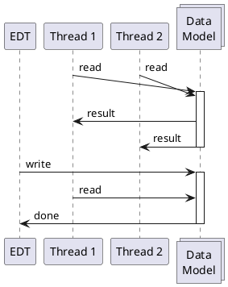

<!-- Copyright 2000-2024 JetBrains s.r.o. and contributors. Use of this source code is governed by the Apache 2.0 license. -->

# Threading Model

<!-- short link: https://jb.gg/ij-platform-threading -->

<link-summary>Threading rules for reading and writing to IntelliJ Platform data models, running and canceling background processes, and avoiding UI freezes.</link-summary>

> It is highly recommended that readers unfamiliar with Java threads go through the official [Java Concurrency](https://docs.oracle.com/javase/tutorial/essential/concurrency/index.html) tutorial before reading this section.

The IntelliJ Platform is a highly concurrent environment.
Code is executed in many threads simultaneously.
In general, as in a regular [Swing](https://docs.oracle.com/javase%2Ftutorial%2Fuiswing%2F%2F/index.html) application, threads can be categorized into two groups:
- [Event Dispatch Thread](https://docs.oracle.com/javase/tutorial/uiswing/concurrency/dispatch.html) (EDT) – also known as the UI thread.
  Its main purpose is handling UI events (such as reacting to clicking a button or updating the UI).
  EDT executes events taken from the Event Queue.
  Operations performed on EDT must be as fast as possible to not block other events and freeze the UI.
  There is only one EDT in the running application.
- background threads (BGT) – used for performing long-running and costly operations, or background tasks

[//]: # (TODO: Add diagram showing BGT, EDT and event queue)

## Readers-Writer Lock

The IntelliJ Platform data structures (such as [Program Structure Interface](psi.md), [Virtual File System](virtual_file_system.md), or [Project root model](project_structure.md)) aren't thread-safe.
Accessing them requires a synchronization mechanism ensuring that all threads see the data in a consistent and up-to-date state.
This is implemented with a single application-wide [readers-writer (RW) lock](https://w.wiki/7dBy) that must be acquired by threads requiring reading or writing to data models.

If a thread requires accessing a data model, it must acquire one of the locks:

<table>
    <tr>
        <td width="33%">Read Lock</td>
        <td width="33%">Write Intent Lock</td>
        <td width="33%">Write Lock</td>
    </tr>
    <tr>
        <td>Allows a thread for reading data.</td>
        <td>Allows a thread for reading data and potentially upgrade to the write lock.</td>
        <td>Allows a thread for reading and writing data.</td>
    </tr>
    <tr>
        <td>Can be acquired from any thread concurrently with other read locks and write intent lock.</td>
        <td>Can be acquired from any thread concurrently with read locks.</td>
        <td>Can only be acquired from under the write intent lock.</td>
    </tr>
    <tr>
        <td>Can't be acquired if write lock is held on another thread.</td>
        <td>Can't be acquired if another write intent lock or write lock is held on another thread.</td>
        <td>Can't be acquired if read lock is held on another thread.</td>
    </tr>
</table>

The following table shows compatibility between locks in a simplified form:

<table style="both">
    <tr>
        <td width="25%"></td>
        <td width="25%">Read</td>
        <td width="25%">Write Intent</td>
        <td width="25%">Write</td>
    </tr>
    <tr>
        <td>Read</td>
        <td></td>
        <td></td>
        <td></td>
    </tr>
    <tr>
        <td>Write Intent</td>
        <td></td>
        <td></td>
        <td></td>
    </tr>
    <tr>
        <td>Write</td>
        <td></td>
        <td></td>
        <td></td>
    </tr>
</table>

The described lock characteristics conclude the following:
- multiple threads can read data at the same time
- once a thread acquires the write lock, no other threads can read or write data

Acquiring and releasing locks explicitly in code would be verbose and error-prone and must never be done by plugins.
The IntelliJ Platform [enables write intent lock implicitly on EDT](#locks-and-edt) and provides an [API for accessing data under read or write locks](#accessing-data).

[//]: # (TODO: diagram[s] showing how the locks are acquired?)

### Locks and EDT

Although acquiring all types of locks can be, in theory, done from any threads, currently, the platform implicitly acquires write intent lock on EDT only.
As the write lock can be acquired only from under write intent lock, it means that **writing data can be done only on EDT**.

> It is known that writing data only on EDT has negative consequences of potentially freezing the UI.
> There is an in-progress effort to [allow writing data from any thread](https://youtrack.jetbrains.com/issue/IJPL-53).

[//]: # (TODO: what is the historical reason for that?)

The scope of implicitly acquiring the write intent lock on EDT differs depending on the platform version:

<tabs group="threading">

<tab title="2023.3+" group-key="newThreading">

Write intent lock is acquired automatically when operation is invoked on EDT with [`Application.invokeLater()`](%gh-ic%/platform/core-api/src/com/intellij/openapi/application/Application.java).

</tab>

<tab title="Earlier versions" group-key="oldThreading">

Write intent lock is acquired automatically when operation is invoked on EDT with methods such as:
- [`Application.invokeLater()`](%gh-ic%/platform/core-api/src/com/intellij/openapi/application/Application.java),
- [`SwingUtilities.invokeLater()`](https://docs.oracle.com/javase/8/docs/api/javax/swing/SwingUtilities.html#invokeLater-java.lang.Runnable-),
- [`UIUtil.invokeAndWaitIfNeeded()`](%gh-ic%/platform/util/ui/src/com/intellij/util/ui/UIUtil.java),
- [`EdtInvocationManager.invokeLaterIfNeeded()`](%gh-ic%/platform/util/src/com/intellij/util/ui/EdtInvocationManager.java),
- and other similar methods

It is recommended to use `Application.invokeLater()` if the operation is supposed to write data.
Use other methods for pure UI operations.

[//]: # (TODO: only these methods or anything executed on EDT? ask Lev to verify)

</tab>

</tabs>

## Accessing Data

The IntelliJ Platform provides a simple API for accessing data under read or write locks in a form of read and write actions.

Read and writes actions allow executing a piece of code under a lock, automatically acquiring it before an action starts, and releasing it after the action is finished.

> Always wrap only the required operations into read/write actions, minimizing the time of holding locks.
> If the read operation itself is long, consider using one of [read action cancellability techniques](#read-action-cancellability) to avoid blocking the write lock and EDT.
>
{style="warning"}

### Read Actions

#### API
{#read-actions-api}

- [`Application.runReadAction()`](%gh-ic%/platform/core-api/src/com/intellij/openapi/application/Application.java):
  <tabs group="languages">
  <tab title="Kotlin" group-key="kotlin">

  ```kotlin
  val psiFile = ApplicationManager.application.runReadAction {
    // read and return PsiFile
  }
  ```
  </tab>
  <tab title="Java" group-key="java">

  ```java
  PsiFile psiFile = ApplicationManager.getApplication()
      .runReadAction((Computable<PsiFile>)() -> {
        // read and return PsiFile
      });
  ```
  </tab>
  </tabs>

- [`ReadAction`](%gh-ic%/platform/core-api/src/com/intellij/openapi/application/ReadAction.java) `run()` or `compute()`:
  <tabs group="languages">
  <tab title="Kotlin" group-key="kotlin">

  ```kotlin
  val psiFile = ReadAction.compute<PsiFile, Throwable> {
    // read and return PsiFile
  }
  ```
  </tab>
  <tab title="Java" group-key="java">

  ```java
  PsiFile psiFile = ReadAction.compute(() -> {
    // read and return PsiFile
  });
  ```
  </tab>
  </tabs>

- Kotlin [`runReadAction()`](%gh-ic%/platform/core-api/src/com/intellij/openapi/application/actions.kt):
  ```kotlin
  val psiFile = runReadAction {
    // read and return PsiFile
  }
  ```
  Note that this API is obsolete since 2024.1.
  Plugins implemented in Kotlin and targeting versions 2024.1+ should use [`readAction()`](%gh-ic%/platform/core-api/src/com/intellij/openapi/application/coroutines.kt).
  See also [](coroutine_read_actions.md).

#### Rules
{#read-actions-rules}

<tabs group="threading">

<tab title="2023.3+" group-key="newThreading">

Reading data is allowed from any thread.

Reading data on EDT invoked with `Application.invokeLater()` doesn't require an explicit read action, as the write intent lock allowing to read data is [acquired implicitly](#locks-and-edt).

</tab>

<tab title="Earlier versions" group-key="oldThreading">

Reading data is allowed from any thread.

Reading data on EDT doesn't require an explicit read action, as the write intent lock allowing to read data is [acquired implicitly](#locks-and-edt).

</tab>

</tabs>

In all other cases, it is required to wrap read operation in a read action with one of the [API](#read-actions-api) methods.

The read objects aren't guaranteed to survive between several consecutive read actions.
Whenever starting a read action, check if the PSI/VFS/project/module is still valid.
Example:
```java
PsiFile psiFile = ReadAction.compute(() -> {
  if (project.isDisposed()) { // check if the project is not disposed
    return null;
  }
  return virtualFile.isValid() ? // check if the file is valid
      PsiManager.getInstance(project).findFile(virtualFile) : null;
});
```

[//]: # (TODO: diagram showing how data can be invalidated)

### Write Actions

#### API
{#write-actions-api}

- [`Application.runWriteAction()`](%gh-ic%/platform/core-api/src/com/intellij/openapi/application/Application.java):
  <tabs group="languages">
  <tab title="Kotlin" group-key="kotlin">

  ```kotlin
  ApplicationManager.application.runWriteAction {
    // write data
  }
  ```
  </tab>
  <tab title="Java" group-key="java">

  ```java
  ApplicationManager.getApplication().runWriteAction(() -> {
    // write data
  });
  ```
  </tab>
  </tabs>

- [`WriteAction`](%gh-ic%/platform/core-api/src/com/intellij/openapi/application/WriteAction.java) `run()` or `compute()`:
  <tabs group="languages">
  <tab title="Kotlin" group-key="kotlin">

  ```kotlin
  WriteAction.run<Throwable> {
    // write data
  }
  ```
  </tab>
  <tab title="Java" group-key="java">

  ```java
  WriteAction.run(() -> {
    // write data
  });
  ```
  </tab>
  </tabs>

- Kotlin [`runWriteAction()`](%gh-ic%/platform/core-api/src/com/intellij/openapi/application/actions.kt):
  ```kotlin
  runWriteAction {
    // write data
  }
  ```
  Note that this API is obsolete since 2024.1.
  Plugins implemented in Kotlin and targeting versions 2024.1+ should use [`writeAction()`](%gh-ic%/platform/core-api/src/com/intellij/openapi/application/coroutines.kt).

#### Rules
{#write-actions-rules}

<tabs group="threading">

<tab title="2023.3+" group-key="newThreading">

Writing data is only allowed on EDT invoked with `Application.invokeLater()`, where the write intent lock is [acquired implicitly](#locks-and-edt).

[//]: # (TODO: ask Lev to verify)

</tab>

<tab title="Earlier versions" group-key="oldThreading">

Writing data is only allowed on EDT, where the write intent lock is [acquired implicitly](#locks-and-edt).

</tab>

</tabs>

Write operations must always be wrapped in a write action with one of the [API](#write-actions-api) methods.

[//]: # (TODO: I don't understand the following two paragraphs)

Modifying the model is only allowed from write-safe contexts, including user actions and `SwingUtilities.invokeLater()` calls from them (see [](#modality-and-invokelater)).

Modifying PSI, VFS, or project model from inside UI renderers or `SwingUtilities.invokeLater()` calls is forbidden.

> [Thread Access Info](https://plugins.jetbrains.com/plugin/16815-thread-access-info) plugin visualizes Read/Write Access and Thread information in the debugger.

<!--
#### WiP
{collapsible="true" initial-collapse-state="collapsed"}

_Just a draft without a special meaning:_



-->

## Modality and `invokeLater()`

Operations that write data on EDT should be invoked with `Application.invokeLater()` because it allows specifying the _modality state_ ([`ModalityState`](%gh-ic%/platform/core-api/src/com/intellij/openapi/application/ModalityState.java)) for the scheduled operation.
This is not supported by `SwingUtilities.invokeLater()` and similar APIs.

`ModalityState` represents the stack of active modal dialogs and is used in calls to `Application.invokeLater()` to ensure the scheduled runnable can execute within the given modality state, meaning when the same set of modal dialogs or a subset is present.

> Note that `Application.invokeLater()` must be used to write data in versions 2023.3+.
>
{style="warning"}

To better understand what problem `ModalityState` solves, consider the following scenario:
1. A user action is started.
2. In the meantime, another operation is scheduled on EDT with `SwingUtilities.invokeLater()` (without modality state support).
3. The action from 1. now shows a dialog asking a <control>Yes</control>/<control>No</control> question.
4. While the dialog is shown, the operation from 2. is now processed and does changes to the data model, which invalidates PSI.
5. The user clicks <control>Yes</control> or <control>No</control> in the dialog, and it executes some code based on the answer.
6. Now, the code to be executed as the result of the user's answer has to deal with the changed data model it was not prepared for. For example, it was supposed to execute changes in the PSI that might be already invalid.

Passing the modality state solves this problem:
1. A user action is started.
2. In the meantime, another operation is scheduled on EDT with `Application.invokeLater()` (supporting modality state).
   The operation is scheduled with `ModalityState.defaultModalityState()` (see the table below for other helper methods).
3. The action from 1. now shows a dialog asking a <control>Yes</control>/<control>No</control> question.
   This adds a modal dialog to the modality state stack.
4. While the dialog is shown, the scheduled operation waits as it was scheduled with a "lower" modality state than the current state with an additional dialog.
5. The user clicks <control>Yes</control> or <control>No</control> in the dialog, and it executes some code based on the answer.
6. The code is executed on data in the same state as before the dialog was shown.
7. The operation from 1. is executed now without interfering with the user's action.

The following table presents methods providing useful modality states to be passed to `Application.invokeLater()`:

| [`ModalityState`](%gh-ic%/platform/core-api/src/com/intellij/openapi/application/ModalityState.java) | Description                                                                                                                                                                                                                                                                                   |
|------------------------------------------------------------------------------------------------------|-----------------------------------------------------------------------------------------------------------------------------------------------------------------------------------------------------------------------------------------------------------------------------------------------|
| <p>`defaultModalityState()`</p><p>_Used if none specified_</p>                                       | <p>If invoked from EDT, it uses the `ModalityState.current()`.</p><p>If invoked from a background process started with `ProgressManager`, the operation can be executed in the same dialog that the process started.</p><p>**This is the optimal choice in most cases.**</p>                  |
| `current()`                                                                                          | The operation can be executed when the modality state stack doesn't grow since the operation was scheduled.                                                                                                                                                                                   |
| `stateForComponent()`                                                                                | The operation can be executed when the topmost shown dialog is the one that contains the specified component or is one of its parent dialogs.                                                                                                                                                 |
| <p>`nonModal()` or</p><p>`NON_MODAL`</p>                                                             | The operation will be executed after all modal dialogs are closed. If any of the open (unrelated) projects displays a per-project modal dialog, the operation will be performed after the dialog is closed.                                                                                   |
| `any()`                                                                                              | The operation will be executed as soon as possible regardless of modal dialogs (the same as with `SwingUtilities.invokeLater()`). It can be used for scheduling only pure UI operations. Modifying PSI, VFS, or project model is prohibited.<p>**Don't use it unless absolutely needed.**</p> |

> If EDT activity needs to access a [file-based index](indexing_and_psi_stubs.md) (for example, it is doing any project-wide PSI analysis, resolves references, or performs other tasks depending on indexes), use [`DumbService.smartInvokeLater()`](%gh-ic%/platform/core-api/src/com/intellij/openapi/project/DumbService.kt).
> This API also supports `ModalityState` and runs the operation after all possible indexing processes have been completed.
>
{style="note"}

## Background Processes and `ProcessCanceledException`

Background progresses are managed by [`ProgressManager`](%gh-ic%/platform/core-api/src/com/intellij/openapi/progress/ProgressManager.java), which has plenty of methods to execute the given code with a modal (dialog), non-modal (visible in the status bar), or invisible progress.
In all cases, the code is executed on a background thread, which is associated with a [`ProgressIndicator`](%gh-ic%/platform/core-api/src/com/intellij/openapi/progress/ProgressIndicator.java) object.
The current thread's indicator can be retrieved any time via `ProgressIndicatorProvider.getGlobalProgressIndicator()`.

For visible progresses, threads can use `ProgressIndicator` to notify the user about the current status: for example, set text or visual fraction of the work done.

Progress indicators also provide the means to handle cancellation of background processes, either by the user (pressing the <control>Cancel</control> button) or from code (for example, when the current operation becomes obsolete due to some changes in the project).
The progress can be marked as canceled by calling `ProgressIndicator.cancel()`.
The process reacts to this by calling `ProgressIndicator.checkCanceled()` (or `ProgressManager.checkCanceled()` if no indicator instance is available in the current context).
This call throws a special unchecked [`ProcessCanceledException`](%gh-ic%/platform/util/base/src/com/intellij/openapi/progress/ProcessCanceledException.java) (PCE) if the background process has been canceled.

All code working with [PSI](psi.md) or in other kinds of background processes must be prepared for PCE being thrown at any point.
This exception must never be logged but rethrown, and it will be handled in the infrastructure that started the process.
Use inspection <control>Plugin DevKit | Code | 'ProcessCanceledException' handled incorrectly</control> (2023.3).

The `checkCanceled()` should be called often enough to guarantee the process's smooth cancellation.
PSI internals have a lot of `checkCanceled()` calls inside.
If a process does lengthy non-PSI activity, insert explicit `checkCanceled()` calls so that it happens frequently, for example, on each _Nth_ loop iteration.
Use inspection <control>Plugin DevKit | Code | Cancellation check in loops</control> (2023.1).

### Disabling `ProcessCanceledException`

Throwing PCE from `ProgressIndicator.checkCanceled()` can be disabled for development (for example, while debugging the code) by invoking:

<tabs>
<tab title="2023.2 and later">

<ui-path>Tools | Internal Actions | Skip Window Deactivation Events</ui-path>

</tab>

<tab title="Earlier Versions">

<ui-path>Tools | Internal Actions | Disable ProcessCanceledException</ui-path>

</tab>
</tabs>

These actions are available only if [Internal Mode is enabled](enabling_internal.md).

## Read Action Cancellability

Background threads shouldn't take plain read actions for a long time.
The reason is that if EDT needs a write action (for example, the user types something), it must be acquired as soon as possible.
Otherwise, the UI will freeze until all background threads have released their read actions.

The best-known approach is to cancel background read actions whenever there is a write action about to occur and restart that background read action later from scratch.
Editor highlighting, code completion, Goto Class/File/… actions all work like this.

To achieve that, the lengthy background operation is started with a `ProgressIndicator`, and a dedicated listener cancels that indicator when a write action is initiated.
The next time the background thread calls `checkCanceled()`, a PCE is thrown, and the thread should stop its operation (and finish the read action) as soon as possible.

There are two recommended ways of doing this:

- If on EDT, call [`ReadAction.nonBlocking()`](%gh-ic%/platform/core-api/src/com/intellij/openapi/application/ReadAction.java) which returns [`NonBlockingReadAction`](%gh-ic%/platform/core-api/src/com/intellij/openapi/application/NonBlockingReadAction.java) (NBRA)
- If already in a background thread, use [`ProgressManager.runInReadActionWithWriteActionPriority()`](%gh-ic%/platform/core-api/src/com/intellij/openapi/progress/ProgressManager.java) in a loop, until it passes or the whole activity becomes obsolete.

In both approaches, always check at the start of each read action if the objects are still valid, and if the whole operation still makes sense (for example, not canceled by the user, the project isn't closed, and similar).
With `ReadAction.nonBlocking()`, use `expireWith()` or `expireWhen()` for that.

If the activity has to access a [file-based index](indexing_and_psi_stubs.md) (for example, it is doing any project-wide PSI analysis, resolves references, or performs other tasks depending on indexes), use `ReadAction.nonBlocking(…).inSmartMode()`.

## Avoiding UI Freezes

#### Don't Perform Long Operations in EDT

In particular, don't traverse [](virtual_file_system.md), parse [PSI](psi.md), resolve [references](psi_references.md) or query [indexes/stubs](indexing_and_psi_stubs.md).

There are still some cases when the platform itself invokes such expensive code (for example, resolve in `AnAction.update()`), but these are being worked on.
Meanwhile, try to speed up what you can in your plugin as it will be generally beneficial and also improve background highlighting performance.
For implementations of [`AnAction`](%gh-ic%/platform/editor-ui-api/src/com/intellij/openapi/actionSystem/AnAction.java), plugin authors should specifically
review the documentation of `AnAction.getActionUpdateThread()` in the [](basic_action_system.md) section as it describes how threading works for actions.

Write actions currently have to happen on EDT.
To speed them up, as much as possible should be moved out of the write action into a preparation step which can be then invoked in the background (for example, using `ReadAction.nonBlocking()`, see above).

#### Event Listeners

Listeners mustn't perform any heavy operations.
Ideally, they should only clear some caches.

It is also possible to schedule background processing of events.
In such cases, be prepared that some new events might be delivered before the background processing starts – and thus the world might have changed by that moment or even in the middle of background processing.
Consider using [`MergingUpdateQueue`](%gh-ic%/platform/ide-core/src/com/intellij/util/ui/update/MergingUpdateQueue.java) and `ReadAction.nonBlocking()` (see [](#read-action-cancellability)) to mitigate these issues.

#### VFS Events

Massive batches of VFS events can be pre-processed in the background, see [`AsyncFileListener`](%gh-ic%/platform/core-api/src/com/intellij/openapi/vfs/AsyncFileListener.java) (2019.2 or later).

[//]: # (TODO: use swing and other purely UI utilities for UI tasks. Use Application.invokeLater, when writing is needed.)
[//]: # (TODO: add section about slow operations)
