<!-- Copyright 2000-2024 JetBrains s.r.o. and contributors. Use of this source code is governed by the Apache 2.0 license. -->

# Coroutine Dispatchers
<primary-label ref="2024.1"/>

<link-summary>Explanation of coroutine dispatcher in the IntelliJ Platform.</link-summary>

<include from="coroutines_snippets.md" element-id="learnCoroutines"/>

Coroutines are always executed in a [context](https://kotlinlang.org/docs/coroutine-context-and-dispatchers.html) represented by [`CoroutineContext`](https://kotlinlang.org/api/latest/jvm/stdlib/kotlin.coroutines/-coroutine-context/).
One of the most important parts of the context is a dispatcher, which determines what thread or thread pool the corresponding coroutine is executed on.

In the IntelliJ Platform, coroutines are executed on three main dispatchers:
- [](#default-dispatcher)
- [](#io-dispatcher)
- [](#edt-dispatcher)

## Default Dispatcher

The [`Dispatchers.Default`](https://kotlinlang.org/api/kotlinx.coroutines/kotlinx-coroutines-core/kotlinx.coroutines/-dispatchers/-default.html) dispatcher is used for performing CPU-bound tasks.

It ensures that the number of tasks running in parallel does not exceed the number of CPU cores.
A hundred threads performing CPU-bound work on a machine with 10 CPU cores can result in threads competing for CPU time and excessive thread switching.
This makes the IDE effectively slower, hence the limitation.
Using the default dispatcher (or its [`limitedParallelism()`](https://kotlinlang.org/api/kotlinx.coroutines/kotlinx-coroutines-core/kotlinx.coroutines/-coroutine-dispatcher/limited-parallelism.html) slice) enables a consistent CPU load.

## IO Dispatcher

The [`Dispatchers.IO`](https://kotlinlang.org/api/kotlinx.coroutines/kotlinx-coroutines-core/kotlinx.coroutines/-dispatchers/-i-o.html) dispatcher is used for performing IO operations like reading/writing to files, network, executing external processes, etc.

It must be used at the very deep moment in the trace right before the actual IO operation happens and exited as soon as the operation is finished.
Example:

<compare first-title="Wrong" second-title="Correct" type="top-bottom">

```kotlin
suspend fun readDataFromFile(): Data {
  return withContext(Dispatchers.IO) {
    val fileName = computeFileName()
    val bytes = readFile(fileName)
    Data(parseBytes(bytes))
  }
}
```

```kotlin
suspend fun readDataFromFile(): Data {
  val fileName = computeFileName()
  val bytes = withContext(Dispatchers.IO) {
    readFile(fileName)
  }
  return Data(parseBytes(bytes))
}
```

</compare>

## EDT Dispatcher

The [`Dispatchers.EDT`](%gh-ic%/platform/core-api/src/com/intellij/openapi/application/coroutines.kt) dispatcher is used for executing UI actions on the Swing Event Dispatch Thread.
`Dispatchers.EDT` dispatches onto EDT within the context [modality state](threading_model.md#invoking-operations-on-edt-and-modality).

### `Dispatchers.Main` vs. `Dispatchers.EDT`

In Kotlin, a standard dispatcher for UI-based activities is [`Dispatchers.Main`](https://kotlinlang.org/api/kotlinx.coroutines/kotlinx-coroutines-core/kotlinx.coroutines/-dispatchers/-main.html).

<tabs>
<tab title="2025.1+">

In the IntelliJ Platform, `Dispatchers.Main` differs from `Dispatchers.EDT`:
1. It is forbidden to initiate read or write actions in `Dispatchers.Main`.
   `Dispatchers.Main` is a pure UI dispatcher, and accidental access to the IntelliJ Platform model could cause UI freezes.
2. `Dispatchers.Main` uses `any` [modality state](threading_model.md#invoking-operations-on-edt-and-modality) if it cannot infer modality from the coroutine context.
   This helps to ensure progress guarantees in libraries that use `Dispatchers.Main`.

</tab>

<tab title="Earlier versions">

In the IntelliJ Platform, the EDT dispatcher is also installed as `Dispatchers.Main` so both can be used, however always prefer `Dispatchers.EDT`.

</tab>
</tabs>

Use `Dispatchers.Main` only if the coroutine is IntelliJ Platform-context agnostic (e.g., when it can be executed outside the IntelliJ Platform context).
Use `Dispatchers.EDT` when in doubt.

## Dispatchers vs. Threads

The dispatcher concept is a higher level of abstraction over threads.
While the code is always executed on threads, do not think about dispatchers as specific thread instances.

A single coroutine is not bound to the same thread during the whole execution time.
It may happen that a coroutine starts on thread A, is suspended, and finished on thread B, even if the whole is executed with the same dispatcher context.

Consider the following code snippet:
```kotlin
suspend fun doSomething() {
  val fetchedData = suspendingTask()
  withContext(Dispatchers.EDT) {
    updateUI(fetchedData)
  }
}

suspend fun suspendingTask(): Data {
  // fetch data from the internet
}
```

The following diagram presents one of the potential execution scenarios:

```mermaid
gantt
    dateFormat X
    %% do not remove trailing space in axisFormat
    axisFormat ‎
    section Thread 1
        suspendingTask() : 2, 3
    section Thread 2
        suspendingTask() : 0, 1
    section EDT
        updateUI() : 3, 4
```



The code is executed as follows:
1. `suspendingTask` is started and partially executed on **Thread 2**.
2. `suspendingTask` is suspended when it waits for data fetched from the internet.
3. After receiving data, `suspendingTask` is resumed, but now it is executed on **Thread 1**.
4. Execution explicitly switches to the EDT dispatcher and `updateUI` is executed on EDT.


> This behavior can result in unexpected consequences for code that relies on thread-specific data and assumes it will execute consistently on the same thread.
>
{style="warning"}

<include from="snippets.topic" element-id="missingContent"/>
