<!-- Copyright 2000-2025 JetBrains s.r.o. and contributors. Use of this source code is governed by the Apache 2.0 license. -->

# Threading Model

<!-- short link: https://jb.gg/ij-platform-threading -->

<link-summary>Threading rules for reading and writing to IntelliJ Platform data models, running and canceling background processes, and avoiding UI freezes.</link-summary>

> It is highly recommended that readers unfamiliar with Java threads go through the official [Java Concurrency](https://docs.oracle.com/javase/tutorial/essential/concurrency/index.html) tutorial before reading this section.

The IntelliJ Platform is a highly concurrent environment.
Code is executed in many threads simultaneously.
In general, as in a regular [Swing](https://docs.oracle.com/javase/tutorial/uiswing/) application, threads can be categorized into two main groups:
- [Event Dispatch Thread](https://docs.oracle.com/javase/tutorial/uiswing/concurrency/dispatch.html) (EDT) – also known as the UI thread.
  Its main purpose is handling UI events (such as reacting to clicking a button or updating the UI), but the platform uses it also for writing data.
  EDT executes events taken from the Event Queue.
  Operations performed on EDT must be as fast as possible to not block other events in the queue and freeze the UI.
- background threads (BGT) – used for performing long-running and costly operations, or background tasks.

There is only one EDT and multiple BGT in the running application:

```mermaid
---
config:
  gantt:
    numberSectionStyles: 2
displayMode: compact
---
gantt
    dateFormat X
    %% do not remove trailing space in axisFormat:
    axisFormat ‎
    section EDT
        UI task : 0, 1
        UI task : 1, 2
        write   : 3, 4
        UI task : 4, 5
        write   : 5, 6
        UI task : 7, 8
        UI task : 8, 9
        write   : 9, 10
    section BGT 1
        task : done, 0, 3
        task : done, 4, 6
        task : done, 7, 10
    section BGT 2
        task : done, 1, 2
        task : done, 3, 7
        task : done, 8, 10
    section ...
        ‎ : 0, 0
    section BGT N
        task : done, 0, 2
        task : done, 3, 6
        task : done, 7, 8
        task : done, 9, 10
```



It is possible to switch between BGT and EDT in both directions.
Operations can be scheduled to execute on EDT from BGT (and EDT) with `invokeLater()` methods (see the rest of this page for details).
Executing on BGT from EDT can be achieved with [background processes](background_processes.md).

> Plugins targeting versions 2024.1+ should use [coroutine dispatchers](coroutine_dispatchers.md) for switching between threads.
>
{style="warning"}

## Read-Write Lock

The IntelliJ Platform data structures (such as [Program Structure Interface](psi.md), [Virtual File System](virtual_file_system.md), or [Project root model](project_model.md)) aren't thread-safe.
Accessing them requires a synchronization mechanism ensuring that all threads see the data in a consistent and up-to-date state.
This is implemented with a single application-wide [read-write (RW) lock](https://w.wiki/7dBy) that must be acquired by threads requiring reading or writing to data models.

If a thread requires accessing a data model, it must acquire one of the locks:

<table style="both">
    <tr>
        <td width="16%"></td>
        <td width="28%">Read Lock</td>
        <td width="28%">Write Intent Lock</td>
        <td width="28%">Write Lock</td>
    </tr>
    <tr>
        <td>Allows for:</td>
        <td>Reading data</td>
        <td>Reading data and potentially upgrade to the write lock</td>
        <td>Reading and writing data</td>
    </tr>
    <tr>
        <td>Can be acquired from:</td>
        <td>Any thread concurrently with other read locks and write intent lock</td>
        <td>Any thread concurrently with read locks</td>
        <td>Only from EDT concurrently with a write intent lock acquired on EDT</td>
    </tr>
    <tr>
        <td>Can't be acquired if:</td>
        <td>A write lock is held on another thread</td>
        <td>Another write intent lock or write lock is held on another thread</td>
        <td>Any other lock is held on another thread</td>
    </tr>
</table>

> See the [reasons](#why-can-write-intent-lock-be-acquired-from-any-thread-but-write-lock-only-from-edt) for allowing to acquire write intent lock from any thread and the write lock only from EDT.

The following table shows compatibility between locks in a simplified form:

<table style="both">
    <tr>
        <td width="25%"></td>
        <td width="25%">Read Lock</td>
        <td width="25%">Write Intent Lock</td>
        <td width="25%">Write Lock</td>
    </tr>
    <tr>
        <td>Read Lock</td>
        <td></td>
        <td></td>
        <td></td>
    </tr>
    <tr>
        <td>Write Intent Lock</td>
        <td></td>
        <td></td>
        <td></td>
    </tr>
    <tr>
        <td>Write Lock</td>
        <td></td>
        <td></td>
        <td></td>
    </tr>
</table>

The described lock characteristics conclude the following:
- multiple threads can read data at the same time
- once a thread acquires the write lock, no other threads can read or write data

Note that acquiring write locks is prioritized over read locks.

Acquiring and releasing locks explicitly in code would be verbose and error-prone and must never be done by plugins.
The IntelliJ Platform enables write intent lock implicitly on EDT (see [](#locks-and-edt) for details) and provides an [API for accessing data under read or write locks](#accessing-data).

### Locks and EDT

Although acquiring all types of locks can be, in theory, done from any threads, the platform implicitly acquires write intent lock and allows acquiring the write lock only on EDT.
It means that **writing data can be done only on EDT**.

> It is known that writing data only on EDT has negative consequences of potentially freezing the UI.
> There is an in-progress effort to [allow writing data from any thread](https://youtrack.jetbrains.com/issue/IJPL-53).
> See the [historical reason](#why-write-actions-are-currently-allowed-only-on-edt) for this behavior in the current platform versions.

The scope of implicitly acquiring the write intent lock on EDT differs depending on the platform version:

<tabs group="threading">

<tab title="2023.3+" group-key="newThreading">

Write intent lock is acquired automatically when operation is invoked on EDT with [`Application.invokeLater()`](%gh-ic%/platform/core-api/src/com/intellij/openapi/application/Application.java).

</tab>

<tab title="Earlier versions" group-key="oldThreading">

Write intent lock is acquired automatically when operation is invoked on EDT with methods such as:
- [`Application.invokeLater()`](%gh-ic%/platform/core-api/src/com/intellij/openapi/application/Application.java),
- [`SwingUtilities.invokeLater()`](https://docs.oracle.com/javase/8/docs/api/javax/swing/SwingUtilities.html#invokeLater-java.lang.Runnable-),
- [`UIUtil.invokeAndWaitIfNeeded()`](%gh-ic%/platform/util/ui/src/com/intellij/util/ui/UIUtil.java),
- [`EdtInvocationManager.invokeLaterIfNeeded()`](%gh-ic%/platform/util/src/com/intellij/util/ui/EdtInvocationManager.java),
- and other similar methods

It is recommended to use `Application.invokeLater()` if the operation is supposed to write data.
Use other methods for pure UI operations.

</tab>

</tabs>

## Accessing Data

The IntelliJ Platform provides a simple API for accessing data under read or write locks in the form of read and write actions.

Read and write actions allow executing a piece of code under a lock, automatically acquiring it before an action starts, and releasing it after the action is finished.

> Always try to wrap only the required operations into read/write actions, minimizing the time of holding locks.
> If the read operation itself is long, consider using one of the [read action cancellability techniques](#read-action-cancellability) to avoid blocking the write lock and EDT.
>
{style="warning" title="Minimize Locking Scopes"}

### Read Actions

#### API
{#read-actions-api}

- [`ReadAction`](%gh-ic%/platform/core-api/src/com/intellij/openapi/application/ReadAction.java) `run()` or `compute()`:
  <tabs group="languages">
  <tab title="Kotlin" group-key="kotlin">

  ```kotlin
  val psiFile = ReadAction.compute<PsiFile, Throwable> {
    // read and return PsiFile
  }
  ```

  > Plugins implemented in Kotlin and targeting versions 2024.1+ should use suspending [`readAction()`](%gh-ic%/platform/core-api/src/com/intellij/openapi/application/coroutines.kt).
  > See also [](coroutine_read_actions.topic).
  >
  {style="warning"}

  </tab>
  <tab title="Java" group-key="java">

  ```java
  PsiFile psiFile = ReadAction.compute(() -> {
    // read and return PsiFile
  });
  ```
  </tab>
  </tabs>

##### Alternative APIs
{#read-action-alternative-apis collapsible=true default-state=collapsed}

- [`Application.runReadAction()`](%gh-ic%/platform/core-api/src/com/intellij/openapi/application/Application.java):
  <tabs group="languages">
  <tab title="Kotlin" group-key="kotlin">

  ```kotlin
  val psiFile = ApplicationManager.application.runReadAction {
    // read and return PsiFile
  }
  ```
  </tab>
  <tab title="Java" group-key="java">

  ```java
  PsiFile psiFile = ApplicationManager.getApplication()
      .runReadAction((Computable<PsiFile>)() -> {
        // read and return PsiFile
      });
  ```
  </tab>
  </tabs>
  Note that this API is considered low-level and should be avoided.

- Kotlin [`runReadAction()`](%gh-ic%/platform/core-api/src/com/intellij/openapi/application/actions.kt):
  ```kotlin
  val psiFile = runReadAction {
    // read and return PsiFile
  }
  ```
  Note that this API is obsolete since 2024.1.

#### Rules
{#read-actions-rules}

<tabs group="threading">

<tab title="2023.3+" group-key="newThreading">

Reading data is allowed from any thread.

Reading data on EDT invoked with `Application.invokeLater()` doesn't require an explicit read action, as the write intent lock allowing to read data is [acquired implicitly](#locks-and-edt).

</tab>

<tab title="Earlier versions" group-key="oldThreading">

Reading data is allowed from any thread.

Reading data on EDT doesn't require an explicit read action, as the write intent lock allowing to read data is [acquired implicitly](#locks-and-edt).

</tab>

</tabs>

In all other cases, it is required to wrap a read operation in a read action with one of the [API](#read-actions-api) methods.

##### Objects Validity

The read objects aren't guaranteed to survive between several consecutive read actions.
Whenever starting a read action, check if the PSI/VFS/project/module is still valid.
Example:

<tabs group="languages">
<tab title="Kotlin" group-key="kotlin">

```kotlin
val virtualFile = runReadAction { // read action 1
  // read a virtual file
}
// do other time-consuming work...
val psiFile = runReadAction { // read action 2
  if (virtualFile.isValid()) { // check if the virtual file is valid
    PsiManager.getInstance(project).findFile(virtualFile)
  } else null
}
```

</tab>
<tab title="Java" group-key="java">

```java
VirtualFile virtualFile = ReadAction.compute(() -> { // read action 1
  // read a virtual file
});
// do other time-consuming work...
PsiFile psiFile = ReadAction.compute(() -> { // read action 2
  if (virtualFile.isValid()) { // check if the virtual file is valid
    return PsiManager.getInstance(project).findFile(virtualFile);
  }
  return null;
});
```

</tab>
</tabs>

Between executing first and second read actions, another thread could invalidate the virtual file:

```mermaid
---
config:
  gantt:
    numberSectionStyles: 2
displayMode: compact
---
gantt
    dateFormat X
    %% do not remove trailing space in axisFormat:
    axisFormat ‎
    section Thread 1
        read action 1       : 0, 1
        time-consuming work : done, 1, 4
        read action 2       : 4, 5
    section Thread 2
        delete virtual file : crit, 2, 3
```



### Write Actions

#### API
{#write-actions-api}

- [`WriteAction`](%gh-ic%/platform/core-api/src/com/intellij/openapi/application/WriteAction.java) `run()` or `compute()`:
  <tabs group="languages">
  <tab title="Kotlin" group-key="kotlin">

  ```kotlin
  WriteAction.run<Throwable> {
    // write data
  }
  ```

  > Plugins implemented in Kotlin and targeting versions 2024.1+ should use suspending [`writeAction()`](%gh-ic%/platform/core-api/src/com/intellij/openapi/application/coroutines.kt).
  >
  {style="warning"}

  </tab>
  <tab title="Java" group-key="java">

  ```java
  WriteAction.run(() -> {
    // write data
  });
  ```
  </tab>
  </tabs>

##### Alternative APIs
{#write-action-alternative-apis collapsible=true default-state=collapsed}

- [`Application.runWriteAction()`](%gh-ic%/platform/core-api/src/com/intellij/openapi/application/Application.java):
  <tabs group="languages">
  <tab title="Kotlin" group-key="kotlin">

  ```kotlin
  ApplicationManager.application.runWriteAction {
    // write data
  }
  ```
  </tab>
  <tab title="Java" group-key="java">

  ```java
  ApplicationManager.getApplication().runWriteAction(() -> {
    // write data
  });
  ```
  </tab>
  </tabs>
  Note that this API is considered low-level and should be avoided.

- Kotlin [`runWriteAction()`](%gh-ic%/platform/core-api/src/com/intellij/openapi/application/actions.kt):
  ```kotlin
  runWriteAction {
    // write data
  }
  ```
  Note that this API is obsolete since 2024.1.

#### Rules
{#write-actions-rules}

<tabs group="threading">

<tab title="2023.3+" group-key="newThreading">

Writing data is only allowed on EDT invoked with `Application.invokeLater()`.

Write operations must always be wrapped in a write action with one of the [API](#write-actions-api) methods.

Modifying the model is only allowed from write-safe contexts (see [](#invoking-operations-on-edt-and-modality)).

</tab>

<tab title="Earlier versions" group-key="oldThreading">

Writing data is only allowed on EDT.

Write operations must always be wrapped in a write action with one of the [API](#write-actions-api) methods.

Modifying the model is only allowed from write-safe contexts, including user actions and `SwingUtilities.invokeLater()` calls from them (see [](#invoking-operations-on-edt-and-modality)).

It is forbidden to modify PSI, VFS, or project model from inside UI renderers or `SwingUtilities.invokeLater()`.

</tab>

</tabs>

> [Thread Access Info](https://plugins.jetbrains.com/plugin/16815-thread-access-info) plugin visualizes Read/Write Access and Thread information in the debugger.

## Invoking Operations on EDT and Modality

Operations that write data on EDT should be invoked with `Application.invokeLater()` because it allows specifying the _modality state_ ([`ModalityState`](%gh-ic%/platform/core-api/src/com/intellij/openapi/application/ModalityState.java)) for the scheduled operation.
This is not supported by `SwingUtilities.invokeLater()` and similar APIs.

> Note that `Application.invokeLater()` must be used to write data in versions 2023.3+.
>
{style="warning"}

`ModalityState` represents the stack of active modal dialogs and is used in calls to `Application.invokeLater()` to ensure the scheduled runnable can execute within the given modality state, meaning when the same set of modal dialogs or a subset is present.

To better understand what problem `ModalityState` solves, consider the following scenario:
1. A user action is started.
2. In the meantime, another operation is scheduled on EDT with `SwingUtilities.invokeLater()` (without modality state support).
3. The action from 1. now shows a dialog asking a <control>Yes</control>/<control>No</control> question.
4. While the dialog is shown, the operation from 2. is now processed and does changes to the data model, which invalidates PSI.
5. The user clicks <control>Yes</control> or <control>No</control> in the dialog, and it executes some code based on the answer.
6. Now, the code to be executed as the result of the user's answer has to deal with the changed data model it was not prepared for. For example, it was supposed to execute changes in the PSI that might be already invalid.

```mermaid
---
config:
  gantt:
    numberSectionStyles: 2
displayMode: compact
---
gantt
    dateFormat X
    %% do not remove trailing space in axisFormat:
    axisFormat ‎
    section EDT
        1. Start action         : 0, 2
        3. Show dialog          : 2, 3
        4. Modify data          : crit, active, 3, 4
        5. Answer dialog        : 4, 5
        6. Work on invalid data : crit, 5, 7
    section BGT
        2. invokeLater()        : crit, active, 1, 2
```



Passing the modality state solves this problem:
1. A user action is started.
2. In the meantime, another operation is scheduled on EDT with `Application.invokeLater()` (supporting modality state).
   The operation is scheduled with `ModalityState.defaultModalityState()` (see the table below for other helper methods).
3. The action from 1. now shows a dialog asking a <control>Yes</control>/<control>No</control> question.
   This adds a modal dialog to the modality state stack.
4. While the dialog is shown, the scheduled operation waits as it was scheduled with a "lower" modality state than the current state with an additional dialog.
5. The user clicks <control>Yes</control> or <control>No</control> in the dialog, and it executes some code based on the answer.
6. The code is executed on data in the same state as before the dialog was shown.
7. The operation from 1. is executed now without interfering with the user's action.

```mermaid
---
config:
  gantt:
    numberSectionStyles: 2
displayMode: compact
---
gantt
    dateFormat X
    %% do not remove trailing space in axisFormat:
    axisFormat ‎
    section EDT
        1. Start action          : 0, 2
        3. Show dialog           : 2, 3
        5. Answer dialog         : 3, 4
        6. Work on correct data  : 4, 6
        7. Modify data           : active, 6, 7
    section BGT
        2. invokeLater()         : active, 1, 2
        4. Wait for dialog close : done, 2, 4
```



The following table presents methods providing useful modality states to be passed to `Application.invokeLater()`:

| [`ModalityState`](%gh-ic%/platform/core-api/src/com/intellij/openapi/application/ModalityState.java) | Description                                                                                                                                                                                                                                                                                   |
|------------------------------------------------------------------------------------------------------|-----------------------------------------------------------------------------------------------------------------------------------------------------------------------------------------------------------------------------------------------------------------------------------------------|
| <p>`defaultModalityState()`</p><p>_Used if none specified_</p>                                       | <p>If invoked from EDT, it uses the `ModalityState.current()`.</p><p>If invoked from a background process started with `ProgressManager`, the operation can be executed in the same dialog that the process started.</p><p>**This is the optimal choice in most cases.**</p>                  |
| `current()`                                                                                          | The operation can be executed when the modality state stack doesn't grow since the operation was scheduled.                                                                                                                                                                                   |
| `stateForComponent()`                                                                                | The operation can be executed when the topmost shown dialog is the one that contains the specified component or is one of its parent dialogs.                                                                                                                                                 |
| <p>`nonModal()` or</p><p>`NON_MODAL`</p>                                                             | The operation will be executed after all modal dialogs are closed. If any of the open (unrelated) projects displays a per-project modal dialog, the operation will be performed after the dialog is closed.                                                                                   |
| `any()`                                                                                              | The operation will be executed as soon as possible regardless of modal dialogs (the same as with `SwingUtilities.invokeLater()`). It can be used for scheduling only pure UI operations. Modifying PSI, VFS, or project model is prohibited.<p>**Don't use it unless absolutely needed.**</p> |

> If EDT activity needs to access a [file-based index](indexing_and_psi_stubs.md) (for example, it is doing any project-wide PSI analysis, resolves references, or performs other tasks depending on indexes), use [`DumbService.smartInvokeLater()`](%gh-ic%/platform/core-api/src/com/intellij/openapi/project/DumbService.kt).
> This API also supports `ModalityState` and runs the operation after all possible indexing processes have been completed.
>
{style="note"}

## Read Action Cancellability

BGT shouldn't hold read locks for a long time.
The reason is that if EDT needs a write action (for example, the user types something in the editor), it must be acquired as soon as possible.
Otherwise, the UI will freeze until all BGTs have released their read actions.
The following diagram presents this problem:

```mermaid
---
config:
  gantt:
    numberSectionStyles: 2
displayMode: compact
---
gantt
    dateFormat X
    %% do not remove trailing space in axisFormat:
    axisFormat ‎
    section BGT
        very long read action               : 0, 6
    section EDT
        write action (waiting for the lock) : done, 2, 6
        write action (executing)            : 6, 8
        UI freeze                           : crit, 2, 8
        UI update (delayed)                 : crit, 8, 10
```



Sometimes, it is required to run a long read action, and it isn't possible to speed it up.
In such a case, the recommended approach is to cancel the read action whenever there is a write action about to occur and restart that read action later from scratch:

```mermaid
---
config:
  gantt:
    numberSectionStyles: 2
displayMode: compact
---
gantt
    dateFormat X
    %% do not remove trailing space in axisFormat:
    axisFormat ‎
    section BGT
        very long read action               : 0, 2
        very long read action (2nd attempt) : 4, 10
        RA canceled                         : milestone, crit, 0, 4
        RA restarted from scratch           : milestone, 4, 4
    section EDT
        write action : 2, 4
        UI update    : 4, 6
```



In this case, the EDT won't be blocked and the UI freeze is avoided.
The total execution time of the read action will be longer due to multiple attempts, but not affecting the UI responsiveness is more important.

The canceling approach is widely used in various areas of the IntelliJ Platform: editor highlighting, code completion, "go to class/file/…" actions all work like this.
Read the [](background_processes.md) section for more details.

### Cancellable Read Actions API

> Plugins targeting versions 2024.1+ should use Write Allowing Read Actions available in the [Kotlin Coroutines Read Actions API](coroutine_read_actions.topic#coroutine-read-actions-api).
>
{style="warning"}

To run a cancellable read action, use one of the available APIs:

- [`ReadAction.nonBlocking()`](%gh-ic%/platform/core-api/src/com/intellij/openapi/application/ReadAction.java) which returns [`NonBlockingReadAction`](%gh-ic%/platform/core-api/src/com/intellij/openapi/application/NonBlockingReadAction.java) (NBRA). NBRA handles restarting the action out-of-the-box.
- [`ReadAction.computeCancellable()`](%gh-ic%/platform/core-api/src/com/intellij/openapi/application/ReadAction.java) which computes the result immediately in the current thread or throws an exception if there is a running or requested write action.

In both cases, when a read action is started and a write action occurs in the meantime, the read action is marked as canceled.
Read actions must [check for cancellation](background_processes.md#handling-cancellation) often enough to trigger actual cancellation.
Although the cancellation mechanism may differ under the hood ([Progress API](background_processes.md#progress-api) or [Kotlin Coroutines](kotlin_coroutines.md)), the cancellation handling rules are the same in both cases.

Always check at the start of each read action if the [objects are still valid](#objects-validity) and if the whole operation still makes sense.
With `ReadAction.nonBlocking()`, use `expireWith()` or `expireWhen()` for that.

> If NBRA needs to access a [file-based index](indexing_and_psi_stubs.md) (for example, it is doing any project-wide PSI analysis, resolves references, or performs other tasks depending on indexes), use `ReadAction.nonBlocking(…).inSmartMode()`.
>
{style="note"}

## Avoiding UI Freezes

### Don't Perform Long Operations on EDT

In particular, don't traverse [VFS](virtual_file_system.md), parse [PSI](psi.md), resolve [references,](psi_references.md) or query [indexes](indexing_and_psi_stubs.md).

There are still some cases when the platform itself invokes such expensive code (for example, resolve in `AnAction.update()`), but these are being worked on.
Meanwhile, try to speed up what you can in your plugin as it will be generally beneficial and will also improve background highlighting performance.

#### Action Update

For implementations of [`AnAction`](%gh-ic%/platform/editor-ui-api/src/com/intellij/openapi/actionSystem/AnAction.java), plugin authors should specifically
review the documentation of `AnAction.getActionUpdateThread()` in the [](action_system.md) section as it describes how threading works for actions.

#### Minimize Write Actions Scope

Write actions currently [have to happen on EDT](#locks-and-edt).
To speed them up, as much as possible should be moved out of the write action into a preparation step which can be then invoked in the [background](background_processes.md) or inside an [NBRA](#cancellable-read-actions-api).

#### Slow Operations on EDT Assertion

Some of the long operations are reported by [`SlowOperations.assertSlowOperationsAreAllowed()`](%gh-ic%/platform/core-api/src/com/intellij/util/SlowOperations.java).
According to its Javadoc, they must be moved to BGT.
This can be achieved with the techniques mentioned in the Javadoc, [background processes](background_processes.md), [`Application.executeOnPooledThread()`](%gh-ic%/platform/core-api/src/com/intellij/openapi/application/Application.java), or [coroutines](kotlin_coroutines.md) (recommended for plugins targeting 2024.1+).
Note that the assertion is enabled in IDE EAP versions, [internal mode](enabling_internal.md), or [development instance](ide_development_instance.md), and regular users don't see them in the IDE.
This will change in the future, so fixing these exceptions is required.

### Event Listeners

Listeners mustn't perform any heavy operations.
Ideally, they should only clear some caches.

It is also possible to schedule background processing of events.
In such cases, be prepared that some new events might be delivered before the background processing starts – and thus the world might have changed by that moment or even in the middle of background processing.
Consider using [`MergingUpdateQueue`](%gh-ic%/platform/ide-core/src/com/intellij/util/ui/update/MergingUpdateQueue.kt) and [NBRA](#cancellable-read-actions-api) to mitigate these issues.

### VFS Events

Massive batches of VFS events can be pre-processed in the background with [`AsyncFileListener`](%gh-ic%/platform/core-api/src/com/intellij/openapi/vfs/AsyncFileListener.java).

## FAQ

### How to check whether the current thread is the EDT/UI thread?

Use `Application.isDispatchThread()`.

If code must be invoked on EDT and the current thread can be EDT or BGT, use [`UIUtil.invokeLaterIfNeeded()`](%gh-ic%/platform/util/ui/src/com/intellij/util/ui/UIUtil.java).
If the current thread is EDT, this method will run code immediately or will schedule a later invocation if the current thread is BGT.

### Why write actions are currently allowed only on EDT?

Reading data model was often performed on EDT to display results in the UI.
The IntelliJ Platform is more than 20 years old, and in its beginnings Java didn't offer features like generics and lambdas.
Code that acquired read locks was very verbose.
For convenience, it was decided that reading data can be done on EDT without read locks (even implicitly acquired).

The consequence of this was that writing had to be allowed only on EDT to avoid read/write conflicts.
The nature of EDT provided this possibility out-of-the-box due to being a single thread.
Event queue guaranteed that reads and writes were ordered and executed one by one and couldn't interweave.

### Why can write intent lock be acquired from any thread but write lock only from EDT?

In the current platform state, technically, write intent lock can be acquired on any thread (it is done only on EDT in practice), but write lock can be acquired only on EDT.

Write intent lock was introduced as a "replacement" for EDT in the context of acquiring write lock.
Instead of allowing to acquire write lock on EDT only, it was planned to make it possible to acquire it from under write intent lock on any thread.
Write intent lock provides read access that was also available on EDT.
This behavior wasn't enabled in production, and the planned locking mechanism has changed.
It is planned to allow for acquiring write lock from any thread, even without a write intent lock.
Write intent lock will be still available and will allow performing read sessions finished with data writing.

<include from="snippets.topic" element-id="missingContent"/>
