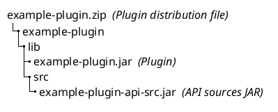

<!-- Copyright 2000-2024 JetBrains s.r.o. and contributors. Use of this source code is governed by the Apache 2.0 license. -->

# Bundling Plugin API Sources

<link-summary>Exposing plugin's API sources for other plugins.</link-summary>

If a plugin exposes its own API that is meant to be used by other plugins, it is worth considering bundling the plugin's API sources in the ZIP distribution.
Being able to see API sources drastically improves the development experience, and it is highly recommended to bundle them.

If a third-party plugin uses [](tools_intellij_platform_gradle_plugin.md) or [](tools_gradle_intellij_plugin.md) (1.7.0+) and adds a dependency to a plugin bundling sources in the ZIP distribution,
sources will be automatically attached to the plugin library and visible in IDE when developers navigate to the API classes.

## API Sources Location

The API source JARs must be located in the <path>example-plugin.zip!/plugin/lib/src</path> directory in the plugin ZIP distribution, e.g.:



The plugin distribution ZIP file can contain multiple source JARs, and there are no strict rules for the source JAR names.

## Defining Plugin API

Usually, the following classes are considered as plugin API:

- [Extension Point](plugin_extension_points.md) and related classes
- [Listener](plugin_listeners.md) and related classes
- [Services](plugin_services.md) and utilities that provide access to the plugin data/behavior

Keep in mind that API should be stable and change very rarely as every incompatible change will break the client plugins.
It is also recommended to organize the plugin code in multiple modules with clear responsibilities, e.g.:

- `example-plugin-api` - a module containing API
- `example-plugin-impl` - a module containing plugin features code that are not meant to be extended or used by client plugins

General rule to define API is to include classes that are likely to be consumed by the client plugins code.

Of course, more complex plugins may require more fine-grained structure.
See [Gradle IntelliJ Plugin - Usage Examples](tools_gradle_intellij_plugin_examples.md).

## Bundling API Sources in Gradle Build Script

In the simplest case, if a project consists of a single module and plugin API is clearly isolated in a package, e.g. `com.example.plugin.openapi`, including the source JAR can be achieved by adding the following snippet to the `tasks` section of the Gradle build script:

<tabs>
<tab title="Kotlin">

```kotlin
tasks {
  val createOpenApiSourceJar by registering(Jar::class) {
    // Java sources
    from(sourceSets.main.get().java) {
      include("**/com/example/plugin/openapi/**/*.java")
    }
    // Kotlin sources
    from(kotlin.sourceSets.main.get().kotlin) {
      include("**/com/example/plugin/openapi/**/*.kt")
    }
    destinationDirectory.set(layout.buildDirectory.dir("libs"))
    archiveClassifier.set("src")
  }

  buildPlugin {
    dependsOn(createOpenApiSourceJar)
    from(createOpenApiSourceJar) { into("lib/src") }
  }
}
```

</tab>
<tab title="Groovy">

```groovy
task createOpenApiSourceJar(type: Jar) {
  // Java sources
  from(sourceSets.main.java) {
    include '**/com/example/plugin/openapi/**/*.java'
  }
  // Kotlin sources
  from(sourceSets.main.kotlin) {
    include '**/com/example/plugin/openapi/**/*.kt'
  }
  destinationDirectory = layout.buildDirectory.dir('libs')
  archiveClassifier = 'src'
}

buildPlugin {
  dependsOn(createOpenApiSourceJar)
  from(createOpenApiSourceJar) { into 'lib/src' }
}
```

</tab>
</tabs>


The above configuration will create a source JAR containing Java and Kotlin source files from the `com.example.plugin.openapi` package and add it to the final plugin ZIP distribution in the required <path>example-plugin.zip!/example-plugin/lib/src</path> directory.

If your plugin is a Gradle project and there is no clear open API package separation, it is recommended to restructure the plugin project to a Gradle multi-project variant and create a dedicated open API subproject that contains all API sources to be included in the final distribution created by the main plugin Gradle project.
