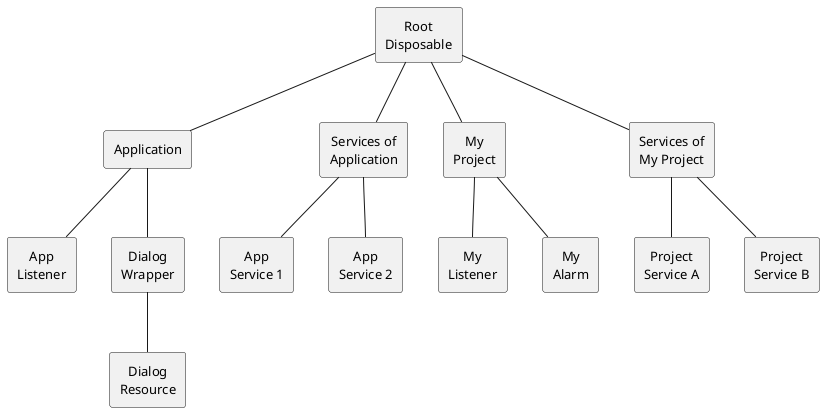

<!-- Copyright 2000-2024 JetBrains s.r.o. and contributors. Use of this source code is governed by the Apache 2.0 license. -->

# Disposer and Disposable

<link-summary>Cleaning up resources on plugin components' lifetime expiration.</link-summary>

The IntelliJ Platform's [`Disposer`](%gh-ic%/platform/util/src/com/intellij/openapi/util/Disposer.java) facilitates resource cleanup.
If a subsystem keeps a set of resources alive coincident with a parent object's lifetime, the subsystem's resources should be registered with the `Disposer` to be released before or at the same time as the parent object.

The most common resource type managed by `Disposer` is listeners, but there are other possible types:
* File handles, and database connections,
* Caches and other significant data structures.

The `Disposer` is a singleton that manages a tree of [`Disposable`](%gh-ic%/platform/util/src/com/intellij/openapi/Disposable.java) instances.
A `Disposable` is an interface for any object providing a `Disposable.dispose()` method to release heavyweight resources after a specific lifetime.

The `Disposer` supports chaining `Disposable` objects in parent-child relationships.

## Automatically Disposed Objects

Many objects are disposed automatically by the platform if they implement the `Disposable` interface.
The most important type of such objects is [services](plugin_services.md).
Application-level services are automatically disposed by the platform when the IDE is closed or the plugin providing the service is unloaded.
Project-level services are disposed on project close or plugin unload events.

Note that extensions registered in <path>[plugin.xml](plugin_configuration_file.md)</path> are *not* automatically disposed.
If an extension requires executing some code to dispose it, you need to define a service and to put the code in its `dispose()` method or use it as a parent disposable.

## The `Disposer` Singleton
The primary purpose of the [`Disposer`](%gh-ic%/platform/util/src/com/intellij/openapi/util/Disposer.java) singleton is to enforce the rule that _a child `Disposable` never outlives its parent_.

The `Disposer` organizes `Disposable` objects in a tree of parent-child relationships.
The tree of `Disposable` objects ensures the `Disposer` releases children of a parent first.
Parent objects always live longer than their children.

The following diagram shows a simplified example of `Disposer`'s tree:



When _My Project_ is closed and its disposal is triggered by the platform, the Disposer API will dispose _My Listener_ and _My Alarm_ before _My Project_, and _Project Service A_ and _Project Service B_ before _Services of My Project_.

See [The Disposable Interface](#implementing-the-disposable-interface) for more information about creating `Disposable` classes.

Registering a disposable is performed by calling `Disposer.register()`:

```java
Disposer.register(parentDisposable, childDisposable);
```

### Choosing a Disposable Parent

To register a child `Disposable`, a parent `Disposable` of a suitable lifetime is used to establish the parent-child relationship.
One of the parent `Disposables` provided by the IntelliJ Platform can be chosen, or it can be another `Disposable`.

Use the following guidelines to choose the correct parent:

* For resources required for a plugin's entire lifetime, use an application or project level [service](plugin_services.md). Example: [`PythonPluginDisposable`](%gh-ic%/python/openapi/src/com/jetbrains/python/PythonPluginDisposable.java).
* For resources required while a [dialog](dialog_wrapper.md) is displayed, use `DialogWrapper.getDisposable()`.
* For resources required while a [tool window](tool_windows.md) tab is displayed, pass your instance implementing `Disposable` to `Content.setDisposer()`.
* For resources with a shorter lifetime, create a disposable using `Disposer.newDisposable()` and dispose it manually using `Disposable.dispose()`.
  Note that it's always best to specify a parent for such a disposable (for example, a project-level service), so that there is no memory leak if the `Disposable.dispose()` call is not reached because of an exception or a programming error.

> Even though `Application` and `Project` implement `Disposable`, they must **never** be used as parent disposables in plugin code.
> Disposables registered using those objects as parents will not be disposed when the plugin is unloaded, leading to memory leaks.
>
> Consider a case of a disposable resource created by a plugin and registered with a project as its parent.
> The following lifetime diagram shows that the resource will outlive the plugin and live as long as the project.
> ```mermaid
> %%{init: {'theme': 'base', 'themeVariables': { 'primaryBorderColor': 'green', 'background': 'yellow'}}}%%
> gantt
>     dateFormat X
>     %% do not remove trailing space in axisFormat
>     axisFormat ‎
>     section Lifetimes
>         Project         : 0, 10
>         Plugin          : 2, 5
>         Plugin Resource : crit, 3, 10
> ```
>
> If the resource used, for example, a plugin's project-level service (if shorter living parents are possible, prefer them), the resource would be disposed together with the plugin:
> ```mermaid
> gantt
>     dateFormat X
>     %% do not remove trailing space in axisFormat
>     axisFormat ‎
>     section Lifetimes
>         Project         : 0, 10
>         Plugin          : 2, 5
>         Plugin Resource : 3, 5
> ```
>
> Inspection <control>Plugin DevKit | Code | Incorrect parentDisposable parameter</control> will highlight such problems.
>
{style="warning" title="Plugin disposable leaks"}

The `Disposer` API flexibility means that if the parent instance is chosen unwisely, the child may consume resources for longer than required.
Continuing to use resources when they are no longer needed can be a severe source of contention due to leaving some zombie objects behind due to each invocation.
An additional challenge is that these kinds of issues won't be reported by the regular leak checker utilities, because technically, it's not a memory leak from the test suite perspective.

For example, suppose a UI component created for a specific operation uses a project-level service as a parent disposable.
In that case, the entire component will remain in memory after the operation is complete.
This creates memory pressure and can waste CPU cycles on processing events that are no longer relevant.

### Registering Listeners with Parent Disposable

Many IntelliJ Platform APIs for registering listeners either require passing a parent disposable or have overloads that take a parent disposable, for example:

```java
public interface PomModel {
  // ...
  void addModelListener(PomModelListener listener);
  void addModelListener(PomModelListener listener, Disposable parentDisposable);
  void removeModelListener(PomModelListener listener);
}
```

Methods with a `parentDisposable` parameter automatically unsubscribe the listener when the corresponding parent disposable is disposed.
Using such methods is always preferable to removing listeners explicitly from the `dispose` method because it requires less code and is easier to verify for correctness.

The same rules apply to [message bus](messaging_infrastructure.md) connections.

Always pass a parent disposable to `MessageBus.connect(parentDisposable)`, and make sure it has the shortest possible lifetime.
To choose the correct parent disposable, use the guidelines from the [previous section](#choosing-a-disposable-parent).

### Determining Disposal Status
You can use `Disposer.isDisposed()` to check whether a `Disposable` has already been disposed.
This check is useful, for example, for an asynchronous callback to a `Disposable` that may be disposed before the callback is executed.
In such a case, the best strategy is usually to do nothing and return early.

> Non-disposed objects shouldn't hold onto references to disposed objects, as this constitutes a memory leak.
> Once a `Disposable` is released, it should be completely inactive, and there's no reason to refer to it anymore.
>
{style="warning"}

### Ending a Disposable Lifecycle
A plugin can manually end a `Disposable` lifecycle by calling `Disposer.dispose(Disposable)`.
This method handles recursively disposing of all the `Disposable` child descendants as well.

## Implementing the `Disposable` Interface

Creating a class requires implementing the `Disposable` interface and defining the `dispose()` method.

In many cases, when the object implements `Disposable` only to be used as a parent disposable, the method's implementation will be completely empty.

An example of a non-trivial `dispose` implementation is shown below:

```java
public class Foo<T> extends JBFoo implements Disposable {

  public Foo(@NotNull Project project,
             @NotNull String name,
             @Nullable FileEditor fileEditor,
             @NotNull Disposable parentDisposable) {
    this(project, name, fileEditor, InitParams.createParams(project),
        DetachedToolWindowManager.getInstance(project));
    Disposer.register(parentDisposable, this);
  }

  @Override
  public void dispose() {
    myFooManager.unregister(this);
    myDetachedToolWindowManager.unregister(myFileEditor);
    KeyboardFocusManager.getCurrentKeyboardFocusManager()
        .removePropertyChangeListener("focusOwner", myMyPropertyChangeListener);
    setToolContext(null);
  }
}
```

A lot of code setting up all the conditions requiring release in `dispose()` has been omitted for simplicity.

Regardless, it illustrates the basic pattern, which is:
* In this case, the parent disposable is passed into the constructor,
* The `Foo` disposable is registered as a child of `parentDisposable` in the constructor.
* The `dispose()` method consolidates the necessary release actions and will be called by the `Disposer`.

> Never call `Disposable.dispose()` directly because it bypasses the parent-child relationships established in `Disposer`.
> Always call `Disposer.dispose(Disposable)` instead.
>
{style="warning"}

## Diagnosing `Disposer` Leaks

When the application exits, it performs a final sanity check to verify everything was disposed.
If something was registered with the `Disposer` but remains undisposed, the IntelliJ Platform reports it before shutting down.

In test, [internal](enabling_internal.md), and debug mode (add `idea.disposer.debug=on` in <ui-path>Help | Edit Custom Properties...</ui-path>), registering a `Disposable` with the `Disposer` also registers a stack trace for the object's allocation path.
The `Disposer` accomplishes this by creating a `Throwable` at the time of registration.

The following snippet represents the sort of "memory leak detected" error encountered in practice:

```text
    java.lang.RuntimeException:
    Memory leak detected: <instance> of class com.example.ClassType
    See the cause for the corresponding Disposer.register() stacktrace:
        at ObjectTree.assertIsEmpty(ObjectTree.java:209)
        at Disposer.assertIsEmpty(Disposer.java:125)
        at Disposer.assertIsEmpty(Disposer.java:121)
        at ApplicationImpl.disposeSelf(ApplicationImpl.java:323)
        at ApplicationImpl.doExit(ApplicationImpl.java:780)
        …
    Caused by: java.lang.Throwable
        at ObjectTree.getOrCreateNodeFor(ObjectTree.java:101)
        at ObjectTree.register(ObjectTree.java:62)
        at Disposer.register(Disposer.java:81)
        at Disposer.register(Disposer.java:75)
        …
        at ProjectManagerEx.createProject(ProjectManagerEx.java:69)
        at NewProjectWizardDynamic.doFinish(NewProjectWizardDynamic.java:235)
        at DynamicWizard$1.run(DynamicWizard.java:433)
        at CoreProgressManager$5.run(CoreProgressManager.java:237)
        at CoreProgressManager$TaskRunnable.run(CoreProgressManager.java:563)
        …
```

> The first part of the callstack is unrelated to diagnosing the memory leak.
> Instead, pay attention to the second part of the call stack, after `Caused by: java.lang.Throwable`.
>

In this specific case, the IntelliJ Platform ([`CoreProgressManager`](%gh-ic%/platform/core-impl/src/com/intellij/openapi/progress/impl/CoreProgressManager.java)) started a task that contained the `DynamicWizard` code.
In turn, that code allocated a `Project` that was never disposed by the time the application exited.
That is a promising place to start digging.

The above memory leak was ultimately caused by failing to pass a `Project` instance to a function responsible for registering it for disposal.
Often the fix for a memory leak is as simple as understanding the memory scope of the object being allocated - usually a UI container, project, or application - and making sure a `Disposer.register()` call is made appropriately for it.
