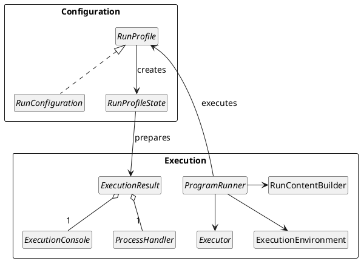

<!-- Copyright 2000-2025 JetBrains s.r.o. and contributors. Use of this source code is governed by the Apache 2.0 license. -->

# Execution

<link-summary>Run profile execution lifecycle and description of APIs used to execute processes.</link-summary>

The IntelliJ Platform Execution API allows [running external processes](https://www.jetbrains.com/help/idea/running-applications.html) from within the IDE, e.g., applications, tests, servers, scripts, etc.
These processes can be run from the [editor](editors.md), [project view](project_view.md), run toolbar, or custom [actions](action_system.md).
Executed processes can be stopped, restarted, and their output and logs can be viewed in the run console.
It is possible to manage and persist [Run Configurations](https://www.jetbrains.com/help/idea/run-debug-configuration.html) from the UI.

## Architecture Overview

The key Execution API classes are divided into two groups:
* [Configuration](#configuration-classes)
* [Execution](#execution-classes)

The following diagram shows the relations between the key classes:

### Configuration Classes

[`RunProfile`](%gh-ic%/platform/execution/src/com/intellij/execution/configurations/RunProfile.java) is a base interface for things that can be executed (e.g., an application started via a `main()` method, a test or test suite, a remote debug session to a specific host, etc.).
It is responsible for building a process that is run and creates a `RunProfileState`.

[`RunProfileState`](%gh-ic%/platform/execution/src/com/intellij/execution/configurations/RunProfileState.java) holds the information about the process ready to be started, like the command line, current working directory, and environment variables.
The existence of `RunProfileState` allows extensions and other components to patch the run profile and modify the parameters before the process gets executed.
See [standard run profile state classes](#run-profile-state).

[`RunConfiguration`](%gh-ic%/platform/execution/src/com/intellij/execution/configurations/RunConfiguration.java) is a specific type of run profile, which can be managed and persisted by users from UI.
See the [Run Configurations](run_configurations.md) section for more details.

### Execution Classes

[`Executor`](%gh-ic%/platform/execution/src/com/intellij/execution/Executor.java) describes a specific way of executing run profiles.
The three default executors provided by the IntelliJ Platform are:
* [`DefaultRunExecutor`](%gh-ic%/platform/execution/src/com/intellij/execution/executors/DefaultRunExecutor.java) _(Run)_
* [`DefaultDebugExecutor`](%gh-ic%/platform/xdebugger-api/src/com/intellij/execution/executors/DefaultDebugExecutor.java) _(Debug)_
* [`CoverageExecutor`](%gh-ic%/plugins/coverage-common/src/com/intellij/coverage/CoverageExecutor.java) _(Run with Coverage)_

Custom implementations are rarely required (it may be necessary, e.g., when a profiler integration is implemented).
Executor implementations are registered in the <include from="snippets.topic" element-id="ep"><var name="ep" value="com.intellij.executor"/></include>.

[`ProgramRunner`](%gh-ic%/platform/execution/src/com/intellij/execution/runners/ProgramRunner.java) is responsible for the [execution workflow](#execution-workflow) of a `RunProfile` with a certain `Executor`.
ProgramRunner` implementations are registered in the <include from="snippets.topic" element-id="ep"><var name="ep" value="com.intellij.programRunner"/></include>.

[`ExecutionEnvironment`](%gh-ic%/platform/execution/src/com/intellij/execution/runners/ExecutionEnvironment.java) object aggregates all the objects and settings required to execute the process.
It is used by the `ProgramRunner.execute()` method.

[`RunContentBuilder`](%gh-ic%/platform/execution-impl/src/com/intellij/execution/runners/RunContentBuilder.java) is responsible for building the content of the <control>Run</control> or <control>Debug</control> tool window.
The content is built by the `ProgramRunner` executing the process.

[`ExecutionResult`](%gh-ic%/platform/execution/src/com/intellij/execution/ExecutionResult.java) is prepared by `RunProfileState` class before execution and contains `ExecutionConsole` and `ProcessHandler`.

[`ExecutionConsole`](%gh-ic%/platform/execution/src/com/intellij/execution/ui/ExecutionConsole.java) is a component displaying the result of executing the process.
It can be a console, a test results view, or another similar component.

[`ProcessHandler`](%gh-ic%/platform/util/src/com/intellij/execution/process/ProcessHandler.java) is an object attached to the executed process and allows controlling and accessing the information about the process.
See [standard process handler class](#process-handler).

## Execution Workflow

A standard execution of a process consists of the following steps:

1. Depending on the execution context:
    1. For execution initiated by a user from UI: the user selects a `RunConfiguration` (e.g., by choosing one from the run configurations combo box) and an `Executor` (e.g., by pressing the <control>Run</control> toolbar button).
    2. For programmatic execution: a `RunProfile` instance is created, and an `Executor` is provided.
       Specific run executors can be accessed with `ExecutorRegistry.getInstance().getExecutorById()`.

    {style="alpha-lower"}
2. The `ProgramRunner` that will execute the process is selected.
   The first `ProgramRunner` that returns true from `ProgramRunner.canRun(executorId, runProfile)` is selected from all registered program runners.
3. The `ExecutionEnvironment` is created.
   It aggregates all the information required to run the process as well as the selected `ProgramRunner`, `Executor`, and `RunProfile`.
4. `ProgramRunner.execute(executionEnvironment)` is called, and the actual process is executed.

A standard implementation of `ProgramRunner.execute()` goes through the following steps to execute the process:

1. `RunProfile.getState()` method is called to create a `RunProfileState` object, which describes a process about to be started.
   The command line parameters, environment variables, and other information required to start the process are initialized at this stage.
2. `RunProfileState.execute(executor, programRunner)` is called.
   It starts the process, attaches a `ProcessHandler` to its input and output streams, creates a console to display the process output, and returns an `ExecutionResult` object aggregating the `ExecutionConsole` and the `ProcessHandler`.
3. The `RunContentBuilder` object is created and invoked to display the execution console in a <control>Run</control> or <control>Debug</control> tool window tab.

**Example:**
[`RunAnythingCommandProvider.runCommand()`](%gh-ic%/platform/lang-impl/src/com/intellij/ide/actions/runAnything/activity/RunAnythingCommandProvider.java), which programmatically executes a command typed by a user in the <control>Run Anything</control> popup

## Standard Base Classes

### Run Profile State

The standard base class used as an implementation of `RunProfileState` is [`CommandLineState`](%gh-ic%/platform/execution/src/com/intellij/execution/configurations/CommandLineState.java).
It contains the logic for putting together a running process and a console into an `ExecutionResult` but doesn't know anything about how the process is actually started.
For starting the process, it's recommended to use the [`GeneralCommandLine`](%gh-ic%/platform/platform-util-io/src/com/intellij/execution/configurations/GeneralCommandLine.java) class, which takes care of setting up the command line parameters and executing the process.

Alternatively, if the process is a JVM-based one, use the [`JavaCommandLineState`](%gh-ic%/java/execution/impl/src/com/intellij/execution/configurations/JavaCommandLineState.java) base class.
It handles the JVM command line parameters and can take care of details like calculating the classpath for the JVM.
Note that using this class requires a [dependency](plugin_dependencies.md) on the .

### Process Handler

The standard class for monitoring the execution of a process and capturing its output is [`OSProcessHandler`](%gh-ic%/platform/platform-util-io/src/com/intellij/execution/process/OSProcessHandler.java).
Once an instance of `OSProcessHandler` is created from either a `GeneralCommandLine` or a `Process` object, call the `startNotify()` method to capture its output.
To display the exit status of the process in the console, attach a [`ProcessTerminatedListener`](%gh-ic%/platform/ide-core/src/com/intellij/execution/process/ProcessTerminatedListener.java) to the `OSProcessHandler`.

### Displaying Process Output

When a process execution is handled with `CommandLineState`, a console view will be automatically created and attached to the process's output.

Alternatively, it can be handled with the following steps:

1. [`TextConsoleBuilderFactory.createBuilder(project).getConsole()`](%gh-ic%/platform/execution/src/com/intellij/execution/filters/TextConsoleBuilderFactory.java) creates a [`ConsoleView`](%gh-ic%/platform/execution/src/com/intellij/execution/ui/ConsoleView.java) instance.
2. `ConsoleView.attachToProcess()` attaches it to the output of a process.

If the running process uses [ANSI escape codes to color its output](https://en.wikipedia.org/wiki/ANSI_escape_code#Colors), use the [`ColoredProcessHandler`](%gh-ic%/platform/platform-util-io/src/com/intellij/execution/process/ColoredProcessHandler.java) class to display the colors in the IDE console.

#### Console Filters

Console [`Filter`](%gh-ic%/platform/execution/src/com/intellij/execution/filters/Filter.java) allows converting certain strings found in the process output to clickable hyperlinks.
To attach a filter to the console, use `CommandLineState.addConsoleFilters()` or [`TextConsoleBuilder.addFilter()`](%gh-ic%/platform/execution/src/com/intellij/execution/filters/TextConsoleBuilder.java) if the console is created manually.
Two standard filter implementations are [`RegexpFilter`](%gh-ic%/platform/lang-api/src/com/intellij/execution/filters/RegexpFilter.java) and [`UrlFilter`](%gh-ic%/platform/execution-impl/src/com/intellij/execution/filters/UrlFilter.java).

Console filters can be also provided by implementing [`ConsoleFilterProvider`](%gh-ic%/platform/lang-api/src/com/intellij/execution/filters/ConsoleFilterProvider.java) and registering
it in <include from="snippets.topic" element-id="ep"><var name="ep" value="com.intellij.consoleFilterProvider"/></include>.

## Listening for Execution Events

Implement [`ExecutionListener`](%gh-ic%/platform/execution/src/com/intellij/execution/ExecutionListener.java) and subscribe to [`ExecutionManager#EXECUTION_TOPIC`](%gh-ic%/platform/execution/src/com/intellij/execution/ExecutionManager.kt).
The listener allows for listening to several phases of the process execution lifecycle.
