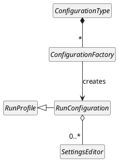

<!-- Copyright 2000-2025 JetBrains s.r.o. and contributors. Use of this source code is governed by the Apache 2.0 license. -->

# Run Configurations

<link-summary>Implementing run configurations management support.</link-summary>

<tldr>

**Product Help:** [Run/Debug Configuration](https://www.jetbrains.com/idea/help/run-debug-configuration.html)

</tldr>

A run configuration is a specific type of [run profile](execution.md#configuration-classes).
Run configurations can be managed from the UI and are persisted between IDE restarts.
They allow users to specify execution options like a working directory, environment variables, program arguments, and other parameters required to run a process.
Run configurations can be started from the <control>Run</control> toolbar, the editor, and executed programmatically from actions or other components.

## Architecture Overview

The following diagram shows the key run configurations classes:

Original:

Run Configuration API (except `SettingsEditor` class, which is a class shared by many IntelliJ Platform APIs) is a part of the [Execution API](execution.md).

### `ConfigurationType`

The entry point of a run configuration implementation is [`ConfigurationType`](%gh-ic%/platform/execution/src/com/intellij/execution/configurations/ConfigurationType.java).
It is responsible for the run configuration type and instances presentation and contains [configuration factories](#configurationfactory).
A single configuration type can have multiple configuration factories, e.g., the Docker configuration type can create run configurations for:
* Dockerfile
* Docker Image
* Docker-compose

To see the list of configuration types available in the IDE, go to <ui-path>Run \| Edit Configurations</ui-path> and click the <control>Add</control> button (<control>+</control> icon).

`ConfigurationType` implementations are registered in the <include from="snippets.topic" element-id="ep"><var name="ep" value="com.intellij.configurationType"/></include>.

Standard base classes for configuration type implementations are:
* [`SimpleConfigurationType`](%gh-ic%/platform/execution/src/com/intellij/execution/configurations/runConfigurationType.kt) - used for configuration types that have a single configuration factory.
  Actually, this configuration type is also a configuration factory, and there is no need for setting up a factory.
* [`ConfigurationTypeBase`](%gh-ic%/platform/execution/src/com/intellij/execution/configurations/runConfigurationType.kt) - used for configuration types that have multiple configuration factories.
  Factories should be added in the constructor by calling the `addFactory()` method.

Marking a configuration type as [dumb aware](indexing_and_psi_stubs.md#DumbAwareAPI) makes all its configurations available during indexing.

Sometimes, it is required to provide run configurations programmatically from contexts external to run configuration UI.
Implementing [`VirtualConfigurationType`](%gh-ic%/platform/execution/src/com/intellij/execution/configurations/VirtualConfigurationType.java) blocks the possibility of adding and removing run configurations of this type in the <control>Run/Debug Configurations</control> panel.
Editing its template is also not available.

### `ConfigurationFactory`

[`ConfigurationFactory`](%gh-ic%/platform/execution/src/com/intellij/execution/configurations/ConfigurationFactory.java) classes are responsible for creating [run configuration](#runconfiguration) instances.
The only method required to be implemented is `createTemplateConfiguration()`, which is called once for each project to create the run configuration template.
The actual run configurations are created in the `createConfiguration()` method by cloning the template.

Configuration factory presentation is inherited from the containing configuration type.
If customization is needed, override the presentation methods in the factory class.

By default, configurations created by a given factory are not editable in [dumb mode](indexing_and_psi_stubs.md#dumb-mode).
To enable editing them in Dumb Mode, return `true` from `isEditableInDumbMode()`.

### `RunConfiguration`

[`RunConfiguration`](%gh-ic%/platform/execution/src/com/intellij/execution/configurations/RunConfiguration.java) extends [`RunProfile`](%gh-ic%/platform/execution/src/com/intellij/execution/configurations/RunProfile.java) and represents a named profile that can be run by the [Execution API](execution.md).

When implementing a run configuration class, consider using one of the standard base classes:
* [`RunConfigurationBase`](%gh-ic%/platform/execution/src/com/intellij/execution/configurations/RunConfigurationBase.java) - a general-purpose base class that contains the most basic implementation of a run configuration.
* [`LocatableConfigurationBase`](%gh-ic%/platform/execution/src/com/intellij/execution/configurations/LocatableConfigurationBase.java) - a base class for [configurations that can be created from context](#creating-a-run-configuration-from-context).
* [`ModuleBasedConfiguration`](%gh-ic%/platform/execution/src/com/intellij/execution/configurations/ModuleBasedConfiguration.java) - a base class for a configuration that is associated with a specific  (e.g., Java run configurations use the selected module to determine the run classpath).

### `SettingsEditor`

A run configuration may allow editing its general settings and settings specific to a [program runner](execution.md#execution-classes).
If it is required, a `RunConfiguration` implementation should return a [`SettingsEditor`](%gh-ic%/platform/ide-core/src/com/intellij/openapi/options/SettingsEditor.java) instance from:
* `getConfigurationEditor()` for editing run configuration settings
* `getRunnerSettingsEditor()` for editing settings for a specific program runner

A `SettingsEditor` implementation must provide the following methods:
* `getComponent()` - creates a UI component for displaying settings controls
* `applyEditorTo()` - copies the current editor UI state into the target settings object
* `resetEditorFrom()` - resets the current editor UI state to the initial settings state

In the case of run configuration settings, the settings object is `RunConfiguration` itself.
Settings specific to a program runner must implement [`ConfigurationPerRunnerSettings`](%gh-ic%/platform/execution/src/com/intellij/execution/configurations/ConfigurationPerRunnerSettings.java).

If the settings editor requires validation, implement [`CheckableRunConfigurationEditor`](%gh-ic%/platform/lang-api/src/com/intellij/execution/impl/CheckableRunConfigurationEditor.java).

If the settings editor is complex, see  for solutions.

**Example:** [DemoSettingsEditor](%gh-sdk-samples-master%/run_configuration/src/main/java/org/jetbrains/sdk/runConfiguration/DemoSettingsEditor.java) from the `run_configuration` code sample.

## Persistence

Run configuration settings are persistent.
They are stored in the file system and loaded back after the IDE restart.
Persisting and loading settings are performed by `writeExternal()` and `readExternal()` methods of `RunConfiguration` class correspondingly.

The actually stored configurations are represented by instances of the [`RunnerAndConfigurationSettings`](%gh-ic%/platform/execution/src/com/intellij/execution/RunnerAndConfigurationSettings.java) class, which combines a run configuration with runner-specific settings and stores general run configuration flags and properties.

## Creating a Run Configuration Programmatically

If a plugin requires creating run configurations programmatically, .e.g, from a custom action, perform the following steps:
1. [`RunManager.createConfiguration()`](%gh-ic%/platform/execution/src/com/intellij/execution/RunManager.kt) - creates an instance of `RunnerAndConfigurationSettings`.
2. [`RunManager.addConfiguration()`](%gh-ic%/platform/execution/src/com/intellij/execution/RunManager.kt) - makes the created configuration persistent by adding it to either the list of shared configurations stored in a project or to the list of local configurations stored in the workspace file.

## Creating a Run Configuration from Context

Run configurations can be created and run from context, e.g., by right-clicking an application main method, a test class/method, etc., directly in the editor or the project view.
This is achieved by implementing [`LazyRunConfigurationProducer`](%gh-ic%/platform/lang-api/src/com/intellij/execution/actions/LazyRunConfigurationProducer.kt) and registering
it in <include from="snippets.topic" element-id="ep"><var name="ep" value="com.intellij.runConfigurationProducer"/></include>.

The extension requires implementing the following methods:
* `getConfigurationFactory()` - returns the factory creating run configurations of the type specified in the extension class implementation.
* `setupConfigurationFromContext()` - receives a blank configuration of the specified type and a [`ConfigurationContext`](%gh-ic%/platform/lang-api/src/com/intellij/execution/actions/ConfigurationContext.java) containing information about a source code location (accessible by calling `getLocation()` or `getPsiLocation()`).
  The implementation needs to check whether the location is applicable to the configuration type (e.g., if it is in a file of the supported language).
  If it is, put the correct context-specific settings into the run configuration and return `true`.
  Return `false` otherwise.
* `isConfigurationFromContext()` - checks if a configuration was created from the specified context.
  This method allows reusing an existing run configuration, which applies to the current context, instead of creating a new one and possibly ignoring the user's customizations in the existing one.

If access to indexes is not required, it can be marked [dumb aware](indexing_and_psi_stubs.md#DumbAwareAPI).
If the run configuration requires additional data before it is executed for the first time, override [`RunConfigurationProducer.onFirstRun()`](%gh-ic%/platform/lang-api/src/com/intellij/execution/actions/RunConfigurationProducer.java) to provide it or display UI to get the data from the user.

To support the automatic naming of configurations created from context, the configuration should extend [`LocatableConfigurationBase`](%gh-ic%/platform/execution/src/com/intellij/execution/configurations/LocatableConfigurationBase.java).
It supports generating a name for a configuration from its settings and tracking whether the user changed the name.

## Running Configurations from the Gutter

If a run configuration is closely related to a PSI element (e.g., runnable method, test, etc.), it is possible to allow running configurations by [clicking the editor gutter icon](https://www.jetbrains.com/help/idea/running-applications.html#run-from-editor).
It is achieved by implementing [`RunLineMarkerContributor`](%gh-ic%/platform/execution-impl/src/com/intellij/execution/lineMarker/RunLineMarkerContributor.java), which provides information like the icon, tooltip content, and available actions for a given PSI element.

The standard method for providing the information is `getInfo()`.
If computing the information is slow, implement `getSlowInfo()`, which is used by the editor highlighting mechanism to gather information in batch, and apply all the information at once to avoid icons blinking.
If access to indexes is not required, it can be marked [dumb aware](indexing_and_psi_stubs.md#DumbAwareAPI).

To provide the standard executor actions like _Run_, _Debug_, etc., use [`ExecutorAction.getActions()`](%gh-ic%/platform/execution-impl/src/com/intellij/execution/lineMarker/ExecutorAction.kt).

## Starting a Run Configuration Programmatically

The easiest way to run an existing run configuration is using [`ProgramRunnerUtil.executeConfiguration(RunnerAndConfigurationSettings, Executor)`](%gh-ic%/platform/execution-impl/src/com/intellij/execution/ProgramRunnerUtil.java).
`RunnerAndConfigurationSettings` can be retrieved with, e.g., `RunManager.getConfigurationSettings(ConfigurationType)`.
The executor can be retrieved with a static method if a required executor exposes one or with [`ExecutorRegistry.getExecutorById()`](%gh-ic%/platform/execution/src/com/intellij/execution/ExecutorRegistry.java).

## Validating a Run Configuration

To check, whether a run configuration is configured correctly and can be executed, implement the `RunConfiguration.checkConfiguration()`.
In case the run configuration settings are incomplete, the method should throw one of the following exceptions:
- [`RuntimeConfigurationWarning`](%gh-ic%/platform/execution/src/com/intellij/execution/configurations/RuntimeConfigurationWarning.java) - in case of a problem, which doesn't affect execution
- [`RuntimeConfigurationException`](%gh-ic%/platform/execution/src/com/intellij/execution/configurations/RuntimeConfigurationException.java) - in case of non-fatal error, which allows executing the configuration
- [`RuntimeConfigurationError`](%gh-ic%/platform/execution/src/com/intellij/execution/configurations/RuntimeConfigurationError.java) - in case of fatal error that makes it impossible to execute the run configuration

If the configuration contains any warnings or errors, its icon will be patched with the error indicator and the message will be displayed in the configuration settings page. In case of `RuntimeConfigurationError`, if a user tries to execute the configuration, the run configuration settings dialog will be presented, so that the user can fix the issues before the execution.

All the mentioned exceptions allow providing a quick fix for the reported issue.
If the quick fix implementation is provided, the quick fix button will be displayed next to the error message.

## Simplifying Settings Editors

If a run configuration settings editor is complex, consider implementing one of the following solutions to simplify the UI:
-  - the recommended approach since version 2021.1
- 

### Fragmented Settings Editor

Fragmented Settings allow for the creation of a cleaner run configuration settings editor.
The fragmented editor is built of reusable fragments, which can be shared between different run configuration editors.

When a user creates a new run configuration from a template, only essential fragments are displayed at first.
More advanced options are hidden and must be explicitly enabled by the user from the <control>Modify options</control> dropdown.
It makes the editor smaller, freeing it from the clutter of unused settings fields.

To implement a fragmented settings editor in a run configuration, extend [`RunConfigurationFragmentedEditor`](%gh-ic%/platform/execution-impl/src/com/intellij/execution/ui/RunConfigurationFragmentedEditor.java) and implement `createRunFragments()`.
The method must return a list of [`SettingsEditorFragment`](%gh-ic%/platform/platform-api/src/com/intellij/execution/ui/SettingsEditorFragment.java) instances, which represent particular settings fragments that users can enable and configure.

**Examples:**
- [`JavaApplicationSettingsEditor`](%gh-ic%/java/execution/impl/src/com/intellij/execution/application/JavaApplicationSettingsEditor.java)
- [`MavenRunConfigurationSettingsEditor`](%gh-ic%/plugins/maven/src/main/java/org/jetbrains/idea/maven/execution/run/configuration/MavenRunConfigurationSettingsEditor.kt)

### Settings Editor Groups

A complex settings editor can be split into smaller editors focused on a specific area, e.g.:
- <control>Configuration</control> - containing the main configuration settings
- <control>Logs</control> - containing settings related to logging
- <control>Coverage</control> - containing settings related to code coverage
- etc.

These editors should be added to the [`SettingsEditorGroup`](%gh-ic%/platform/ide-core/src/com/intellij/openapi/options/SettingsEditorGroup.java) object, which is a `SettingsEditor`'s implementation itself and must be returned from `getConfigurationEditor()` or `getRunnerSettingsEditor()`.
Each editor added to the group is displayed in a separate tab.

**Example:** [`ApplicationConfiguration.getConfigurationEditor()`](%gh-ic%/java/execution/impl/src/com/intellij/execution/application/ApplicationConfiguration.java)

## Refactoring Support

Some run configurations contain references to classes, files, or directories in their settings, and these settings usually need to be updated when the corresponding element is renamed or moved.
To support that, a run configuration needs to implement the [`RefactoringListenerProvider`](%gh-ic%/platform/execution/src/com/intellij/execution/configurations/RefactoringListenerProvider.java) interface.

The `RefactoringListenerProvider.getRefactoringElementListener()`'s implementation should check whether the refactored element is referred from the run configuration.
If it is, return a [`RefactoringElementListener`](%gh-ic%/platform/analysis-api/src/com/intellij/refactoring/listeners/RefactoringElementListener.java) that updates the run configuration according to the new name and location of the element.

## Modifying Existing Run Configurations

Plugins can modify existing run configurations before they are run, e.g., by adding additional process parameters.
However, there is no single platform-wide extension point, and different IDEs provide different configuration base classes and extension points, allowing for their modifications.
To see what is possible in your case, check the [`RunConfigurationExtensionBase`](%gh-ic%/platform/execution/src/com/intellij/execution/configuration/RunConfigurationExtensionBase.java) inheritors.
Examples:
* [`RunConfigurationExtension`](%gh-ic%/java/execution/impl/src/com/intellij/execution/RunConfigurationExtension.java) implementations registered in <include from="snippets.topic" element-id="ep"><var name="ep" value="com.intellij.runConfigurationExtension"/></include> allow for modifying Java run configurations extending [`RunConfigurationBase`](%gh-ic%/platform/execution/src/com/intellij/execution/configurations/RunConfigurationBase.java).
* [`PythonRunConfigurationExtension`](%gh-ic%/python/src/com/jetbrains/python/run/PythonRunConfigurationExtension.java) implementations registered in <include from="snippets.topic" element-id="ep"><var name="ep" value="Pythonid.runConfigurationExtension"/></include> allow for modifying configuration extending [`AbstractPythonRunConfiguration`](%gh-ic%/python/src/com/jetbrains/python/run/AbstractPythonRunConfiguration.java)
etc.

## Referencing Environment Variables in Run Configurations

Run configurations can define user environment variables specific to a given run configuration and include system environment variables.
Sometimes, it is convenient to reference existing variables in newly created variables, e.g., if a user creates an `EXTENDED_PATH` variable and builds it from a custom entry and the system `PATH` variable, they should reference it in the value by surrounding it with the `$` character: `/additional/entry:$PATH$`.

To substitute variable references with the actual references, it is required to call [`EnvironmentUtil.inlineParentOccurrences()`](%gh-ic%/platform/util/src/com/intellij/util/EnvironmentUtil.java) (available since 2023.2).

## Before Run Tasks

Sometimes, it is necessary to perform specific tasks before a configuration is actually run, e.g., build the project, run a build tool preparation task, launch a web browser, etc.
Plugins can provide custom tasks that can be added by users to a created run configuration.

To provide a custom task, implement [`BeforeRunTaskProvider`](%gh-ic%/platform/execution/src/com/intellij/execution/BeforeRunTaskProvider.java) and register it
in <include from="snippets.topic" element-id="ep"><var name="ep" value="com.intellij.stepsBeforeRunProvider"/></include>.
The provider implementation is responsible for creating a task instance for a given run configuration and executing the task.

If access to indexes is not required, it can be marked [dumb aware](indexing_and_psi_stubs.md#DumbAwareAPI).

## Macros

Macros are dynamic variables, which can be referenced in run configurations, and expanded to actual values when a run configuration is executed.

For example, a macro with a name `ProjectFileDir` can be referenced as `$ProjectFileDir$` in a run configuration command line argument.
It is expanded to the absolute path of the current project directory when the run configuration is executed by a user.

A list of built-in macros is available in the [IntelliJ IDEA Web Help](https://www.jetbrains.com/help/idea/built-in-macros.html) and other products' documentation pages.

> Note that Macro API is not specific to execution or run configuration API and can be used in other places.

### Adding Macro Selector in Run Configuration Editor

Macro selecting support can be added to a text field on the run configuration editor by installing it with [`MacrosDialog.addMacroSupport()`](%gh-ic%/platform/execution-impl/src/com/intellij/ide/macro/MacrosDialog.java) or other similar methods from this class.
After installation, a text field will be extended by a button invoking the macro dialog, which lists available macros with descriptions and previews.
After selecting and accepting a macro from the list, the macro placeholder is inserted into the text field at the current caret position.

### Expanding Macros Before Execution

Macros used in run configuration must be expanded to actual values before the process execution.
It is usually done in the `RunProfile.getState()` method called during the [execution workflow](execution.md#execution-workflow).
To expand configured values, use one of [`ProgramParametersConfigurator`](%gh-ic%/platform/execution-impl/src/com/intellij/execution/util/ProgramParametersConfigurator.java)'s method: `expandMacros()`, `expandPathAndMacros()`, or `expandMacrosAndParseParameters()`.
See their Javadocs for the details.

### Providing Custom Macros

If the predefined list of macros is insufficient, a plugin can provide custom macros by extending [`Macro`](%gh-ic%/platform/macro/src/com/intellij/ide/macro/Macro.java) and
registering it in the <include from="snippets.topic" element-id="ep"><var name="ep" value="com.intellij.macro"/></include>.
