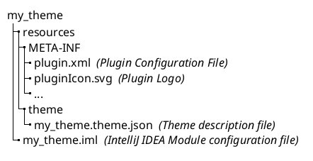

<!-- Copyright 2000-2025 JetBrains s.r.o. and contributors. Use of this source code is governed by the Apache 2.0 license. -->

# Creating a Theme Project

<link-summary>Creating a theme plugin project with Plugin DevKit wizard and generated project overview.</link-summary>

This documentation page describes a DevKit-based theme project generated with the [New Project Wizard](https://www.jetbrains.com/help/idea/new-project-wizard.html).

## Creating a Theme with New Project Wizard

> Before creating a theme project, make sure that [development environment is set up](setting_up_theme_environment.md).

<procedure title="Create Theme Plugin" id="create-theme">

Launch the <control>New Project</control> wizard via the <ui-path>File | New | Project...</ui-path> action and provide the following information:
1. Select the <control>IDE Plugin</control> generator type from the list on the left.
2. Specify the project <control>Name</control> and <control>Location</control>.
3. Choose the <control>Theme</control> option in the project <control>Type</control>.
4. As the <control>JDK</control> select the [configured SDK](setting_up_theme_environment.md#configuring-intellij-platform-plugin-sdk).
5. Click the <control>Create</control> button to generate the project.

</procedure>

### Components of a Wizard-Generated Gradle IntelliJ Platform Theme

For the example `my_theme` created with the steps describes above, the _IDE Plugin_ generator creates the following directory content:

<path>META-INF</path> directory with:
  - <path>[plugin.xml](plugin_configuration_file.md)</path> configuration file containing preconfigured theme provider
  - <path>pluginIcon.svg</path> file that is a [plugin logo](plugin_icon_file.md)

    Replace it with a custom logo representing the Theme.
- <path>my_theme.theme.json</path> - a minimal [theme description file](themes_customize.md#introduction-to-theme-description-file-syntax)
- <path>my_theme.iml</path> - [IntelliJ IDEA Module](https://www.jetbrains.com/help/idea/creating-and-managing-modules.html) configuration file

See  for more details.

## Additional Plugin Themes

Theme plugin project [created with the new project wizard](#create-theme) contains a single theme description file by default.
In case a plugin needs to provide multiple themes (e.g., dark and light variants), it is possible to add them with the dedicated action.

Additional plugin themes can be added using the DevKit Theme Wizard, which is a part of the _Plugin DevKit_ plugin.
The wizard can be used for both DevKit-based and Gradle-based plugins.

<procedure title="Add Theme" id="add-theme">

1. In the <control>Project</control> tool window, select the <path>resources</path> directory and invoke the context menu with the right click.
2. Select the <ui-path>New | Plugin DevKit | Theme</ui-path> action.

   It is a good practice to include the name of the plugin in the created theme name.
3. Check the <control>Dark theme</control> checkbox if the created theme should be based on IntelliJ IDEA _Darcula_ theme.
   Otherwise, the _Light_ theme will be used as the base.
4. Click <control>OK</control> button to generate the [theme description file](themes_customize.md#introduction-to-theme-description-file-syntax) with <path>\$THEME_NAME\$.theme.json</path> name. The generated theme will be automatically configured in the <path>plugin.xml</path> file.

</procedure>

## Bundling Color Schemes

Use <include from="snippets.topic" element-id="ep"><var name="ep" value="com.intellij.bundledColorScheme"/></include> specifying the `path` to the color scheme XML file (without `.xml` suffix).
Specify attribute `id` for this extension in <path>plugin.xml</path> matching its `name` attribute value from the color scheme XML.
