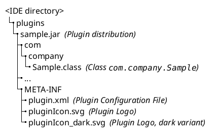
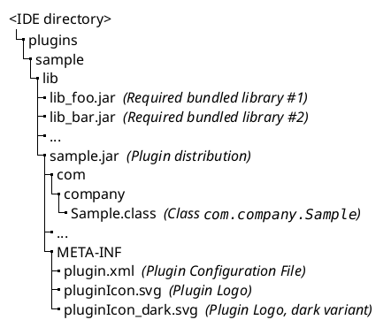

<!-- Copyright 2000-2024 JetBrains s.r.o. and contributors. Use of this source code is governed by the Apache 2.0 license. -->

# Plugin Content

<link-summary>Layout and contents of a plugin distribution file.</link-summary>

Plugin distribution is built using the dedicated Gradle `buildPlugin` task (Reference: [2.x](tools_intellij_platform_gradle_plugin_tasks.md#buildPlugin),
[1.x](tools_gradle_intellij_plugin.md#tasks-buildplugin)) or [Plugin DevKit](deploying_theme.md).

The plugin distribution <path>.jar</path> file contains:

- configuration file (<path>META-INF/plugin.xml</path>) ()
- classes implementing the plugin functionality
- recommended: plugin logo file(s) (<path>META-INF/pluginIcon*.svg</path>) ()

> See  for important steps to optimize the plugin distribution file.

Targeting a plugin distribution to a specific OS is not possible ([issue](https://youtrack.jetbrains.com/issue/MP-1896)).

### Plugin Without Dependencies

A plugin consisting of a single <path>.jar</path> file is placed in the <path>/plugins</path> directory.

### Plugin With Dependencies

The plugin <path>.jar</path> file is placed in the <path>/lib</path> folder under the plugin's "root" folder, together with all required bundled libraries.

All JARs from the <path>/lib</path> folder are automatically added to the classpath (see also [Plugin Class Loaders](plugin_class_loaders.md)).

<snippet id="doNotRepackageLibraries">

> Do not repackage libraries into the main plugin JAR file.
> Otherwise, [Plugin Verifier](verifying_plugin_compatibility.md) will yield false positives for unresolved classes and methods.
>
{title="Do Not Repackage Libraries" style="warning"}

</snippet>

