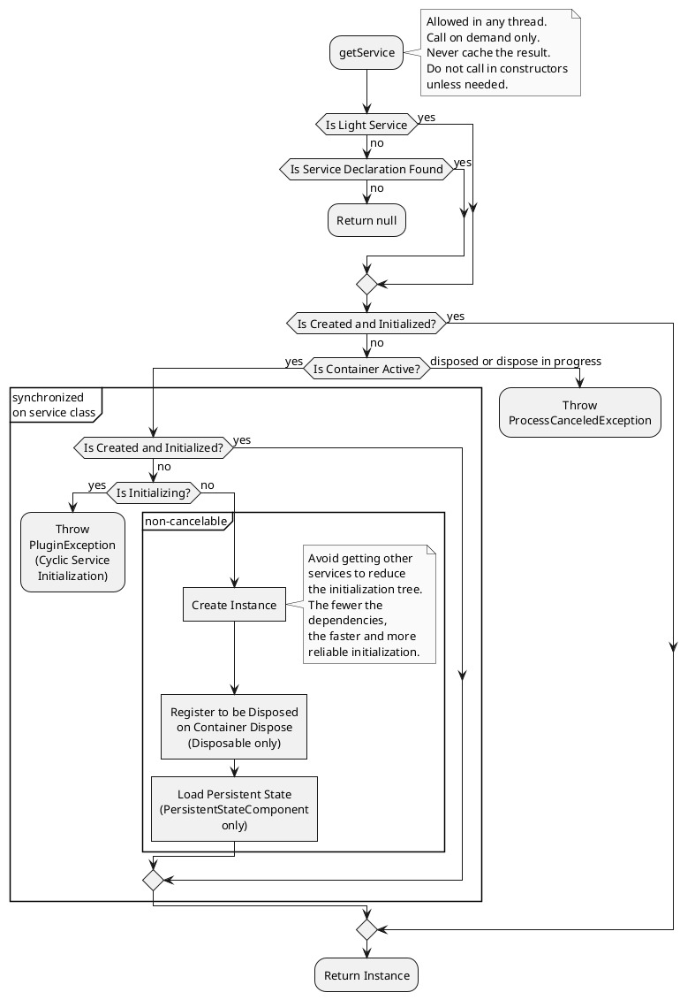

<!-- Copyright 2000-2024 JetBrains s.r.o. and contributors. Use of this source code is governed by the Apache 2.0 license. -->

# Services

<link-summary>Registering and using on-demand services to encapsulate plugin functionality.</link-summary>

A _service_ is a plugin component loaded on demand when your plugin calls the `getService()` method of corresponding [`ComponentManager`](%gh-ic%/platform/extensions/src/com/intellij/openapi/components/ComponentManager.java) instance (see [Types](#types)).
The IntelliJ Platform ensures that only one instance of a service is loaded even though it is called several times.
Services are used to encapsulate logic operating on a set of related classes or to provide some reusable functionality that can be used across the plugin project.
Conceptually, they don't differ from the service classes in other languages or frameworks.

A service must have an implementation class used for service instantiation.
A service may also have an interface class used to obtain the service instance and provide the service's API.

A service needing a shutdown hook/cleanup routine can implement [`Disposable`](%gh-ic%/platform/util/src/com/intellij/openapi/Disposable.java) and perform necessary work in `dispose()` (see [](disposers.md#automatically-disposed-objects)).

> If declared services are intended to be used by other plugins depending on your plugin, consider [bundling their sources](bundling_plugin_openapi_sources.md) in the plugin distribution.
>
{style="note" title="Services as API"}

#### Types

The IntelliJ Platform offers three types of services: _application-level_ services (global singleton), _project-level_ services, and _module-level_ services.
For the latter two, a separate instance of the service is created for each instance of its corresponding scope, see [Project Model Introduction](project_model.md).

> Avoid using module-level services as it can increase memory usage for projects with many modules.
>
{style="note"}
{id="moduleServiceNote"}

#### Constructor

{#ctor}

To improve startup performance, avoid any heavy initializations in the constructor.

Project/Module-level service constructors can have a [`Project`](%gh-ic%/platform/core-api/src/com/intellij/openapi/project/Project.java)/[`Module`](%gh-ic%/platform/core-api/src/com/intellij/openapi/module/Module.java) argument.

> Using constructor injection of dependency services is deprecated (and not supported in [](#light-services)) for performance reasons.
>
> Other service dependencies must be [acquired only when needed](#retrieving-a-service) in all corresponding methods, e.g., if you need a service to get some data or execute a task, retrieve the service before calling its methods.
> Do not retrieve services in constructors to store them in class fields.
>
> Use inspection <control>Plugin DevKit | Code | Non-default constructors for service and extension class</control> to verify code.
>
{style="warning" title="Do not use Constructor Injection"}

##### Kotlin Coroutines

When using [](kotlin_coroutines.md), a distinct service [scope](coroutine_scopes.md) can be injected as parameter.

<include from="coroutine_scopes.md" element-id="serviceScopes"/>

## Light Services

A service not going to be overridden or exposed as API to other plugins does not need to be registered in <path>[plugin.xml](plugin_configuration_file.md)</path> (see [](#declaring-a-service)).
Instead, annotate the service class with [`@Service`](%gh-ic%/platform/core-api/src/com/intellij/openapi/components/Service.java) (see [](#examples)).
The service instance will be created in the scope according to the caller (see [](#retrieving-a-service)).

### Light Service Restrictions

* None of these attributes/restrictions (available for [registration of non-light services](#declaring-a-service)) is allowed: `id`, `os`, `client`, `overrides`, `configurationSchemaKey`/`preload` (Internal API).
* There is no separate headless/test implementation required.
* Service class must be `final`.
* [Constructor injection](#ctor) of dependency services is not supported.
* If an application-level service is a [PersistentStateComponent](persisting_state_of_components.md), roaming must be disabled (`roamingType = RoamingType.DISABLED`).

Use these inspections to verify above restrictions and highlight non-light services that can be converted (2023.3):

- <control>Plugin DevKit | Code | Light service must be final</control>
- <control>Plugin DevKit | Code | Mismatch between light service level and its constructor</control>
- <control>Plugin DevKit | Code | A service can be converted to a light one</control> and corresponding <control>Plugin DevKit | Plugin descriptor | A service can be converted to a light one</control> for <path>plugin.xml</path>

### Examples

{id="lightServiceExamples"}

<tabs group="languages">


<tab title="Java" group-key="java">

Application-level light service:

```java

@Service
public final class MyAppService {

  public void doSomething(String param) {
    // ...
  }

}
```

Project-level light service example:

```java

@Service(Service.Level.PROJECT)
public final class MyProjectService {

  private final Project myProject;

  MyProjectService(Project project) {
    myProject = project;
  }

  public void doSomething(String param) {
    String projectName = myProject.getName();
    // ...
  }

}
```

</tab>

<tab title="Kotlin" group-key="kotlin">

Application-level light service:

```kotlin
@Service
class MyAppService {
  fun doSomething(param: String) {
    // ...
  }
}
```

Project-level light service example:

```kotlin
@Service(Service.Level.PROJECT)
class MyProjectService(private val project: Project) {
  fun doSomething(param: String) {
    val projectName = project.name
    // ...
  }
}
```

</tab>

</tabs>

## Declaring a Service

To register a non-[Light Service](#light-services), distinct extension points are provided for each type:

* `com.intellij.applicationService` – application-level service
* `com.intellij.projectService` – project-level service
* `com.intellij.moduleService` – module-level service (not recommended, see [Note](#types))

The service implementation is specified in the required `serviceImplementation` attribute.

### Service API

To expose a service's API, create a separate class for `serviceInterface` and extend it in the corresponding class registered in `serviceImplementation`.
If `serviceInterface` isn't specified, it is supposed to have the same value as `serviceImplementation`.
Use inspection <control>Plugin DevKit | Plugin descriptor | Plugin.xml extension registration</control> to highlight redundant `serviceInterface` declarations.

### Additional Attributes

A service can be restricted to a certain OS via the `os` attribute.

To provide a custom implementation for test or headless environment, specify `testServiceImplementation` or `headlessImplementation` respectively.

### Examples

<tabs group="languages">

<tab title="Java" group-key="java">

Application-level service:

- Interface:

  ```java
  public interface MyAppService {
    void doSomething(String param);
  }
  ```

- Implementation:

  ```java
  final class MyAppServiceImpl implements MyAppService {
    @Override
    public void doSomething(String param) {
      // ...
    }
  }
  ```

Project-level service:

- Interface:

  ```java
  public interface MyProjectService {
    void doSomething(String param);
  }
  ```

- Implementation:

  ```java
  final class MyProjectServiceImpl implements MyProjectService {
    private final Project myProject;

    MyProjectServiceImpl(Project project) {
      myProject = project;
    }

    public void doSomething(String param) {
      String projectName = myProject.getName();
      // ...
    }
  }
  ```

</tab>

<tab title="Kotlin" group-key="kotlin">

Application-level service:

- Interface:

  ```kotlin
  interface MyAppService {
    fun doSomething(param: String)
  }
  ```

- Implementation:

  ```kotlin
  internal class MyAppServiceImpl : MyAppService {
    override fun doSomething(param: String) {
      // ...
    }
  }
  ```

Project-level service:

- Interface:

  ```kotlin
  interface MyProjectService {
    fun doSomething(param: String)
  }
  ```

- Implementation:

  ```kotlin
  internal class MyProjectServiceImpl(private val project: Project)
      : MyProjectService {

    fun doSomething(param: String) {
      val projectName = project.name
      // ...
    }
  }
  ```

</tab>

</tabs>

Registration in <path>plugin.xml</path>:

```xml

<extensions defaultExtensionNs="com.intellij">
  <!-- Declare the application-level service -->
  <applicationService
          serviceInterface="com.example.MyAppService"
          serviceImplementation="com.example.MyAppServiceImpl"/>

  <!-- Declare the project-level service -->
  <projectService
          serviceInterface="com.example.MyProjectService"
          serviceImplementation="com.example.MyProjectServiceImpl"/>
</extensions>
```

## Retrieving a Service

> **Never** acquire service instances prematurely or store them in fields for later use.
> Instead, **always** obtain service instances directly and **only** at the location where they're needed.
> Failing to do so will lead to unexpected exceptions and severe consequences for the plugin's functionality.
>
> Such problems are highlighted via inspections (2023.3):
> - <control>Plugin DevKit | Code | Application service assigned to a static final field or immutable property</control>
> - <control>Plugin DevKit | Code | Incorrect service retrieving</control>
> - <control>Plugin DevKit | Code | Simplifiable service retrieving</control>
>
{style="warning" title="Correct Service Retrieval"}

Getting a service doesn't need a read action and can be performed from any thread.
If a service is requested from several [threads](threading_model.md), it will be initialized in the first thread, and other threads will be blocked until it is fully initialized.

<tabs group="languages">
<tab title="Java" group-key="java">

```java
MyAppService applicationService =
    ApplicationManager.getApplication().getService(MyAppService.class);

MyProjectService projectService =
    project.getService(MyProjectService.class);
```

Service implementations can wrap these calls with convenient static `getInstance()` or `getInstance(Project)` method:

```java
MyAppService applicationService = MyAppService.getInstance();

MyProjectService projectService = MyProjectService.getInstance(project);
```

</tab>

<tab title="Kotlin" group-key="kotlin">

```kotlin
val applicationService = service<MyAppService>()

val projectService = project.service<MyProjectService>()
```

</tab>

</tabs>

<chapter title="Getting Service Flow" collapsible="true" default-state="collapsed">



</chapter>

## Sample Plugin

To clarify how to use services, consider the **maxOpenProjects** sample plugin available in the [code samples](%gh-sdk-samples-master%/max_opened_projects).

This plugin has an application service counting the number of currently opened projects in the IDE.
If this number exceeds the maximum number of simultaneously opened projects allowed by the plugin (3), it displays an information message.

See [Code Samples](code_samples.md) on how to set up and run the plugin.
