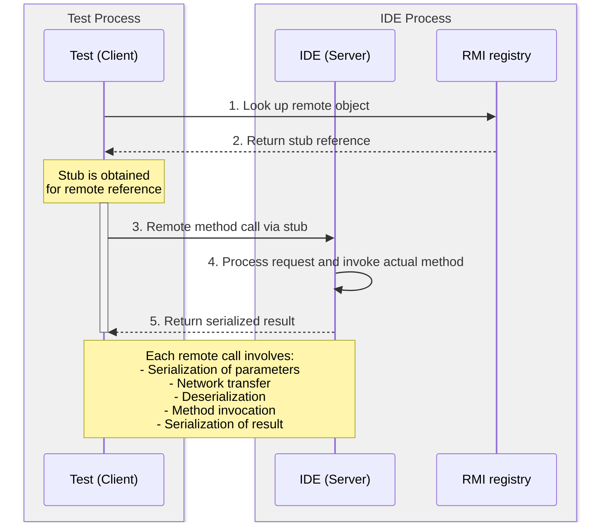

<!-- Copyright 2000-2025 JetBrains s.r.o. and contributors. Use of this source code is governed by the Apache 2.0 license. -->

# Integration Tests: API Interaction

<primary-label ref="2023.2"/>

<link-summary>Walkthrough how to interact with API in integration tests.</link-summary>

> This page is part of the [](integration_tests.md) tutorial.

For introduction and setting up dependencies, refer to [](integration_tests_intro.md).

## Java Management Extension

The IDE and tests are running in different processes, which means some way to communicate between them is required.

Driver framework uses Java Management Extensions (or JMX for short).
JMX supports different connectors to manage the state of the JVM.
Driver framework uses a standard Java Remote Method Invocation (RMI) protocol.
This protocol allows tests to access objects and invoke methods in the JVM running the IDE.

The architecture of RMI protocol is as follows:


When a test needs to invoke a method on a remote object:

1. The test looks up the remote object in the RMI registry (the IDE).
2. The IDE returns a reference to the stub, which implements the same interface as the remote object.
3. When the client calls a method on the stub:
    1. The stub serializes the method call, including any parameters.
    2. It sends the serialized data over the network to the remote server.
    3. The RMI runtime inside the IDE unmarshals the request and invokes the corresponding method on the actual remote object.
    4. The method executes, and the result is serialized and sent back to the client via the stub.
    5. The stub unmarshals the response and returns the result to the caller.

Thus, the stub makes remote calls feel like local method calls, without the caller worrying about low-level networking, data conversion, or request handling.

## Creating Stubs

To demonstrate how this works in practice, add the following code to the plugin:

```kotlin
package com.example.demo

object PluginStorage {
  @JvmStatic
  fun getPluginStorage() = Storage("static method", listOf("static1", "static2"))
}

@Service
class PluginService {
  fun someMethod(): Unit = Unit
  fun getAnswer(): Int = 42
}

@Service(Service.Level.PROJECT)
class PluginProjectService {
  fun getStrings(): Array<String> = arrayOf("foo", "bar")
}

data class Storage(val key: String, val attributes: List<String>)
```

This file contains one class with the static method `getPluginStorage`, and two [light services](plugin_services.md#light-services) – one application-level `PluginService` and one project-level `PluginProjectService`.

The test needs to call the methods of these classes and verify their return values.
To do this, the following stubs have to be created:

```kotlin
import com.intellij.driver.client.Remote

@Remote("com.example.demo.PluginStorage", plugin = "com.example.demo")
interface PluginStorage {
  fun getPluginStorage(): Storage
}

@Remote("com.example.demo.PluginService", plugin = "com.example.demo")
interface PluginService {
  fun getAnswer(): Int
}

@Remote("com.example.demo.PluginProjectService", plugin = "com.example.demo")
interface PluginProjectService {
  fun getStrings(): Array<String>
}

@Remote("com.example.demo.Storage", plugin = "com.example.demo")
interface Storage {
  fun getAttributes(): List<String>
  fun getKey(): String
}
```

As seen above, a stub is an interface for the class with methods that will be used in the test.
Stubs shouldn't be created for methods not used in tests.

The first parameter is the fully qualified name of the class that will correspond to the stub using the [`Remote`](%gh-ic%/platform/remote-driver/client/src/com/intellij/driver/client/Remote.kt) annotation.
Strings are used to avoid introducing dependency between production and test code.

The `plugin` parameter specifies the ID of a plugin, where classes are located.
This parameter is required since IntelliJ-based IDEs use separate [class loaders](plugin_class_loaders.md) for each plugin, and the code that will call methods on the IDE side (Invoker) needs to know where to search for them.

There is built-in support for `@Remote` annotation inside IntelliJ IDEA:
{width="717"}

Rename and move the target class refactorings will update the annotation accordingly.
Gutter icons can be used to navigate to the target class from a stub.

## Calling IDE Methods from Tests

The complete API test:

```kotlin
@Test
fun testStubs() {
  Starter.newContext(
    "testExample",
    TestCase(
      IdeProductProvider.IC,
      GitHubProject.fromGithub(
        branchName = "master",
        repoRelativeUrl = "JetBrains/ij-perf-report-aggregator"
      )
    )
      .withVersion("2024.3")
  )
    .apply {
      val pathToPlugin = System.getProperty("path.to.build.plugin")
      PluginConfigurator(this).installPluginFromFolder(File(pathToPlugin))
    }.runIdeWithDriver().useDriverAndCloseIde {
      val storage = utility<PluginStorage>().getPluginStorage()
      val key = storage.getKey()
      val attributes = storage.getAttributes()
      Assertions.assertEquals("static method", key)
      Assertions.assertEquals(listOf("static1", "static2"), attributes)
      val answer = service<PluginService>().getAnswer()
      Assertions.assertEquals(42, answer)
      waitForProjectOpen()
      val project = singleProject()
      val strings = service<PluginProjectService>(project).getStrings()
      Assertions.assertArrayEquals(arrayOf("foo", "bar"), strings)
    }
}
```

There are two methods that allow invoking methods: `service` and `utility`.
The first one will return an instance of a service, and the second will return an instance of any class.

Project-level services require a `Project` stub.
To get it, use the `singleProject` method, which is implemented in the same way as demonstrated above:

```kotlin
service<ProjectManager>().getOpenProjects().singleOrNull()
```

> Service and utility proxies can be acquired on each call, there is no need to cache them in clients.
>
{style="note"}

## JMX/RMI Limitations

The main inconvenience of using JMX/RMI is that stubs need to be created for all objects which are used in tests.
On the other hand, they don't require modification of the production code.

As with any protocol, JMX/RMI has its limitations:

* Parameters and return values can only be:
    * Primitives and their wrappers: `Integer`, `Short`, `Long`, `Double`, `Float`, and `Byte`.
    * `String`.
    * `@Remote` references.
    * An array of primitive values or `String` or `@Remote` references.
    * Lists of primitive values or `String` or `@Remote` references.
* Only public methods can be called.
* JMX/RMI can’t interact with suspend methods.

