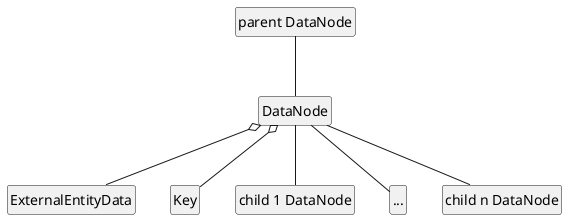
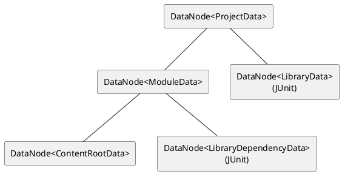

<!-- Copyright 2000-2025 JetBrains s.r.o. and contributors. Use of this source code is governed by the Apache 2.0 license. -->

# External System Integration

<link-summary>Overview and introduction to implementing an External System (e.g., Maven, Gradle, sbt) support.</link-summary>

<tldr>

**External System Extension Points**: 

</tldr>

This page provides a high-level overview of the *External System* subsystem.
There are multiple project management systems ([Apache Maven](https://maven.apache.org/), [Gradle](https://www.gradle.org/), [sbt](https://www.scala-sbt.org/), etc.) and IntelliJ Platform provides a mechanism to support them in IDEs.

Most of the project management systems provide a similar set of facilities from the integration point of view:

* build a project from external system config (<path>pom.xml</path>, <path>build.gradle.kts</path>, etc.)
* provide a list of available tasks
* allow executing a particular task
* and more

That means that we can separate external system-specific logic and general IDE processing.
The *External System* subsystem provides an API for wrapping external system elements and extensible IDE-specific processing logic.

## Project Management

### Project Data Domain

The external system wrapper is required to be able to build project info on the basis of the given external system config.
That information is built with the following base classes:

* [`DataNode`](%gh-ic%/platform/external-system-api/src/com/intellij/openapi/externalSystem/model/DataNode.java)
* [`Key`](%gh-ic%/platform/external-system-api/src/com/intellij/openapi/externalSystem/model/Key.java)
* [`ExternalEntityData`](%gh-ic%/platform/external-system-api/src/com/intellij/openapi/externalSystem/model/project/ExternalEntityData.java)

The `DataNode` class is just a holder for the target data (a data type is defined by the `Key`).
Multiple `DataNode` objects might be organized in a directed graph where every edge identifies parent-child relation.

For example, a simple one-module project might look as below:

The IDE provides a set of built-in `Key` and `ExternalEntityData` classes but any external system integration or third-party plugin developer might enhance project data by defining custom `Key` and `ExternalEntityData` and store them at a child of appropriate `DataNode`.

### Managing Project Data

Processing project data built on an external system config basis can be performed with [`ProjectDataService`](%gh-ic%/platform/external-system-api/src/com/intellij/openapi/externalSystem/service/project/manage/ProjectDataService.java).
It is a strategy which knows how to manage particular `ExternalEntityData`.
For example, when we want to import a project from an external model, we can start with the top level `DataNode` which references project info and then import its data using the corresponding service.

Custom services can be registered via the <include from="snippets.topic" element-id="ep"><var name="ep" value="com.intellij.externalProjectDataService"/></include>.

The good thing is that we can separate project parsing and management here.
That means that a set of `DataNode`, `Key` and `ProjectDataServices` can be introduced for a particular technology and then every external system integration can build corresponding data if necessary using it.

### Importing from External Model

The IntelliJ Platform provides an API for importing projects from external models:

* [`ProjectImportBuilder`](%gh-ic%/java/idea-ui/src/com/intellij/projectImport/ProjectImportBuilder.java)
* [`ProjectImportProvider`](%gh-ic%/java/idea-ui/src/com/intellij/projectImport/ProjectImportProvider.java)

There are two classes built on the *template method* pattern that simplify implementation:

* [`AbstractExternalProjectImportBuilder`](%gh-ic%/java/idea-ui/src/com/intellij/openapi/externalSystem/service/project/wizard/AbstractExternalProjectImportBuilder.java)
* [`AbstractExternalProjectImportProvider`](%gh-ic%/java/idea-ui/src/com/intellij/openapi/externalSystem/service/project/wizard/AbstractExternalProjectImportProvider.java)

Note that [`AbstractExternalProjectImportBuilder`](%gh-ic%/java/idea-ui/src/com/intellij/openapi/externalSystem/service/project/wizard/AbstractExternalProjectImportBuilder.java) is built on top of the 'external system settings' controls.

Concrete implementations should be registered in <include from="snippets.topic" element-id="ep"><var name="ep" value="com.intellij.projectImportBuilder"/></include> and <include from="snippets.topic" element-id="ep"><var name="ep" value="com.intellij.projectImportProvider"/></include> accordingly.

Example of the project import provider and builder for Gradle:

* [`JavaGradleProjectImportProvider`](%gh-ic%/plugins/gradle/java/src/service/project/wizard/JavaGradleProjectImportProvider.kt)
* [`JavaGradleProjectImportBuilder`](%gh-ic%/plugins/gradle/java/src/service/project/wizard/JavaGradleProjectImportBuilder.kt)

## Auto-Import

It's possible to configure external system integration to automatically refresh the project structure when external project's config files are modified.

> From 2020.1, auto-import cannot be disabled by a user.
>

### Auto-Import for `ExternalSystemManager` Implementation

Describe the project's settings files to track by having external system [`ExternalSystemManager`](%gh-ic%/platform/external-system-api/src/com/intellij/openapi/externalSystem/ExternalSystemManager.java) implement [`ExternalSystemAutoImportAware`](%gh-ic%/platform/external-system-api/src/com/intellij/openapi/externalSystem/ExternalSystemAutoImportAware.java).

> The `ExternalSystemAutoImportAware.getAffectedExternalProjectPath()` method is called quite often, that's why it's expected to return control as soon as possible.
> Helper `CachingExternalSystemAutoImportAware` class might be used for caching, i.e. `ExternalSystemManager` which implements `ExternalSystemAutoImportAware` can have a field like `new CachingExternalSystemAutoImportAware(new MyExternalSystemAutoImportAware())` and delegate `ExternalSystemAutoImportAware.getAffectedExternalProjectPath()` calls to it.
>
{style="note"}

### Auto-Import for Standalone External Systems

Some external systems don't have `ExternalSystemManager` (e.g., Maven), but they also can use auto-import core to track changes in settings files.
For this, implement `ExternalSystemProjectAware` that describes settings files for tracking and an action to reload the project model.
Then register the instance with `ExternalSystemProjectTracker` to start tracking.

> Multiple `ExternalSystemProjectAware` instances can correspond to a single external system.
> It allows performing project reload differently depending on the set of settings files (project aware per settings file, per module, per external project, etc.).
>
{style="note"}

### Icon for Reload Notification

<primary-label ref="2020.1"/>

The icon for reload notification can be specified per external system.
Implement [`ExternalSystemIconProvider`](%gh-ic%/platform/external-system-api/src/com/intellij/openapi/externalSystem/ui/ExternalSystemIconProvider.kt)
and register in <include from="snippets.topic" element-id="ep"><var name="ep" value="com.intellij.externalIconProvider"/></include> in <path>[plugin.xml](plugin_configuration_file.md)</path>.
Alternatively, set the `reloadIcon` field if the external system implements `ExternalSystemIconProvider` directly.

## Settings

All external system settings controls are represented by implementations of [`ExternalSystemSettingsControl`](%gh-ic%/platform/external-system-impl/src/com/intellij/openapi/externalSystem/util/ExternalSystemSettingsControl.java).
There are general and linked project-level external system settings.
A particular external system settings UI contains the following items:

* General system settings
* Linked external projects list
* Project-level settings for the selected project

It's recommended to extend from [`AbstractExternalProjectSettingsControl`](%gh-ic%/platform/external-system-impl/src/com/intellij/openapi/externalSystem/service/settings/AbstractExternalProjectSettingsControl.java) for implementing project-level settings control as it already handles some of them.

**Examples:**

* [`GradleSystemSettingsControl`](%gh-ic%/plugins/gradle/src/org/jetbrains/plugins/gradle/service/settings/GradleSystemSettingsControl.java) handling the <control>General settings</control> in <ui-path>Settings | Build, Execution, Deployment | Build Tools | Gradle</ui-path>
* [`GradleProjectSettingsControl`](%gh-ic%/plugins/gradle/src/org/jetbrains/plugins/gradle/service/settings/GradleProjectSettingsControl.java) handling the selected Gradle project settings in <ui-path>Settings | Build, Execution, Deployment | Build Tools | Gradle</ui-path>

A similar approach is used for providing settings in importing external project UI.
Implementation is expected to extend [`AbstractImportFromExternalSystemControl`](%gh-ic%/java/idea-ui/src/com/intellij/openapi/externalSystem/service/settings/AbstractImportFromExternalSystemControl.java) and instead of the linked external projects list it contains target external project path control.

## Testing

<primary-label ref="2022.1"/>

Use `com.jetbrains.intellij.platform:external-system-test-framework` from .

Relevant base classes:

* [`ExternalSystemImportingTestCase`](%gh-ic%/platform/external-system-api/testFramework/src/com/intellij/platform/externalSystem/testFramework/ExternalSystemImportingTestCase.java)
* [`ExternalSystemTestCase`](%gh-ic%/platform/external-system-api/testFramework/src/com/intellij/platform/externalSystem/testFramework/ExternalSystemTestCase.java)
