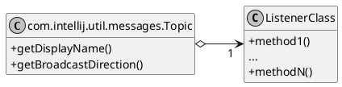
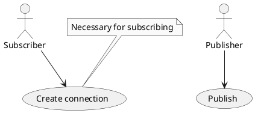
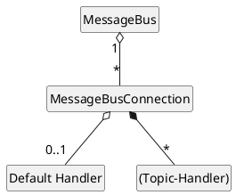
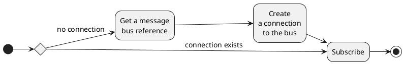
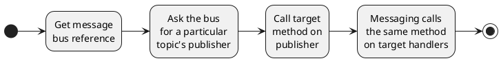
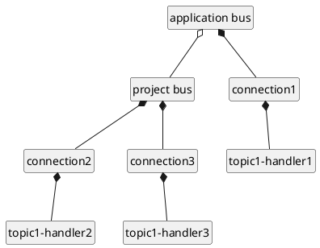
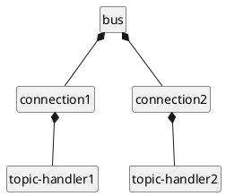

<!-- Copyright 2000-2025 JetBrains s.r.o. and contributors. Use of this source code is governed by the Apache 2.0 license. -->

# Messaging Infrastructure

<link-summary>Subscribing and publishing messages via message bus.</link-summary>

IntelliJ Platform's messaging infrastructure is an implementation of [Publisher Subscriber Pattern](https://w.wiki/5xaV) that provides additional features like _broadcasting on hierarchy_ and special _nested events_ processing (a _nested event_ is an event directly or indirectly fired from the callback of another event).

> All available listeners/topics are listed on [](intellij_platform_extension_point_list.md) under _Listeners_ sections.

## Design

The following sections describe the main components of the messaging API:
- [Topic](#topic)
- [Message Bus](#message-bus)
- [Connection](#connection)

### Topic

The [`Topic`](%gh-ic%/platform/extensions/src/com/intellij/util/messages/Topic.java) class serves as an endpoint at the messaging infrastructure.
Clients are allowed to subscribe to a specific topic within a bus and send messages to that topic within that particular bus.
To clarify the corresponding message bus, a `Topic` field declaration should be annotated with `@Topic.AppLevel` and/or `@Topic.ProjectLevel`.



#### Topic Properties

Display name
: Human-readable name used for logging/monitoring purposes.

Broadcast direction
: See [](#broadcasting) for more details. The default value is `TO_CHILDREN`.

Listener class
: A business interface for a particular topic.
  Subscribers register an implementation of this interface at the messaging infrastructure.
  Publishers later retrieve objects that conform to the interface (IS-A) and call any methods defined on those implementations.
  The messaging infrastructure takes care of dispatching the message to all subscribers of the topic by calling the same method with the same arguments on the registered implementation callbacks.

### Message Bus

[`MessageBus`](%gh-ic%/platform/extensions/src/com/intellij/util/messages/MessageBus.kt) is the core of the messaging system.
It is used in the following scenarios:



### Connection

Connection is represented by [`MessageBusConnection`](%gh-ic%/platform/extensions/src/com/intellij/util/messages/MessageBusConnection.kt) class and manages all subscriptions for a particular client within a particular bus.



Connection stores *topic-handler* mappings - callbacks to invoke when message for the target topic is received (not more than one handler per topic within the same connection is allowed).

It's possible to specify *default handler* and subscribe to the target topic without explicitly provided callback.
Connection will use that *default handler* when storing a topic-handler mapping.

It's possible to explicitly release acquired resources (see `disconnect()`).
Also, it can be plugged to standard semi-automatic disposing ([`Disposable`](%gh-ic%/platform/util/src/com/intellij/openapi/Disposable.java)).

## Messaging API Usage

The sample below assumes a Project-level topic.

### Defining a Business Interface and a Topic

Create an interface with the business methods and a topic field bound to the business interface:

```java
public interface ChangeActionNotifier {

  @Topic.ProjectLevel
  Topic<ChangeActionNotifier> CHANGE_ACTION_TOPIC =
      Topic.create("custom name", ChangeActionNotifier.class);

  void beforeAction(Context context);
  void afterAction(Context context);
}
```

### Subscribing to a Topic



> Use [declarative registration](plugin_listeners.md) whenever possible.
>
{style="note"}

```java
project.getMessageBus().connect().subscribe(
    ChangeActionNotifier.CHANGE_ACTION_TOPIC,
    new ChangeActionNotifier() {
        @Override
        public void beforeAction(Context context) {
          // Process 'before action' event.
        }
        @Override
        public void afterAction(Context context) {
          // Process 'after action' event.
        }
});
```

`MessageBus` instances are available via [`ComponentManager.getMessageBus()`](%gh-ic%/platform/extensions/src/com/intellij/openapi/components/ComponentManager.java).
Many standard interfaces implement returning a message bus, e.g., [`Application.getMessageBus()`](%gh-ic%/platform/core-api/src/com/intellij/openapi/application/Application.java) and [`Project.getMessageBus()`](%gh-ic%/platform/core-api/src/com/intellij/openapi/project/Project.java).

### Publishing Messages



```java
public void doChange(Context context) {
  ChangeActionNotifier publisher = project.getMessageBus()
      .syncPublisher(ChangeActionNotifier.CHANGE_ACTION_TOPIC);
  publisher.beforeAction(context);
  try {
    // do action
  } finally {
    publisher.afterAction(context);
  }
}
```

## Broadcasting

Message buses can be organised into hierarchies.
Moreover, the IntelliJ Platform has them already:

```plantuml
@startuml

skinparam monochrome true
skinparam DefaultFontName JetBrains Sans
skinparam DefaultFontSize 14
hide empty members
hide circle

left to right direction

' Define the objects in the diagram
class "application bus" as AB
class "project bus" as PB
class "module bus" as MB

' Define the class relationships
AB o-- "*" PB
PB o-- "*" MB
@enduml
```



That allows to notify subscribers registered in one message bus on messages sent to another message bus.

Example setup:



The example setup presents a simple hierarchy (the *application bus* is a parent of the *project bus*) with three subscribers for the same topic.

If *topic1* defines broadcast direction as `TO_CHILDREN`, we get the following:
1. A message is sent to *topic1* via *application bus*.
2. *handler1* is notified about the message.
3. The message is delivered to the subscribers of the same topic within *project bus* (*handler2* and *handler3*).

The main benefit of broadcasting is managing subscribers that are bound to child buses but interested in parent bus-level events.
In the example above, we may want to have project-specific functionality that reacts to the application-level events.
All we need to do is to subscribe to the target topic within the *project bus*.
No hard reference to the project-level subscriber will be stored at application-level then, i.e., we just avoided memory leak on project re-opening.

Broadcast configuration is defined per-topic.
The following options are available:

- `TO_CHILDREN` (default)
- `TO_DIRECT_CHILDREN`
- `NONE`
- `TO_PARENT`

See [`Topic.BroadcastDirection`](%gh-ic%/platform/extensions/src/com/intellij/util/messages/Topic.java) for detailed description of each option.

## Nested Messages

_Nested message_ is a message sent (directly or indirectly) during another message processing.
The IntelliJ Platform's messaging infrastructure guarantees that all messages sent to particular topic will be delivered at the sending order.

Consider the following configuration:



When a message is sent to the target topic, the following happens:

- _message1_ is sent
- _handler1_ receives _message1_ and sends _message2_ to the same topic
- _handler2_ receives _message1_
- _handler2_ receives _message2_
- _handler1_ receives _message2_

## Tips and Tricks

### Relief Listeners Management

Messaging infrastructure is very light-weight, so it's possible to reuse it at local sub-systems in order to relieve [Subscribers](https://en.wikipedia.org/wiki/Publish%E2%80%93subscribe_pattern){ignore-vars="true"} construction.
Let's see what is necessary to do then:

1. Define business interface to work with.
2. Create shared message bus and topic that uses the interface above (_shared_ here means that either _subject_ or _subscribers_ know about them).

A manual implementation would require:

1. Define listener interface (business interface).
2. Provide reference to the _subject_ to all interested listeners.
3. Add listeners storage and listeners management methods (add/remove) to the _subject_.
4. Manually iterate all listeners and call target callback in all places where new event is fired.

### Avoid Shared Data Modification from Subscribers

We had a problem in a situation when two subscribers tried to modify the same document
([IDEA-71701](https://youtrack.jetbrains.com/issue/IDEA-71701)).

The thing is that every document change is performed by the following scenario:

1. _before change_ event is sent to all document listeners and some of them publish new messages during that;
2. actual change is performed;
3. _after change_ event is sent to all document listeners;

We had the following then:

1. _message1_ is sent to the topic with two subscribers;
2. _message1_ is queued for both subscribers;
3. _message1_ delivery starts;
4. _subscriber1_ receives _message1_;
5. _subscriber1_ issues document modification request at particular range (e.g. _document.delete(startOffset, endOffset)_);
6. _before change_ notification is sent to the document listeners;
7. _message2_ is sent by one of the standard document listeners to another topic within the same message bus during _before change_ processing;
8. the bus tries to deliver all pending messages before queuing _message2_;
9. _subscriber2_ receives _message1_ and also modifies a document;
10. the call stack is unwound and _actual change_ phase of document modification operation requested by _subscriber1_ begins;

**The problem** is that document range used by _subscriber1_ for initial modification request is invalid if _subscriber2_ has changed document's range before it.
