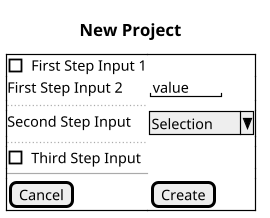
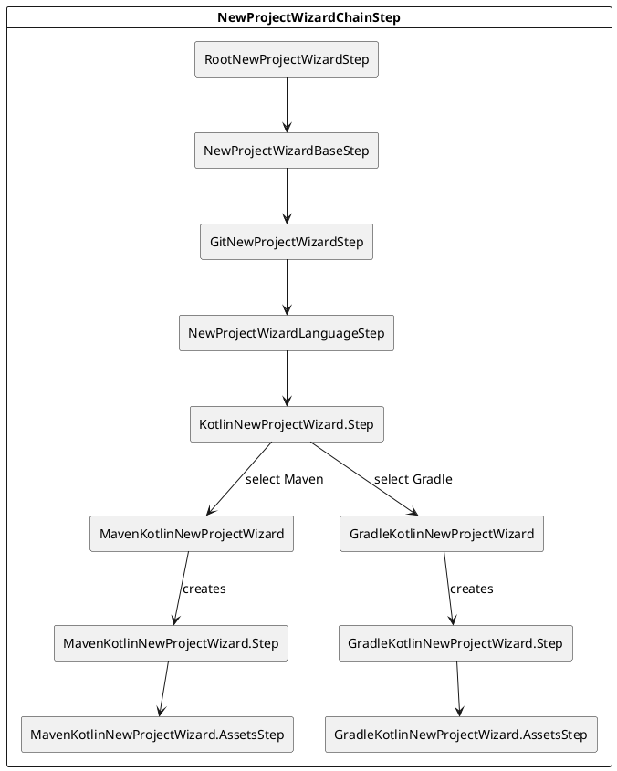

<!-- Copyright 2000-2025 JetBrains s.r.o. and contributors. Use of this source code is governed by the Apache 2.0 license. -->

# New Project Wizard API
<primary-label ref="2024.2"/>

<link-summary>Implementing a custom project and module creation wizard.</link-summary>

> This section describes the New Project Wizard API, which is also used to create modules within projects.
> The page uses "project wizard" wording for brevity.

The [New Project](https://www.jetbrains.com/help/idea/new-project-wizard.html) wizard items can be grouped into two main types:
- [](#language-project-generators)
- [](#framework-project-generators)

> [Language](#language-project-generators) and [framework](#framework-project-generators) project generators described on this page work only in IDEs supporting Java.
> See [](#how-to-implement-a-project-wizard-for-non-java-ides) in the FAQ section.
>
{style="warning"}

## Language Project Generators

Language project generators allow for creating general-purpose projects without specific frameworks (they can be added to the project by users later).
Examples:
- a Kotlin project
- a Python project

These items are displayed at the top in the left sidebar of the <control>New Project</control> dialog.

Language project generators implement
[`LanguageGeneratorNewProjectWizard`](%gh-ic%/platform/platform-impl/src/com/intellij/ide/wizard/language/LanguageGeneratorNewProjectWizard.kt)
and are registered in <include from="snippets.topic" element-id="ep"><var name="ep" value="com.intellij.newProjectWizard.languageGenerator"/></include>.

The generator implementation must provide:
- `name` and `icon` used in UI
- `ordinal` that is used to sort the generator in the generator list
- `isEnabled(WizardContext)` that allows controlling displaying the item depending on the current context
- `createStep(NewProjectWizardStep)` that creates the tree of steps that users go through during the project creation.
   Note the provided parent step, which exposes the wizard context, data holder, and other shared properties.
   See [](#wizard-steps) for details.

**Examples:**
- [`KotlinNewProjectWizard`](%gh-ic%/plugins/kotlin/project-wizard/idea/src/org/jetbrains/kotlin/tools/projectWizard/KotlinNewProjectWizard.kt) generating Kotlin projects
- [`PythonNewProjectWizard`](%gh-ic-master%/python/pluginJava/src/com/intellij/python/community/plugin/java/PythonNewProjectWizard.kt) generating Python projects

## Framework Project Generators

Framework project wizards allow for creating projects related to a specific technology, for example:
- a Spring Boot project
- a project generated from a Maven Archetype
- a React project

These items are displayed under language generator items in the left sidebar of the <control>New Project</control> dialog.

Framework project wizards implement
[`GeneratorNewProjectWizard`](%gh-ic%/platform/platform-impl/src/com/intellij/ide/wizard/GeneratorNewProjectWizard.kt)
and are registered in <include from="snippets.topic" element-id="ep"><var name="ep" value="com.intellij.newProjectWizard.generator"/></include>.

The interface exposes:
- unique `id`
- `name` and `icon` used in UI
- `ordinal` that is used to sort the generator in the generator list
- `isEnabled()` that allows controlling displaying the item depending on the current IDE context
- `createStep(WizardContext)` that creates the tree of steps that users go through during the project creation.
   See [](#wizard-steps) for details.

**Example:** [`MavenArchetypeNewProjectWizard`](%gh-ic%/plugins/maven/src/main/java/org/jetbrains/idea/maven/wizards/archetype/MavenArchetypeNewProjectWizard.kt) creating Maven projects from a selected archetype

## Wizard Steps

Every project wizard consists of one or more steps that users go through during project creation.
Each step contains UI elements for data necessary to create a project.
All the steps are displayed on a single screen in the project wizard dialog, which displays the <control>Create</control> button that creates the project.

> Wizards implemented with the old API (`ModuleBuilder`) can create multiple vertical steps that are navigable with the <control>Next</control> and <control>Previous</control> buttons in the wizard dialog.
> It caused many screens to be half-empty, and to improve the UX, new wizards display all steps on a single screen.

A project wizard step implements
[`NewProjectWizardStep`](%gh-ic%/platform/platform-impl/src/com/intellij/ide/wizard/NewProjectWizardStep.kt).
The most important methods are:
- `setupUI()` — defines the UI components for the step. Step UI is built with [](kotlin_ui_dsl_version_2.md)
- `setupProject()` — applies the parameters provided in UI to the generated project

See the example implementations in the [`intellij-community`](%gh-ic%/README.md) repository.

Steps build a tree structure (read the rest of this section for details), as some steps can be displayed depending on previously selected options.
`setupUI()` and `setupProject()` of steps building the tree are applied in the order from root to leaf.
Note that `setupProject()` won't be called for hidden steps.

For convenience, the platform provides
[`AbstractNewProjectWizardStep`](%gh-ic%/platform/platform-impl/src/com/intellij/ide/wizard/AbstractNewProjectWizardStep.kt),
which is a base step class that takes a parent step and delegates common property accessors to the parent.
It allows sharing the [root step's](#root-step) properties by all descendant steps.

### Chaining Steps

As mentioned before, all steps are rendered on a single screen.
Merging multiple steps into a chain displayed as a single screen step is achieved with
[`NewProjectWizardChainStep`](%gh-ic%/platform/platform-impl/src/com/intellij/ide/wizard/NewProjectWizardChainStep.kt).
Its companion object exposes a helper method `NewProjectWizardChainStep.nextStep()`, which allows chaining steps in fluent form, for example:

```kotlin
override fun createStep(context: WizardContext): NewProjectWizardStep {
  return RootNewProjectWizardStep(context)
    .nextStep(::FirstProjectWizardStep)
    .nextStep(::SecondProjectWizardStep)
    .nextStep(::ThirdProjectWizardStep)
}
```

All the steps above will be created inside a single `NewProjectWizardChainStep` and will be displayed (except the root step, which exists to hold shared data) in a single dialog page:


### Root Step

The root project wizard step initializes a data holder and other properties shared with all descendant steps in the wizard.

In the case of [language project generators](#language-project-generators), the `LanguageGeneratorNewProjectWizard.createStep(NewProjectWizardStep)` receives a parent step, and there is no need to initialize these values and create a root step.

In the case of [framework project generators](#framework-project-generators), the root step can be created with [`RootNewProjectWizardStep`](%gh-ic%/platform/platform-impl/src/com/intellij/ide/wizard/RootNewProjectWizardStep.kt), which initializes shared properties.

### Common Steps

Almost every project requires providing the project name and the location where it should be created.
Also, projects are often shared in a Git repository.
The IntelliJ Platform provides:
- [`NewProjectWizardBaseStep`](%gh-ic%/platform/platform-impl/src/com/intellij/ide/wizard/NewProjectWizardBaseStep.kt),
which handles the project <control>Name</control> and <control>Location</control> fields
- [`GitNewProjectWizardStep`](%gh-ic%/platform/platform-impl/src/com/intellij/ide/wizard/GitNewProjectWizardStep.kt), which is responsible for handling Git repository initialization if the user enables it

Note that [language project generators](#language-project-generators) already include these steps out of the box, and there is no need to create them in the wizard implementation.

### Asset Steps

> Note that `AssetsNewProjectWizardStep` **requires** a [dependency](plugin_dependencies.md) on the Java plugin.
> In addition, it is marked as an experimental API.
>
{style=warning}

It is often required to populate a created project with initial assets like:
- directory structure, for example, <path>src/main/java</path>, <path>src/main/resources</path>, <path>src/test/java</path>, <path>src/test/resources</path> in a Gradle Java project
- a build-tool-specific <path>.gitignore</path> file ignoring build and other directories and files
- sample code

This can be achieved by creating a step extending [`AssetsNewProjectWizardStep`](%gh-ic%/java/idea-ui/src/com/intellij/ide/projectWizard/generators/AssetsNewProjectWizardStep.kt).
It allows for adding directories, static assets, assets generated from [Freemarker templates](https://freemarker.apache.org/docs/dgui_quickstart_template.html), and granting them proper file permissions.

See example implementations in the [`intellij-community`](%gh-ic%/README.md) repository.

### Steps Forking the Wizard Flow

Sometimes, a wizard requires displaying different options depending on the user's selection.
For example, depending on the selected build tool, different fields specific to the selected build tool are displayed.

Such a behavior can be implemented with
[`AbstractNewProjectWizardMultiStep`](%gh-ic%/platform/platform-impl/src/com/intellij/ide/wizard/AbstractNewProjectWizardMultiStep.kt).

`AbstractNewProjectWizardMultiStep` internally handles steps forking the wizard flow.
It is responsible for:
- setting up the switcher
- setting up the selected step's UI
- applying the selected step's options to the created project

Forking steps are provided with an [extension point](plugin_extension_points.md) implementing
[`NewProjectWizardMultiStepFactory`](%gh-ic%/platform/platform-impl/src/com/intellij/ide/wizard/NewProjectWizardMultiStepFactory.kt).
Besides the parent step, `AbstractNewProjectWizardMultiStep`'s constructor receives the name of the extension point implementing `NewProjectWizardMultiStepFactory` and uses registered [extensions](plugin_extensions.md) to create steps.

> Note that a plugin must implement a custom extension point, which may allow for adding new forking steps (for example, build tools) supported by other plugins.

The [](#adding-support-for-custom-build-systems-in-language-project-wizards) section lists example implementations of `AbstractNewProjectWizardMultiStep`.

#### Adding Support for Custom Build Systems in Language Project Wizards

Some language project generators contain the <control>Build system</control> field that allows for choosing a build system used by a project.
This is achieved by implementing `AbstractNewProjectWizardMultiStep` described above.
Example implementations are:
- [`JavaNewProjectWizard.Step`](%gh-ic%/java/idea-ui/src/com/intellij/ide/projectWizard/generators/JavaNewProjectWizard.kt) — for Java language
- [`KotlinNewProjectWizard.Step`](%gh-ic%/plugins/kotlin/project-wizard/idea/src/org/jetbrains/kotlin/tools/projectWizard/KotlinNewProjectWizard.kt) — for Kotlin language
- [`GroovyNewProjectWizard.Step`](%gh-ic%/plugins/groovy/src/org/jetbrains/plugins/groovy/config/wizard/GroovyNewProjectWizard.kt) — for Groovy language

It is possible to add support for custom build systems by implementing extensions specific to these languages.
The table below shows the supported languages with corresponding interfaces and extension points:

| Language | Interface and Extension Point                                                                                                                                                                                                                                                                                  | Examples                                                                                                                                                                                                                                                                                                                                                                                                                                                                                                |
|----------|----------------------------------------------------------------------------------------------------------------------------------------------------------------------------------------------------------------------------------------------------------------------------------------------------------------|---------------------------------------------------------------------------------------------------------------------------------------------------------------------------------------------------------------------------------------------------------------------------------------------------------------------------------------------------------------------------------------------------------------------------------------------------------------------------------------------------------|
| Java     | [`BuildSystemJavaNewProjectWizard`](%gh-ic%/java/idea-ui/src/com/intellij/ide/projectWizard/generators/BuildSystemJavaNewProjectWizard.kt)<br/><include from="snippets.topic" element-id="epLink"><var name="ep" value="com.intellij.newProjectWizard.java.buildSystem"/></include>                            | [`IntelliJJavaNewProjectWizard`](%gh-ic%/java/idea-ui/src/com/intellij/ide/projectWizard/generators/IntelliJJavaNewProjectWizard.kt)<br/>[`MavenJavaNewProjectWizard`](%gh-ic%/plugins/maven/src/main/java/org/jetbrains/idea/maven/wizards/MavenJavaNewProjectWizard.kt)<br/>[`GradleJavaNewProjectWizard`](%gh-ic%/plugins/gradle/java/src/service/project/wizard/GradleJavaNewProjectWizard.kt)                                                                                                      |
| Kotlin   | [`BuildSystemKotlinNewProjectWizard`](%gh-ic%/plugins/kotlin/project-wizard/idea/src/org/jetbrains/kotlin/tools/projectWizard/BuildSystemKotlinNewProjectWizard.kt)<br/><include from="snippets.topic" element-id="epLink"><var name="ep" value="com.intellij.newProjectWizard.kotlin.buildSystem"/></include> | [`IntelliJKotlinNewProjectWizard`](%gh-ic%/plugins/kotlin/project-wizard/idea/src/org/jetbrains/kotlin/tools/projectWizard/IntelliJKotlinNewProjectWizard.kt)<br/>[`MavenKotlinNewProjectWizard`](%gh-ic%/plugins/kotlin/project-wizard/maven/src/org/jetbrains/kotlin/tools/projectWizard/maven/MavenKotlinNewProjectWizard.kt)<br/>[`GradleKotlinNewProjectWizard`](%gh-ic%/plugins/kotlin/project-wizard/gradle/src/org/jetbrains/kotlin/tools/projectWizard/gradle/GradleKotlinNewProjectWizard.kt) |
| Groovy   | [`BuildSystemGroovyNewProjectWizard`](%gh-ic%/plugins/groovy/src/org/jetbrains/plugins/groovy/config/wizard/BuildSystemGroovyNewProjectWizard.kt)<br/><include from="snippets.topic" element-id="epLink"><var name="ep" value="com.intellij.newProjectWizard.groovy.buildSystem"/></include>                   | [`IntelliJGroovyNewProjectWizard`](%gh-ic%/plugins/groovy/src/org/jetbrains/plugins/groovy/config/wizard/IntelliJGroovyNewProjectWizard.kt)<br/>[`MavenGroovyNewProjectWizard`](%gh-ic%/plugins/maven/src/main/java/org/jetbrains/idea/maven/plugins/groovy/wizard/MavenGroovyNewProjectWizard.kt)<br/>[`GradleGroovyNewProjectWizard`](%gh-ic%/plugins/gradle/java/src/service/project/wizard/groovy/GradleGroovyNewProjectWizard.kt)                                                                  |

### Sharing Data Between Steps

Project wizards with multiple steps may require sharing data between them.
The recommended approach includes the following implementation steps:

<procedure>

1. Create an interface exposing step's shared properties, for example, `ExampleData`:
   ```kotlin
   interface ExampleData {
     val value: String
   }
   ```

2. Add a companion object with the data key and a helper `NewProjectWizardStep.exampleData` extension property.

   ```kotlin
   interface ExampleData {
     // ...
     companion object {
       val KEY: Key<ExampleData> = Key.create(ExampleData::class.java.name)
       @JvmStatic
       val NewProjectWizardStep.exampleData: ExampleData?
        get() = data.getUserData(KEY)
     }
   }
   ```

3. Make the step implement the created interface and implement the data property and a graph property (see [](#property-graph) for details):

   ```kotlin
   class ExampleStep(parent: NewProjectWizardStep) :
     AbstractNewProjectWizardStep(parent), ExampleData {
     private val valueProperty = propertyGraph.property(false)
     override var value: String by valueProperty
     // ...
   }
   ```
   The graph property is used for binding value with UI components.
   Consider exposing it via the data interface if it is possible that other steps may depend on it.

4. During step instance initialization, store data in the data holder shared with all steps:
   ```kotlin
   class ExampleStep(parent: NewProjectWizardStep) :
     AbstractNewProjectWizardStep(parent), ExampleData {
     // ...
     init {
       data.putUserData(ExampleData.KEY, this)
     }
   }
   ```

</procedure>

Shared data can be accessed in another step in the following way:

```kotlin
class AnotherStep(parent: NewProjectWizardStep) :
   AbstractNewProjectWizardStep(parent) {

   override fun setupProject(project: Project) {
     // exampleData is available via this
     if (exampleData?.value == true) {
       doSomething()
     }
     // ...
   }
   // ...
}
```

### Property Graph

[`PropertyGraph`](%gh-ic%/platform/observable/src/com/intellij/openapi/observable/properties/PropertyGraph.kt) creates an observable dependency graph that automatically propagates changes between related properties.
It is created in the [root step](#root-step) and shared between all descendant steps via [`AbstractNewProjectWizardStep.propertyGraph`](%gh-ic%/platform/platform-impl/src/com/intellij/ide/wizard/AbstractNewProjectWizardStep.kt).

`PropertyGraph` is widely used in wizard steps to create a responsive UI that dynamically updates depending on the user's actions.
It allows for:
- conditional visibility of fields based on other selections
- dynamic validation of user inputs
- automatic updates to dependent properties when primary properties change
- and more

Consider [`NewProjectWizardBaseStep`](%gh-ic%/platform/platform-impl/src/com/intellij/ide/wizard/NewProjectWizardBaseStep.kt).
It implements two graph properties for the project name and path:

```kotlin
override val nameProperty: GraphProperty<String> =
  propertyGraph.lazyProperty(::suggestName)
override val pathProperty: GraphProperty<String> =
  propertyGraph.lazyProperty { suggestLocation().toCanonicalPath() }
```

Both properties are lazily initialized with default values based on the current context.

Data properties delegate to the graph properties:
```kotlin
override var name: String by nameProperty
override var path: String by pathProperty
```

Any read or update of a data or graph property will update its counterpart.


Dependencies between properties are defined during step instance initialization:
```kotlin
init {
  nameProperty.dependsOn(pathProperty, ::suggestUniqueName)
}
```

It means that whenever `pathProperty` is changed, the `nameProperty` will be updated using the provided `suggestUniqueName()` function.

Properties are also bound to the UI allowing for synchronizing them with the UI in both directions:
```kotlin
textField()
  .bindText(nameProperty.trim())
...
textFieldWithBrowseButton(fileChooserDescriptor, context.project)
   .bindText(pathProperty.toUiPathProperty())
```

In addition, there is another graph property created from path and name graph properties:
```kotlin
val locationProperty = pathProperty.joinCanonicalPath(nameProperty)
```

`locationProperty` will be updated whenever `pathProperty` or `nameProperty` is updated, and it will contain a path built of the path and name.
The value of the property is bound to the comment component displayed under the location row:
```kotlin
textFieldWithBrowseButton(fileChooserDescriptor, context.project)
  // ...
  .locationComment(context, locationProperty)
```

`PropertyGraph` has many possibilities that are hard to describe in detail.
It is recommended to experiment with existing project wizards and [exploring their implementations](explore_api.md).

#### Persisting Default Settings

It is convenient for users to remember commonly used settings, so they don't need to fill them again.
Consider the checkbox initializing a Git repository in a created project.
When the user selects it for the first time, and later they create another project, the checkbox will be automatically selected.

This behavior can be implemented by binding graph properties to persistent storage via methods from
[`BindUtil`](%gh-ic%/platform/platform-api/src/com/intellij/openapi/observable/util/BindUtil.kt),
for example:
```kotlin
private val gitProperty = propertyGraph.property(false)
    .bindBooleanStorage(GIT_PROPERTY_NAME)
```

Under the hood, properties are stored at the application level via [PropertiesComponent](persisting_state_of_components.md#using-propertiescomponent-for-simple-non-roamable-persistence) under the `GIT_PROPERTY_NAME` key.

### Example Project Wizard Steps Structure

The following diagram presents the steps flow of the Kotlin language project wizard implemented by
[`KotlinNewProjectWizard`](%gh-ic%/plugins/kotlin/project-wizard/idea/src/org/jetbrains/kotlin/tools/projectWizard/KotlinNewProjectWizard.kt).



The following steps are always present in [language project generators](#language-project-generators) and are created by the platform under the hood:
- `RootNewProjectWizardStep` — initializes shared properties like data holder and property graph
- `NewProjectWizardBaseStep` — displays project name and location options
- `GitNewProjectWizardStep` — allows for creating a Git repository for the new project
- `NewProjectWizardLanguageStep` — invisible step holding information about the chosen language (this step is deprecated and is used only for technical reasons; it shouldn't be used by plugins)

All steps are enclosed within `NewProjectWizardChainStep`, which renders them on a single screen.

`KotlinNewProjectWizard.Step` is a [multistep](#steps-forking-the-wizard-flow) that forks the wizard flow into two paths depending on the user selection in the <control>Build system</control> switcher:
1. Maven-specific, if the user selected <control>Maven</control>
2. Gradle-specific, if the user selected <control>Gradle</control>

It creates the actual steps by using registered step factory extensions (`MavenKotlinNewProjectWizard` and `GradleKotlinNewProjectWizard`).

Depending on the selection, the platform executes `setupUI()` and `setupProject()` methods of enabled steps.

## FAQ

### How to determine whether the current context is a project or a module creation?

Use [`WizardContext.isCreatingNewProject()`](%gh-ic%/platform/lang-core/src/com/intellij/ide/util/projectWizard/WizardContext.java).
The wizard context is available in every step via [`NewProjectWizardStep.context`](%gh-ic%/platform/platform-impl/src/com/intellij/ide/wizard/NewProjectWizardStep.kt).

### How to add a project wizard hint?

Sometimes, a project wizard requires an explanation about the purpose of the wizard or links to an alternative item.
To add a simple comment, use [`CommentNewProjectWizardStep`](%gh-ic%/platform/platform-impl/src/com/intellij/ide/wizard/comment/CommentNewProjectWizardStep.kt), for example, [`EmptyProjectGeneratorNewProjectWizard.CommentStep`](%gh-ic%/platform/platform-impl/src/com/intellij/ide/wizard/language/EmptyProjectGeneratorNewProjectWizard.kt)

To additionally render a clickable link to another wizard, use [`LinkNewProjectWizardStep`](%gh-ic%/platform/platform-impl/src/com/intellij/ide/wizard/comment/LinkNewProjectWizardStep.kt), for example, [`MavenArchetypeNewProjectWizard.CommentStep`](%gh-ic%/plugins/maven/src/main/java/org/jetbrains/idea/maven/wizards/archetype/MavenArchetypeNewProjectWizard.kt).

### How to implement a project wizard for non-Java IDEs?

To create project wizards for non-Java IDEs (for example, [PyCharm](https://www.jetbrains.com/pycharm/)), implement
[`DirectoryProjectGenerator`](%gh-ic%/platform/platform-impl/src/com/intellij/platform/DirectoryProjectGenerator.java)
and register it in the <include from="snippets.topic" element-id="ep"><var name="ep" value="com.intellij.directoryProjectGenerator"/></include>.

<include from="snippets.topic" element-id="missingContent"/>
