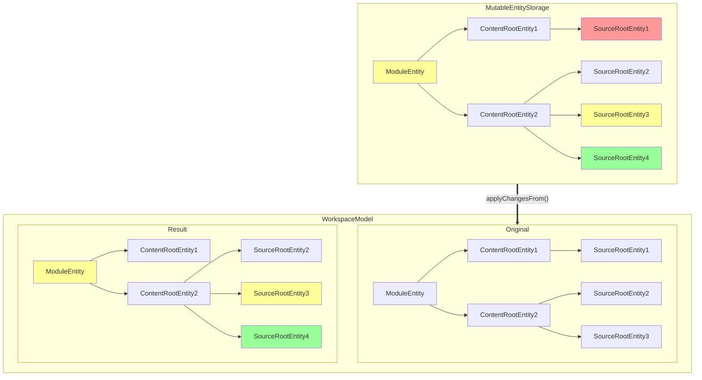
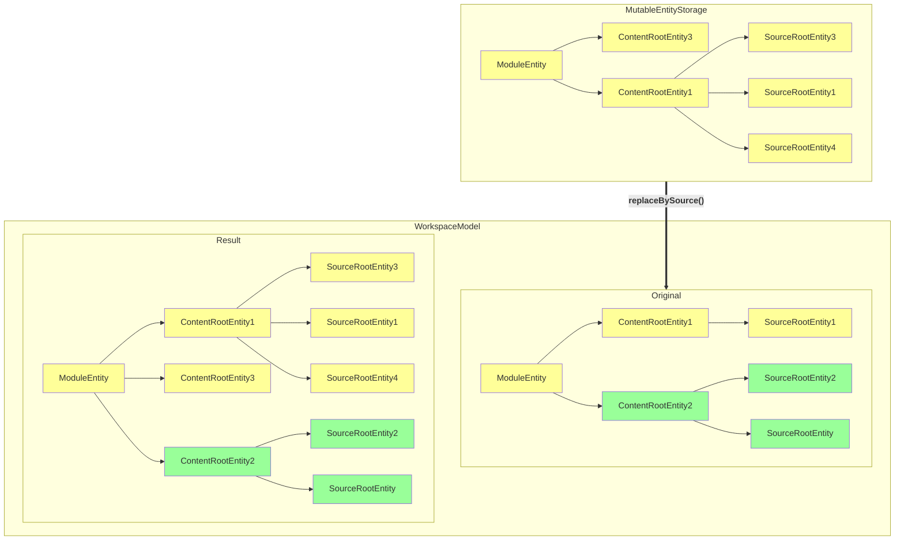

<!-- Copyright 2000-2024 JetBrains s.r.o. and contributors. Use of this source code is governed by the Apache 2.0 license. -->

# Entity Mutation

<primary-label ref="2024.2"/>

<link-summary>Workspace Model Entity mutation</link-summary>

All modifications of
[`WorkspaceModel`](%gh-ic%/platform/backend/workspace/src/WorkspaceModel.kt)
are executed through a special mutable version of the store, represented by the
[`MutableEntityStorage`](%gh-ic%/platform/workspace/storage/src/com/intellij/platform/workspace/storage/MutableEntityStorage.kt)
interface.
It can be used to build a storage from scratch or modify an existing storage in a way which requires reading its state after
modifications. **Instances of this interface aren't thread-safe.**

All modifications inside the IDE process are executed via
[`WorkspaceModel.update()`](%gh-ic%/platform/backend/workspace/src/WorkspaceModel.kt).

Two main modification scenarios exist: small lightweight and batch operations (for complex computations).

## Lightweight Operations

### Adding Entities

To add a new entity to the storage, create it by calling the `companion` object of its interface and then
pass it to the
[`MutableEntityStorage.addEntity()`](%gh-ic%/platform/workspace/storage/src/com/intellij/platform/workspace/storage/MutableEntityStorage.kt)
function:

```kotlin
// mandatory properties are passed as parameters
val module = ModuleEntity(moduleName, dependencies, entitySource) {
  // optional properties can be initialized in the lambda
  // passed as the last parameter
  type = ModuleTypeId.JAVA_MODULE
}

WorkspaceModel.getInstance(project).update("Add module") { builder ->
  builder.addEntity(module)
}
```

An entire tree of entities can be prepared first, then add the root to the storage, and
`MutableEntityStorage.addEntity()` will automatically add all the children.

### Modifying and Removing Entities

To modify or remove an entity, find its instance in the
[`MutableEntityStorage`](%gh-ic%/platform/workspace/storage/src/com/intellij/platform/workspace/storage/MutableEntityStorage.kt)
instance.
This can be done by:
- resolving its
[`SymbolicEntityId`](%gh-ic%/platform/workspace/storage/src/com/intellij/platform/workspace/storage/SymbolicEntityId.kt)
via [`SymbolicEntityId.resolve()`](%gh-ic%/platform/workspace/storage/src/com/intellij/platform/workspace/storage/SymbolicEntityId.kt)
- resolving an
[`EntityPointer`](%gh-ic%/platform/workspace/storage/src/com/intellij/platform/workspace/storage/EntityPointer.kt)
via [`EntityPointer.resolve()`](%gh-ic%/platform/workspace/storage/src/com/intellij/platform/workspace/storage/EntityPointer.kt)
- iterating by children of another entity

```kotlin
WorkspaceModel.getInstance(project).updateProjectModel("Update module") { builder ->
  val module = ModuleId(moduleName).resolve(builder) ?: ...
  val groupPath = module.groupPath ?: ...
  builder.removeEntity(groupPath)
  // a special extension function 'modifyEntity'
  // is generated for each entity type
  builder.modifyModuleEntity(module) {
    name = prefix + name
  }
}
```

### Adding and Removing Child Entities

There are two equivalent ways to add a child entity to an existing parent entity.

* Specify the parent when creating the child and add the child via
  [`MutableEntityStorage.addEntity()`](%gh-ic%/platform/workspace/storage/src/com/intellij/platform/workspace/storage/MutableEntityStorage.kt):

```kotlin
val contentRoot = ContentRootEntity(url, emptyList(), entitySource) {
  this.module = module
}
builder.addEntity(contentRoot)
```

* Call
  [`MutableEntityStorage.modifyEntity()`](%gh-ic%/platform/workspace/storage/src/com/intellij/platform/workspace/storage/MutableEntityStorage.kt)
  on the parent entity and modify its property to include the new child:

```kotlin
val contentRoot = ContentRootEntity(url, emptyList(), entitySource)
builder.modifyContentRootEntity(module) {
  this.contentRoots = this.contentRoots + contentRoot
}
```

To remove a child entity, it is enough to call
[`MutableEntityStorage.removeEntity()`](%gh-ic%/platform/workspace/storage/src/com/intellij/platform/workspace/storage/MutableEntityStorage.kt)
for it, the reference in its parent will be updated automatically.
Also, if the reference to the parent is declared as non-null in the child interface, it is enough to modify the reference to the children
in the parent entity:

```kotlin
builder.modifyModuleEntity(module) {
  contentRoots = contentRoots.filter { it.url != contentUrlToRemove }
}
```

When performing this for a child with nullable reference to the parent, the child will be detached from the parent but won't be removed from
the storage.

## Batch Operations

Besides operation with individual entities,
[`MutableEntityStorage`](%gh-ic%/platform/workspace/storage/src/com/intellij/platform/workspace/storage/MutableEntityStorage.kt)
supports two batch operations: `applyChangesFrom()` and `replaceBySource()`.

### Apply Changes From

Each instance of
[`MutableEntityStorage`](%gh-ic%/platform/workspace/storage/src/com/intellij/platform/workspace/storage/MutableEntityStorage.kt)
records changes made in it: addition, modification, and removal of entities.
Such changes made in one instance may be applied to a different instance by calling its `applyChangesFrom()` function.

The diagram below shows a schematic example of this operation.
Yellow indicates changed entities, red deleted ones, and green new ones.



#### Use Cases

Some exemplary use cases are listed below.

##### Parallel Filling of the Storage

When the configuration of a project is read from <path>\*.iml</path> files, the IDE creates a separate empty
`MutableEntityStorage` for each file and runs tasks which parse an <path>\*.iml</path> file and load entities from it to the corresponding storage concurrently.
When the tasks finish, their results are merged into the single storage via `applyChangesFrom()`.

##### Accumulating Changes

The user performs modifications in the <control>Project Structure</control> dialog.
Changes shouldn't be applied immediately, so they're accumulated in a builder and then added to the main storage using the
`applyChangesFrom()` when the user presses the <control>Apply</control> button.

### Replace By Source

Partially replace the storage with the new one based on the predicate on
[`WorkspaceEntity.entitySource`](%gh-ic%/platform/workspace/storage/src/com/intellij/platform/workspace/storage/WorkspaceEntity.kt).
This operation updates the part of the storage affected by the change, trying to minimize the number of changes in the entities.

Usually, entities in the workspace model storage are created from data loaded from some configuration files.
When these configuration files change, the corresponding entities must be updated in the storage.
It would be rather hard and error-prone to analyze what exactly was changed in the files since the previous version,
so a different approach is used.
Each entity must specify its `WorkspaceEntity.entitySource` describing where the entity comes from.

The diagram below shows a schematic example of the
[`MutableEntityStorage.replaceBySource()`](%gh-ic%/platform/workspace/storage/src/com/intellij/platform/workspace/storage/MutableEntityStorage.kt)
operation.
The color represents the type of entity source.
In this example it is called with the predicate `{ entitySource is YellowEntitySource }`.
In the resulting storage we can see that the function automatically calculates the changes for entities with `YellowEntitySource` and
doesn't touch entities not matching the predicate.



#### Use Cases

{id="replaceBySourceUseCases"}

Some exemplary use cases are listed below.

##### Importing a Project Model from External System

In a Maven project, the project model can be created each time we detect the <path>pom.xml</path> file was changed.
The new project model is applied to the main storage using the `replaceBySource()` operation.
This will affect only changed entities created from Maven.

##### Working with JPS Build System

For entities loaded from configuration files from the <path>.idea</path> directory,
[`WorkspaceEntity.entitySource`](%gh-ic%/platform/workspace/storage/src/com/intellij/platform/workspace/storage/WorkspaceEntity.kt)
points to the corresponding XML file.
When the IDE detects changes in some configuration files, it loads new entities from the created
and modified files to a separate `MutableEntityStorage` instance.
Then it calls `replaceBySource()` passing a filter which accepts entity sources corresponding to the all
created, modified, and deleted files and the prepared `MutableEntityStorage` instance.
