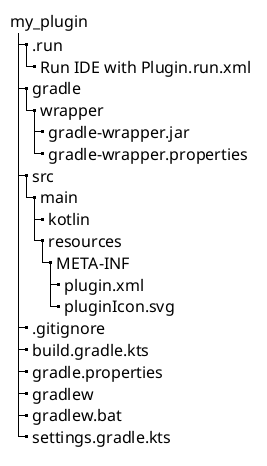

<!-- Copyright 2000-2025 JetBrains s.r.o. and contributors. Use of this source code is governed by the Apache 2.0 license. -->

# Creating a Plugin Gradle Project

<web-summary>
Create and run a Gradle-based IntelliJ Platform plugin project using the IDE Plugin wizard.
</web-summary>

<link-summary>Creating and running a Gradle-based IntelliJ Platform plugin project.</link-summary>

This documentation page describes a Gradle-based plugin project generated with the [New Project Wizard](https://www.jetbrains.com/help/idea/new-project-wizard.html)
in IntelliJ IDEA, but the project generated with [](plugin_github_template.md) covers all the described files and directories.

## Creating a Plugin with New Project Wizard

To enable the _IDE Plugin_ wizard, make sure _Gradle_ and _Plugin DevKit_ plugins are installed and enabled.

<include from="snippets.topic" element-id="pluginDevKitAvailability"/>

<procedure title="Create IDE Plugin" id="create-ide-plugin">

Launch the <control>New Project</control> wizard via the <ui-path>File | New | Project...</ui-path> action and follow these steps:
1. Select the <control>IDE Plugin</control> type from the list on the left.
2. Specify the project <control>Name</control> and <control>Location</control>.
3. Choose the <control>Plugin</control> option in the project <control>Type</control>.
4. _Only in IntelliJ IDEA older than 2023.1:_

   Choose the <control>Language</control> the plugin will use for implementation.
   For this example select the <control>Kotlin</control> option.
   See also [Kotlin for Plugin Developers](using_kotlin.md) for more information.

   > Projects generated with IntelliJ IDEA 2023.1 or newer support both Kotlin and Java sources out of the box.
   > The wizard automatically creates the <path>\$PLUGIN_DIR\$/src/main/kotlin</path> sources directory.
   > To add Java sources, add the <path>\$PLUGIN_DIR\$/src/main/java</path> directory manually.
   >
   {style="note" title="Using Kotlin and Java sources"}

5. Provide the <control>Group</control> which is typically an inverted company domain (e.g. `com.example.mycompany`).
   It is used for the Gradle property `project.group` value in the project's Gradle build script.
6. Provide the <control>Artifact</control> which is the default name of the build project artifact (without the version).
   It is also used for the Gradle property `rootProject.name` value in the project's <path>settings.gradle.kts</path> file.
   For this example, enter `my_plugin`.
7. Select a <control>JDK</control> matching the required Java version.
   It will be the default JRE used to run Gradle, and the JDK used to compile the plugin sources.

<include from="snippets.topic" element-id="apiChangesJavaVersion"/>

8. Click the <control>Create</control> button to generate the project.

</procedure>

### Components of a Wizard-Generated Gradle IntelliJ Platform Plugin

For the `my_plugin` example created with the steps described above, the following directory content is created:



* The default IntelliJ Platform <path>build.gradle.kts</path> file (see [below](#build-gradle-kts)).
* The <path>gradle.properties</path> file, containing properties used by Gradle build script.
* The <path>settings.gradle.kts</path> file, containing a definition of the `rootProject.name` and required repositories.
* The Gradle Wrapper files in the <path>gradle</path> directory.
  The <path>gradle-wrapper.properties</path> file specifies the version of Gradle to be used to build the plugin.
  If needed, the IDE downloads the version of Gradle specified in this file automatically.
* The <path>META-INF</path> directory under the default `main` [source set](https://docs.gradle.org/current/userguide/java_plugin.html#sec:java_project_layout) contains the [plugin configuration file](plugin_configuration_file.md) and [plugin logo](plugin_icon_file.md).
* The _Run IDE with Plugin_ [run configuration](https://www.jetbrains.com/help/idea/run-debug-configuration.html).

#### `build.gradle.kts` Gradle Build File
{id="build-gradle-kts"}

The generated `my_plugin` project <path>build.gradle.kts</path> file depends on the IDE version used to generate the project:
- 2025.1+: [](tools_intellij_platform_gradle_plugin.md) variant
- earlier IDE versions: [](tools_gradle_intellij_plugin.md) variant (deprecated)

<tabs>

<tab title="IntelliJ Platform Gradle Plugin (2.x)">

```kotlin
plugins {
    id("java")
    id("org.jetbrains.kotlin.jvm") version "1.9.25"
    id("org.jetbrains.intellij.platform") version "2.3.0"
}

group = "org.example"
version = "1.0-SNAPSHOT"

repositories {
    mavenCentral()
    intellijPlatform {
        defaultRepositories()
    }
}

// Configure Gradle IntelliJ Plugin
// Read more: https://plugins.jetbrains.com/docs/intellij/tools-intellij-platform-gradle-plugin.html
dependencies {
    intellijPlatform {
        create("IC", "2024.2.6")
        testFramework(org.jetbrains.intellij.platform.gradle.TestFrameworkType.Platform)

        // Add necessary plugin dependencies for compilation here, example:
        // bundledPlugin("com.intellij.java")
    }
}

intellijPlatform {
    pluginConfiguration {
        ideaVersion {
            sinceBuild = "242"
        }

        changeNotes = """
      Initial version
    """.trimIndent()
    }
}

tasks {
    // Set the JVM compatibility versions
    withType<JavaCompile> {
        sourceCompatibility = "21"
        targetCompatibility = "21"
    }
    withType<org.jetbrains.kotlin.gradle.tasks.KotlinCompile> {
        kotlinOptions.jvmTarget = "21"
    }
}
```

* Three Gradle plugins are explicitly declared:
    * [Gradle Java](https://docs.gradle.org/current/userguide/java_plugin.html) plugin (`java`)
    * [Kotlin Gradle](https://kotlinlang.org/docs/gradle-configure-project.html#apply-the-plugin) plugin (`org.jetbrains.kotlin.jvm`)
    * [](tools_intellij_platform_gradle_plugin.md) (`org.jetbrains.intellij.platform`)
* The <control>Group</control> from the [New Project](#create-ide-plugin) wizard is the `project.group` value
* `repositories`: setup required repositories ([](tools_intellij_platform_gradle_plugin_repositories_extension.md))
* `dependencies`:
  * define target IDE type (`IC`) and version (`2024.2.6`) ([](tools_intellij_platform_gradle_plugin_dependencies_extension.md#target-versions))
  * add dependency on the platform testing framework ([](tools_intellij_platform_gradle_plugin_dependencies_extension.md#testing))
* `pluginConfiguration`: [`since-build`](tools_intellij_platform_gradle_plugin_extension.md#intellijPlatform-pluginConfiguration-ideaVersion) and initial [change notes](tools_intellij_platform_gradle_plugin_extension.md#intellijPlatform-pluginConfiguration-changeNotes)
* `sourceCompatibility` enforces using a 21 JDK

</tab>

<tab title="Gradle IntelliJ Plugin (1.x)">

```kotlin
plugins {
  id("java")
  id("org.jetbrains.kotlin.jvm") version "1.9.21"
  id("org.jetbrains.intellij") version "1.17.4"
}

group = "com.example"
version = "1.0-SNAPSHOT"

repositories {
  mavenCentral()
}

// Configure Gradle IntelliJ Plugin
// Read more: https://plugins.jetbrains.com/docs/intellij/tools-gradle-intellij-plugin.html
intellij {
  version.set("2022.2.5")
  type.set("IC") // Target IDE Platform

  plugins.set(listOf(/* Plugin Dependencies */))
}

tasks {
  // Set the JVM compatibility versions
  withType<JavaCompile> {
    sourceCompatibility = "17"
    targetCompatibility = "17"
  }
  withType<org.jetbrains.kotlin.gradle.tasks.KotlinCompile> {
    kotlinOptions.jvmTarget = "17"
  }

  patchPluginXml {
    sinceBuild.set("222")
    untilBuild.set("232.*")
  }

  signPlugin {
    certificateChain.set(System.getenv("CERTIFICATE_CHAIN"))
    privateKey.set(System.getenv("PRIVATE_KEY"))
    password.set(System.getenv("PRIVATE_KEY_PASSWORD"))
  }

  publishPlugin {
    token.set(System.getenv("PUBLISH_TOKEN"))
  }
}
```

* Three Gradle plugins are explicitly declared:
  * The [Gradle Java](https://docs.gradle.org/current/userguide/java_plugin.html) plugin (`java`).
  * The [Kotlin Gradle](https://kotlinlang.org/docs/gradle-configure-project.html#apply-the-plugin) plugin (`org.jetbrains.kotlin.jvm`).
  * The [](tools_gradle_intellij_plugin.md) (`org.jetbrains.intellij`).
* The <control>Group</control> from the [New Project](#create-ide-plugin) wizard is the `project.group` value.
* The `sourceCompatibility` line is injected to enforce using Java 17 JDK to compile Java sources.
* The values of the [`intellij.version`](tools_gradle_intellij_plugin.md#intellij-extension-version) and [`intellij.type`](tools_gradle_intellij_plugin.md#intellij-extension-type) properties specify the version and type of the IntelliJ Platform to be used to build the plugin.
* The empty placeholder list for [plugin dependencies](tools_gradle_intellij_plugin.md#intellij-extension-plugins).
* The values of the [`patchPluginXml.sinceBuild`](tools_gradle_intellij_plugin.md#tasks-patchpluginxml-sincebuild) and [`patchPluginXml.untilBuild`](tools_gradle_intellij_plugin.md#tasks-patchpluginxml-untilbuild) properties specifying the minimum and maximum versions of the IDE build the plugin is compatible with.
* The initial [`signPlugin`](tools_gradle_intellij_plugin.md#tasks-signplugin) and [`publishPlugin`](tools_gradle_intellij_plugin.md#tasks-publishplugin) tasks configuration.
  See the [](publishing_plugin.md#publishing-plugin-with-gradle) section for more information.

</tab>

</tabs>

#### Plugin Gradle Properties and Plugin Configuration File Elements

The Gradle properties `rootProject.name` and `project.group` will not, in general, match the respective [plugin configuration file](plugin_configuration_file.md) <path>plugin.xml</path> elements [`<name>`](plugin_configuration_file.md#idea-plugin__name) and [`<id>`](plugin_configuration_file.md#idea-plugin__id).
There is no IntelliJ Platform-related reason they should as they serve different functions.

The `<name>` element (used as the plugin's display name) is often the same as `rootProject.name`, but it can be more explanatory.

The `<id>` value must be a unique identifier over all plugins, typically a concatenation of the specified <control>Group</control> and <control>Artifact</control>.
Please note that it is impossible to change the `<id>` of a published plugin without losing automatic updates for existing installations.

## Running a Plugin With the `runIde` Gradle task

Gradle projects are run from the IDE's <control>Gradle</control> tool window.

### Adding Code to the Project

Before running [`my_plugin`](#components-of-a-wizard-generated-gradle-intellij-platform-plugin), some code can be added to provide basic functionality.
See the [](creating_actions_tutorial.md) tutorial for step-by-step instructions for adding a menu action.

### Executing the Plugin

The generated project contains the _Run IDE with Plugin_ run configuration that can be executed via the <ui-path>Run | Run...</ui-path> action or can be found in the <control>Gradle</control> tool window under the <control>Run Configurations</control> node.

To execute the Gradle `runIde` task directly, open the <control>Gradle</control> tool window and search for the <control>runIde</control> task under the <control>Tasks</control> node.
If it's not on the list, click the <control>Sync All Gradle Projects</control> button on the [toolbar](https://www.jetbrains.com/help/idea/jetgradle-tool-window.html#gradle_toolbar) at the top of the <control>Gradle</control> tool window.
Then double-click it to execute.

To debug your plugin in a _standalone_ IDE instance, please see [How to Debug Your Own IntelliJ IDEA Instance](https://medium.com/agorapulse-stories/how-to-debug-your-own-intellij-idea-instance-7d7df185a48d) blog post.

> For more information about how to work with Gradle-based projects see the [Working with Gradle in IntelliJ IDEA](https://www.youtube.com/watch?v=6V6G3RyxEMk) screencast and working with [Gradle tasks](https://www.jetbrains.com/help/idea/work-with-gradle-tasks.html) in the IntelliJ IDEA help.
>
