# 1. Tests Prerequisites

<!-- Copyright 2000-2024 JetBrains s.r.o. and contributors. Use of this source code is governed by the Apache 2.0 license. -->

<link-summary>Setting up the test folders structure and mocking the project's SDK.</link-summary>

<snippet id="custom_language_testing_tutorial_header">

> This page is part of multistep  tutorial.

</snippet>

This page discusses the steps to configure a plugin project for creating tests.

## Create a Folder for Tests

```plantuml
@startuml

skinparam TitleFontName JetBrains Sans
skinparam TitleFontStyle plain
skinparam TitleFontSize 16
skinparam DefaultTextAlignment left

title
  src
  |_ main
    |_ java
    |_ resources
  |_ test
    |_ java
    |_ testData
end title
@enduml
```

Open the plugin project and create a separate folder named <path>test</path> under the <path>src</path> directory.
Under <path>test</path>, create the <path>java</path> folder for test source code, and the folder <path>testData</path> for [test data files](test_project_and_testdata_directories.md) and reimport the Gradle project.

## Set the Run Configuration Parameters

Because some tests use Java files as test data, the tests need to mock up the project's SDK.
See the  section for details.
