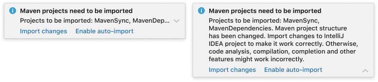

<!-- Copyright 2000-2024 JetBrains s.r.o. and contributors. Use of this source code is governed by the Apache 2.0 license. -->

# Balloon

<link-summary>UI guidelines on using balloons.</link-summary>

Balloon notifications inform users of the events or system states related to a project or IDE.

## When to use

Use a balloon notification if:
* There is no need to point to a particular context or location in the interface.
* User action is recommended but not required immediately.

In other cases, choose another <a href="notification_types.md">notification type</a>.

## How to use

### Message severity

#### Error
Use to inform of a critical event or state that might disrupt the user's experience.

#### Warning
Use in case of an event or state that might slow the user's work down or require an action to fix the IDE settings.

#### Information
Use to suggest optimizations for the IDE settings and notify on the results of a process that is not tied to any tool window.

#### Information about a certain plugin

Use to show a plugin-related suggestion.

Add the plugin’s icon to indicate that the notification relates to a particular plugin. Use a 16×16 svg icon.

### Sticky or Timed

By default, choose a **sticky** balloon. Sticky notifications stay on screen until the user clicks a link in the message or closes the notification manually. This behaviour is preferable as it guarantees the user will not miss the notification.

Use a **timed** notification when the message is informational, and missing it will not affect the user’s workflow. Timed notifications stay on screen for 10 seconds and then disappear. They can be viewed later in the Event Log.

### Title

Briefly describe the event and the context in which it occurred, e.g. a particular plugin or library, VCS, a run/debug configuration, etc.

[Write short and clear](writing_short.md) as the title should fit in one line.

Use sentence case and follow the [punctuation rules](punctuation.md).

If the message fits well in one sentence and does not require a separate title, choose either a title or a body:
* Use title-only message when it’s short and fits in one line:

* Use only body text when the message fits in two lines and the title would duplicate its meaning, fully or partially:

 Incorrect 

 Correct

### Body

Provide the details on the event or system state to help users decide what to do next:
* What is the cause or trigger.
* What are the consequences.
* What exactly is affected: files, libraries, versions, plugins, etc.

Note that only the first line of the body text is visible by default. The rest of the message is only visible when expanded with an arrow icon. Make the beginning of the text most informative.

### Actions

Add actions to help users take the next steps: fix a problem, view relevant information, configure settings, etc.

If the notification is informational and there is a possibility it might appear too often, add the "Don’t ask again" action:

Preferable number of actions is two, as it is easier for the user to choose.

If a set of more than 2 actions will be useful for the user, place the primary action first, and hide the others under the "More actions" dropdown:

If the notification reports an error or warning, always provide an action to help users fix the problem:

If no actions are available, provide more details in the body text, e.g. how to fix the error or what is the warning/error cause:

 Incorrect 

Correct

### Naming a notification group
Each balloon notification belongs to a group. Groups can be seen in <ui-path>Settings | Appearance & Behavior | Notifications</ui-path>.

To name a notification group, follow these rules:
* Name the group with an ending to the phrase "Notifications in this group notify the user about…". Examples: _Automatic indent detection_, _Content root duplicates_.
* If a name about a particular process or event cannot be given, use the name of a subsystem or plugin. Examples: _HTTP Client_, _Power Save Mode_.
* When a group contains notifications about errors or problems, do not use a verb. Example: _Debugger errors_, not _Debugger errors ~~found~~_.
* Do **not** use words "notification" or "group". They are implied from the settings context.

