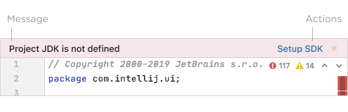

<!-- Copyright 2000-2024 JetBrains s.r.o. and contributors. Use of this source code is governed by the Apache 2.0 license. -->

# Banner

<link-summary>UI guidelines on using banners.</link-summary>

A banner notification informs the user about the state of a specific context in the project. For example, when there is a missing or broken configuration for some file.

## When to use

Use a banner if user actions should attract  attention in a file tab, tool window, or dialog, but are not required immediately.

*Reconnecting to the database is required to make edits.*

*The component needs to be installed in order to run the available virtual devices.*

Do **not** use a banner if there is no particular UI component it can be tied to. Use a [balloon notification](balloon.md) in the main window instead.

For all other cases, choose another notification type.

### Types of banners

#### Information

Use when actions can improve the user’s workflow, but are considered optional and can be safely ignored.

*The new tool window UI is suggested to improve the workflow for version control.*

#### Warning

Use to suggest actions that can impact the user’s workflow.

*Generated files should be edited directly.*

#### Error

Use to suggest actions that are required to unblock the user’s workflow.

*Syntax highlighting and other inspections are broken until a JDK is defined for the project.*

## How to use

### Message

*   The message should be [short and descriptive](writing_short.md) (two sentences at most) and follow the [Punctuation](punctuation.md) guide.
*   Use sentence case capitalization.

### Actions

*   The action name should be [short and descriptive](writing_short.md), preferably not longer than two–three words.
*   Use sentence case capitalization.
*   Limit the number of actions to two to make the call to action clear in the specific context.
*   Use the built-in 'Hide' action instead of creating a separate one.

### Icon (optional)

*   16x16 icons can be used to complement the message, e.g. a gift icon to advertise functionality.

### Placement

*   Place the banner at the top of the related UI component.
*   It can float or be adjacent to the content, depending on the amount of the available space and whether or not the content’s vertical shifting needs to be minimized.

*The banner floats on top of the preview surface to reduce shifting during code editing.*
