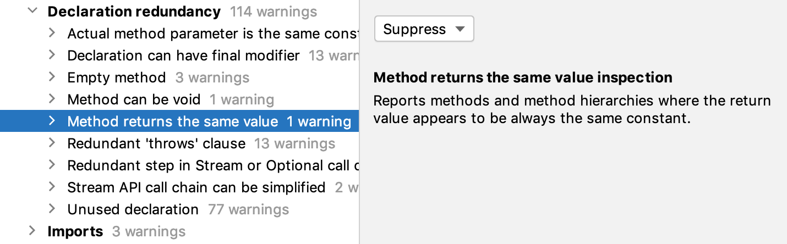
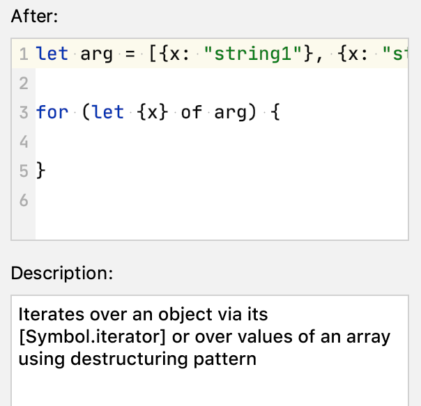
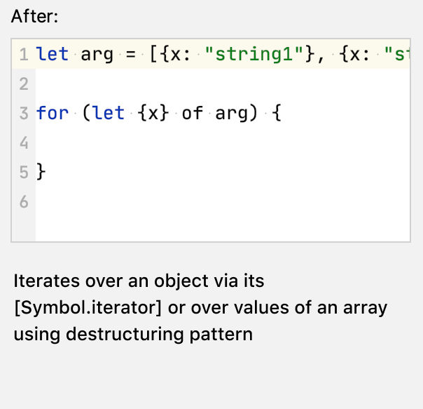

<!-- Copyright 2000-2024 JetBrains s.r.o. and contributors. Use of this source code is governed by the Apache 2.0 license. -->

# Description Text

<link-summary>UI guidelines on descriptions texts.</link-summary>

Description text provides explanatory information about a set of settings or a single item in a list or tree.

## When to Use

Use description text to:

* Show details about items in a list or tree:

* Describe a group of settings:

## How to Use

### Text

Follow general rules in [Writing short and clear](writing_short.md) and [Punctuation](punctuation.md).

Use the default text style for plain text. Increase line height by 3px from the default value.

Use [H4 bold](typography.md) (Default bold) for headings or to highlight important words:

Use the editor font to highlight code snippets:

Use bullets for lists:

Limit the width of the line to 70–80 symbols, as it is not convenient to read very long lines:

Incorrect

Correct

If the text does not fit, add a scrollbar:

### Appearance

Do not add borders around description text. Use the panel color for the background.

<table>
<tr>
<td> 
 Incorrect 
</td>
<td> 
 Correct 
</td>
</tr>
  <tr>
    <td>
        
    </td>
    <td>
        
    </td>
  </tr>
</table>

For [links](link.md), use the default link color: `Link.activeForeground`. Underline links on hover:

### Insets

Separate the text from the surroundings with insets.

Use a 12px horizontal inset if the description text’s area has other elements:

Increase inset up to 20px if the description text is the only element:

